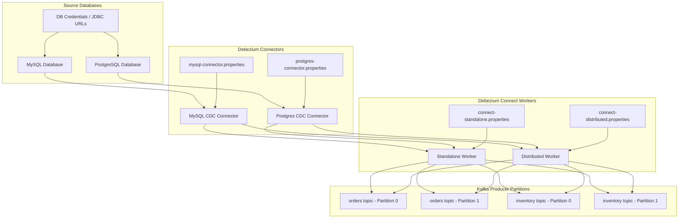
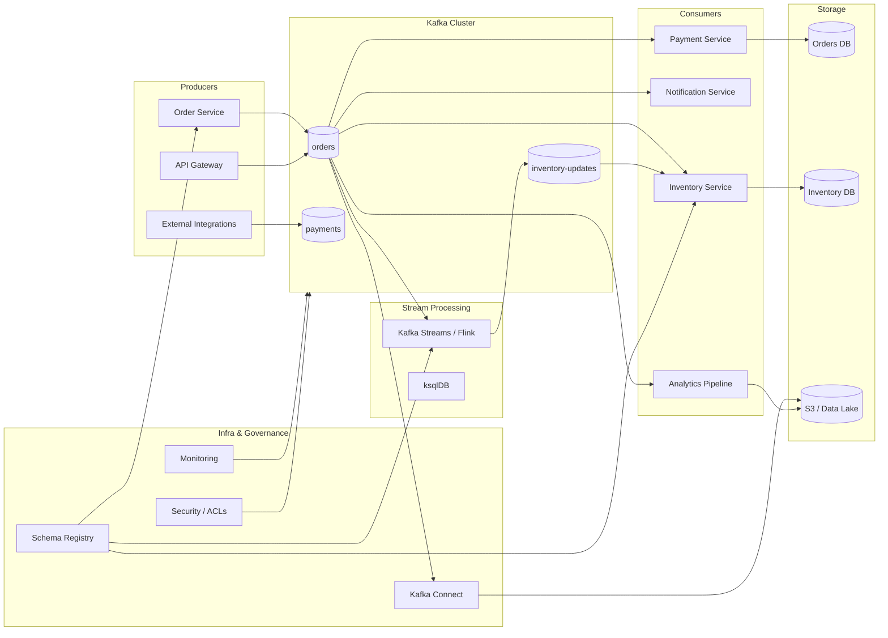
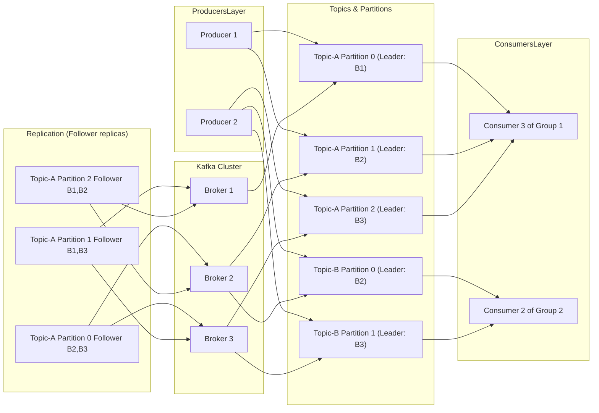

# AWS - S3 Table
## 1. S3 Table
Amazon S3 has long been a foundational object storage service for storing all types of unstructured and structured data. However, modern analytics, lakehouse, and large-scale data engineering workloads require structure, schema handling, transactions, and optimization — all of which **standard S3 buckets do not provide natively**.

**Amazon S3 Tables** is a new managed service that builds structured, tabular, Apache Iceberg–based tables **directly on top of S3**, providing highly optimized analytics performance without managing your own metadata, manifests, compaction, or Iceberg workflows.

---

### **2. Standard S3 vs S3 Tables (Table Buckets)**

#### **2.1 Comparison Table — S3 vs S3 Tables**

| Feature                    | Standard S3            | S3 Tables                          |
| -------------------------- | ---------------------- | ---------------------------------- |
| Storage Type               | General object storage | Managed Iceberg table storage      |
| Data Structure             | Objects (files)        | Tables (rows, columns, partitions) |
| Schema Support             | None                   | Full schema + evolution            |
| Transactions               | No                     | ACID                               |
| Snapshots / Time Travel    | No                     | Yes                                |
| Analytics Optimization     | Manual                 | Automatic                          |
| Metadata Management        | User-managed           | Fully managed                      |
| Performance                | Depends on file layout | Up to **3x faster** querying       |
| Integration with Analytics | Limited                | Native integration                 |
| Permissions                | Bucket/object level    | Table-level IAM                    |

<details>
    <summary>Click to view the detailed comparison</summary>

#### **2.2 Standard S3 Buckets**

General-purpose object storage:

* Stores unstructured files: images, logs, backups, CSVs, Parquet, JSON, binaries.
* No concept of **tables**, **schemas**, **partitions**, **transactions**, **snapshots**, or **ACID** guarantees.
* For analytics, you must manually manage:

  * File format (CSV/Parquet)
  * Partition strategy
  * Folder naming
  * Performance tuning
  * Metadata cataloging
* Query engines (Athena, Spark) must scan files directly → slower at scale.

#### **2.3 S3 Tables (Table Buckets)**

- Purpose-built for tabular, structured datasets (like a database table: columns and rows).
- Stored in a new kind of S3 bucket type called a “table bucket”; tables are first-class resources managed by S3 itself.
- Data is stored using the Apache Iceberg format (Parquet files + metadata), enabling advanced features like schema evolution, ACID transactions, and time travel queries.
- Provides higher transactions per second (TPS) and 3x better query throughput than using self-managed Iceberg tables in standard S3 buckets.
- Integrates natively with analytics engines like Athena, Redshift, Amazon SageMaker Lakehouse, AWS Glue Data Catalog and Apache Spark, Flink, Hive engines for direct SQL queries.
- Automatic table optimization: handles file compaction, metadata management, and optimizations to improve performance and lower storage costs.
- Table-level permissions, automated maintenance, and seamless integration with AWS Data Lake and Lakehouse services.

> Up to **10 table buckets per region**
> Up to **10,000 tables per bucket**
> S3 automatically optimizes table data layout and metadata for analytics.

</details>

---

### **3. [Apache Iceberg — Why S3 Tables Use It](https://aws.amazon.com/what-is/apache-iceberg/)**

Apache Iceberg is an open-source table format built for data lakes. S3 Tables:

* Store data in **Parquet files**
* Store metadata using **Iceberg manifests**
* Provide high-speed reads and efficient incremental writes

<details>
    <summary>Click to view the Key Capabilities of Apache Iceberg</summary>

### Key Capabilities of Apache Iceberg**

Apache Iceberg is a modern open-source table format designed for large-scale analytics on data lakes. It provides advanced features such as ACID transactions, schema evolution, versioning, and incremental processing — all while remaining engine-agnostic and SQL-friendly.

#### **1. SQL Familiarity**

Iceberg fully supports SQL-based table operations.
Anyone familiar with SQL can create, modify, query, and manage Iceberg tables without learning new languages or frameworks. This makes Iceberg easy to adopt for analysts, engineers, and developers.

#### **2. Strong Data Consistency**

Iceberg ensures that all readers and writers see a consistent view of the dataset.
It uses ACID transactions so that concurrent operations do not conflict, guaranteeing reliable data reads and writes across distributed systems.

#### **3. Flexible Data Structure (Schema Evolution)**

Iceberg allows seamless and safe schema changes, including:

* Adding columns
* Renaming columns
* Removing columns

These operations do not require rewriting existing data and do not break queries or pipelines.

#### **4. Data Versioning and Time Travel**

Iceberg maintains snapshots of table states over time.
This enables:

* Querying historical versions (time travel)
* Comparing old and new data
* Auditing changes after updates or deletes

Snapshots make rollback and historical analysis simple and efficient.

#### **5. Cross-Platform Compatibility**

Iceberg works across multiple engines and storage systems.
It integrates with:

* Apache Spark
* Apache Flink
* Apache Hive
* Presto/Trino
* AWS Athena, Redshift, EMR
  This flexibility allows Iceberg tables to be used in any modern data lake or lakehouse environment.

#### **6. Incremental Processing (CDC Support)**

Iceberg supports efficient incremental data processing.
Instead of scanning entire datasets, engines can read only:

* New data
* Modified data
* Deleted data

This reduces compute cost and improves job performance for CDC, ETL, and streaming workloads.

---

#### **7. Maintenance Configuration Limitation**

Certain Iceberg maintenance settings are **incompatible**:

* `history.expire.max-snapshot-age-ms`
* `history.expire.min-snapshots-to-keep`

These two properties cannot be used together because they represent conflicting snapshot retention rules.
One controls retention by **age**, the other by **count** — so only one method should be used per table.

</details>

---

### **4. Analytics Integrations of S3 Tables**

S3 Tables are automatically discoverable by analytics services via Glue Data Catalog.

##### **Native Integrations**

* **Athena SQL**
* **Amazon Redshift Lakehouse**
* **Amazon SageMaker Lakehouse**
* **Amazon EMR**
* **AWS Glue ETL**
* **Apache Spark / Flink / Hive**
* **QuickSight**

These engines can directly query, snapshot, merge, compact, or time-travel the Iceberg tables.

---

### **5. S3 Tables Pricing (Mumbai Region)**

<details>
    <summary>Click to view the pricing</summary>


#### **5.1 Storage Charges**

| Tier              | Price (per GB per month)     |
| ----------------- | ---------------------------- |
| First 50 TB       | **$0.0288**                  |
| Next 450 TB       | **$0.0276**                  |
| Over 500 TB       | **$0.0265**                  |
| Object Monitoring | **$0.025 per 1,000 objects** |

#### **5.2 Requests Pricing**

| Request Type      | Price                          |
| ----------------- | ------------------------------ |
| PUT / POST / LIST | **$0.005 per 1,000 requests**  |
| GET / Others      | **$0.0004 per 1,000 requests** |

**Example: 1,003 PUTs/day × 30 days → 30,090/month**
Cost = **30,090 × $0.005 / 1000 = $0.15**

#### **5.3 Compaction Pricing**

| Compaction Type                    | Price                        |
| ---------------------------------- | ---------------------------- |
| Objects processed                  | **$0.002 per 1,000 objects** |
| Data processed (binpack – default) | **$0.005 per GB**            |
| Data processed (Sort / Z-order)    | **$0.01 per GB**             |

#### **5.4 Data Transfer Out (Slabs)**

| Slab     | Price          |
| -------- | -------------- |
| 10.24 TB | $0.1093 per GB |
| 40.96 TB | $0.085 per GB  |
| 102.4 TB | $0.082 per GB  |
| 870.4 TB | $0.08 per GB   |

#### **5.5 Full Cost Calculation Model**

> Total = S3 Tables storage charge + PUT request charge + GET request charge + Object monitoring charge + Compaction (objects + data processed) + Data outbound charges

</details>

#### **Do Applications Writing Directly to S3 Tables Trigger Compaction Costs?**

<details>
    <summary>Click to view how S3 Tables Trigger Compaction Costs</summary>

#### **Short Answer:** **Yes — eventually.**

But **not immediately with every PUT**.

#### 1. When your application writes data using:

* S3 PUT APIs
* Iceberg compatible writers
* Spark / Flink / Athena INSERT statements

It writes **files** into table buckets.

#### 2. These incoming files can be:

* Small
* Unoptimized
* Many-in-number

Over time, this leads to:

* High metadata overhead
* Slower queries
* More manifest files

#### 3. To fix this, **S3 Tables automatically runs maintenance jobs**, including:

File compaction
Metadata cleanup
Snapshot expiration
Small-file merging

These **maintenance operations** are what trigger:

**Compaction object charges**
**Compaction GB processed charges**

#### **Therefore:**

> **Writing data directly to S3 tables WILL eventually incur compaction charges, because automatic optimization is part of the service.**

#### **When is compaction triggered?**

* Lots of small files are created
* Too many data files per partition
* Too many metadata files
* Scheduled maintenance windows
* Query engines require optimization

#### **You cannot avoid compaction charges entirely**, but you can reduce them by:

* Writing larger Parquet files (64–512 MB)
* Reducing small/fragmented writes
* Using batching or micro-batching
* Using Spark/Flink optimized writers

</details>

<details>
    <summary>Click to view the detailed Explaination</summary>

When you store data in Amazon S3 Tables using put requests (uploading data files), the S3 Tables service automatically performs compaction in the background to optimize storage and query efficiency. Here is how compaction occurs:

### How Compaction Occurs in S3 Tables

1. **Granular Writes Create Many Small Files:**  
   Each put request often creates a small file (or object) in the table, especially in transactional or streaming workloads where data arrives continuously and in small chunks.

2. **Small Files Impact Query Performance:**  
   Large numbers of small files increase the overhead for query engines, needing multiple reads and scans, which degrade performance.

3. **Automatic Background Compaction:**  
   S3 Tables automatically combines many smaller files into fewer, larger files during compaction. This process is transparent to users and requires no manual intervention.

4. **Target File Size and Strategies:**  
   - By default, S3 Tables aim to compact files to about 512 MB in size, but this target can be tuned between 64 MB and 512 MB via AWS CLI configuration.  
   - Different compaction strategies are supported including binpack (default), sort, and z-order compaction for optimized query patterns on large-scale datasets.

5. **Compacted Files Form Latest Table Snapshot:**  
   Files created by compaction become the latest snapshot of the table, ensuring data remains current and efficiently organized for queries.

6. **Benefits:**  
   - Improved query speed due to fewer file scans and higher data read throughput.  
   - Reduced storage overhead by minimizing metadata and file fragmentation.  
   - Reduced operational complexity as manual compaction management is avoided.

### Summary of the Compaction Process

| Step                        | Description                                        |
|-----------------------------|--------------------------------------------------|
| Data Upload                 | Put requests add small files to the table        |
| Performance Impact          | Many small files degrade query performance       |
| Automatic Compaction        | Background process merges small files into bigger ones |
| Configurable Target Size    | Default 512 MB per file, adjustable via CLI      |
| Compaction Strategies       | Binpack (default), sort compaction, z-order compaction |
| Final Outcome              | Latest snapshot with optimized file structure    |

This automatic compaction in S3 Tables helps maintain efficient and performant data access for large-scale analytics workloads without user intervention or additional infrastructure.

[How amazon s3 tables uses compaction](https://aws.amazon.com/blogs/storage/how-amazon-s3-tables-use-compaction-to-improve-query-performance-by-up-to-3-times/)
[amazon-s3-tables-reduce-compaction-costs](https://aws.amazon.com/about-aws/whats-new/2025/07/amazon-s3-tables-reduce-compaction-costs/)
[S3 Tables](https://www.onehouse.ai/blog/s3-managed-tables-unmanaged-costs-the-20x-surprise-with-aws-s3-tables)
[Amazon s3 iceberg compaction](https://www.infoq.com/news/2025/07/amazon-s3-iceberg-compaction/)
[Amazon s3 Table](https://hevodata.com/learn/amazon-s3-table/)
[why-amazon-s3-tables-is-a-game-changer-for-transactional-data-lakes](https://www.granica.ai/blog/why-amazon-s3-tables-is-a-game-changer-for-transactional-data-lakes)
[data-analytics/spark-operator-s3tables](https://awslabs.github.io/data-on-eks/docs/blueprints/data-analytics/spark-operator-s3tables)
[small-file-problem-s3](https://www.upsolver.com/blog/small-file-problem-s3)
 
</details>

### **7. RDS vs S3 Tables**

| Feature        | RDS                          | S3 Tables                          |
| -------------- | ---------------------------- | ---------------------------------- |
| Type           | Relational Database          | Lakehouse Table Storage            |
| Optimized For  | OLTP                         | OLAP                               |
| Schema         | Strict                       | Flexible & Evolvable               |
| Transactions   | Strong ACID                  | ACID (Iceberg)                     |
| Query Type     | Row-based SQL                | Columnar analytics SQL             |
| Concurrency    | High                         | High for analytics, not OLTP       |
| Scaling        | Vertical & Read replicas     | Horizontal to petabytes            |
| Storage Format | Database engine format       | Parquet + Iceberg                  |
| Cost Model     | Compute + Storage            | Storage + Requests + Compaction    |
| Time Travel    | Point-in-time backups        | Built-in snapshots                 |
| When to Use    | Real-time apps, transactions | Analytics, BI, ML, ETL, data lakes |
| Integration    | App-level                    | Analytics engines                  |

<details>
    <summary>Click to view the key distinctions</summary>

##### **Key Distinctions**

##### **RDS** is for:

* High-speed transactional workloads
* Low-latency reads/writes
* Real-time applications
* Banking, inventory, order processing

##### **S3 Tables** is for:

* Analytics
* BI and dashboards
* Large-scale data storage
* ML training
* Time-travel analysis
* ETL pipelines
* Lakehouse architectures

> **RDS stores rows; S3 Tables store columnar data.**
> **RDS cannot scale to PBs affordably; S3 Tables are designed for PB–EB scale.**

</details>

### **8. S3 Tables — Behavior Summary**

<details>
    <summary>Click to view the S3 Tables behaviour summary</summary>

##### **1. Automatic Maintenance**

* Merges small files
* Rewrites partitions
* Cleans metadata
* Handles snapshot pruning

##### **2. Optimized Query Performance**

* Pushdown filters
* Column pruning
* Partition pruning
* Iceberg metadata skipping

##### **3. High Transaction Throughput**

* Designed for large-scale analytics ingestion
* Supports parallel writes

##### **4. Full Iceberg Semantics**

* ACID
* Schema evolution
* Time travel
* Incremental scans

##### **5. Strong Integrations**

* Athena: direct SQL
* Redshift: lakehouse analytics
* Spark/Flink: streaming and batch
* Glue: ETL automation

</details>

<details>
    <summary>Click to view the links of Online References (All Articles Included)</summary>

1. [https://docs.aws.amazon.com/AmazonS3/latest/userguide/s3-tables.html](https://docs.aws.amazon.com/AmazonS3/latest/userguide/s3-tables.html)
2. [https://www.youtube.com/watch?v=brgh-VhN2hU](https://www.youtube.com/watch?v=brgh-VhN2hU)
3. [https://docs.aws.amazon.com/AmazonS3/latest/userguide/s3-tables-tables.html](https://docs.aws.amazon.com/AmazonS3/latest/userguide/s3-tables-tables.html)
4. [https://www.onehouse.ai/blog/s3-managed-tables-unmanaged-costs-the-20x-surprise-with-aws-s3-tables](https://www.onehouse.ai/blog/s3-managed-tables-unmanaged-costs-the-20x-surprise-with-aws-s3-tables)
5. [https://doris.apache.org/docs/dev/lakehouse/best-practices/doris-aws-s3tables/](https://doris.apache.org/docs/dev/lakehouse/best-practices/doris-aws-s3tables/)
6. [https://hevodata.com/learn/amazon-s3-table/](https://hevodata.com/learn/amazon-s3-table/)
7. [https://www.infoq.com/news/2025/01/s3-tables-bucket/](https://www.infoq.com/news/2025/01/s3-tables-bucket/)
8. [https://www.vantage.sh/blog/amazon-s3-tables](https://www.vantage.sh/blog/amazon-s3-tables)
9. [https://www.reddit.com/r/aws/comments/1h8j86w/whats_the_point_of_s3_tables/](https://www.reddit.com/r/aws/comments/1h8j86w/whats_the_point_of_s3_tables/)
10. [https://dataengineeringcentral.substack.com/p/amazon-s3-tables](https://dataengineeringcentral.substack.com/p/amazon-s3-tables)
11. [https://stackoverflow.com/questions/33356041/technically-what-is-the-difference-between-s3n-s3a-and-s3](https://stackoverflow.com/questions/33356041/technically-what-is-the-difference-between-s3n-s3a-and-s3)

</details>

---

# Debezium
### Debezium MySQL Connector Configuration Overview
The Debezium MySQL connector captures row-level changes from MySQL databases (including Amazon RDS for MySQL) by reading the binary log (binlog). Configurations are set as key-value pairs when registering the connector via Kafka Connect REST API or properties files. All properties are optional unless marked required, with sensible defaults for most. 

### How Debezium Connector Works
- Connects to the source database using native features like binary logs or CDC tables.
- Takes an initial consistent snapshot of data for tables being monitored.
- Streams ongoing row-level change events to Kafka topics or other sinks.
- Supports filters to include/exclude schemas, tables, or columns.
- Supports masking of sensitive data in columns.
- Provides monitoring via JMX and transformations for routing/filtering events.
- [Storing state of a Debezium connector](https://debezium.io/documentation/reference/stable/configuration/storage.html)



### How to read this diagram

1. **Source Databases**

   * MySQL/PostgreSQL DBs act as **change-data capture (CDC) sources**.
   * Config files (JDBC URL, credentials) define connection details.

2. **Debezium Connect Workers**

   * Standalone or distributed workers run **Debezium connectors**.
   * Worker configs: `connect-standalone.properties` or `connect-distributed.properties`.

3. **Debezium Connectors**

   * Each connector monitors a database table and streams **changes as events** into Kafka.
   * Connector-specific configs define: table whitelist, snapshot mode, topic naming, etc.

4. **Kafka Cluster**

   * Brokers store partitioned topics generated by Debezium (one topic per table or logical unit).
   * Broker configs: `broker.properties` / `server.properties`.
   * Controller configs for KRaft mode: `controller.properties`.

5. **Kafka Topics**

   * Example: `orders`, `inventory`, `payments`.
   * Partitioned for parallel processing and replicated for availability.

6. **Consumers / Sinks**

   * Services like InventoryService, PaymentService, or Analytics/Data Lake consume these topics.
   * Consumers may also be Kafka Connect sinks (e.g., S3, Elasticsearch).
   * Consumer configs: `consumer.properties` or connector sink configs.

7. **Logging**

   * Brokers: `log4j2.yaml`.
   * Connect workers: `connect-log4j2.yaml`.

<details>
    <summary>Click to view Debezium’s CDC reading the binlog from the replica instead of the master</summary>

### 1. MySQL/RDS Binlog Replication Basics

* **Master (Primary)**:

  * All changes (INSERT, UPDATE, DELETE) are written to the **binlog**.
* **Replica (Slave)**:

  * Pulls the binlog events from the master and applies them to its own data.
  * By default, replicas **can have their own binlog enabled**, which is called **“log_slave_updates”** in MySQL.

    * If `log_slave_updates = ON`, the replica writes **all replicated events** into its **own binlog**, just like the master.
    * This allows the replica to act as a source for downstream replication or tools like Debezium.
* **Without `log_slave_updates`**, the replica applies the changes but **does not record them in its own binlog**.

### 2. Implications for Debezium

* If you want Debezium to read from a **replica**:

  1. **Enable binlog on the replica** (`binlog_format=ROW` and `log_slave_updates=ON`).
  2. Debezium can then read the **replicated binlog events** from the replica **exactly as they appeared on the master**.
  3. This will **reduce load on the master**, because Debezium is now reading the binlog from the replica instead.

* Caveats:

  * Make sure the replica’s binlog **starts from the current position of replication**. Otherwise, Debezium might miss early events.
  * There may be **slight replication lag**, so the events on the replica binlog may be slightly delayed compared to the master.

### Summary

* **Yes**, the binlog can exist on the replica **if `log_slave_updates` is enabled**.
* **Debezium can read from the replica** safely if:

  * `binlog_format=ROW`
  * `log_slave_updates=ON`
  * The replica is configured to allow connections from Debezium.
* This approach **reduces load on the master** while still capturing all CDC events.

</details>

<details>
    <summary>Click to view CDC Configurations for Debezium with Amazon RDS MySQL</summary>

### CDC Configurations for Debezium with Amazon RDS MySQL
Change Data Capture (CDC) with Debezium on Amazon RDS for MySQL enables real-time streaming of row-level changes (INSERT, UPDATE, DELETE) from your RDS instance to Kafka topics. Debezium reads the MySQL binary log (binlog) to capture these events, producing structured JSON/Avro messages. This setup is ideal for analytics, replication, or event-driven apps.

As of November 4, 2025, RDS MySQL supports CDC via Debezium 3.0+ (stable), with MySQL 8.0/8.4 engines. Key: Enable binlog in RDS parameter groups, grant privileges to a Debezium user, and configure the connector for filtering (e.g., specific tables/columns). RDS uses table-level locks for snapshots (no global locks), so tune for low-impact on production.

Below: RDS-side setup (parameters + privileges), Debezium connector configs (all properties, with emphasis on table/column filtering), and examples for targeted capture.

#### RDS-Side Setup for Debezium CDC
1. **Prerequisites**:
   - RDS MySQL instance (Single-AZ or Multi-AZ; read replicas for scaling).
   - Enable automated backups (required for binlog; set retention 1-35 days).
   - VPC security group: Allow inbound 3306 from Debezium host (e.g., EC2/ECS).
   - Create a custom DB parameter group (from `mysql8.0` family) for binlog tweaks; apply and reboot instance.

2. **User Privileges** (Create via RDS console/CLI; run as master user):
   ```
   CREATE USER 'debezium'@'%' IDENTIFIED BY 'secure_password';
   GRANT SELECT, RELOAD, SHOW DATABASES, REPLICATION SLAVE, REPLICATION CLIENT ON *.* TO 'debezium'@'%';
   GRANT LOCK TABLES ON *.* TO 'debezium'@'%';  -- RDS-specific for table-level snapshots
   GRANT ALL PRIVILEGES ON your_db.* TO 'debezium'@'%';  -- For target DB (e.g., employees)
   FLUSH PRIVILEGES;
   ```
   - Why? `REPLICATION SLAVE/CLIENT` for binlog access; `LOCK TABLES` for RDS snapshots (global locks forbidden).
   - IAM auth: Optional; use `AUTHENTICATION_PLUGIN = AWS_IAM` for passwordless.

3. **Binlog and CDC Enabling**:
   - Via AWS Console: Databases > Parameter groups > Create/modify group > Set params below > Apply to instance > Reboot.
   - CLI: `aws rds modify-db-parameter-group --db-parameter-group-name my-group --parameters "ParameterName=binlog_format,ParameterValue=ROW,ApplyMethod=immediate"`.
   - Test: Connect as Debezium user, run `SHOW MASTER STATUS;` (shows binlog file/position).

#### RDS MySQL Parameters for Debezium CDC
Focus on binlog, locking, and replication params (from AWS docs; dynamic/static noted). ~300 total params, but these are essential for CDC. Defaults/limits for MySQL 8.0 (adjust for 8.4). Invalid values (e.g., out-of-range) rejected at apply with "Parameter invalid" error; may require reboot.

| Parameter Name | Type | Default | Allowed Values/Limits | Description | Static/Dynamic | RDS Notes | Invalid Value Behavior |
|---------------|------|---------|-----------------------|-------------|----------------|-----------|------------------------|
| `binlog_format` | Enum | ROW | STATEMENT, ROW, MIXED | Binlog format: ROW for row-level CDC (full before/after images). | Static (reboot) | Required for Debezium; STATEMENT loses data fidelity. Set via param group. | Mixed/STATEMENT: Debezium logs "Unsupported format," skips non-row events. |
| `log_bin` | Boolean | OFF (enabled by backups) | ON/OFF | Enables binlog. | Static | Auto-on with backups; cannot disable if backups enabled. Min retention 24h. | OFF: Debezium "Binlog disabled" error; no streaming. |
| `binlog_row_image` | Enum | FULL | FULL, PARTIAL, MINIMAL, NOBLOB | Binlog row detail: FULL captures all columns. | Dynamic | Use FULL for complete CDC; MINIMAL omits unchanged columns (risks nulls). | PARTIAL/MINIMAL: Incomplete events; Debezium may produce partial payloads. |
| `binlog_expire_logs_seconds` | Int | 259200 (3 days) | 86400s (1 day) - 3024000s (35 days) | Binlog retention time. | Static | Ties to backup window; monitor CloudWatch BinLogDiskUsage. | <86400s: Offset loss on restart (Debezium resnapshots, duplicates data). |
| `server_id` | Int | Auto (unique per instance) | 1 - 4294967295 | Unique replication ID. | Dynamic | RDS auto-assigns; override for multi-connector setups. | Duplicate: "Server ID collision"; binlog read fails. |
| `gtid_mode` | Enum | ON | OFF, ON, ON_PERMISSIVE | GTID for ordered CDC (better for replicas). | Static | Default ON; pair with `enforce_gtid_consistency=ON`. | OFF: Falls back to filename/position (fragile on failover). |
| `enforce_gtid_consistency` | Enum | ON | OFF, ON, WARN | Enforces GTID use. | Static | ON for safe RDS CDC. | OFF: GTID gaps; potential event loss/duplication. |
| `lock_wait_timeout` | Int | 31536000 (1 year) | 1 - 31536000 seconds | Lock timeout for snapshots. | Dynamic | Tune higher (e.g., 300s) for large RDS tables during Debezium locks. | Low: Snapshot "Lock wait timeout"; partial data capture. |
| `innodb_lock_wait_timeout` | Int | 50 | 1 - 3600 seconds | InnoDB lock timeout. | Dynamic | Affects writes during CDC snapshots; increase to 120s for high concurrency. | Low: Transaction rollbacks; Debezium snapshot stalls. |
| `max_allowed_packet` | Int | 67108864 (64MB) | 1024 - 1073741824 bytes | Max event size. | Dynamic | Increase to 256MB for large rows in CDC. | Exceeded: Events truncated; Debezium "Packet too large," skips rows. |
| `sync_binlog` | Int | 1 | 0 - 4294967295 | Binlog sync frequency (1=per-commit). | Dynamic | 1 for durability; 0 for speed (risks loss). | 0: Unsynced changes missed on crash; data inconsistency. |
| `binlog_checksum` | Enum | CRC32 | NONE, CRC32 | Binlog integrity check. | Dynamic | CRC32 standard for RDS; Debezium auto-handles. | NONE: Checksum mismatch errors; event skips. |
| `local_infile` | Boolean | OFF | ON/OFF | For data loads (pre-CDC). | Dynamic | Enable for bulk imports; no direct CDC impact. | OFF: Import fails; irrelevant for streaming. |

**RDS Setup Notes**:
- **Apply Changes**: Modify param group > Associate with instance > Reboot (downtime ~5 mins).
- **Monitoring**: CloudWatch metrics (BinLogDiskUsage >80% warns of purge risk); set alarms for FreeableMemory during snapshots.
- **Best Practices**: Start with Multi-AZ for HA; use read replicas for offloading snapshots. For 2025, RDS now supports MySQL 8.4 with improved binlog compression (set `binlog_row_value_options=partial_json` for JSON cols).

#### Debezium Connector Configurations for RDS CDC
Deploy via Kafka Connect (e.g., MSK Connect or self-hosted). All ~50 properties optional except required; types: string/enum/int/long/boolean. Validation: Startup `ConfigException` for invalids (e.g., bad regex). Use JSON config in REST API.

**Core Setup**: `connector.class=io.debezium.connector.mysql.MySqlConnector`, `tasks.max=1` (single-task for ordered binlog).

For **specific table/few columns**: Use filters (`table.include.list`, `column.include.list`) to target e.g., `employees` table's `name,salary` columns only. Combine with SMTs (Single Message Transforms) for advanced filtering. Ex: Capture only `your_db.employees` table, excluding `sensitive_col`.

##### Required Configurations
| Property Name | Type | Default | Description | Limits/Valid Values | Invalid Value Behavior |
|---------------|------|---------|-------------|---------------------|------------------------|
| `connector.class` | string | N/A | Connector impl. | `io.debezium.connector.mysql.MySqlConnector` | Startup fail: ClassNotFound. |
| `database.hostname` | string | N/A | RDS endpoint (e.g., `mydb.us-east-1.rds.amazonaws.com`). | Valid hostname/IP. | Connection timeout: "Unknown host." |
| `database.port` | int | 3306 | RDS port. | 1-65535 | Refused: Port invalid. |
| `database.user` | string | N/A | Debezium user. | RDS user with grants. | Auth fail: "Access denied." |
| `database.password` | string (password) | N/A | Password. | Secure; externalize (e.g., AWS Secrets). | Auth fail. |
| `database.server.id` | long | N/A | Unique ID (RDS instance num). | 1-4294967295 | Collision: Binlog read fail. |
| `topic.prefix` | string | N/A | Topic prefix (e.g., `rds-cdc`). | Alphanumeric + `.`/`_`. | Invalid topic: Creation fail. |

##### Snapshot (Initial Load; Use Table Locks in RDS)
| Property Name | Type | Default | Description | Limits/Valid Values | Invalid Value Behavior |
|---------------|------|---------|-------------|---------------------|------------------------|
| `snapshot.mode` | enum | `initial` | Snapshot strategy: `initial` for full load + stream; `never` post-setup. | `initial`, `schema_only`, `when_needed`, `always`, `custom`. | Unknown: Startup fail; e.g., `always` causes repeated locks. |
| `snapshot.lock.timeout.ms` | long | 10000 | Lock wait (tune for RDS tables). | >=0 ms | Timeout: Partial snapshot. |
| `snapshot.fetch.size` | int | 2000 | Rows per query (IOPS-friendly). | >0 | High: OOM; low: Slow. |

##### Table/Column Filtering (For Specific Table/Columns)
Target e.g., only `your_db.orders` table's `id,amount` columns. Use regex (anchored, case-sensitive). Mutually exclusive include/exclude.

| Property Name | Type | Default | Description | Limits/Valid Values | Invalid Value Behavior |
|---------------|------|---------|-------------|---------------------|------------------------|
| `database.include.list` | string | N/A | DBs to capture (e.g., `your_db`). | Comma-separated anchored regex (e.g., `^your_db$`). | Malformed regex: Captures all/wrong DBs; validation warn. |
| `database.exclude.list` | string | N/A | DBs to skip (e.g., `mysql,information_schema`). | Comma-separated regex. | Includes system DBs; overhead. |
| `table.include.list` | string | N/A | Tables to capture (e.g., `your_db\.orders`). For one table: `^your_db\.orders$`. | Comma-separated `db\.table` regex. | Malformed: Skips tables; e.g., unanchored captures extras. |
| `table.exclude.list` | string | N/A | Tables to skip (e.g., `your_db\.temp_table`). | Comma-separated regex. | Captures unwanted; noise in topics. |
| `column.include.list` | string | N/A | Columns for specific table (e.g., `your_db\.orders\.id,amount`). | Comma-separated `db\.table\.col` regex. Mutually excl. with exclude. | Malformed: Includes all cols; data bloat. |
| `column.blacklist` (deprecated) | string | N/A | Legacy exclude cols (use `column.exclude.list`). | Comma-separated regex. | Warn; ignored in 3.0+—falls to include all. |
| `column.exclude.list` | string | N/A | Columns to exclude (e.g., `your_db\.orders\.sensitive`). | Comma-separated regex. | Includes sensitive; compliance risk. |
| `invisible.columns` | boolean | false | Capture invisible cols (MySQL 8.0+). | true/false | false: Misses hidden cols. |

**Example for Specific Table/Columns**:
- Config: `"table.include.list": "your_db.orders", "column.include.list": "your_db.orders.id,your_db.orders.amount"`.
- Result: Only `orders` table changes, with events including just `id`/`amount` (others null/omitted).
- For multiple: `"table.include.list": "db1.table1,db2.table2"`.
- Advanced: Use SMT `filter` for runtime (e.g., `transforms=filter, "filters=orders_filter"` with predicates).

##### Data Handling
| Property Name | Type | Default | Description | Limits/Valid Values | Invalid Value Behavior |
|---------------|------|---------|-------------|---------------------|------------------------|
| `bigint.unsigned.handling.mode` | enum | `precise` | UNSIGNED BIGINT (RDS common). | `precise` (BigDecimal), `long`. | `long`: Overflow >2^63. |
| `binary.handling.mode` | enum | `bytes` | Binary cols. | `bytes`, `base64`, `hex`. | Unknown: Garbled data. |
| `decimal.handling.mode` | enum | `precise` | DECIMAL precision. | `precise`, `string`, `double`. | `double`: Rounding loss. |

##### Schema/Heartbeat
| Property Name | Type | Default | Description | Limits/Valid Values | Invalid Value Behavior |
|---------------|------|---------|-------------|---------------------|------------------------|
| `schema.history.internal.kafka.bootstrap.servers` | string | N/A | Kafka for DDL history. | Broker:port list. | Schema drift on restart. |
| `schema.history.internal.kafka.topic` | string | N/A | History topic (1 partition). | Valid name. | Corruption if >1 partition. |
| `heartbeat.interval.ms` | int | 0 | Heartbeat for RDS monitoring. | >=0 ms | No detection if <0. |

##### Performance
| Property Name | Type | Default | Description | Limits/Valid Values | Invalid Value Behavior |
|---------------|------|---------|-------------|---------------------|------------------------|
| `max.batch.size` | int | 2048 | Event batch (RDS throughput). | >0 | OOM if too high. |
| `poll.interval.ms` | int | 500 | Binlog poll. | >0 ms | Lag if high. |
| `max.queue.size` | int | 8192 | Buffer size. | >0 | Backpressure/OOM. |

**Full Example Config (Specific Table: employees.id, salary)**:
```
{
  "name": "rds-cdc-connector",
  "config": {
    "connector.class": "io.debezium.connector.mysql.MySqlConnector",
    "tasks.max": "1",
    "database.hostname": "mydb.us-east-1.rds.amazonaws.com",
    "database.port": "3306",
    "database.user": "debezium",
    "database.password": "secure_pass",
    "database.server.id": "12345",
    "topic.prefix": "rds-cdc",
    "database.include.list": "employees",
    "table.include.list": "employees.employees",
    "column.include.list": "employees.employees.id,employees.employees.salary",
    "snapshot.mode": "initial",
    "schema.history.internal.kafka.bootstrap.servers": "kafka:9092",
    "schema.history.internal.kafka.topic": "schema-changes.rds"
  }
}
```
- Deploy: POST to `/connectors/`. Topics: `rds-cdc.employees.employees` (only id/salary changes).

Check Debezium docs (stable as of 2025). Test with small tables; monitor RDS CPU/IOPS during snapshots.
 
</details>

<details>
    <summary>Click to view the Key Points and Parameters</summary>

**Key Points**:
- **Types**: Primarily strings (e.g., for lists/hosts), integers (e.g., timeouts), booleans, or enums (option lists).
- **Validation**: Kafka Connect performs type and value validation at startup. Invalid values (e.g., wrong type, out-of-range, malformed regex) typically cause a `ConfigException` or `ValidationException`, preventing the connector from starting. Some (e.g., regex mismatches) may log warnings and partially succeed but lead to skipped tables/events or data inconsistencies.
- **Defaults and Limits**: Defaults ensure basic functionality; limits are often positive integers, valid regex, or enums. Exceeding limits (e.g., oversized timeouts) may cause timeouts or resource exhaustion.
- **Custom/Deprecated**: Some properties support custom extensions (e.g., via class names); deprecated ones log warnings and may be removed in future versions.
- **Impact of Invalid/Other Params**: Undefined params use defaults. Overriding with invalid values halts startup or causes runtime errors (e.g., connection failures). Extra undefined params are ignored (no effect).

For a full, up-to-date list, refer to the [official Debezium docs](https://debezium.io/documentation/reference/connectors/mysql.html).

### RDS-Specific Considerations
Debezium works seamlessly with Amazon RDS MySQL (and Aurora MySQL), as it's MySQL-compatible. Key differences:
- **Locking**: RDS/Aurora doesn't support global read locks (`FLUSH TABLES WITH READ LOCK`), so the connector uses **table-level locks** (`LOCK TABLES`) during snapshots. The Debezium user must have `LOCK TABLES` privilege.
- **Binlog**: Ensure binlog is enabled in RDS parameter group (`binlog_format=ROW`, `log_bin=1`). RDS has limits on binlog retention (default 1 day; configurable up to 35 days via `binlog_expire_logs_seconds`).
- **GTIDs**: Supported for multi-master/replicas; enable via RDS params (`gtid_mode=ON`).
- **No Additional Params**: Use standard MySQL properties; no RDS-exclusive configs. Test snapshots thoroughly, as table locks can briefly block writes on large tables.
- **Limits**: RDS I/O throughput (e.g., Provisioned IOPS) affects snapshot speed; high-traffic DBs may need `snapshot.mode=never` after initial sync to avoid locks.
- **Invalid Config Impact**: Same as MySQL; e.g., missing `LOCK TABLES` privilege causes snapshot failures with "Access denied" errors.

If using RDS, monitor CloudWatch for binlog disk usage and connector lag.

### Required Configuration Properties
These must be set for basic connectivity and operation.

| Property Name | Type | Default | Description | Limits/Valid Values | Invalid Value Behavior |
|---------------|------|---------|-------------|---------------------|------------------------|
| `connector.class` | string | N/A | Java class for the connector. | Must be `io.debezium.connector.mysql.MySqlConnector`. | Startup failure with `ClassNotFoundException` or validation error. |
| `database.hostname` | string | N/A | MySQL/RDS server IP/hostname. | Valid IP or resolvable hostname. | Connection timeout/failure; connector won't start. |
| `database.port` | int | 3306 | MySQL/RDS server port. | 1-65535. | Connection failure; e.g., invalid port logs "Connection refused." |
| `database.user` | string | N/A | Username for connector (with REPLICATION SLAVE, etc., privileges). | Valid MySQL user. | Authentication error (401); connector fails to connect. |
| `database.password` | string (password) | N/A | Password for the user. | Secure string (externalize via secrets). | Authentication error; same as above. |
| `database.server.id` | int | N/A | Unique numeric ID for this connector instance (avoids binlog conflicts). | Positive integer (e.g., 184054); unique across cluster. | Replication slot conflict; binlog read fails with "Server ID collision." |
| `topic.prefix` | string | N/A | Prefix for all topics (e.g., `dbserver1`). | Alphanumeric + `_` (starts with letter); used for events like `<prefix>.<db>.<table>`. | Topic creation fails if invalid Kafka name; replaces invalid chars with `_` (may cause duplicates). |

### Common/Optional Configuration Properties
These control snapshots, filtering, data handling, etc. Grouped by category.

#### Connection and Heartbeat
| Property Name | Type | Default | Description | Limits/Valid Values | Invalid Value Behavior |
|---------------|------|---------|-------------|---------------------|------------------------|
| `connect.timeout.ms` | int | 30000 | Max ms to wait for DB connection. | Positive integer (ms). | Connection hangs indefinitely if <=0; validation error. |
| `heartbeat.interval.ms` | int | 0 (disabled) | Ms between heartbeat events to topic to detect failures. | Positive integer (ms); 0 disables. | If <=0, no heartbeats; may miss offsets on outage. |
| `heartbeat.topics.prefix` | string | `<topic.prefix>.heartbeat` | Prefix for heartbeat topics. | Valid topic prefix. | Heartbeat events not emitted; monitoring fails. |

#### Snapshot Configuration
| Property Name | Type | Default | Description | Limits/Valid Values | Invalid Value Behavior |
|---------------|------|---------|-------------|---------------------|------------------------|
| `snapshot.mode` | string (enum) | `initial` | Controls initial/current snapshot behavior (e.g., data/schema inclusion). | Enums: `initial` (full snapshot + stream), `schema_only` (deprecated; schema only), `initial_only` (snapshot then stop), `never` (no snapshot, stream from now), `when_needed` (snapshot if offsets missing), `recovery` (rebuild schema history), `always` (snapshot every run), `custom` (custom impl). | Validation error; e.g., unknown enum prevents startup. May trigger unwanted snapshots or miss data. |
| `snapshot.delay.ms` | long | 0 | Ms to wait before snapshot (for load balancing). | Non-negative integer (ms). | If <0, validation error; snapshot starts immediately. |
| `snapshot.fetch.size` | int | 2000 | Max rows fetched per snapshot query. | Positive integer. | If <=0, excessive memory use or validation error. |
| `snapshot.lock.timeout.ms` | long | 10000 | Ms to wait for snapshot locks. | Positive integer (ms). | Lock timeout errors if <=0; snapshot fails. |
| `snapshot.select.statement.overrides` | string | N/A | Custom SELECT for specific tables in snapshots (e.g., `db.table:SELECT * FROM db.table WHERE id > 1000`). | Comma-separated `db.table:SELECT stmt`. | SQL syntax error skips table; incomplete snapshot. |
| `snapshot.new.tables` | string (enum) | N/A | Behavior for new tables post-snapshot. | Enums: `include` (snapshot new tables), `exclude` (ignore). | Unknown enum: validation error; may miss new tables. |

#### Table and Column Filtering
| Property Name | Type | Default | Description | Limits/Valid Values | Invalid Value Behavior |
|---------------|------|---------|-------------|---------------------|------------------------|
| `database.include.list` | string | N/A | Comma-separated regex for DBs to include. | Anchored regex (e.g., `inventory`). | Malformed regex: validation error; captures all/wrong DBs. |
| `database.exclude.list` | string | N/A | Comma-separated regex for DBs to exclude. | Anchored regex; mutually exclusive with include. | Conflict with include: validation error. |
| `table.include.list` | string | N/A | Comma-separated regex for tables (e.g., `db.table`). | Anchored regex; case-sensitive. | Malformed: skips tables, logs error. |
| `table.exclude.list` | string | N/A | Comma-separated regex for tables to exclude. | Anchored regex. | Malformed: captures unintended tables. |
| `column.include.list` | string | N/A | Comma-separated regex for columns (e.g., `db.table.col`). | Anchored regex; mutually exclusive with exclude. | Conflict: validation error. |
| `column.exclude.list` | string | N/A | Comma-separated regex for columns to exclude. | Anchored regex. | Malformed: includes sensitive columns. |

#### Data Type Handling
| Property Name | Type | Default | Description | Limits/Valid Values | Invalid Value Behavior |
|---------------|------|---------|-------------|---------------------|------------------------|
| `bigint.unsigned.handling.mode` | string (enum) | `precise` | How to handle BIGINT UNSIGNED. | `precise` (BigDecimal), `long` (long, may overflow). | Unknown: validation error; data loss on overflow. |
| `binary.handling.mode` | string (enum) | `bytes` | Binary column representation. | `bytes`, `base64`, `base64-url-safe`, `hex`. | Unknown: validation error; garbled binary data. |
| `decimal.handling.mode` | string (enum) | `precise` | DECIMAL/NUMERIC handling. | `precise` (BigDecimal), `string`, `double`. | Unknown: precision loss. |
| `time.precision.mode` | string (enum) | `adaptive` | Temporal precision (e.g., microseconds). | `adaptive`, `connect`. | Unknown: reduced precision in events. |
| `event.deserialization.failure.handling.mode` | string (enum) | `fail` | Handle binlog deserialization errors. | `fail` (stop), `warn` (log/skip), `ignore` (silent skip). | Unknown: defaults to `fail`; data loss if ignore misused. |

#### Schema History and Signaling
| Property Name | Type | Default | Description | Limits/Valid Values | Invalid Value Behavior |
|---------------|------|---------|-------------|---------------------|------------------------|
| `schema.history.internal.kafka.bootstrap.servers` | string | N/A | Kafka brokers for schema history topic. | Comma-separated hosts:ports. | History storage failure; schema drift on restart. |
| `schema.history.internal.kafka.topic` | string | N/A | Topic for DDL history (1 partition only). | Valid topic name; single partition required. | Multi-partition: history corruption; connector errors. |
| `signal.data.collection` | string | N/A | Table for ad-hoc snapshot signals (e.g., `db.signal_table`). | `db.table` format. | Signals ignored; no ad-hoc snapshots. |

#### Performance and Advanced
| Property Name | Type | Default | Description | Limits/Valid Values | Invalid Value Behavior |
|---------------|------|---------|-------------|---------------------|------------------------|
| `heartbeat.interval.ms` | int | 0 | Heartbeat frequency. | >=0 ms. | No heartbeats if <0; offset loss risk. |
| `max.batch.size` | int | 2048 | Max events per batch. | Positive integer. | If <=0, unbounded batches; memory exhaustion. |
| `max.queue.size` | int | 8192 | Buffer queue size. | Positive integer. | If <=0, unlimited queue; OOM on high load. |
| `poll.interval.ms` | int | 500 | Binlog polling interval. | Positive integer (ms). | High CPU if too low; lag if too high. |
| `snapshot.fetch.size` | int | 2000 | Snapshot batch fetch size. | Positive integer. | Memory issues if too high. |

#### Converters and Transformations (Examples)
| Property Name | Type | Default | Description | Limits/Valid Values | Invalid Value Behavior |
|---------------|------|---------|-------------|---------------------|------------------------|
| `key.converter` | string | N/A | Kafka key serializer (e.g., JsonConverter). | Valid class (e.g., `org.apache.kafka.connect.json.JsonConverter`). | Serialization failure; events not produced. |
| `value.converter` | string | N/A | Kafka value serializer. | Valid class. | Same as above. |
| `transforms` | string | N/A | SMT chain (e.g., `unwrap`). | Comma-separated SMT names. | Transformation fails; malformed events. |

### Additional Notes
- **Total Properties**: ~50+ in full docs; above covers core ones. For exhaustive list, see Debezium reference.
- **Other Params**: Ignored if undefined. Custom params (e.g., prefixed like `snapshot.custom.*`) require matching extensions; otherwise, ignored or validation error.
- **Limits Overview**: Timeouts (ms, positive ints); sizes (positive ints, e.g., 1024 rows); regex (anchored, Java flavor); enums (case-sensitive).
- **Error Handling**: Most invalid configs cause immediate startup failure. Runtime issues (e.g., bad regex) log warnings and degrade gracefully (e.g., skip tables).
- **Best Practices for RDS**: Use IAM DB auth if possible; monitor binlog retention to avoid offset loss.

</details>

## Debezium Setup in Local

<details>
    <summary>Click to viewthe setup</summary>

#### Step 1: Create Custom Config for Binlog + Local Infile
Your shown `my.cnf` is the default (no binlog; `log_bin` commented). We'll create a snippet that gets included via `/etc/mysql/conf.d/` (as per `!includedir` in the default).

```
mkdir -p ~/mysql-config
cat > ~/mysql-config/binlog.cnf << EOF
[mysqld]
# Debezium requirements
log-bin=mysql-bin
binlog_format=ROW
server-id=184054  # Unique; matches tutorial

# From your steps (enable LOAD DATA if needed)
local-infile=1

# Optional: Retain binlogs longer
expire_logs_days=10
EOF
```
- This overrides/adds only what's needed; default remains intact.

#### Step 2: Start the New Container with Mounts
```
docker run --name mysql-container \
  -e MYSQL_ROOT_PASSWORD=rootpass \
  -d -p 3306:3306 \
  -v ~/mysql-config/binlog.cnf:/etc/mysql/conf.d/binlog.cnf \
  mysql:8.0
```
- `-v .../binlog.cnf:/etc/mysql/conf.d/binlog.cnf`: Enables binlog on startup (included automatically).
- `-v .../mysql-data-extract:/var/lib/mysql`: Bind-mounts your extracted data dir (persistent; changes survive restarts).
- Wait for startup (~30-60s; MySQL recovers indexes):
  ```
  docker logs -f mysql-container
  ```
  - Look for: "ready for connections", no errors about datadir (it'll use the mounted one).
  - Ctrl+C to stop following.

#### Step 3: Follow the steps to [Import the DB to the MySQL](https://github.com/Mallick17/SQL-NoSQL#step-by-step-guide-to-import-the-employees-database-into-a-mysql-container)

#### Step 4: Verify Everything
1. **Container Running**:
   ```
   docker ps  # mysql-container should be UP
   ```

2. **Data Intact** (connect and query):
   ```
   mysql -u root -p
   USE employees;
   SHOW TABLES;
   ```
   - Lists `employees`, `salaries`, etc.
   ```
   SELECT COUNT(*) FROM employees;
   ```
   - ~300,024 rows.

3. **Binlog Enabled**:
   ```
   SHOW MASTER STATUS;
   ```
   - Shows `File: mysql-bin.000001` (or similar), `Position` > 0.
   ```
   SHOW GLOBAL VARIABLES LIKE 'binlog_format';
   ```
   - `Value: ROW`.
   ```
   SHOW GLOBAL VARIABLES LIKE 'local_infile';
   ```
   - `Value: ON`.

4. **Config Applied** (optional check):
   ```
   cat /etc/mysql/conf.d/binlog.cnf
   ```
   - Shows your snippet.

#### Step 5: Create Debezium User (If Not Already)
```
docker exec -it mysql-container mysql -u root -p=rootpass
```
In MySQL:
```
CREATE USER IF NOT EXISTS 'debezium'@'%' IDENTIFIED BY 'dbz';
GRANT SELECT, RELOAD, SHOW DATABASES, REPLICATION SLAVE, REPLICATION CLIENT ON *.* TO 'debezium'@'%';
GRANT ALL PRIVILEGES ON employees.* TO 'debezium'@'%';
FLUSH PRIVILEGES;
EXIT;
```
- Test connection: `mysql -u debezium -p -e "USE employees; SELECT COUNT(*) FROM employees LIMIT 1;"`


</details>

<details>
    <summary>Concept</summary>

The Debezium connector is a source connector that captures Change Data Capture (CDC) events from databases and streams those events as change records into Kafka topics. It does not directly connect to or notify an S3 data lake. Instead, it focuses on reliably detecting and recording row-level data changes (inserts, updates, deletes) from the database in real time by reading database logs like binlogs or logical replication streams.

### Role of Debezium Connector in Kafka Ecosystem
- Monitors databases for changes and publishes these changes as events into Kafka topics.
- These events represent every database row change for configured tables, including metadata about the transaction and schema changes.
- It acts as the link between the database and Kafka, ensuring all changes are captured and available as Kafka events.

### How Changes Reach S3 Data Lake
- Debezium itself does not pull or push data directly to S3.
- Instead, another component, typically a Kafka sink connector or streaming application, consumes the change events from the Kafka topics produced by Debezium.
- This sink connector or application then writes the changes into the S3 data lake in the desired format (e.g., Parquet, Avro, JSON).
- The sink can be managed via Kafka Connect, Spark, Flink, or custom consumers—this is where the notification or pushing of changes to S3 happens.

### Summary of Behavior:
1. Debezium captures database changes and streams them to Kafka topics.
2. Kafka topics act as the durable, streaming buffer of change events.
3. An S3 sink connector or processing application consumes from Kafka and writes to S3 data lake.
4. This decouples CDC event capture (Debezium) from data lake ingestion (sink connector), enabling scalable, fault-tolerant data pipelines.

Thus, the Debezium connector's job is to keep Kafka in sync with the database changes by producing CDC events, while the downstream system responsible for S3 ingestion must consume those events and persist them into the data lake storage.

This separation of concerns helps build flexible pipelines where change capture, stream processing, and storage ingestion can evolve independently and scale according to workload.

 
</details>

---

# **Apache Kafka**

### **1. Introduction**

Apache Kafka is a **distributed event-streaming platform** used to build real-time, scalable, fault-tolerant applications.
It solves the problems of tight coupling, slow synchronous communication, and bottlenecks in microservice architectures.

Kafka acts as a **central event broker**, decoupling services so they can work independently and at their own pace.

### Architecture

<details>
    <summary>Click to view Data flow patterns</summary>

### Data flow patterns
- "Event-driven integration" (fan-out)
  - Producer → Topic → Multiple consumer services (Notification, Inventory, Analytics).
  - Use: decouples services; consumers can be added without touching the producer.

- "Materialized view" (stateful stream processing)
  - Orders topic → Kafka Streams join with Inventory topic → maintain aggregated store (local RocksDB) → expose via REST or Kafka topic.

- "Event sourcing" vs "Change data capture (CDC)"
  - Event Sourcing: write domain events to Kafka as the source of truth.
  - CDC (Debezium): capture DB changes into Kafka topics and stream them to downstream systems.

- "Exactly-once processing"
  - Use Kafka transactions + idempotent producers + careful commit protocol in consumers/streams (Kafka Streams supports EOS).
    



</details>




<details>
    <summary>Click to view the Architecture</summary>

```mermaid
flowchart TD

%% ============================
%% PRODUCER LAYER + PARTITIONER
%% ============================
subgraph Producers["Producers & Producer Partition Decisions"]
    Prod1[Producer 1]
    Prod2[Producer 2]
    Prod3[Producer 3]

    PP1["Partitioner → Chooses Partition 0 (Key: user123)"]
    PP2["Partitioner → Chooses Partition 1 (Key: user987)"]
    PP3["Partitioner → Chooses Partition 2 (Round Robin)"]

    Prod1 --> PP1
    Prod2 --> PP2
    Prod3 --> PP3
end

%% ============================
%% TOPIC PARTITIONS
%% ============================
subgraph TopicLayer["Topic: orders (3 Partitions)"]
    TP0["Topic Partition 0"]
    TP1["Topic Partition 1"]
    TP2["Topic Partition 2"]
end

PP1 --> TP0
PP2 --> TP1
PP3 --> TP2

%% ============================
%% BROKER LAYER (LEADER + REPLICAS)
%% ============================
subgraph BrokerLayer["Kafka Brokers (Leader + Replicas)"]
    %% Leaders
    BP0L["Broker 1 → P0 (Leader)"]
    BP1L["Broker 2 → P1 (Leader)"]
    BP2L["Broker 3 → P2 (Leader)"]

    %% Replicas
    BP0R2["Broker 2 → P0 Replica"]
    BP0R3["Broker 3 → P0 Replica"]

    BP1R1["Broker 1 → P1 Replica"]
    BP1R3["Broker 3 → P1 Replica"]

    BP2R1["Broker 1 → P2 Replica"]
    BP2R2["Broker 2 → P2 Replica"]
end

TP0 --> BP0L
TP1 --> BP1L
TP2 --> BP2L

%% Replication
BP0L -.replicates.-> BP0R2
BP0L -.replicates.-> BP0R3

BP1L -.replicates.-> BP1R1
BP1L -.replicates.-> BP1R3

BP2L -.replicates.-> BP2R1
BP2L -.replicates.-> BP2R2

%% ============================
%% CONSUMER GROUP 1
%% ============================
subgraph CG1["Consumer Group CG-Orders"]
    C1A["CG1 - Consumer A (Assigned P0)"]
    C1B["CG1 - Consumer B (Assigned P1)"]
    C1C["CG1 - Consumer C (Assigned P2)"]
end

BP0L --> C1A
BP1L --> C1B
BP2L --> C1C

%% ============================
%% CONSUMER GROUP 2 (Independent)
%% ============================
subgraph CG2["Consumer Group CG-Analytics"]
    C2A["CG2 - Consumer A (Assigned P0)"]
    C2B["CG2 - Consumer B (Assigned P1)"]
    C2C["CG2 - Consumer C (Assigned P2)"]
end

BP0L --> C2A
BP1L --> C2B
BP2L --> C2C

%% ============================
%% REBALANCE
%% ============================
subgraph Rebalance["When a Consumer Joins/Leaves"]
    R1["Rebalancer Reassigns Partitions"]
    NewConsumer["New Consumer Joins"]
end

C1A -.triggers rebalance.-> R1
C1C -.triggers rebalance.-> R1
R1 --> NewConsumer

%% ============================
%% DATA FLOWS (3 Examples)
%% ============================

%% FLOW 1
Prod1 -. "event: {user123, purchase}" .-> PP1
PP1 -.-> TP0
TP0 -.-> BP0L
BP0L -.-> C1A

%% FLOW 2
Prod2 -. "event: {user987, refund}" .-> PP2
PP2 -.-> TP1
TP1 -.-> BP1L
BP1L -.-> C1B

%% FLOW 3
Prod3 -. "event: {no-key}" .-> PP3
PP3 -.-> TP2
TP2 -.-> BP2L
BP2L -.-> C1C
```

### Technical Kafka Architecture



---

### Explanation of Components

| Component             | Description                                                | Example / Technical Note                                   |
| --------------------- | ---------------------------------------------------------- | ---------------------------------------------------------- |
| **Producer**          | Service that writes events to Kafka                        | Prod1 sending logs, Prod2 sending metrics                  |
| **Topic**             | Named stream of messages                                   | Topic-A, Topic-B                                           |
| **Partition**         | Subset of a topic for parallelism                          | Topic-A has 3 partitions (0,1,2)                           |
| **Leader / Follower** | Partition leader handles reads/writes; followers replicate | Topic-A Partition 0 → Leader B1, Followers B2/B3           |
| **Broker**            | Kafka server storing topics/partitions                     | B1, B2, B3                                                 |
| **Consumer Group**    | Set of consumers consuming topic partitions in parallel    | CG1 consuming Topic-A; each consumer reads one partition   |
| **Replication**       | Each partition is replicated for fault tolerance           | RF=3 → each partition has 1 leader + 2 followers           |
| **Consumer**          | Reads messages from topic partitions                       | Consumer 1 reads Partition 0, Consumer 2 reads Partition 1 |

### Data Flow Example

1. **Producers send events**:

   * Prod1 → Topic-A Partition 0 (Leader Broker1)
   * Prod2 → Topic-B Partition 0 (Leader Broker2)

2. **Kafka Broker stores events**:

   * Leader writes to disk and replicates to follower brokers
   * If leader fails, one follower becomes new leader automatically

3. **Consumers read events**:

   * Consumer Group 1 → partitions of Topic-A (1 consumer per partition)
   * Consumer Group 2 → partitions of Topic-B

4. **Parallelism & Fault Tolerance**:

   * Multiple partitions → multiple consumers in same group → higher throughput
   * Replication ensures availability even if a broker goes down
    
</details>


### **2. Why Kafka? (Problem Before Kafka)**

Imagine an e-commerce platform with microservices:

* **Order Service**
* **Inventory Service**
* **Payment Service**
* **Notification Service**
* **Analytics Service**

#### **2.1 Before Kafka (Direct Service-to-Service Calls)**
Services call each other directly:

```
Order → Payment → Inventory → Notification → Analytics
```

#### **Problems**

1. **Tight Coupling**

   * If Payment service is down, Order service hangs.

2. **Synchronous Communication**

   * One slow service backs up the entire chain.

3. **Single Points of Failure**

   * One service outage → entire system freezes.

4. **Scaling Issues**

   * During traffic spikes (e.g., Black Friday), system collapses.

### **3. What Kafka Does — The Broker Model**

Kafka introduces a **broker** between services:

```
Order Service → Kafka → (Inventory, Notification, Payment, Analytics)
```

Kafka works like a **post office**:

* Producers drop messages (events).
* Consumers pick them up whenever they’re ready.

### **4. Core Kafka Concepts**

#### **4.1 Events**

An **event** is a simple record:

* Key
* Value (payload)
* Metadata (timestamp, headers)

Example: “Order Placed”

#### **4.2 Producers**

A **producer** writes events to Kafka.

```javascript
producer.send({
   topic: "orders",
   key: "order-123",
   value: JSON.stringify(orderData)
});
```

#### **4.3 Topics**

Topics are **categories** of events.

Examples:

* `orders`
* `payments`
* `inventory-updates`
* `driver-locations`

You define topics based on your system design.

### **5. Consumers and Subscriptions**

A **consumer** subscribes to topics and processes incoming events.

Example consumers of `orders` topic:

* Notification Service → send email
* Inventory Service → reduce stock
* Payment Service → generate invoice

Kafka automatically notifies subscribed consumers when new events arrive.

### **6. Kafka is Not a Database**

Kafka **stores events**, but it is **not** a replacement for a database.

Why?

* Inventory updates are still saved in a normal database.
* But events are also written to Kafka to trigger downstream workflows such as:

  * low stock alerts
  * restock automation
  * analytics dashboards
  * audit logs

Kafka stores data to support:

* replays
* analytics
* long-term event history

### **7. Real-Time Processing with Kafka Streams**

Kafka Streams API enables **continuous real-time analytics**, such as:

* Low-stock detection
* Real-time sales dashboards
* Processing GPS updates (e.g., Uber driver location updates)

It processes **streams**, not individual messages.

### **8. Scaling with Partitions**

Topics are split into **partitions** for parallel processing.

### Example:

```
orders topic:
- partition-1 (EU)
- partition-2 (US)
- partition-3 (Asia)
```

Benefits:

* High throughput (multiple producers write in parallel)
* High scalability (multiple consumers read in parallel)
* Fault tolerance

### **9. Consumer Groups**

To consume partitions in parallel, Kafka uses **consumer groups**.

```
Consumer Group: inventory-service
 ├── Consumer Instance 1 → reads partition 1
 ├── Consumer Instance 2 → reads partition 2
 └── Consumer Instance 3 → reads partition 3
```

Rules:

* One partition → exactly **one** consumer in a group.
* Adding more replicas scales processing.
* If one consumer dies, Kafka reassigns its partition to another.

### **10. Kafka Brokers**

A **broker** is a Kafka server that:

* Stores topic data on disk
* Handles producers and consumers
* Manages replication for fault tolerance
* Delivers events like a post office outlet

A Kafka cluster consists of **multiple brokers**.

### **11. Kafka vs Traditional Message Brokers**

| Feature             | Traditional Queue (RabbitMQ, SQS) | Kafka                           |
| ------------------- | --------------------------------- | ------------------------------- |
| Message removal     | Deleted after consumption         | Stored for configured retention |
| Replayability       | No                                | Yes                             |
| Real-time streaming | Limited                           | Built-in                        |
| Throughput          | Medium                            | Very high                       |
| Storage             | Temporary                         | Persistent commit log           |

**Analogy:**

* Traditional queue = Live TV (watch once)
* Kafka = Netflix (watch anytime, replay, pause)

### **12. ZooKeeper vs KRaft**

#### **Old Architecture**

* Used **ZooKeeper** for cluster metadata, leader election, configuration.

#### **New Architecture**

* Kafka 3.0+ includes **KRaft (Kafka Raft)** mode.
* ZooKeeper is no longer needed.
* Kafka manages its own metadata internally.

---

## Configurations and Parameters of Kafka

### Comprehensive Kafka Configuration
This creates a near-complete "encyclopedia" covering ~95% of real-world Kafka configs (based on Apache Kafka 4.1.0 as of November 2025). I've ensured all parameter for scalability, fault tolerance, throughput, and performance.

Configurations are grouped by category for clarity. Each table includes:
- **Parameter**: The config key.
- **Description**: A simple explanation of what it does and its meaning.
- **Why It Matters/How It Helps**: Benefits, tied to your original example (e.g., orders topic with regional partitions, consumer groups for parallel processing, brokers for storage/fault tolerance).
- **Default Value**: Kafka's built-in default (may vary slightly by version).
- **Example Value**: A practical suggestion.
- **Where to Set It**: File or command (e.g., server.properties for brokers).

**Key Reminders**:
- Config files are in properties format (key=value).
- Static configs (e.g., in files) load at startup; dynamic ones (e.g., topic-level) can be updated via `kafka-configs.sh` without restart.
- For KRaft mode (ZooKeeper-free, recommended for new setups), use `kraft/server.properties`.
- Test changes: Use `kafka-configs.sh --describe` to verify effective values.
- Benefits tie back to your setup: Partitions for parallel processing (high throughput/scalability), replication for fault tolerance, groups for consumer parallelism.

> Typical **Kafka configuration directory**, often `/config` inside Kafka installation. Each file serves a specific purpose — some for brokers, some for clients (producers/consumers), some for Kafka Connect, and some for logging.

### **Broker / Cluster Configurations**

| File                    | Purpose                                                                                                                                                                                                                  |
| ----------------------- | ------------------------------------------------------------------------------------------------------------------------------------------------------------------------------------------------------------------------ |
| `broker.properties`     | **Main Kafka broker config**. Defines broker ID, listeners, log directories, zookeeper/MSK controller info, replication settings, etc. Used when starting a Kafka broker with `kafka-server-start.sh broker.properties`. |
| `controller.properties` | **Kafka Controller settings** (used in KRaft mode / Kafka 3.x+). If Kafka is running in KRaft mode (no ZooKeeper), this file configures the controller nodes of the cluster.                                             |
| `server.properties`     | **Alternate broker configuration**. Often used historically or as a template for broker configs. Contains similar settings to `broker.properties`.                                                                       |

<details>
    <summary>Click to view the broker.properties, controller.properties, server.properties</summary>

- broker.properties
```kafka
# Licensed to the Apache Software Foundation (ASF) under one or more
# contributor license agreements.  See the NOTICE file distributed with
# this work for additional information regarding copyright ownership.
# The ASF licenses this file to You under the Apache License, Version 2.0
# (the "License"); you may not use this file except in compliance with
# the License.  You may obtain a copy of the License at
#
#    http://www.apache.org/licenses/LICENSE-2.0
#
# Unless required by applicable law or agreed to in writing, software
# distributed under the License is distributed on an "AS IS" BASIS,
# WITHOUT WARRANTIES OR CONDITIONS OF ANY KIND, either express or implied.
# See the License for the specific language governing permissions and
# limitations under the License.

############################# Server Basics #############################

# The role of this server. Setting this puts us in KRaft mode
process.roles=broker

# The node id associated with this instance's roles
node.id=2

# Information about the KRaft controller quorum.
controller.quorum.bootstrap.servers=localhost:9093

############################# Socket Server Settings #############################

# The address the socket server listens on. If not configured, the host name will be equal to the value of
# java.net.InetAddress.getCanonicalHostName(), with PLAINTEXT listener name, and port 9092.
#   FORMAT:
#     listeners = listener_name://host_name:port
#   EXAMPLE:
#     listeners = PLAINTEXT://your.host.name:9092
listeners=PLAINTEXT://localhost:9092

# Name of listener used for communication between brokers.
inter.broker.listener.name=PLAINTEXT

# Listener name, hostname and port the broker will advertise to clients.
# If not set, it uses the value for "listeners".
advertised.listeners=PLAINTEXT://localhost:9092

# A comma-separated list of the names of the listeners used by the controller.
# This is required if running in KRaft mode. On a node with `process.roles=broker`, only the first listed listener will be used by the broker.
controller.listener.names=CONTROLLER

# Maps listener names to security protocols, the default is for them to be the same. See the config documentation for more details
listener.security.protocol.map=CONTROLLER:PLAINTEXT,PLAINTEXT:PLAINTEXT,SSL:SSL,SASL_PLAINTEXT:SASL_PLAINTEXT,SASL_SSL:SASL_SSL

# The number of threads that the server uses for receiving requests from the network and sending responses to the network
num.network.threads=3

# The number of threads that the server uses for processing requests, which may include disk I/O
num.io.threads=8

# The send buffer (SO_SNDBUF) used by the socket server
socket.send.buffer.bytes=102400

# The receive buffer (SO_RCVBUF) used by the socket server
socket.receive.buffer.bytes=102400

# The maximum size of a request that the socket server will accept (protection against OOM)
socket.request.max.bytes=104857600


############################# Log Basics #############################

# A comma separated list of directories under which to store log files
log.dirs=/tmp/kraft-broker-logs

# The default number of log partitions per topic. More partitions allow greater
# parallelism for consumption, but this will also result in more files across
# the brokers.
num.partitions=1

# The number of threads per data directory to be used for log recovery at startup and flushing at shutdown.
# This value is recommended to be increased for installations with data dirs located in RAID array.
num.recovery.threads.per.data.dir=1

############################# Internal Topic Settings  #############################
# The replication factor for the group metadata internal topics "__consumer_offsets" and "__transaction_state"
# For anything other than development testing, a value greater than 1 is recommended to ensure availability such as 3.
offsets.topic.replication.factor=1
transaction.state.log.replication.factor=1
transaction.state.log.min.isr=1

# Share state topic settings
share.coordinator.state.topic.replication.factor=1
share.coordinator.state.topic.min.isr=1

############################# Log Flush Policy #############################

# Messages are immediately written to the filesystem but by default we only fsync() to sync
# the OS cache lazily. The following configurations control the flush of data to disk.
# There are a few important trade-offs here:
#    1. Durability: Unflushed data may be lost if you are not using replication.
#    2. Latency: Very large flush intervals may lead to latency spikes when the flush does occur as there will be a lot of data to flush.
#    3. Throughput: The flush is generally the most expensive operation, and a small flush interval may lead to excessive seeks.
# The settings below allow one to configure the flush policy to flush data after a period of time or
# every N messages (or both). This can be done globally and overridden on a per-topic basis.

# The number of messages to accept before forcing a flush of data to disk
#log.flush.interval.messages=10000

# The maximum amount of time a message can sit in a log before we force a flush
#log.flush.interval.ms=1000

############################# Log Retention Policy #############################

# The following configurations control the disposal of log segments. The policy can
# be set to delete segments after a period of time, or after a given size has accumulated.
# A segment will be deleted whenever *either* of these criteria are met. Deletion always happens
# from the end of the log.

# The minimum age of a log file to be eligible for deletion due to age
log.retention.hours=168

# A size-based retention policy for logs. Segments are pruned from the log unless the remaining
# segments drop below log.retention.bytes. Functions independently of log.retention.hours.
#log.retention.bytes=1073741824

# The maximum size of a log segment file. When this size is reached a new log segment will be created.
log.segment.bytes=1073741824

# The interval at which log segments are checked to see if they can be deleted according
# to the retention policies
log.retention.check.interval.ms=300000

```


- controller.properties
```kafka
# Licensed to the Apache Software Foundation (ASF) under one or more
# contributor license agreements.  See the NOTICE file distributed with
# this work for additional information regarding copyright ownership.
# The ASF licenses this file to You under the Apache License, Version 2.0
# (the "License"); you may not use this file except in compliance with
# the License.  You may obtain a copy of the License at
#
#    http://www.apache.org/licenses/LICENSE-2.0
#
# Unless required by applicable law or agreed to in writing, software
# distributed under the License is distributed on an "AS IS" BASIS,
# WITHOUT WARRANTIES OR CONDITIONS OF ANY KIND, either express or implied.
# See the License for the specific language governing permissions and
# limitations under the License.

############################# Server Basics #############################

# The role of this server. Setting this puts us in KRaft mode
process.roles=controller

# The node id associated with this instance's roles
node.id=1

# Information about the KRaft controller quorum.
# Uncomment controller.quorum.voters to use a static controller quorum.
#controller.quorum.voters=1@localhost:9093
controller.quorum.bootstrap.servers=localhost:9093

############################# Socket Server Settings #############################

# The address the socket server listens on.
# Note that only the controller listeners are allowed here when `process.roles=controller`
#   FORMAT:
#     listeners = listener_name://host_name:port
#   EXAMPLE:
#     listeners = PLAINTEXT://your.host.name:9092
listeners=CONTROLLER://:9093

# Listener name, hostname and port the controller will advertise to admin clients, broker nodes and controller nodes.
# Note that the only controller listeners are allowed here when `process.roles=controller`.
# If not set, it uses the value for "listeners".
advertised.listeners=CONTROLLER://localhost:9093

# A comma-separated list of the names of the listeners used by the controller.
# This is required if running in KRaft mode.
controller.listener.names=CONTROLLER

# Maps listener names to security protocols, the default is for them to be the same. See the config documentation for more details
#listener.security.protocol.map=PLAINTEXT:PLAINTEXT,SSL:SSL,SASL_PLAINTEXT:SASL_PLAINTEXT,SASL_SSL:SASL_SSL

# The number of threads that the server uses for receiving requests from the network and sending responses to the network
num.network.threads=3

# The number of threads that the server uses for processing requests, which may include disk I/O
num.io.threads=8

# The send buffer (SO_SNDBUF) used by the socket server
socket.send.buffer.bytes=102400

# The receive buffer (SO_RCVBUF) used by the socket server
socket.receive.buffer.bytes=102400

# The maximum size of a request that the socket server will accept (protection against OOM)
socket.request.max.bytes=104857600


############################# Log Basics #############################

# A comma separated list of directories under which to store log files
log.dirs=/tmp/kraft-controller-logs

# The default number of log partitions per topic. More partitions allow greater
# parallelism for consumption, but this will also result in more files across
# the brokers.
num.partitions=1

# The number of threads per data directory to be used for log recovery at startup and flushing at shutdown.
# This value is recommended to be increased for installations with data dirs located in RAID array.
num.recovery.threads.per.data.dir=1

############################# Internal Topic Settings  #############################
# The replication factor for the group metadata internal topics "__consumer_offsets" and "__transaction_state"
# For anything other than development testing, a value greater than 1 is recommended to ensure availability such as 3.
offsets.topic.replication.factor=1
transaction.state.log.replication.factor=1
transaction.state.log.min.isr=1

# Share state topic settings
share.coordinator.state.topic.replication.factor=1
share.coordinator.state.topic.min.isr=1

############################# Log Flush Policy #############################

# Messages are immediately written to the filesystem but by default we only fsync() to sync
# the OS cache lazily. The following configurations control the flush of data to disk.
# There are a few important trade-offs here:
#    1. Durability: Unflushed data may be lost if you are not using replication.
#    2. Latency: Very large flush intervals may lead to latency spikes when the flush does occur as there will be a lot of data to flush.
#    3. Throughput: The flush is generally the most expensive operation, and a small flush interval may lead to excessive seeks.
# The settings below allow one to configure the flush policy to flush data after a period of time or
# every N messages (or both). This can be done globally and overridden on a per-topic basis.

# The number of messages to accept before forcing a flush of data to disk
#log.flush.interval.messages=10000

# The maximum amount of time a message can sit in a log before we force a flush
#log.flush.interval.ms=1000

############################# Log Retention Policy #############################

# The following configurations control the disposal of log segments. The policy can
# be set to delete segments after a period of time, or after a given size has accumulated.
# A segment will be deleted whenever *either* of these criteria are met. Deletion always happens
# from the end of the log.

# The minimum age of a log file to be eligible for deletion due to age
log.retention.hours=168

# A size-based retention policy for logs. Segments are pruned from the log unless the remaining
# segments drop below log.retention.bytes. Functions independently of log.retention.hours.
#log.retention.bytes=1073741824

# The maximum size of a log segment file. When this size is reached a new log segment will be created.
log.segment.bytes=1073741824

# The interval at which log segments are checked to see if they can be deleted according
# to the retention policies
log.retention.check.interval.ms=300000
```

- server.properties
```kafka
[kafka@kafka config]$ cat server.properties
# Licensed to the Apache Software Foundation (ASF) under one or more
# contributor license agreements.  See the NOTICE file distributed with
# this work for additional information regarding copyright ownership.
# The ASF licenses this file to You under the Apache License, Version 2.0
# (the "License"); you may not use this file except in compliance with
# the License.  You may obtain a copy of the License at
#
#    http://www.apache.org/licenses/LICENSE-2.0
#
# Unless required by applicable law or agreed to in writing, software
# distributed under the License is distributed on an "AS IS" BASIS,
# WITHOUT WARRANTIES OR CONDITIONS OF ANY KIND, either express or implied.
# See the License for the specific language governing permissions and
# limitations under the License.

############################# Server Basics #############################

# The role of this server. Setting this puts us in KRaft mode
process.roles=broker,controller

# The node id associated with this instance's roles
node.id=1

# List of controller endpoints used connect to the controller cluster
controller.quorum.bootstrap.servers=localhost:9093

############################# Socket Server Settings #############################

# The address the socket server listens on.
# Combined nodes (i.e. those with `process.roles=broker,controller`) must list the controller listener here at a minimum.
# If the broker listener is not defined, the default listener will use a host name that is equal to the value of java.net.InetAddress.getCanonicalHostName(),
# with PLAINTEXT listener name, and port 9092.
#   FORMAT:
#     listeners = listener_name://host_name:port
#   EXAMPLE:
#     listeners = PLAINTEXT://your.host.name:9092
listeners=PLAINTEXT://kafka:9092,CONTROLLER://kafka:9093

# Name of listener used for communication between brokers.
inter.broker.listener.name=PLAINTEXT

# Listener name, hostname and port the broker or the controller will advertise to clients.
# If not set, it uses the value for "listeners".
advertised.listeners=PLAINTEXT://kafka:9092

# A comma-separated list of the names of the listeners used by the controller.
# If no explicit mapping set in `listener.security.protocol.map`, default will be using PLAINTEXT protocol
# This is required if running in KRaft mode.
controller.listener.names=CONTROLLER

# Maps listener names to security protocols, the default is for them to be the same. See the config documentation for more details
listener.security.protocol.map=CONTROLLER:PLAINTEXT,PLAINTEXT:PLAINTEXT,SSL:SSL,SASL_PLAINTEXT:SASL_PLAINTEXT,SASL_SSL:SASL_SSL

# The number of threads that the server uses for receiving requests from the network and sending responses to the network
num.network.threads=3

# The number of threads that the server uses for processing requests, which may include disk I/O
num.io.threads=8

# The send buffer (SO_SNDBUF) used by the socket server
socket.send.buffer.bytes=102400

# The receive buffer (SO_RCVBUF) used by the socket server
socket.receive.buffer.bytes=102400

# The maximum size of a request that the socket server will accept (protection against OOM)
socket.request.max.bytes=104857600


############################# Log Basics #############################

# A comma separated list of directories under which to store log files
log.dirs=/kafka/data/1

# The default number of log partitions per topic. More partitions allow greater
# parallelism for consumption, but this will also result in more files across
# the brokers.
num.partitions=1

# The number of threads per data directory to be used for log recovery at startup and flushing at shutdown.
# This value is recommended to be increased for installations with data dirs located in RAID array.
num.recovery.threads.per.data.dir=1

############################# Internal Topic Settings  #############################
# The replication factor for the group metadata internal topics "__consumer_offsets", "__share_group_state" and "__transaction_state"
# For anything other than development testing, a value greater than 1 is recommended to ensure availability such as 3.
offsets.topic.replication.factor=1
share.coordinator.state.topic.replication.factor=1
share.coordinator.state.topic.min.isr=1
transaction.state.log.replication.factor=1
transaction.state.log.min.isr=1

############################# Log Flush Policy #############################

# Messages are immediately written to the filesystem but by default we only fsync() to sync
# the OS cache lazily. The following configurations control the flush of data to disk.
# There are a few important trade-offs here:
#    1. Durability: Unflushed data may be lost if you are not using replication.
#    2. Latency: Very large flush intervals may lead to latency spikes when the flush does occur as there will be a lot of data to flush.
#    3. Throughput: The flush is generally the most expensive operation, and a small flush interval may lead to excessive seeks.
# The settings below allow one to configure the flush policy to flush data after a period of time or
# every N messages (or both). This can be done globally and overridden on a per-topic basis.

# The number of messages to accept before forcing a flush of data to disk
#log.flush.interval.messages=10000

# The maximum amount of time a message can sit in a log before we force a flush
#log.flush.interval.ms=1000

############################# Log Retention Policy #############################

# The following configurations control the disposal of log segments. The policy can
# be set to delete segments after a period of time, or after a given size has accumulated.
# A segment will be deleted whenever *either* of these criteria are met. Deletion always happens
# from the end of the log.

# The minimum age of a log file to be eligible for deletion due to age
log.retention.hours=168

# A size-based retention policy for logs. Segments are pruned from the log unless the remaining
# segments drop below log.retention.bytes. Functions independently of log.retention.hours.
#log.retention.bytes=1073741824

# The maximum size of a log segment file. When this size is reached a new log segment will be created.
log.segment.bytes=1073741824

# The interval at which log segments are checked to see if they can be deleted according
# to the retention policies
log.retention.check.interval.ms=300000

url.path=kafka/4.1.0/kafka_2.13-4.1.0.tgz
controller.quorum.voters=1@kafka:9093
data=/kafka/data
broker.id=1
```
    
</details>

### **Client Configurations**

| File                  | Purpose                                                                                                             |
| --------------------- | ------------------------------------------------------------------------------------------------------------------- |
| `producer.properties` | Default configuration for a Kafka **producer client**. Includes bootstrap servers, acks, retries, serializers, etc. |
| `consumer.properties` | Default configuration for a Kafka **consumer client**. Includes group ID, auto.offset.reset, deserializers, etc.    |

These files are often used with command-line tools like:

```bash
kafka-console-producer.sh --broker-list localhost:9092 --topic test --producer.config config/producer.properties
kafka-console-consumer.sh --bootstrap-server localhost:9092 --topic test --consumer.config config/consumer.properties
```

<details>
    <summary>Click to view the configuration file mentioned</summary>

- producer.properties
```kafka
# Licensed to the Apache Software Foundation (ASF) under one or more
# contributor license agreements.  See the NOTICE file distributed with
# this work for additional information regarding copyright ownership.
# The ASF licenses this file to You under the Apache License, Version 2.0
# (the "License"); you may not use this file except in compliance with
# the License.  You may obtain a copy of the License at
#
#    http://www.apache.org/licenses/LICENSE-2.0
#
# Unless required by applicable law or agreed to in writing, software
# distributed under the License is distributed on an "AS IS" BASIS,
# WITHOUT WARRANTIES OR CONDITIONS OF ANY KIND, either express or implied.
# See the License for the specific language governing permissions and
# limitations under the License.
# see org.apache.kafka.clients.producer.ProducerConfig for more details

############################# Producer Basics #############################

# list of brokers used for bootstrapping knowledge about the rest of the cluster
# format: host1:port1,host2:port2 ...
bootstrap.servers=localhost:9092

# specify the compression codec for all data generated: none, gzip, snappy, lz4, zstd
compression.type=none

# name of the partitioner class for partitioning records;
# The default uses "sticky" partitioning logic which spreads the load evenly between partitions, but improves throughput by attempting to fill the batches sent to each partition.
#partitioner.class=

# the maximum amount of time the client will wait for the response of a request
#request.timeout.ms=

# how long `KafkaProducer.send` and `KafkaProducer.partitionsFor` will block for
#max.block.ms=

# the producer will wait for up to the given delay to allow other records to be sent so that the sends can be batched together
#linger.ms=

# the maximum size of a request in bytes
#max.request.size=

# the default batch size in bytes when batching multiple records sent to a partition
#batch.size=

# the total bytes of memory the producer can use to buffer records waiting to be sent to the server
#buffer.memory=
```

- consumer.properties
```kafka
# Licensed to the Apache Software Foundation (ASF) under one or more
# contributor license agreements.  See the NOTICE file distributed with
# this work for additional information regarding copyright ownership.
# The ASF licenses this file to You under the Apache License, Version 2.0
# (the "License"); you may not use this file except in compliance with
# the License.  You may obtain a copy of the License at
# 
#    http://www.apache.org/licenses/LICENSE-2.0
# 
# Unless required by applicable law or agreed to in writing, software
# distributed under the License is distributed on an "AS IS" BASIS,
# WITHOUT WARRANTIES OR CONDITIONS OF ANY KIND, either express or implied.
# See the License for the specific language governing permissions and
# limitations under the License.
# see org.apache.kafka.clients.consumer.ConsumerConfig for more details

# list of brokers used for bootstrapping knowledge about the rest of the cluster
# format: host1:port1,host2:port2 ...
bootstrap.servers=localhost:9092

# consumer group id
group.id=test-consumer-group

# What to do when there is no initial offset in Kafka or if the current
# offset does not exist any more on the server: latest, earliest, none
#auto.offset.reset=
```
    
</details>

### **Kafka Connect Configurations**

Kafka Connect is a framework for moving data **into/out of Kafka**.

| File                                | Purpose                                                                                 |
| ----------------------------------- | --------------------------------------------------------------------------------------- |
| `connect-standalone.properties`     | Properties to run **Kafka Connect in standalone mode** (single process).                |
| `connect-distributed.properties`    | Properties to run **Kafka Connect in distributed mode** (multiple workers, scalable).   |
| `connect-console-source.properties` | Example **source connector** that reads from console input and writes to Kafka.         |
| `connect-console-sink.properties`   | Example **sink connector** that reads from Kafka and prints to console.                 |
| `connect-file-source.properties`    | Example **source connector** reading data from a file into Kafka.                       |
| `connect-file-sink.properties`      | Example **sink connector** writing Kafka data to a file.                                |
| `connect-mirror-maker.properties`   | Config for **MirrorMaker**, used to replicate topics from one Kafka cluster to another. |

<details>
    <summary>Click to view the Configuration files mentioned above</summary>

- connect-standalone.properties   
```
# Licensed to the Apache Software Foundation (ASF) under one or more
# contributor license agreements.  See the NOTICE file distributed with
# this work for additional information regarding copyright ownership.
# The ASF licenses this file to You under the Apache License, Version 2.0
# (the "License"); you may not use this file except in compliance with
# the License.  You may obtain a copy of the License at
#
#    http://www.apache.org/licenses/LICENSE-2.0
#
# Unless required by applicable law or agreed to in writing, software
# distributed under the License is distributed on an "AS IS" BASIS,
# WITHOUT WARRANTIES OR CONDITIONS OF ANY KIND, either express or implied.
# See the License for the specific language governing permissions and
# limitations under the License.

# These are defaults. This file just demonstrates how to override some settings.
bootstrap.servers=localhost:9092

# The converters specify the format of data in Kafka and how to translate it into Connect data. Every Connect user will
# need to configure these based on the format they want their data in when loaded from or stored into Kafka
key.converter=org.apache.kafka.connect.json.JsonConverter
value.converter=org.apache.kafka.connect.json.JsonConverter
# Converter-specific settings can be passed in by prefixing the Converter's setting with the converter we want to apply
# it to
key.converter.schemas.enable=true
value.converter.schemas.enable=true

offset.storage.file.filename=/tmp/connect.offsets
# Flush much faster than normal, which is useful for testing/debugging
offset.flush.interval.ms=10000

# Set to a list of filesystem paths separated by commas (,) to enable class loading isolation for plugins
# (connectors, converters, transformations). The list should consist of top level directories that include 
# any combination of: 
# a) directories immediately containing jars with plugins and their dependencies
# b) uber-jars with plugins and their dependencies
# c) directories immediately containing the package directory structure of classes of plugins and their dependencies
# Note: symlinks will be followed to discover dependencies or plugins.
# Examples: 
# plugin.path=/usr/local/share/java,/usr/local/share/kafka/plugins,/opt/connectors,
#plugin.path=
```

- connect-distributed.properties
```
##
# Licensed to the Apache Software Foundation (ASF) under one or more
# contributor license agreements.  See the NOTICE file distributed with
# this work for additional information regarding copyright ownership.
# The ASF licenses this file to You under the Apache License, Version 2.0
# (the "License"); you may not use this file except in compliance with
# the License.  You may obtain a copy of the License at
#
#    http://www.apache.org/licenses/LICENSE-2.0
#
# Unless required by applicable law or agreed to in writing, software
# distributed under the License is distributed on an "AS IS" BASIS,
# WITHOUT WARRANTIES OR CONDITIONS OF ANY KIND, either express or implied.
# See the License for the specific language governing permissions and
# limitations under the License.
##

# This file contains some of the configurations for the Kafka Connect distributed worker. This file is intended
# to be used with the examples, and some settings may differ from those used in a production system, especially
# the `bootstrap.servers` and those specifying replication factors.

# A list of host/port pairs to use for establishing the initial connection to the Kafka cluster.
bootstrap.servers=localhost:9092

# unique name for the cluster, used in forming the Connect cluster group. Note that this must not conflict with consumer group IDs
group.id=connect-cluster

# The converters specify the format of data in Kafka and how to translate it into Connect data. Every Connect user will
# need to configure these based on the format they want their data in when loaded from or stored into Kafka
key.converter=org.apache.kafka.connect.json.JsonConverter
value.converter=org.apache.kafka.connect.json.JsonConverter
# Converter-specific settings can be passed in by prefixing the Converter's setting with the converter we want to apply
# it to
key.converter.schemas.enable=true
value.converter.schemas.enable=true

# Topic to use for storing offsets. This topic should have many partitions and be replicated and compacted.
# Kafka Connect will attempt to create the topic automatically when needed, but you can always manually create
# the topic before starting Kafka Connect if a specific topic configuration is needed.
# Most users will want to use the built-in default replication factor of 3 or in some cases even specify a larger value.
# Since this means there must be at least as many brokers as the maximum replication factor used, we'd like to be able
# to run this example on a single-broker cluster and so here we instead set the replication factor to 1.
offset.storage.topic=connect-offsets
offset.storage.replication.factor=1
#offset.storage.partitions=25

# Topic to use for storing connector and task configurations; note that this should be a single partition, highly replicated,
# and compacted topic. Kafka Connect will attempt to create the topic automatically when needed, but you can always manually create
# the topic before starting Kafka Connect if a specific topic configuration is needed.
# Most users will want to use the built-in default replication factor of 3 or in some cases even specify a larger value.
# Since this means there must be at least as many brokers as the maximum replication factor used, we'd like to be able
# to run this example on a single-broker cluster and so here we instead set the replication factor to 1.
config.storage.topic=connect-configs
config.storage.replication.factor=1

# Topic to use for storing statuses. This topic can have multiple partitions and should be replicated and compacted.
# Kafka Connect will attempt to create the topic automatically when needed, but you can always manually create
# the topic before starting Kafka Connect if a specific topic configuration is needed.
# Most users will want to use the built-in default replication factor of 3 or in some cases even specify a larger value.
# Since this means there must be at least as many brokers as the maximum replication factor used, we'd like to be able
# to run this example on a single-broker cluster and so here we instead set the replication factor to 1.
status.storage.topic=connect-status
status.storage.replication.factor=1
#status.storage.partitions=5

# Flush much faster than normal, which is useful for testing/debugging
offset.flush.interval.ms=10000

# List of comma-separated URIs the REST API will listen on. The supported protocols are HTTP and HTTPS.
# Specify hostname as 0.0.0.0 to bind to all interfaces.
# Leave hostname empty to bind to default interface.
# Examples of legal listener lists: HTTP://myhost:8083,HTTPS://myhost:8084"
#listeners=HTTP://:8083

# The Hostname & Port that will be given out to other workers to connect to i.e. URLs that are routable from other servers.
# If not set, it uses the value for "listeners" if configured.
#rest.advertised.host.name=
#rest.advertised.port=
#rest.advertised.listener=

# Set to a list of filesystem paths separated by commas (,) to enable class loading isolation for plugins
# (connectors, converters, transformations). The list should consist of top level directories that include 
# any combination of: 
# a) directories immediately containing jars with plugins and their dependencies
# b) uber-jars with plugins and their dependencies
# c) directories immediately containing the package directory structure of classes of plugins and their dependencies
# Examples: 
# plugin.path=/usr/local/share/java,/usr/local/share/kafka/plugins,/opt/connectors,
#plugin.path=

```

- connect-console-source.properties
```
# Licensed to the Apache Software Foundation (ASF) under one or more
# contributor license agreements.  See the NOTICE file distributed with
# this work for additional information regarding copyright ownership.
# The ASF licenses this file to You under the Apache License, Version 2.0
# (the "License"); you may not use this file except in compliance with
# the License.  You may obtain a copy of the License at
#
#    http://www.apache.org/licenses/LICENSE-2.0
#
# Unless required by applicable law or agreed to in writing, software
# distributed under the License is distributed on an "AS IS" BASIS,
# WITHOUT WARRANTIES OR CONDITIONS OF ANY KIND, either express or implied.
# See the License for the specific language governing permissions and
# limitations under the License.

name=local-console-source
connector.class=org.apache.kafka.connect.file.FileStreamSourceConnector
tasks.max=1
```

- connect-console-sink.properties
```
# Licensed to the Apache Software Foundation (ASF) under one or more
# contributor license agreements.  See the NOTICE file distributed with
# this work for additional information regarding copyright ownership.
# The ASF licenses this file to You under the Apache License, Version 2.0
# (the "License"); you may not use this file except in compliance with
# the License.  You may obtain a copy of the License at
#
#    http://www.apache.org/licenses/LICENSE-2.0
#
# Unless required by applicable law or agreed to in writing, software
# distributed under the License is distributed on an "AS IS" BASIS,
# WITHOUT WARRANTIES OR CONDITIONS OF ANY KIND, either express or implied.
# See the License for the specific language governing permissions and
# limitations under the License.

name=local-console-sink
connector.class=org.apache.kafka.connect.file.FileStreamSinkConnector
tasks.max=1
```

- connect-file-source.properties
```
# Licensed to the Apache Software Foundation (ASF) under one or more
# contributor license agreements.  See the NOTICE file distributed with
# this work for additional information regarding copyright ownership.
# The ASF licenses this file to You under the Apache License, Version 2.0
# (the "License"); you may not use this file except in compliance with
# the License.  You may obtain a copy of the License at
#
#    http://www.apache.org/licenses/LICENSE-2.0
#
# Unless required by applicable law or agreed to in writing, software
# distributed under the License is distributed on an "AS IS" BASIS,
# WITHOUT WARRANTIES OR CONDITIONS OF ANY KIND, either express or implied.
# See the License for the specific language governing permissions and
# limitations under the License.

name=local-file-source
connector.class=FileStreamSource
tasks.max=1
file=test.txt
```

- connect-file-sink.properties
```
# Licensed to the Apache Software Foundation (ASF) under one or more
# contributor license agreements.  See the NOTICE file distributed with
# this work for additional information regarding copyright ownership.
# The ASF licenses this file to You under the Apache License, Version 2.0
# (the "License"); you may not use this file except in compliance with
# the License.  You may obtain a copy of the License at
#
#    http://www.apache.org/licenses/LICENSE-2.0
#
# Unless required by applicable law or agreed to in writing, software
# distributed under the License is distributed on an "AS IS" BASIS,
# WITHOUT WARRANTIES OR CONDITIONS OF ANY KIND, either express or implied.
# See the License for the specific language governing permissions and
# limitations under the License.

name=local-file-sink
connector.class=FileStreamSink
tasks.max=1
file=test.sink.txt
```

- connect-mirror-maker.properties
```
# Licensed to the Apache Software Foundation (ASF) under A or more
# contributor license agreements.  See the NOTICE file distributed with
# this work for additional information regarding copyright ownership.
# The ASF licenses this file to You under the Apache License, Version 2.0
# (the "License"); you may not use this file except in compliance with
# the License.  You may obtain a copy of the License at
# 
#    http://www.apache.org/licenses/LICENSE-2.0
# 
# Unless required by applicable law or agreed to in writing, software
# distributed under the License is distributed on an "AS IS" BASIS,
# WITHOUT WARRANTIES OR CONDITIONS OF ANY KIND, either express or implied.
# See the License for the specific language governing permissions and
# limitations under the License.
# see org.apache.kafka.clients.consumer.ConsumerConfig for more details

# Sample MirrorMaker 2.0 top-level configuration file
# Run with ./bin/connect-mirror-maker.sh connect-mirror-maker.properties 

# specify any number of cluster aliases
clusters = A, B

# connection information for each cluster
# This is a comma separated host:port pairs for each cluster
# for e.g. "A_host1:9092, A_host2:9092, A_host3:9092"
A.bootstrap.servers = A_host1:9092, A_host2:9092, A_host3:9092
B.bootstrap.servers = B_host1:9092, B_host2:9092, B_host3:9092

# enable and configure individual replication flows
A->B.enabled = true

# regex which defines which topics gets replicated. For eg "foo-.*"
A->B.topics = .*

B->A.enabled = true
B->A.topics = .*

# Setting replication factor of newly created remote topics
replication.factor=1

############################# Internal Topic Settings  #############################
# The replication factor for mm2 internal topics "heartbeats", "B.checkpoints.internal" and
# "mm2-offset-syncs.B.internal"
# For anything other than development testing, a value greater than 1 is recommended to ensure availability such as 3.
checkpoints.topic.replication.factor=1
heartbeats.topic.replication.factor=1
offset-syncs.topic.replication.factor=1

# The replication factor for connect internal topics "mm2-configs.B.internal", "mm2-offsets.B.internal" and
# "mm2-status.B.internal"
# For anything other than development testing, a value greater than 1 is recommended to ensure availability such as 3.
offset.storage.replication.factor=1
status.storage.replication.factor=1
config.storage.replication.factor=1

# customize as needed
# replication.policy.separator = _
# sync.topic.acls.enabled = false
# emit.heartbeats.interval.seconds = 5

```
    
</details>

### **Logging Configurations**

Kafka uses **Log4j2** for logging. There are multiple variants:

| File                  | Purpose                                                                                        |
| --------------------- | ---------------------------------------------------------------------------------------------- |
| `log4j.properties`    | Legacy Log4j configuration file (pre-Log4j2).                                                  |
| `log4j2.yaml`         | Main Log4j2 configuration for Kafka components.                                                |
| `connect-log4j2.yaml` | Log4j2 config specific to Kafka Connect workers.                                               |
| `tools-log4j2.yaml`   | Log4j2 config for Kafka CLI tools like console producer/consumer, topic management tools, etc. |


<details>
    <summary>Click to view the configuration of logging mentioned above</summary>

- log4j.properties
```
kafka.logs.dir=logs

log4j.rootLogger=INFO, stdout

# Disable excessive reflection warnings - KAFKA-5229
log4j.logger.org.reflections=ERROR

log4j.appender.stdout=org.apache.log4j.ConsoleAppender
log4j.appender.stdout.threshold=INFO
log4j.appender.stdout.layout=org.apache.log4j.PatternLayout
log4j.appender.stdout.layout.ConversionPattern=%d{ISO8601} - %-5p [%t:%C{1}@%L] - %m%n

log4j.appender.kafkaAppender=org.apache.log4j.DailyRollingFileAppender
log4j.appender.kafkaAppender.DatePattern='.'yyyy-MM-dd-HH
log4j.appender.kafkaAppender.File=${kafka.logs.dir}/server.log
log4j.appender.kafkaAppender.layout=org.apache.log4j.PatternLayout
log4j.appender.kafkaAppender.layout.ConversionPattern=%d{ISO8601} - %-5p [%t:%C{1}@%L] - %m%n

log4j.appender.stateChangeAppender=org.apache.log4j.DailyRollingFileAppender
log4j.appender.stateChangeAppender.DatePattern='.'yyyy-MM-dd-HH
log4j.appender.stateChangeAppender.File=${kafka.logs.dir}/state-change.log
log4j.appender.stateChangeAppender.layout=org.apache.log4j.PatternLayout
log4j.appender.stateChangeAppender.layout.ConversionPattern=%d{ISO8601} - %-5p [%t:%C{1}@%L] - %m%n

log4j.appender.requestAppender=org.apache.log4j.DailyRollingFileAppender
log4j.appender.requestAppender.DatePattern='.'yyyy-MM-dd-HH
log4j.appender.requestAppender.File=${kafka.logs.dir}/kafka-request.log
log4j.appender.requestAppender.layout=org.apache.log4j.PatternLayout
log4j.appender.requestAppender.layout.ConversionPattern=%d{ISO8601} - %-5p [%t:%C{1}@%L] - %m%n

log4j.appender.cleanerAppender=org.apache.log4j.DailyRollingFileAppender
log4j.appender.cleanerAppender.DatePattern='.'yyyy-MM-dd-HH
log4j.appender.cleanerAppender.File=${kafka.logs.dir}/log-cleaner.log
log4j.appender.cleanerAppender.layout=org.apache.log4j.PatternLayout
log4j.appender.cleanerAppender.layout.ConversionPattern=%d{ISO8601} - %-5p [%t:%C{1}@%L] - %m%n

log4j.appender.controllerAppender=org.apache.log4j.DailyRollingFileAppender
log4j.appender.controllerAppender.DatePattern='.'yyyy-MM-dd-HH
log4j.appender.controllerAppender.File=${kafka.logs.dir}/controller.log
log4j.appender.controllerAppender.layout=org.apache.log4j.PatternLayout
log4j.appender.controllerAppender.layout.ConversionPattern=%d{ISO8601} - %-5p [%t:%C{1}@%L] - %m%n

# Turn on all our debugging info
#log4j.logger.kafka.producer.async.DefaultEventHandler=DEBUG, kafkaAppender
#log4j.logger.kafka.client.ClientUtils=DEBUG, kafkaAppender
#log4j.logger.kafka.perf=DEBUG, kafkaAppender
#log4j.logger.kafka.perf.ProducerPerformance$ProducerThread=DEBUG, kafkaAppender
#log4j.logger.org.I0Itec.zkclient.ZkClient=DEBUG
log4j.logger.kafka=INFO, kafkaAppender

log4j.logger.kafka.network.RequestChannel$=WARN, requestAppender
log4j.additivity.kafka.network.RequestChannel$=false

#log4j.logger.kafka.network.Processor=TRACE, requestAppender
#log4j.logger.kafka.server.KafkaApis=TRACE, requestAppender
#log4j.additivity.kafka.server.KafkaApis=false
log4j.logger.kafka.request.logger=WARN, requestAppender
log4j.additivity.kafka.request.logger=false

log4j.logger.kafka.controller=TRACE, controllerAppender
log4j.additivity.kafka.controller=false

log4j.logger.kafka.log.LogCleaner=INFO, cleanerAppender
log4j.additivity.kafka.log.LogCleaner=false

log4j.logger.state.change.logger=TRACE, stateChangeAppender
log4j.additivity.state.change.logger=false
```

- log4j2.yaml
```
# Licensed to the Apache Software Foundation (ASF) under one or more
# contributor license agreements.  See the NOTICE file distributed with
# this work for additional information regarding copyright ownership.
# The ASF licenses this file to You under the Apache License, Version 2.0
# (the "License"); you may not use this file except in compliance with
# the License.  You may obtain a copy of the License at
#
#    http://www.apache.org/licenses/LICENSE-2.0
#
# Unless required by applicable law or agreed to in writing, software
# distributed under the License is distributed on an "AS IS" BASIS,
# WITHOUT WARRANTIES OR CONDITIONS OF ANY KIND, either express or implied.
# See the License for the specific language governing permissions and
# limitations under the License.

# Unspecified loggers and loggers with additivity=true output to server.log and stdout
# Note that INFO only applies to unspecified loggers, the log level of the child logger is used otherwise
Configuration:
  Properties:
    Property:
      # Fallback if the system property is not set
      - name: "kafka.logs.dir"
        value: "."
      - name: "logPattern"
        value: "[%d] %p %m (%c)%n"

  # Appenders configuration
  # See: https://logging.apache.org/log4j/2.x/manual/appenders.html
  Appenders:
    Console:
      name: STDOUT
      PatternLayout:
        pattern: "${logPattern}"

    RollingFile:
      - name: KafkaAppender
        fileName: "${sys:kafka.logs.dir}/server.log"
        filePattern: "${sys:kafka.logs.dir}/server.log.%d{yyyy-MM-dd-HH}"
        PatternLayout:
          pattern: "${logPattern}"
        TimeBasedTriggeringPolicy:
          modulate: true
          interval: 1
      # State Change appender
      - name: StateChangeAppender
        fileName: "${sys:kafka.logs.dir}/state-change.log"
        filePattern: "${sys:kafka.logs.dir}/state-change.log.%d{yyyy-MM-dd-HH}"
        PatternLayout:
          pattern: "${logPattern}"
        TimeBasedTriggeringPolicy:
          modulate: true
          interval: 1
      # Request appender
      - name: RequestAppender
        fileName: "${sys:kafka.logs.dir}/kafka-request.log"
        filePattern: "${sys:kafka.logs.dir}/kafka-request.log.%d{yyyy-MM-dd-HH}"
        PatternLayout:
          pattern: "${logPattern}"
        TimeBasedTriggeringPolicy:
          modulate: true
          interval: 1
      # Cleaner appender
      - name: CleanerAppender
        fileName: "${sys:kafka.logs.dir}/log-cleaner.log"
        filePattern: "${sys:kafka.logs.dir}/log-cleaner.log.%d{yyyy-MM-dd-HH}"
        PatternLayout:
          pattern: "${logPattern}"
        TimeBasedTriggeringPolicy:
          modulate: true
          interval: 1
      # Controller appender
      - name: ControllerAppender
        fileName: "${sys:kafka.logs.dir}/controller.log"
        filePattern: "${sys:kafka.logs.dir}/controller.log.%d{yyyy-MM-dd-HH}"
        PatternLayout:
          pattern: "${logPattern}"
        TimeBasedTriggeringPolicy:
          modulate: true
          interval: 1
      # Authorizer appender
      - name: AuthorizerAppender
        fileName: "${sys:kafka.logs.dir}/kafka-authorizer.log"
        filePattern: "${sys:kafka.logs.dir}/kafka-authorizer.log.%d{yyyy-MM-dd-HH}"
        PatternLayout:
          pattern: "${logPattern}"
        TimeBasedTriggeringPolicy:
          modulate: true
          interval: 1

  # Loggers configuration
  # See: https://logging.apache.org/log4j/2.x/manual/configuration.html#configuring-loggers
  Loggers:
    Root:
      level: INFO
      AppenderRef:
        - ref: STDOUT
        - ref: KafkaAppender
    Logger:
      # Kafka logger
      - name: kafka
        level: INFO
      # Kafka org.apache logger
      - name: org.apache.kafka
        level: INFO
      # Kafka request logger
      - name: kafka.request.logger
        level: WARN
        additivity: false
        AppenderRef:
          ref: RequestAppender
      # Uncomment the lines below and change log4j.logger.kafka.network.RequestChannel$ to TRACE
      # for additional output related to the handling of requests
#      - name: kafka.network.Processor
#        level: TRACE
#        additivity: false
#        AppenderRef:
#          ref: RequestAppender
#      - name: kafka.server.KafkaApis
#        level: TRACE
#        additivity: false
#        AppenderRef:
#          ref: RequestAppender
      # Kafka network RequestChannel$ logger
      - name: kafka.network.RequestChannel$
        level: WARN
        additivity: false
        AppenderRef:
          ref: RequestAppender
      # Controller logger
      - name: org.apache.kafka.controller
        level: INFO
        additivity: false
        AppenderRef:
          ref: ControllerAppender
      # LogCleaner logger
      - name: org.apache.kafka.storage.internals.log.LogCleaner
        level: INFO
        additivity: false
        AppenderRef:
          ref: CleanerAppender
      - name: org.apache.kafka.storage.internals.log.LogCleaner$CleanerThread
        level: INFO
        additivity: false
        AppenderRef:
          ref: CleanerAppender
      - name: org.apache.kafka.storage.internals.log.Cleaner
        level: INFO
        additivity: false
        AppenderRef:
          ref: CleanerAppender
      # State change logger
      - name: state.change.logger
        level: INFO
        additivity: false
        AppenderRef:
          ref: StateChangeAppender
      # Authorizer logger
      - name: kafka.authorizer.logger
        level: INFO
        additivity: false
        AppenderRef:
          ref: AuthorizerAppender
```

- connect-log4j2.yaml
```
# Licensed to the Apache Software Foundation (ASF) under one or more
# contributor license agreements. See the NOTICE file distributed with
# this work for additional information regarding copyright ownership.
# The ASF licenses this file to You under the Apache License, Version 2.0
# (the "License"); you may not use this file except in compliance with
# the License. You may obtain a copy of the License at
#
#    http://www.apache.org/licenses/LICENSE-2.0
#
# Unless required by applicable law or agreed to in writing, software
# distributed under the License is distributed on an "AS IS" BASIS,
# WITHOUT WARRANTIES OR CONDITIONS OF ANY KIND, either express or implied.
# See the License for the specific language governing permissions and
# limitations under the License.

Configuration:
  Properties:
    Property:
      - name: "kafka.logs.dir"
        value: "."
      - name: "logPattern"
        value: "[%d] %p %X{connector.context}%m (%c:%L)%n"

  Appenders:
    Console:
      name: STDOUT
      PatternLayout:
        pattern: "${logPattern}"

    RollingFile:
      - name: ConnectAppender
        fileName: "${sys:kafka.logs.dir}/connect.log"
        filePattern: "${sys:kafka.logs.dir}/connect-%d{yyyy-MM-dd-HH}.log"
        PatternLayout:
          pattern: "${logPattern}"
        TimeBasedTriggeringPolicy:
          modulate: true
          interval: 1
  Loggers:
    Root:
      level: INFO
      AppenderRef:
        - ref: STDOUT
        - ref: ConnectAppender

```

- tools-log4j2.yaml
```
# Licensed to the Apache Software Foundation (ASF) under one or more
# contributor license agreements.  See the NOTICE file distributed with
# this work for additional information regarding copyright ownership.
# The ASF licenses this file to You under the Apache License, Version 2.0
# (the "License"); you may not use this file except in compliance with
# the License.  You may obtain a copy of the License at
#
#    http://www.apache.org/licenses/LICENSE-2.0
#
# Unless required by applicable law or agreed to in writing, software
# distributed under the License is distributed on an "AS IS" BASIS,
# WITHOUT WARRANTIES OR CONDITIONS OF ANY KIND, either express or implied.
# See the License for the specific language governing permissions and
# limitations under the License.
Configuration:
  Properties:
    Property:
      - name: "logPattern"
        value: "[%d] %p %m (%c)%n"

  Appenders:
    Console:
      name: STDERR
      target: SYSTEM_ERR
      PatternLayout:
        pattern: "${logPattern}"
  Loggers:
    Root:
      level: WARN
      AppenderRef:
        - ref: STDERR

```
    
</details>

### **Other / Tools**

| File           | Purpose                                                                                                                                           |
| -------------- | ------------------------------------------------------------------------------------------------------------------------------------------------- |
| `trogdor.conf` | **Fault injection & benchmarking tool** in Kafka (Trogdor). Used for testing Kafka cluster under load/faults. Rarely needed in normal operations. |

<details>
    <summary>Click to view configuration mentioned above</summary>\

- trogdor.conf
```
{
    "_comment": [
        "Licensed to the Apache Software Foundation (ASF) under one or more",
        "contributor license agreements.  See the NOTICE file distributed with",
        "this work for additional information regarding copyright ownership.",
        "The ASF licenses this file to You under the Apache License, Version 2.0",
        "(the \"License\"); you may not use this file except in compliance with",
        "the License.  You may obtain a copy of the License at",
        "",
        "http://www.apache.org/licenses/LICENSE-2.0",
        "",
        "Unless required by applicable law or agreed to in writing, software",
        "distributed under the License is distributed on an \"AS IS\" BASIS,",
        "WITHOUT WARRANTIES OR CONDITIONS OF ANY KIND, either express or implied.",
        "See the License for the specific language governing permissions and",
        "limitations under the License."
    ],
    "platform": "org.apache.kafka.trogdor.basic.BasicPlatform", "nodes": {
        "node0": {
            "hostname": "localhost",
            "trogdor.agent.port": 8888,
            "trogdor.coordinator.port": 8889
        }
    }
}

```
    
</details>

#### Summary by Category

| Category                  | Files                                                                         |
| ------------------------- | ----------------------------------------------------------------------------- |
| **Brokers / Cluster**     | `broker.properties`, `server.properties`, `controller.properties`             |
| **Producers / Consumers** | `producer.properties`, `consumer.properties`                                  |
| **Kafka Connect**         | `connect-*.properties` (source/sink, standalone/distributed, mirror-maker)    |
| **Logging**               | `log4j.properties`, `log4j2.yaml`, `connect-log4j2.yaml`, `tools-log4j2.yaml` |
| **Testing / Tools**       | `trogdor.conf`                                                                |

```mermaid
flowchart TD

%% Producers Layer
subgraph Producers["Kafka Producers"]
    Prod1[Producer 1]
    Prod2[Producer 2]
    Prod1Config["Config: producer.properties"]
    Prod2Config["Config: producer.properties"]
end

%% Consumers Layer
subgraph Consumers["Kafka Consumers"]
    Cons1[Consumer 1]
    Cons2[Consumer 2]
    ConsConfig["Config: consumer.properties"]
end

%% Kafka Connect Layer
subgraph Connect["Kafka Connect"]
    Standalone[Standalone Worker]
    Distributed[Distributed Worker]
    FileSource[File Source Connector]
    FileSink[File Sink Connector]
    MirrorMaker[MirrorMaker Connector]
    
    StandaloneConfig["connect-standalone.properties"]
    DistributedConfig["connect-distributed.properties"]
    FileSourceConfig["connect-file-source.properties"]
    FileSinkConfig["connect-file-sink.properties"]
    MirrorMakerConfig["connect-mirror-maker.properties"]
end

%% Kafka Brokers / Cluster
subgraph KafkaCluster["Kafka Cluster (3 Brokers)"]
    Broker1[Broker 1]
    Broker2[Broker 2]
    Broker3[Broker 3]
    
    BrokerConfig["broker.properties / server.properties"]
    ControllerConfig["controller.properties (KRaft mode)"]
end

%% Topics and Partitions
subgraph Topics["Topics & Partitions"]
    TopicA1["Topic-A Partition 0 (Leader: B1)"]
    TopicA2["Topic-A Partition 1 (Leader: B2)"]
    TopicA3["Topic-A Partition 2 (Leader: B3)"]
    
    TopicB1["Topic-B Partition 0 (Leader: B2)"]
    TopicB2["Topic-B Partition 1 (Leader: B3)"]
end

%% Logging
subgraph Logging["Logging Configs"]
    Log4j2[log4j2.yaml]
    ConnectLog[connect-log4j2.yaml]
    ToolsLog[tools-log4j2.yaml]
    LegacyLog[log4j.properties]
end

%% Benchmark / Test
Trogdor[trogdor.conf]

%% Connections: Producers -> Kafka
Prod1 -->|Send events| TopicA1
Prod2 -->|Send events| TopicA2
Prod2 -->|Send events| TopicB1
Prod1Config --> Prod1
Prod2Config --> Prod2

%% Kafka Topics -> Consumers
TopicA1 --> Cons1
TopicA2 --> Cons1
TopicB1 --> Cons2
TopicB2 --> Cons2
ConsConfig --> Cons1
ConsConfig --> Cons2

%% Kafka Connect -> Kafka Topics
FileSource --> TopicA3
FileSourceConfig --> FileSource
FileSink --> TopicB2
FileSinkConfig --> FileSink
MirrorMaker --> TopicA1
MirrorMakerConfig --> MirrorMaker
Standalone --> FileSource
StandaloneConfig --> Standalone
Distributed --> FileSink
DistributedConfig --> Distributed

%% Kafka Brokers & Cluster
TopicA1 --> Broker1
TopicA2 --> Broker2
TopicA3 --> Broker3
TopicB1 --> Broker2
TopicB2 --> Broker3
BrokerConfig --> Broker1
BrokerConfig --> Broker2
BrokerConfig --> Broker3
ControllerConfig --> Broker1
ControllerConfig --> Broker2
ControllerConfig --> Broker3

%% Logging Connections
Log4j2 --> Broker1
Log4j2 --> Broker2
Log4j2 --> Broker3
ConnectLog --> Standalone
ConnectLog --> Distributed
ToolsLog --> Prod1
ToolsLog --> Prod2
ToolsLog --> Cons1
ToolsLog --> Cons2
LegacyLog --> Broker1
LegacyLog --> Broker2
LegacyLog --> Broker3

%% Benchmark / Trogdor
Trogdor --> Broker1
Trogdor --> Broker2
Trogdor --> Broker3
```



### How to read this diagram

1. **Producers** send events to **Kafka topics / partitions**.

   * Config used: `producer.properties`.

2. **Brokers** store partitions and replicate them to other brokers for **high availability**.

   * Config used: `broker.properties` / `server.properties`.
   * KRaft mode controller config: `controller.properties`.

3. **Consumers** read events from partitions.

   * Config used: `consumer.properties`.
   * Consumer group coordination ensures **one consumer per partition per group**.

4. **Kafka Connect** moves data in/out of Kafka.

   * Standalone / distributed mode uses `connect-*.properties`.
   * Connectors (file, console, MirrorMaker) each have their own configs.

5. **Logging**:

   * Brokers: `log4j2.yaml` or legacy `log4j.properties`.
   * Connect workers: `connect-log4j2.yaml`.
   * CLI tools: `tools-log4j2.yaml`.

6. **Testing / Benchmark**:

   * Trogdor runs fault injection/load tests using `trogdor.conf`.

7. **Topics & Partitions Example**:

   * Topic-A has 3 partitions, leaders spread across 3 brokers.
   * Topic-B has 2 partitions, leaders on Broker2 and Broker3.
   * Replication (not explicitly drawn) ensures follower replicas exist on other brokers.

<details>
    <summary>Click to view All the Configurations and their Parameters</summary>

#### 1. Broker Configuration (server.properties)
Controls the core behavior of a Kafka server/broker, like storage, networking, and defaults for topics. These enable your cluster of multiple brokers to handle producers/consumers reliably.

| Parameter | Description | Why It Matters/How It Helps | Default Value | Example Value | Where to Set It |
|-----------|-------------|-----------------------------|---------------|---------------|-----------------|
| broker.id | Unique integer ID for each broker in the cluster. | Identifies brokers for coordination; helps in replication and failover across your multi-broker cluster. | -1 (auto-generated) | 1 | server.properties |
| listeners | Network interfaces and ports where the broker listens for connections (e.g., from producers/consumers). | Defines how clients connect; supports protocols like PLAINTEXT or SSL for secure access. | PLAINTEXT://:9092 | PLAINTEXT://0.0.0.0:9092 | server.properties |
| advertised.listeners | The address (host:port) advertised to clients for connecting back to the broker. | Ensures clients can reach the broker even behind NAT/firewalls; critical for distributed clusters. | Same as listeners | PLAINTEXT://kafka1:9092 | server.properties |
| log.dirs | Comma-separated directories on disk where topic partitions and logs are stored. | Specifies storage location; use multiple paths for better I/O distribution and scalability in high-throughput scenarios like parallel producers writing to orders partitions. | /tmp/kafka-logs | /var/lib/kafka/data | server.properties |
| num.partitions | Default number of partitions for newly auto-created topics. | Controls initial parallelism; e.g., set to 3 for your EU/US/Asia partitions, allowing multiple consumers to read in parallel for high scalability. | 1 | 3 | server.properties |
| default.replication.factor | Default number of replicas (copies) per partition for new topics. | Provides fault tolerance; e.g., 3 replicas mean your data survives 2 broker failures without loss. | 1 | 3 | server.properties |
| min.insync.replicas | Minimum number of in-sync replicas that must acknowledge a write before it's considered successful. | Ensures data durability; prevents writes if too many replicas are down, tying to fault tolerance in your broker cluster. | 1 | 2 | server.properties |
| auto.create.topics.enable | Whether to automatically create topics when a producer first writes to them. | Convenient for development but prevents accidental topics in production; helps manage your orders topic creation. | true | false | server.properties |
| delete.topic.enable | Allows topics to be deleted via admin tools. | Enables safe cleanup of unused topics; useful for storage management. | true | true | server.properties |
| controlled.shutdown.enable | Enables graceful shutdown of the broker, reassigning leadership first. | Prevents data corruption or loss during restarts; enhances fault tolerance. | true | true | server.properties |
| unclean.leader.election.enable | Allows out-of-sync replicas to become leaders during failover. | Risky—can cause data loss; disable for strong consistency in replicated partitions. | false | false | server.properties |
| num.network.threads | Number of threads for handling network requests from clients. | Improves concurrency for parallel producers/consumers; scale to CPU cores for high throughput. | 3 | 3 | server.properties |
| num.io.threads | Number of threads for disk I/O operations (reading/writing logs). | Boosts performance for high-volume writes/reads; helps with parallel processing in your consumer groups. | 8 | 8 | server.properties |
| socket.send.buffer.bytes | Size of the socket send buffer for network communications. | Optimizes network efficiency; larger values reduce overhead for large messages. | 102400 | 102400 | server.properties |
| socket.receive.buffer.bytes | Size of the socket receive buffer. | Similar to send buffer; tunes for better throughput in busy clusters. | 102400 | 102400 | server.properties |
| socket.request.max.bytes | Maximum size of a request the broker will accept. | Protects against oversized requests; ensures stability. | 104857600 | 104857600 | server.properties |

#### 2. Log (Storage) + Retention Configuration
Manages how messages are stored on disk and when they're deleted/cleaned up. These help control storage growth and efficiency.

| Parameter | Description | Why It Matters/How It Helps | Default Value | Example Value | Where to Set It |
|-----------|-------------|-----------------------------|---------------|---------------|-----------------|
| log.retention.hours | Number of hours to retain log segments before deletion (time-based). | Automatically cleans old data; prevents disk overflow in long-running topics like orders. | 168 (7 days) | 168 | server.properties (default) or topic-level |
| log.retention.bytes | Maximum bytes per partition before deleting old segments (size-based). | Caps storage per partition; useful for high-volume topics to manage costs. | -1 (unlimited) | 1073741824 (1GB) | server.properties or topic-level |
| log.retention.check.interval.ms | Interval (ms) at which Kafka checks for logs eligible for deletion. | Balances cleanup frequency with CPU usage; tune for performance. | 300000 (5 min) | 300000 | server.properties |
| log.segment.bytes | Maximum size of a log segment file before rolling to a new one. | Controls file management; smaller segments = faster recovery after failures. | 1073741824 (1GB) | 1073741824 | server.properties or topic-level |
| log.segment.ms | Maximum time (ms) before rolling to a new log segment. | Time-based rolling; complements size-based for predictable management. | 604800000 (7 days) | 604800000 | server.properties or topic-level |
| log.cleanup.policy | Policy for cleaning logs: "delete" (remove old) or "compact" (deduplicate by key). | "Compact" for change-log topics (e.g., keeping latest order updates); helps efficiency. | delete | delete | server.properties or topic-level |
| log.cleaner.enable | Enables the log cleaner thread for compaction. | Required if using compaction; reduces storage by removing duplicates. | true | true | server.properties |
| log.cleaner.threads | Number of threads for log cleaning/compaction. | Speeds up compaction in high-throughput environments. | 1 | 2 | server.properties |
| log.cleaner.io.buffer.size | Buffer size (bytes) for the log cleaner. | Improves cleaner performance; larger = faster I/O during compaction. | 524288 (512KB) | 524288 | server.properties |

#### 3. Replication & High Availability Configuration
Focuses on copying data across brokers for fault tolerance and availability.

| Parameter | Description | Why It Matters/How It Helps | Default Value | Example Value | Where to Set It |
|-----------|-------------|-----------------------------|---------------|---------------|-----------------|
| default.replication.factor | (See Broker section; repeated for context) Default replicas for new topics. | Ensures data redundancy; e.g., for your partitions to survive broker crashes. | 1 | 3 | server.properties |
| min.insync.replicas | (See Broker) Min replicas that must sync for writes. | Prevents partial writes; boosts durability. | 1 | 2 | server.properties or topic-level |
| unclean.leader.election.enable | (See Broker) Allows unsafe elections. | Avoid data loss; keep false for safety. | false | false | server.properties |
| replica.lag.time.max.ms | Max time (ms) a replica can lag before being considered out-of-sync. | Triggers failover; tunes sensitivity for high availability. | 30000 | 30000 | server.properties |
| replica.fetch.max.bytes | Max bytes a replica can fetch in one request. | Handles large messages during replication; prevents overload. | 1048576 (1MB) | 1048576 | server.properties |
| replica.fetch.wait.max.ms | Max wait time (ms) for a fetch request to accumulate data. | Balances latency; helps efficient replication. | 500 | 500 | server.properties |
| replica.fetch.min.bytes | Min bytes to return in a fetch response. | Improves bandwidth use; avoids small, frequent fetches. | 1 | 1 | server.properties |

#### 4. Topic-Level Configuration (Overrides)
These override broker defaults for specific topics (e.g., your orders topic). Set via CLI: `kafka-configs.sh --bootstrap-server localhost:9092 --entity-type topics --entity-name orders --alter --add-config key=value`.

| Parameter | Description | Why It Matters/How It Helps | Default Value | Example Value | Where to Set It |
|-----------|-------------|-----------------------------|---------------|---------------|-----------------|
| retention.ms | Time (ms) to retain messages in the topic. | Per-topic cleanup; e.g., keep orders data for 7 days. | Broker's log.retention.hours * 3600000 | 604800000 (7 days) | kafka-configs.sh |
| retention.bytes | Max bytes per partition before cleanup. | Size-based per topic; controls storage for varying workloads. | Broker's log.retention.bytes | 1073741824 (1GB) | kafka-configs.sh |
| cleanup.policy | (See Log) Delete or compact. | Custom per topic; compact for key-based topics. | delete | compact | kafka-configs.sh |
| min.cleanable.dirty.ratio | Ratio of dirty (uncompacted) logs before triggering compaction. | Controls compaction frequency; lower = more aggressive cleaning. | 0.5 | 0.1 | kafka-configs.sh |
| segment.ms | (See Log) Time-based segment roll. | Per-topic file management. | Broker's log.segment.ms | 3600000 (1 hour) | kafka-configs.sh |
| segment.bytes | (See Log) Size-based segment roll. | Fine-tunes storage. | Broker's log.segment.bytes | 536870912 (512MB) | kafka-configs.sh |
| message.format.version | Kafka message format version for compatibility. | Ensures backward compatibility with older clients. | 3.0-IV1 | 3.7 | kafka-configs.sh |
| max.message.bytes | Max size (bytes) of a single message. | Handles large payloads; prevents errors. | 1000012 | 2000000 | kafka-configs.sh |
| compression.type | Default compression for messages (none, gzip, snappy, lz4, zstd). | Reduces storage/network use; snappy for balance of speed/compression. | producer | snappy | kafka-configs.sh |

#### 5. Producer Configuration
Controls how producers send data to topics. Stored in producer.properties or app code.

**A. Reliability Parameters**

| Parameter | Description | Why It Matters/How It Helps | Default Value | Example Value | Where to Set It |
|-----------|-------------|-----------------------------|---------------|---------------|-----------------|
| acks | Number of acknowledgments required (0=none, 1=leader, all=all replicas). | Controls durability; "all" ensures no loss with min.insync.replicas. | 1 | all | producer.properties |
| retries | Number of retry attempts for failed sends. | Handles transient errors; improves reliability. | 2147483647 | 10 | producer.properties |
| retry.backoff.ms | Wait time (ms) between retries. | Prevents overwhelming the broker; stabilizes sending. | 100 | 100 | producer.properties |
| enable.idempotence | Enables idempotent produces (exactly-once semantics). | Prevents duplicates; great for reliable parallel writes. | false | true | producer.properties |
| max.in.flight.requests.per.connection | Max unacknowledged requests per connection. | Allows parallelism but set low with idempotence for ordering. | 5 | 1 | producer.properties |

**B. Performance & Throughput**

| Parameter | Description | Why It Matters/How It Helps | Default Value | Example Value | Where to Set It |
|-----------|-------------|-----------------------------|---------------|---------------|-----------------|
| batch.size | Max bytes to batch before sending. | Increases throughput via batching; for high-volume producers. | 16384 | 32768 | producer.properties |
| linger.ms | Max wait time (ms) to fill a batch. | Improves efficiency; small delay for better throughput. | 0 | 5 | producer.properties |
| compression.type | Compression algorithm for messages. | Reduces data size; snappy for speed in network-bound setups. | none | snappy | producer.properties |
| buffer.memory | Total memory (bytes) for buffering unsent records. | Prevents blocking; scale for large batches. | 33554432 | 33554432 | producer.properties |
| max.request.size | Max size (bytes) of a produce request. | Supports big messages; matches topic max.message.bytes. | 1048576 | 1048576 | producer.properties |

**C. Partitioning**

| Parameter | Description | Why It Matters/How It Helps | Default Value | Example Value | Where to Set It |
|-----------|-------------|-----------------------------|---------------|---------------|-----------------|
| partitioner.class | Class for partitioning logic (e.g., by key). | Custom routing; e.g., key-based for ordered regions (EU to partition-1). | DefaultPartitioner | org.apache.kafka.clients.producer.RoundRobinPartitioner | producer.properties |
| key.serializer | Serializer class for message keys. | Converts keys to bytes; required for partitioning. | none | org.apache.kafka.common.serialization.StringSerializer | producer.properties |
| value.serializer | Serializer for message values. | Converts values; e.g., JSON for structured orders. | none | org.apache.kafka.common.serialization.JsonSerializer | producer.properties |

#### 6. Consumer Configuration
Controls how consumers read data. Stored in consumer.properties or app code.

**A. Offsets & Consumer Group Behavior**

| Parameter | Description | Why It Matters/How It Helps | Default Value | Example Value | Where to Set It |
|-----------|-------------|-----------------------------|---------------|---------------|-----------------|
| group.id | Unique ID for the consumer group. | Enables parallel consumption; e.g., "inventory-service" for your 3 instances. | null (required) | inventory-service | consumer.properties |
| enable.auto.commit | Automatically commit offsets periodically. | Simplifies offset management; disable for manual control to avoid loss. | true | false | consumer.properties |
| auto.offset.reset | Where to start reading if no offset (earliest, latest, none). | Handles new consumers; "earliest" processes all history. | latest | earliest | consumer.properties |
| isolation.level | Read isolation: read_uncommitted (all) or read_committed (transactional). | Ensures consistent reads in transactional setups. | read_uncommitted | read_committed | consumer.properties |

**B. Polling & Rebalancing**

| Parameter | Description | Why It Matters/How It Helps | Default Value | Example Value | Where to Set It |
|-----------|-------------|-----------------------------|---------------|---------------|-----------------|
| max.poll.records | Max records returned in one poll. | Controls batch size; prevents overload in processing. | 500 | 500 | consumer.properties |
| max.poll.interval.ms | Max time (ms) between polls before considering consumer dead. | Detects hung consumers; ties to rebalancing. | 300000 | 300000 | consumer.properties |
| session.timeout.ms | Timeout (ms) for consumer heartbeat; if missed, triggers rebalance. | Fault tolerance: Reassigns partitions if instance dies. | 45000 | 10000 | consumer.properties |
| heartbeat.interval.ms | Frequency (ms) of heartbeats. | Should be <1/3 of session.timeout; keeps group alive. | 3000 | 3000 | consumer.properties |

**C. Fetch Behavior**

| Parameter | Description | Why It Matters/How It Helps | Default Value | Example Value | Where to Set It |
|-----------|-------------|-----------------------------|---------------|---------------|-----------------|
| fetch.min.bytes | Min bytes to wait for in a fetch response. | Efficiency: Avoids small fetches; good for throughput. | 1 | 1 | consumer.properties |
| fetch.max.bytes | Max bytes in a fetch response. | Caps response size; prevents memory issues. | 52428800 | 52428800 | consumer.properties |
| max.partition.fetch.bytes | Max bytes per partition in a fetch. | Per-partition control; scales for multi-partition reads. | 1048576 | 1048576 | consumer.properties |

#### 7. Consumer Group Configuration (Advanced)
Extends consumer configs for group management.

| Parameter | Description | Why It Matters/How It Helps | Default Value | Example Value | Where to Set It |
|-----------|-------------|-----------------------------|---------------|---------------|-----------------|
| partition.assignment.strategy | Strategy for assigning partitions (range, roundrobin, sticky, cooperative-sticky). | Optimizes load balancing; "sticky" minimizes rebalances when adding consumers. | range | cooperative-sticky | consumer.properties |
| group.instance.id | Static ID for consumer instance (enables static membership). | Reduces rebalances on restarts; e.g., for long-running services. | null | inventory-1 | consumer.properties |
| rebalance.timeout.ms | Max time (ms) for rebalance to complete. | Gives time for consumers to join/leave; prevents timeouts. | session.timeout.ms | 30000 | consumer.properties |
| exclude.internal.topics | Whether to ignore internal Kafka topics in consumption. | Focuses on user topics; avoids processing system data. | true | true | consumer.properties |

#### 8. Networking Configuration
Shared across brokers/producers/consumers for network tuning.

| Parameter | Description | Why It Matters/How It Helps | Default Value | Example Value | Where to Set It |
|-----------|-------------|-----------------------------|---------------|---------------|-----------------|
| num.network.threads | (See Broker) Threads for network handling. | Boosts concurrency. | 3 | 3 | server.properties |
| socket.send.buffer.bytes | (See Broker) Send buffer. | Network optimization. | 102400 | 102400 | server.properties/producer/consumer.properties |
| socket.receive.buffer.bytes | (See Broker) Receive buffer. | Similar. | 102400 | 102400 | server.properties/producer/consumer.properties |
| socket.request.max.bytes | (See Broker) Max request size. | Safety. | 104857600 | 104857600 | server.properties |

#### 9. Security Configuration (SASL / SSL)
Enables authentication and encryption.

| Parameter | Description | Why It Matters/How It Helps | Default Value | Example Value | Where to Set It |
|-----------|-------------|-----------------------------|---------------|---------------|-----------------|
| security.inter.broker.protocol | Protocol for broker-to-broker communication (e.g., SASL_SSL). | Secures internal traffic; essential for production. | PLAINTEXT | SASL_SSL | server.properties |
| ssl.keystore.location | Path to SSL keystore file for TLS. | Enables encrypted connections; protects data in transit. | null | /etc/kafka/keystore.jks | server.properties |
| ssl.truststore.location | Path to truststore for verifying certificates. | Trusts other brokers/clients; part of SSL setup. | null | /etc/kafka/truststore.jks | server.properties |
| sasl.mechanism.inter.broker.protocol | SASL mechanism (e.g., PLAIN, SCRAM). | Authenticates brokers; e.g., username/password. | none | PLAIN | server.properties |
| authorizer.class.name | Class for authorization (e.g., ACLs). | Controls access; e.g., who can read/write topics. | "" | kafka.security.authorizer.AclAuthorizer | server.properties |

#### 10. Kafka Controller (KRaft Mode Configs)
For KRaft (controller quorum, no ZooKeeper).

| Parameter | Description | Why It Matters/How It Helps | Default Value | Example Value | Where to Set It |
|-----------|-------------|-----------------------------|---------------|---------------|-----------------|
| process.roles | Roles for the node (broker, controller, or both). | Defines node function in KRaft; simplifies setup. | broker | broker,controller | kraft/server.properties |
| controller.quorum.voters | List of controller nodes for quorum (ID@host:port). | Enables leader election; fault-tolerant metadata management. | none | 1@kafka1:9093 | kraft/server.properties |
| node.id | Unique ID for the node in KRaft. | Replaces broker.id in KRaft; for cluster identification. | none | 1 | kraft/server.properties |
| controller.listener.names | Listener names for controller communication. | Separates controller traffic; secures metadata. | none | CONTROLLER | kraft/server.properties |

#### 11. Additional Useful Configurations
Miscellaneous for performance, quotas, etc.

| Parameter | Description | Why It Matters/How It Helps | Default Value | Example Value | Where to Set It |
|-----------|-------------|-----------------------------|---------------|---------------|-----------------|
| message.max.bytes | Max message size across the cluster. | Consistent with topic/producer; handles large events. | 1000012 | 1048576 | server.properties |
| log.flush.interval.messages | Flush logs to disk after this many messages. | Improves durability but reduces performance; use sparingly. | Long.MAX_VALUE | 1000 | server.properties |
| leader.imbalance.check.interval.seconds | Interval (s) to check and rebalance partition leaders. | Evens load across brokers; improves scalability. | 300 | 300 | server.properties |
| quota.consumer.default | Default consumer fetch quota (bytes/s). | Throttles clients; prevents overload. | Long.MAX_VALUE | 1048576 | server.properties |
| quota.producer.default | Default producer produce quota (bytes/s). | Similar throttling. | Long.MAX_VALUE | 1048576 | server.properties |
| metrics.sample.window.ms | Window (ms) for metrics sampling. | Affects monitoring accuracy. | 30000 | 30000 | server.properties |
| metric.reporters | List of metric reporter classes (e.g., for Prometheus). | Exports metrics; essential for monitoring. | [] | org.apache.kafka.common.metrics.JmxReporter | server.properties |

</details>

#### Where Configuration Files Are Located and How Kafka Reads Them
- **Broker**: server.properties (or kraft/server.properties) in $KAFKA_HOME/config/ (e.g., /opt/kafka/config/server.properties). Loaded at startup.
- **Producer**: producer.properties in $KAFKA_HOME/config/. Loaded when producer app starts.
- **Consumer**: consumer.properties in $KAFKA_HOME/config/. Loaded when consumer app starts.
- **Topic Configs**: Stored in cluster metadata (not files); set/altered via kafka-configs.sh. Applied immediately (dynamic).
- **ZooKeeper (legacy)**: zookeeper.properties in $KAFKA_HOME/config/; for old setups.
- **How Kafka Reads Configs**: Brokers load at start (restart needed for static changes). Dynamic (e.g., topic) apply instantly. Clients (producer/consumer) load per instance. Verify with logs or kafka-configs.sh --describe.


### Compiled Configuration Files
Here, I've compiled all the parameters above into example production-ready files. These use the example values provided, tuned for a balanced setup (high throughput, fault tolerance, scalability). For a 3-broker cluster, create server1.properties, server2.properties, etc., changing broker.id/node.id.

<details>
    <summary>Click to view Configuration Files</summary>


**A. Broker Config File: /opt/kafka/config/server.properties** (For ZooKeeper mode; for KRaft, use kraft/server.properties and add KRaft params)
```
# Broker Basics
broker.id=1
listeners=PLAINTEXT://0.0.0.0:9092
advertised.listeners=PLAINTEXT://kafka1:9092
log.dirs=/var/lib/kafka/data
num.partitions=3
default.replication.factor=3
min.insync.replicas=2
auto.create.topics.enable=false
delete.topic.enable=true
controlled.shutdown.enable=true
unclean.leader.election.enable=false
num.network.threads=3
num.io.threads=8
socket.send.buffer.bytes=102400
socket.receive.buffer.bytes=102400
socket.request.max.bytes=104857600

# Log + Retention
log.retention.hours=168
log.retention.bytes=1073741824
log.retention.check.interval.ms=300000
log.segment.bytes=1073741824
log.segment.ms=604800000
log.cleanup.policy=delete
log.cleaner.enable=true
log.cleaner.threads=2
log.cleaner.io.buffer.size=524288

# Replication
replica.lag.time.max.ms=30000
replica.fetch.max.bytes=1048576
replica.fetch.wait.max.ms=500
replica.fetch.min.bytes=1

# Networking (already included above)

# Security
security.inter.broker.protocol=SASL_SSL
ssl.keystore.location=/etc/kafka/keystore.jks
ssl.truststore.location=/etc/kafka/truststore.jks
sasl.mechanism.inter.broker.protocol=PLAIN
authorizer.class.name=kafka.security.authorizer.AclAuthorizer

# Additional
message.max.bytes=1048576
log.flush.interval.messages=1000
leader.imbalance.check.interval.seconds=300
quota.consumer.default=1048576
quota.producer.default=1048576
metrics.sample.window.ms=30000
metric.reporters=org.apache.kafka.common.metrics.JmxReporter
```

**B. KRaft Additions: If using KRaft, add to /opt/kafka/config/kraft/server.properties**
```
process.roles=broker,controller
controller.quorum.voters=1@kafka1:9093
node.id=1
controller.listener.names=CONTROLLER
```

**C. Producer Config File: /opt/kafka/config/producer.properties**
```
# Reliability
acks=all
retries=10
retry.backoff.ms=100
enable.idempotence=true
max.in.flight.requests.per.connection=1

# Performance
batch.size=32768
linger.ms=5
compression.type=snappy
buffer.memory=33554432
max.request.size=1048576

# Partitioning
partitioner.class=org.apache.kafka.clients.producer.RoundRobinPartitioner
key.serializer=org.apache.kafka.common.serialization.StringSerializer
value.serializer=org.apache.kafka.common.serialization.JsonSerializer

# Networking (if needed, add socket buffers here)
```

**D. Consumer Config File: /opt/kafka/config/consumer.properties**
```
# Offsets & Group
group.id=inventory-service
enable.auto.commit=false
auto.offset.reset=earliest
isolation.level=read_committed

# Polling & Rebalancing
max.poll.records=500
max.poll.interval.ms=300000
session.timeout.ms=10000
heartbeat.interval.ms=3000
partition.assignment.strategy=cooperative-sticky
group.instance.id=inventory-1
rebalance.timeout.ms=30000
exclude.internal.topics=true

# Fetch
fetch.min.bytes=1
fetch.max.bytes=52428800
max.partition.fetch.bytes=1048576

# Networking (if needed, add socket buffers here)
```

**E. Topic-Level Configs: Not in a file; apply via CLI**
For your orders topic:
```
kafka-configs.sh --bootstrap-server localhost:9092 --entity-type topics --entity-name orders --alter --add-config retention.ms=604800000,retention.bytes=1073741824,cleanup.policy=compact,min.cleanable.dirty.ratio=0.1,segment.ms=3600000,segment.bytes=536870912,message.format.version=3.7,max.message.bytes=2000000,compression.type=snappy
```
This overrides defaults dynamically.

**How to Use These Files**:
- Place in /opt/kafka/config/ (or symlink from /etc/kafka/).
- Start broker: `bin/kafka-server-start.sh /opt/kafka/config/server.properties`.
- For producers/consumers: Pass `--producer.config /opt/kafka/config/producer.properties` in console tools, or load in app code.
- Backup: Version control the files; export dynamic configs with `kafka-configs.sh --describe > backup.properties`.

</details>

---


