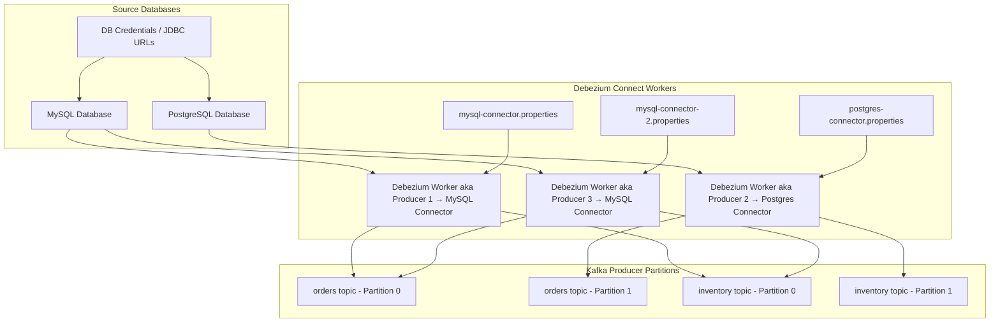
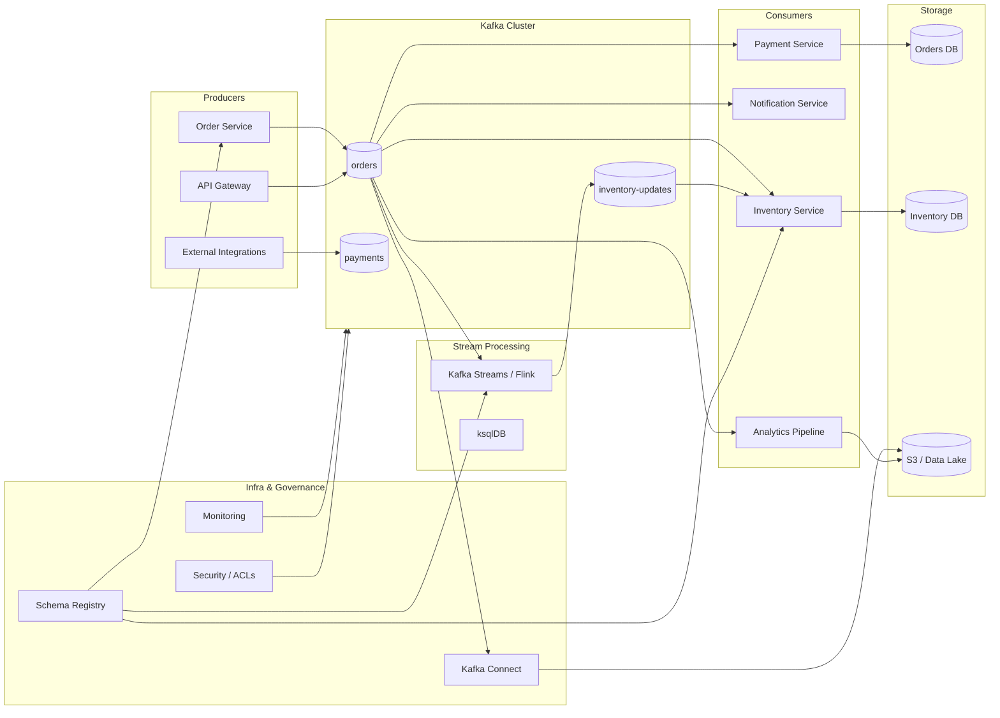
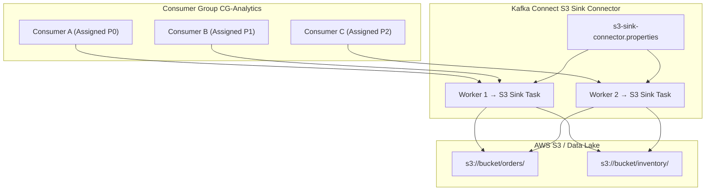
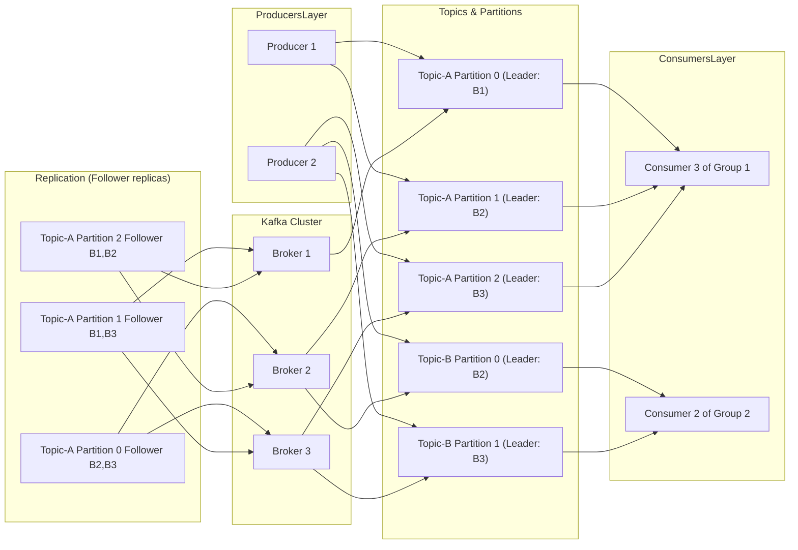
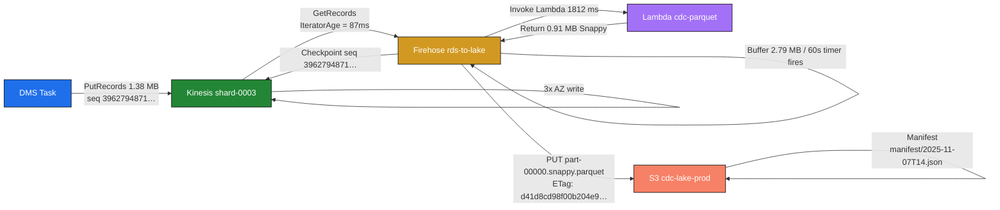

# AWS - S3 Table
## 1. S3 Table
Amazon S3 has long been a foundational object storage service for storing all types of unstructured and structured data. However, modern analytics, lakehouse, and large-scale data engineering workloads require structure, schema handling, transactions, and optimization — all of which **standard S3 buckets do not provide natively**.

**Amazon S3 Tables** is a new managed service that builds structured, tabular, Apache Iceberg–based tables **directly on top of S3**, providing highly optimized analytics performance without managing your own metadata, manifests, compaction, or Iceberg workflows.

---

### **2. Standard S3 vs S3 Tables (Table Buckets)**

#### **2.1 Comparison Table — S3 vs S3 Tables**

| Feature                    | Standard S3            | S3 Tables                          |
| -------------------------- | ---------------------- | ---------------------------------- |
| Storage Type               | General object storage | Managed Iceberg table storage      |
| Data Structure             | Objects (files)        | Tables (rows, columns, partitions) |
| Schema Support             | None                   | Full schema + evolution            |
| Transactions               | No                     | ACID                               |
| Snapshots / Time Travel    | No                     | Yes                                |
| Analytics Optimization     | Manual                 | Automatic                          |
| Metadata Management        | User-managed           | Fully managed                      |
| Performance                | Depends on file layout | Up to **3x faster** querying       |
| Integration with Analytics | Limited                | Native integration                 |
| Permissions                | Bucket/object level    | Table-level IAM                    |

<details>
    <summary>Click to view the detailed comparison</summary>

#### **2.2 Standard S3 Buckets**

General-purpose object storage:

* Stores unstructured files: images, logs, backups, CSVs, Parquet, JSON, binaries.
* No concept of **tables**, **schemas**, **partitions**, **transactions**, **snapshots**, or **ACID** guarantees.
* For analytics, you must manually manage:

  * File format (CSV/Parquet)
  * Partition strategy
  * Folder naming
  * Performance tuning
  * Metadata cataloging
* Query engines (Athena, Spark) must scan files directly → slower at scale.

#### **2.3 S3 Tables (Table Buckets)**

- Purpose-built for tabular, structured datasets (like a database table: columns and rows).
- Stored in a new kind of S3 bucket type called a “table bucket”; tables are first-class resources managed by S3 itself.
- Data is stored using the Apache Iceberg format (Parquet files + metadata), enabling advanced features like schema evolution, ACID transactions, and time travel queries.
- Provides higher transactions per second (TPS) and 3x better query throughput than using self-managed Iceberg tables in standard S3 buckets.
- Integrates natively with analytics engines like Athena, Redshift, Amazon SageMaker Lakehouse, AWS Glue Data Catalog and Apache Spark, Flink, Hive engines for direct SQL queries.
- Automatic table optimization: handles file compaction, metadata management, and optimizations to improve performance and lower storage costs.
- Table-level permissions, automated maintenance, and seamless integration with AWS Data Lake and Lakehouse services.

> Up to **10 table buckets per region**
> Up to **10,000 tables per bucket**
> S3 automatically optimizes table data layout and metadata for analytics.

</details>

---

### **3. [Apache Iceberg — Why S3 Tables Use It](https://aws.amazon.com/what-is/apache-iceberg/)**

Apache Iceberg is an open-source table format built for data lakes. S3 Tables:

* Store data in **Parquet files**
* Store metadata using **Iceberg manifests**
* Provide high-speed reads and efficient incremental writes

<details>
    <summary>Click to view the Key Capabilities of Apache Iceberg</summary>

### Key Capabilities of Apache Iceberg**

Apache Iceberg is a modern open-source table format designed for large-scale analytics on data lakes. It provides advanced features such as ACID transactions, schema evolution, versioning, and incremental processing — all while remaining engine-agnostic and SQL-friendly.

#### **1. SQL Familiarity**

Iceberg fully supports SQL-based table operations.
Anyone familiar with SQL can create, modify, query, and manage Iceberg tables without learning new languages or frameworks. This makes Iceberg easy to adopt for analysts, engineers, and developers.

#### **2. Strong Data Consistency**

Iceberg ensures that all readers and writers see a consistent view of the dataset.
It uses ACID transactions so that concurrent operations do not conflict, guaranteeing reliable data reads and writes across distributed systems.

#### **3. Flexible Data Structure (Schema Evolution)**

Iceberg allows seamless and safe schema changes, including:

* Adding columns
* Renaming columns
* Removing columns

These operations do not require rewriting existing data and do not break queries or pipelines.

#### **4. Data Versioning and Time Travel**

Iceberg maintains snapshots of table states over time.
This enables:

* Querying historical versions (time travel)
* Comparing old and new data
* Auditing changes after updates or deletes

Snapshots make rollback and historical analysis simple and efficient.

#### **5. Cross-Platform Compatibility**

Iceberg works across multiple engines and storage systems.
It integrates with:

* Apache Spark
* Apache Flink
* Apache Hive
* Presto/Trino
* AWS Athena, Redshift, EMR
  This flexibility allows Iceberg tables to be used in any modern data lake or lakehouse environment.

#### **6. Incremental Processing (CDC Support)**

Iceberg supports efficient incremental data processing.
Instead of scanning entire datasets, engines can read only:

* New data
* Modified data
* Deleted data

This reduces compute cost and improves job performance for CDC, ETL, and streaming workloads.

---

#### **7. Maintenance Configuration Limitation**

Certain Iceberg maintenance settings are **incompatible**:

* `history.expire.max-snapshot-age-ms`
* `history.expire.min-snapshots-to-keep`

These two properties cannot be used together because they represent conflicting snapshot retention rules.
One controls retention by **age**, the other by **count** — so only one method should be used per table.

</details>

---

### **4. Analytics Integrations of S3 Tables**

S3 Tables are automatically discoverable by analytics services via Glue Data Catalog.

##### **Native Integrations**

* **Athena SQL**
* **Amazon Redshift Lakehouse**
* **Amazon SageMaker Lakehouse**
* **Amazon EMR**
* **AWS Glue ETL**
* **Apache Spark / Flink / Hive**
* **QuickSight**

These engines can directly query, snapshot, merge, compact, or time-travel the Iceberg tables.

---

### **5. S3 Tables Pricing (Mumbai Region)**

<details>
    <summary>Click to view the pricing</summary>


#### **5.1 Storage Charges**

| Tier              | Price (per GB per month)     |
| ----------------- | ---------------------------- |
| First 50 TB       | **$0.0288**                  |
| Next 450 TB       | **$0.0276**                  |
| Over 500 TB       | **$0.0265**                  |
| Object Monitoring | **$0.025 per 1,000 objects** |

#### **5.2 Requests Pricing**

| Request Type      | Price                          |
| ----------------- | ------------------------------ |
| PUT / POST / LIST | **$0.005 per 1,000 requests**  |
| GET / Others      | **$0.0004 per 1,000 requests** |

**Example: 1,003 PUTs/day × 30 days → 30,090/month**
Cost = **30,090 × $0.005 / 1000 = $0.15**

#### **5.3 Compaction Pricing**

| Compaction Type                    | Price                        |
| ---------------------------------- | ---------------------------- |
| Objects processed                  | **$0.002 per 1,000 objects** |
| Data processed (binpack – default) | **$0.005 per GB**            |
| Data processed (Sort / Z-order)    | **$0.01 per GB**             |

#### **5.4 Data Transfer Out (Slabs)**

| Slab     | Price          |
| -------- | -------------- |
| 10.24 TB | $0.1093 per GB |
| 40.96 TB | $0.085 per GB  |
| 102.4 TB | $0.082 per GB  |
| 870.4 TB | $0.08 per GB   |

#### **5.5 Full Cost Calculation Model**

> Total = S3 Tables storage charge + PUT request charge + GET request charge + Object monitoring charge + Compaction (objects + data processed) + Data outbound charges

</details>

#### **Do Applications Writing Directly to S3 Tables Trigger Compaction Costs?**

<details>
    <summary>Click to view how S3 Tables Trigger Compaction Costs</summary>

#### **Short Answer:** **Yes — eventually.**

But **not immediately with every PUT**.

#### 1. When your application writes data using:

* S3 PUT APIs
* Iceberg compatible writers
* Spark / Flink / Athena INSERT statements

It writes **files** into table buckets.

#### 2. These incoming files can be:

* Small
* Unoptimized
* Many-in-number

Over time, this leads to:

* High metadata overhead
* Slower queries
* More manifest files

#### 3. To fix this, **S3 Tables automatically runs maintenance jobs**, including:

File compaction
Metadata cleanup
Snapshot expiration
Small-file merging

These **maintenance operations** are what trigger:

**Compaction object charges**
**Compaction GB processed charges**

#### **Therefore:**

> **Writing data directly to S3 tables WILL eventually incur compaction charges, because automatic optimization is part of the service.**

#### **When is compaction triggered?**

* Lots of small files are created
* Too many data files per partition
* Too many metadata files
* Scheduled maintenance windows
* Query engines require optimization

#### **You cannot avoid compaction charges entirely**, but you can reduce them by:

* Writing larger Parquet files (64–512 MB)
* Reducing small/fragmented writes
* Using batching or micro-batching
* Using Spark/Flink optimized writers

</details>

<details>
    <summary>Click to view the detailed Explaination</summary>

When you store data in Amazon S3 Tables using put requests (uploading data files), the S3 Tables service automatically performs compaction in the background to optimize storage and query efficiency. Here is how compaction occurs:

### How Compaction Occurs in S3 Tables

1. **Granular Writes Create Many Small Files:**  
   Each put request often creates a small file (or object) in the table, especially in transactional or streaming workloads where data arrives continuously and in small chunks.

2. **Small Files Impact Query Performance:**  
   Large numbers of small files increase the overhead for query engines, needing multiple reads and scans, which degrade performance.

3. **Automatic Background Compaction:**  
   S3 Tables automatically combines many smaller files into fewer, larger files during compaction. This process is transparent to users and requires no manual intervention.

4. **Target File Size and Strategies:**  
   - By default, S3 Tables aim to compact files to about 512 MB in size, but this target can be tuned between 64 MB and 512 MB via AWS CLI configuration.  
   - Different compaction strategies are supported including binpack (default), sort, and z-order compaction for optimized query patterns on large-scale datasets.

5. **Compacted Files Form Latest Table Snapshot:**  
   Files created by compaction become the latest snapshot of the table, ensuring data remains current and efficiently organized for queries.

6. **Benefits:**  
   - Improved query speed due to fewer file scans and higher data read throughput.  
   - Reduced storage overhead by minimizing metadata and file fragmentation.  
   - Reduced operational complexity as manual compaction management is avoided.

### Summary of the Compaction Process

| Step                        | Description                                        |
|-----------------------------|--------------------------------------------------|
| Data Upload                 | Put requests add small files to the table        |
| Performance Impact          | Many small files degrade query performance       |
| Automatic Compaction        | Background process merges small files into bigger ones |
| Configurable Target Size    | Default 512 MB per file, adjustable via CLI      |
| Compaction Strategies       | Binpack (default), sort compaction, z-order compaction |
| Final Outcome              | Latest snapshot with optimized file structure    |

This automatic compaction in S3 Tables helps maintain efficient and performant data access for large-scale analytics workloads without user intervention or additional infrastructure.

[How amazon s3 tables uses compaction](https://aws.amazon.com/blogs/storage/how-amazon-s3-tables-use-compaction-to-improve-query-performance-by-up-to-3-times/)
[amazon-s3-tables-reduce-compaction-costs](https://aws.amazon.com/about-aws/whats-new/2025/07/amazon-s3-tables-reduce-compaction-costs/)
[S3 Tables](https://www.onehouse.ai/blog/s3-managed-tables-unmanaged-costs-the-20x-surprise-with-aws-s3-tables)
[Amazon s3 iceberg compaction](https://www.infoq.com/news/2025/07/amazon-s3-iceberg-compaction/)
[Amazon s3 Table](https://hevodata.com/learn/amazon-s3-table/)
[why-amazon-s3-tables-is-a-game-changer-for-transactional-data-lakes](https://www.granica.ai/blog/why-amazon-s3-tables-is-a-game-changer-for-transactional-data-lakes)
[data-analytics/spark-operator-s3tables](https://awslabs.github.io/data-on-eks/docs/blueprints/data-analytics/spark-operator-s3tables)
[small-file-problem-s3](https://www.upsolver.com/blog/small-file-problem-s3)
 
</details>

### **7. RDS vs S3 Tables**

| Feature        | RDS                          | S3 Tables                          |
| -------------- | ---------------------------- | ---------------------------------- |
| Type           | Relational Database          | Lakehouse Table Storage            |
| Optimized For  | OLTP                         | OLAP                               |
| Schema         | Strict                       | Flexible & Evolvable               |
| Transactions   | Strong ACID                  | ACID (Iceberg)                     |
| Query Type     | Row-based SQL                | Columnar analytics SQL             |
| Concurrency    | High                         | High for analytics, not OLTP       |
| Scaling        | Vertical & Read replicas     | Horizontal to petabytes            |
| Storage Format | Database engine format       | Parquet + Iceberg                  |
| Cost Model     | Compute + Storage            | Storage + Requests + Compaction    |
| Time Travel    | Point-in-time backups        | Built-in snapshots                 |
| When to Use    | Real-time apps, transactions | Analytics, BI, ML, ETL, data lakes |
| Integration    | App-level                    | Analytics engines                  |

<details>
    <summary>Click to view the key distinctions</summary>

##### **Key Distinctions**

##### **RDS** is for:

* High-speed transactional workloads
* Low-latency reads/writes
* Real-time applications
* Banking, inventory, order processing

##### **S3 Tables** is for:

* Analytics
* BI and dashboards
* Large-scale data storage
* ML training
* Time-travel analysis
* ETL pipelines
* Lakehouse architectures

> **RDS stores rows; S3 Tables store columnar data.**
> **RDS cannot scale to PBs affordably; S3 Tables are designed for PB–EB scale.**

</details>

### **8. S3 Tables — Behavior Summary**

<details>
    <summary>Click to view the S3 Tables behaviour summary</summary>

##### **1. Automatic Maintenance**

* Merges small files
* Rewrites partitions
* Cleans metadata
* Handles snapshot pruning

##### **2. Optimized Query Performance**

* Pushdown filters
* Column pruning
* Partition pruning
* Iceberg metadata skipping

##### **3. High Transaction Throughput**

* Designed for large-scale analytics ingestion
* Supports parallel writes

##### **4. Full Iceberg Semantics**

* ACID
* Schema evolution
* Time travel
* Incremental scans

##### **5. Strong Integrations**

* Athena: direct SQL
* Redshift: lakehouse analytics
* Spark/Flink: streaming and batch
* Glue: ETL automation

</details>

<details>
    <summary>Click to view the links of Online References (All Articles Included)</summary>

1. [https://docs.aws.amazon.com/AmazonS3/latest/userguide/s3-tables.html](https://docs.aws.amazon.com/AmazonS3/latest/userguide/s3-tables.html)
2. [https://www.youtube.com/watch?v=brgh-VhN2hU](https://www.youtube.com/watch?v=brgh-VhN2hU)
3. [https://docs.aws.amazon.com/AmazonS3/latest/userguide/s3-tables-tables.html](https://docs.aws.amazon.com/AmazonS3/latest/userguide/s3-tables-tables.html)
4. [https://www.onehouse.ai/blog/s3-managed-tables-unmanaged-costs-the-20x-surprise-with-aws-s3-tables](https://www.onehouse.ai/blog/s3-managed-tables-unmanaged-costs-the-20x-surprise-with-aws-s3-tables)
5. [https://doris.apache.org/docs/dev/lakehouse/best-practices/doris-aws-s3tables/](https://doris.apache.org/docs/dev/lakehouse/best-practices/doris-aws-s3tables/)
6. [https://hevodata.com/learn/amazon-s3-table/](https://hevodata.com/learn/amazon-s3-table/)
7. [https://www.infoq.com/news/2025/01/s3-tables-bucket/](https://www.infoq.com/news/2025/01/s3-tables-bucket/)
8. [https://www.vantage.sh/blog/amazon-s3-tables](https://www.vantage.sh/blog/amazon-s3-tables)
9. [https://www.reddit.com/r/aws/comments/1h8j86w/whats_the_point_of_s3_tables/](https://www.reddit.com/r/aws/comments/1h8j86w/whats_the_point_of_s3_tables/)
10. [https://dataengineeringcentral.substack.com/p/amazon-s3-tables](https://dataengineeringcentral.substack.com/p/amazon-s3-tables)
11. [https://stackoverflow.com/questions/33356041/technically-what-is-the-difference-between-s3n-s3a-and-s3](https://stackoverflow.com/questions/33356041/technically-what-is-the-difference-between-s3n-s3a-and-s3)

</details>

---
# Debezium
### Debezium MySQL Connector Configuration Overview
The Debezium MySQL connector captures row-level changes from MySQL databases (including Amazon RDS for MySQL) by reading the binary log (binlog). Configurations are set as key-value pairs when registering the connector via Kafka Connect REST API or properties files. All properties are optional unless marked required, with sensible defaults for most. 

### How Debezium Connector Works
- Connects to the source database using native features like binary logs or CDC tables.
- Takes an initial consistent snapshot of data for tables being monitored.
- Streams ongoing row-level change events to Kafka topics or other sinks.
- Supports filters to include/exclude schemas, tables, or columns.
- Supports masking of sensitive data in columns.
- Provides monitoring via JMX and transformations for routing/filtering events.
- [Storing state of a Debezium connector](https://debezium.io/documentation/reference/stable/configuration/storage.html)



### **Explanation of Architecture**

#### **1. Source Databases**

* `MySQLDB` and `PostgresDB` are the CDC sources.
* Debezium connects via **JDBC URL** and credentials (`DBConfig`).

#### **2. Debezium Connect Workers**

* **Standalone Worker**

  * Single process, all connectors run here.
  * Config file: `connect-standalone.properties`
  * Good for dev/testing.
* **Distributed Worker**

  * Multiple nodes coordinate tasks, scalable, fault-tolerant.
  * Config file: `connect-distributed.properties`
  * Used in production.

#### **3. Debezium Connectors**

* Each database has one connector:

  * `mysql-connector.properties` → MySQL tables → Kafka topics
  * `postgres-connector.properties` → Postgres tables → Kafka topics
* Connectors fetch database changes and push them to Kafka via the worker.

**Connector Config Example Fields:**

```properties
name=mysql-connector
connector.class=io.debezium.connector.mysql.MySqlConnector
database.hostname=localhost
database.port=3306
database.user=root
database.password=root
database.server.id=184054
database.server.name=dbserver1
table.include.list=orders,customers
database.history.kafka.bootstrap.servers=kafka:9092
database.history.kafka.topic=dbhistory.orders
```

#### **4. Kafka Producer Partitions**

* Kafka topics are **partitioned** for parallelism and ordering:

| Topic     | Partition | Example Data           |
| --------- | --------- | ---------------------- |
| orders    | P0        | user123 events         |
| orders    | P1        | user987 events         |
| inventory | P0        | stock updates region 1 |
| inventory | P1        | stock updates region 2 |

* **Debezium workers act as producers**.
* **Partitioning** is based on the connector configuration:

  * **Key-based hashing** → keeps ordering for same key
  * **Round-robin** → balances load if no key

#### **5. Data Flow**

1. **Database change** (INSERT/UPDATE/DELETE) occurs.
2. **Debezium connector** detects it.
3. Connector sends event to **worker process**.
4. **Worker produces event** to Kafka topic partition:

   * Example: `orders table update → orders topic P0`
5. Consumers downstream can read from the topic partitions in parallel.

**Key Points**

* Debezium workers = processes that **produce events**
* Producer partitions = **specific Kafka topic partitions where events land**
* Connector config files = define **what to capture, which database, which tables, which Kafka topic, etc.**
* Multiple workers = fault tolerance, scaling, distributed task assignment

<details>
    <summary>Click to view Debezium’s CDC reading the binlog from the replica instead of the master</summary>

### 1. MySQL/RDS Binlog Replication Basics

* **Master (Primary)**:

  * All changes (INSERT, UPDATE, DELETE) are written to the **binlog**.
* **Replica (Slave)**:

  * Pulls the binlog events from the master and applies them to its own data.
  * By default, replicas **can have their own binlog enabled**, which is called **“log_slave_updates”** in MySQL.

    * If `log_slave_updates = ON`, the replica writes **all replicated events** into its **own binlog**, just like the master.
    * This allows the replica to act as a source for downstream replication or tools like Debezium.
* **Without `log_slave_updates`**, the replica applies the changes but **does not record them in its own binlog**.

### 2. Implications for Debezium

* If you want Debezium to read from a **replica**:

  1. **Enable binlog on the replica** (`binlog_format=ROW` and `log_slave_updates=ON`).
  2. Debezium can then read the **replicated binlog events** from the replica **exactly as they appeared on the master**.
  3. This will **reduce load on the master**, because Debezium is now reading the binlog from the replica instead.

* Caveats:

  * Make sure the replica’s binlog **starts from the current position of replication**. Otherwise, Debezium might miss early events.
  * There may be **slight replication lag**, so the events on the replica binlog may be slightly delayed compared to the master.

### Summary

* **Yes**, the binlog can exist on the replica **if `log_slave_updates` is enabled**.
* **Debezium can read from the replica** safely if:

  * `binlog_format=ROW`
  * `log_slave_updates=ON`
  * The replica is configured to allow connections from Debezium.
* This approach **reduces load on the master** while still capturing all CDC events.

</details>

<details>
    <summary>Click to view CDC Configurations for Debezium with Amazon RDS MySQL</summary>

### CDC Configurations for Debezium with Amazon RDS MySQL
Change Data Capture (CDC) with Debezium on Amazon RDS for MySQL enables real-time streaming of row-level changes (INSERT, UPDATE, DELETE) from your RDS instance to Kafka topics. Debezium reads the MySQL binary log (binlog) to capture these events, producing structured JSON/Avro messages. This setup is ideal for analytics, replication, or event-driven apps.

As of November 4, 2025, RDS MySQL supports CDC via Debezium 3.0+ (stable), with MySQL 8.0/8.4 engines. Key: Enable binlog in RDS parameter groups, grant privileges to a Debezium user, and configure the connector for filtering (e.g., specific tables/columns). RDS uses table-level locks for snapshots (no global locks), so tune for low-impact on production.

Below: RDS-side setup (parameters + privileges), Debezium connector configs (all properties, with emphasis on table/column filtering), and examples for targeted capture.

#### RDS-Side Setup for Debezium CDC
1. **Prerequisites**:
   - RDS MySQL instance (Single-AZ or Multi-AZ; read replicas for scaling).
   - Enable automated backups (required for binlog; set retention 1-35 days).
   - VPC security group: Allow inbound 3306 from Debezium host (e.g., EC2/ECS).
   - Create a custom DB parameter group (from `mysql8.0` family) for binlog tweaks; apply and reboot instance.

2. **User Privileges** (Create via RDS console/CLI; run as master user):
   ```
   CREATE USER 'debezium'@'%' IDENTIFIED BY 'secure_password';
   GRANT SELECT, RELOAD, SHOW DATABASES, REPLICATION SLAVE, REPLICATION CLIENT ON *.* TO 'debezium'@'%';
   GRANT LOCK TABLES ON *.* TO 'debezium'@'%';  -- RDS-specific for table-level snapshots
   GRANT ALL PRIVILEGES ON your_db.* TO 'debezium'@'%';  -- For target DB (e.g., employees)
   FLUSH PRIVILEGES;
   ```
   - Why? `REPLICATION SLAVE/CLIENT` for binlog access; `LOCK TABLES` for RDS snapshots (global locks forbidden).
   - IAM auth: Optional; use `AUTHENTICATION_PLUGIN = AWS_IAM` for passwordless.

3. **Binlog and CDC Enabling**:
   - Via AWS Console: Databases > Parameter groups > Create/modify group > Set params below > Apply to instance > Reboot.
   - CLI: `aws rds modify-db-parameter-group --db-parameter-group-name my-group --parameters "ParameterName=binlog_format,ParameterValue=ROW,ApplyMethod=immediate"`.
   - Test: Connect as Debezium user, run `SHOW MASTER STATUS;` (shows binlog file/position).

#### RDS MySQL Parameters for Debezium CDC
Focus on binlog, locking, and replication params (from AWS docs; dynamic/static noted). ~300 total params, but these are essential for CDC. Defaults/limits for MySQL 8.0 (adjust for 8.4). Invalid values (e.g., out-of-range) rejected at apply with "Parameter invalid" error; may require reboot.

| Parameter Name | Type | Default | Allowed Values/Limits | Description | Static/Dynamic | RDS Notes | Invalid Value Behavior |
|---------------|------|---------|-----------------------|-------------|----------------|-----------|------------------------|
| `binlog_format` | Enum | ROW | STATEMENT, ROW, MIXED | Binlog format: ROW for row-level CDC (full before/after images). | Static (reboot) | Required for Debezium; STATEMENT loses data fidelity. Set via param group. | Mixed/STATEMENT: Debezium logs "Unsupported format," skips non-row events. |
| `log_bin` | Boolean | OFF (enabled by backups) | ON/OFF | Enables binlog. | Static | Auto-on with backups; cannot disable if backups enabled. Min retention 24h. | OFF: Debezium "Binlog disabled" error; no streaming. |
| `binlog_row_image` | Enum | FULL | FULL, PARTIAL, MINIMAL, NOBLOB | Binlog row detail: FULL captures all columns. | Dynamic | Use FULL for complete CDC; MINIMAL omits unchanged columns (risks nulls). | PARTIAL/MINIMAL: Incomplete events; Debezium may produce partial payloads. |
| `binlog_expire_logs_seconds` | Int | 259200 (3 days) | 86400s (1 day) - 3024000s (35 days) | Binlog retention time. | Static | Ties to backup window; monitor CloudWatch BinLogDiskUsage. | <86400s: Offset loss on restart (Debezium resnapshots, duplicates data). |
| `server_id` | Int | Auto (unique per instance) | 1 - 4294967295 | Unique replication ID. | Dynamic | RDS auto-assigns; override for multi-connector setups. | Duplicate: "Server ID collision"; binlog read fails. |
| `gtid_mode` | Enum | ON | OFF, ON, ON_PERMISSIVE | GTID for ordered CDC (better for replicas). | Static | Default ON; pair with `enforce_gtid_consistency=ON`. | OFF: Falls back to filename/position (fragile on failover). |
| `enforce_gtid_consistency` | Enum | ON | OFF, ON, WARN | Enforces GTID use. | Static | ON for safe RDS CDC. | OFF: GTID gaps; potential event loss/duplication. |
| `lock_wait_timeout` | Int | 31536000 (1 year) | 1 - 31536000 seconds | Lock timeout for snapshots. | Dynamic | Tune higher (e.g., 300s) for large RDS tables during Debezium locks. | Low: Snapshot "Lock wait timeout"; partial data capture. |
| `innodb_lock_wait_timeout` | Int | 50 | 1 - 3600 seconds | InnoDB lock timeout. | Dynamic | Affects writes during CDC snapshots; increase to 120s for high concurrency. | Low: Transaction rollbacks; Debezium snapshot stalls. |
| `max_allowed_packet` | Int | 67108864 (64MB) | 1024 - 1073741824 bytes | Max event size. | Dynamic | Increase to 256MB for large rows in CDC. | Exceeded: Events truncated; Debezium "Packet too large," skips rows. |
| `sync_binlog` | Int | 1 | 0 - 4294967295 | Binlog sync frequency (1=per-commit). | Dynamic | 1 for durability; 0 for speed (risks loss). | 0: Unsynced changes missed on crash; data inconsistency. |
| `binlog_checksum` | Enum | CRC32 | NONE, CRC32 | Binlog integrity check. | Dynamic | CRC32 standard for RDS; Debezium auto-handles. | NONE: Checksum mismatch errors; event skips. |
| `local_infile` | Boolean | OFF | ON/OFF | For data loads (pre-CDC). | Dynamic | Enable for bulk imports; no direct CDC impact. | OFF: Import fails; irrelevant for streaming. |

**RDS Setup Notes**:
- **Apply Changes**: Modify param group > Associate with instance > Reboot (downtime ~5 mins).
- **Monitoring**: CloudWatch metrics (BinLogDiskUsage >80% warns of purge risk); set alarms for FreeableMemory during snapshots.
- **Best Practices**: Start with Multi-AZ for HA; use read replicas for offloading snapshots. For 2025, RDS now supports MySQL 8.4 with improved binlog compression (set `binlog_row_value_options=partial_json` for JSON cols).

#### Debezium Connector Configurations for RDS CDC
Deploy via Kafka Connect (e.g., MSK Connect or self-hosted). All ~50 properties optional except required; types: string/enum/int/long/boolean. Validation: Startup `ConfigException` for invalids (e.g., bad regex). Use JSON config in REST API.

**Core Setup**: `connector.class=io.debezium.connector.mysql.MySqlConnector`, `tasks.max=1` (single-task for ordered binlog).

For **specific table/few columns**: Use filters (`table.include.list`, `column.include.list`) to target e.g., `employees` table's `name,salary` columns only. Combine with SMTs (Single Message Transforms) for advanced filtering. Ex: Capture only `your_db.employees` table, excluding `sensitive_col`.

##### Required Configurations
| Property Name | Type | Default | Description | Limits/Valid Values | Invalid Value Behavior |
|---------------|------|---------|-------------|---------------------|------------------------|
| `connector.class` | string | N/A | Connector impl. | `io.debezium.connector.mysql.MySqlConnector` | Startup fail: ClassNotFound. |
| `database.hostname` | string | N/A | RDS endpoint (e.g., `mydb.us-east-1.rds.amazonaws.com`). | Valid hostname/IP. | Connection timeout: "Unknown host." |
| `database.port` | int | 3306 | RDS port. | 1-65535 | Refused: Port invalid. |
| `database.user` | string | N/A | Debezium user. | RDS user with grants. | Auth fail: "Access denied." |
| `database.password` | string (password) | N/A | Password. | Secure; externalize (e.g., AWS Secrets). | Auth fail. |
| `database.server.id` | long | N/A | Unique ID (RDS instance num). | 1-4294967295 | Collision: Binlog read fail. |
| `topic.prefix` | string | N/A | Topic prefix (e.g., `rds-cdc`). | Alphanumeric + `.`/`_`. | Invalid topic: Creation fail. |

##### Snapshot (Initial Load; Use Table Locks in RDS)
| Property Name | Type | Default | Description | Limits/Valid Values | Invalid Value Behavior |
|---------------|------|---------|-------------|---------------------|------------------------|
| `snapshot.mode` | enum | `initial` | Snapshot strategy: `initial` for full load + stream; `never` post-setup. | `initial`, `schema_only`, `when_needed`, `always`, `custom`. | Unknown: Startup fail; e.g., `always` causes repeated locks. |
| `snapshot.lock.timeout.ms` | long | 10000 | Lock wait (tune for RDS tables). | >=0 ms | Timeout: Partial snapshot. |
| `snapshot.fetch.size` | int | 2000 | Rows per query (IOPS-friendly). | >0 | High: OOM; low: Slow. |

##### Table/Column Filtering (For Specific Table/Columns)
Target e.g., only `your_db.orders` table's `id,amount` columns. Use regex (anchored, case-sensitive). Mutually exclusive include/exclude.

| Property Name | Type | Default | Description | Limits/Valid Values | Invalid Value Behavior |
|---------------|------|---------|-------------|---------------------|------------------------|
| `database.include.list` | string | N/A | DBs to capture (e.g., `your_db`). | Comma-separated anchored regex (e.g., `^your_db$`). | Malformed regex: Captures all/wrong DBs; validation warn. |
| `database.exclude.list` | string | N/A | DBs to skip (e.g., `mysql,information_schema`). | Comma-separated regex. | Includes system DBs; overhead. |
| `table.include.list` | string | N/A | Tables to capture (e.g., `your_db\.orders`). For one table: `^your_db\.orders$`. | Comma-separated `db\.table` regex. | Malformed: Skips tables; e.g., unanchored captures extras. |
| `table.exclude.list` | string | N/A | Tables to skip (e.g., `your_db\.temp_table`). | Comma-separated regex. | Captures unwanted; noise in topics. |
| `column.include.list` | string | N/A | Columns for specific table (e.g., `your_db\.orders\.id,amount`). | Comma-separated `db\.table\.col` regex. Mutually excl. with exclude. | Malformed: Includes all cols; data bloat. |
| `column.blacklist` (deprecated) | string | N/A | Legacy exclude cols (use `column.exclude.list`). | Comma-separated regex. | Warn; ignored in 3.0+—falls to include all. |
| `column.exclude.list` | string | N/A | Columns to exclude (e.g., `your_db\.orders\.sensitive`). | Comma-separated regex. | Includes sensitive; compliance risk. |
| `invisible.columns` | boolean | false | Capture invisible cols (MySQL 8.0+). | true/false | false: Misses hidden cols. |

**Example for Specific Table/Columns**:
- Config: `"table.include.list": "your_db.orders", "column.include.list": "your_db.orders.id,your_db.orders.amount"`.
- Result: Only `orders` table changes, with events including just `id`/`amount` (others null/omitted).
- For multiple: `"table.include.list": "db1.table1,db2.table2"`.
- Advanced: Use SMT `filter` for runtime (e.g., `transforms=filter, "filters=orders_filter"` with predicates).

##### Data Handling
| Property Name | Type | Default | Description | Limits/Valid Values | Invalid Value Behavior |
|---------------|------|---------|-------------|---------------------|------------------------|
| `bigint.unsigned.handling.mode` | enum | `precise` | UNSIGNED BIGINT (RDS common). | `precise` (BigDecimal), `long`. | `long`: Overflow >2^63. |
| `binary.handling.mode` | enum | `bytes` | Binary cols. | `bytes`, `base64`, `hex`. | Unknown: Garbled data. |
| `decimal.handling.mode` | enum | `precise` | DECIMAL precision. | `precise`, `string`, `double`. | `double`: Rounding loss. |

##### Schema/Heartbeat
| Property Name | Type | Default | Description | Limits/Valid Values | Invalid Value Behavior |
|---------------|------|---------|-------------|---------------------|------------------------|
| `schema.history.internal.kafka.bootstrap.servers` | string | N/A | Kafka for DDL history. | Broker:port list. | Schema drift on restart. |
| `schema.history.internal.kafka.topic` | string | N/A | History topic (1 partition). | Valid name. | Corruption if >1 partition. |
| `heartbeat.interval.ms` | int | 0 | Heartbeat for RDS monitoring. | >=0 ms | No detection if <0. |

##### Performance
| Property Name | Type | Default | Description | Limits/Valid Values | Invalid Value Behavior |
|---------------|------|---------|-------------|---------------------|------------------------|
| `max.batch.size` | int | 2048 | Event batch (RDS throughput). | >0 | OOM if too high. |
| `poll.interval.ms` | int | 500 | Binlog poll. | >0 ms | Lag if high. |
| `max.queue.size` | int | 8192 | Buffer size. | >0 | Backpressure/OOM. |

**Full Example Config (Specific Table: employees.id, salary)**:
```
{
  "name": "rds-cdc-connector",
  "config": {
    "connector.class": "io.debezium.connector.mysql.MySqlConnector",
    "tasks.max": "1",
    "database.hostname": "mydb.us-east-1.rds.amazonaws.com",
    "database.port": "3306",
    "database.user": "debezium",
    "database.password": "secure_pass",
    "database.server.id": "12345",
    "topic.prefix": "rds-cdc",
    "database.include.list": "employees",
    "table.include.list": "employees.employees",
    "column.include.list": "employees.employees.id,employees.employees.salary",
    "snapshot.mode": "initial",
    "schema.history.internal.kafka.bootstrap.servers": "kafka:9092",
    "schema.history.internal.kafka.topic": "schema-changes.rds"
  }
}
```
- Deploy: POST to `/connectors/`. Topics: `rds-cdc.employees.employees` (only id/salary changes).

Check Debezium docs (stable as of 2025). Test with small tables; monitor RDS CPU/IOPS during snapshots.
 
</details>

<details>
    <summary>Click to view the Key Points and Parameters</summary>

**Key Points**:
- **Types**: Primarily strings (e.g., for lists/hosts), integers (e.g., timeouts), booleans, or enums (option lists).
- **Validation**: Kafka Connect performs type and value validation at startup. Invalid values (e.g., wrong type, out-of-range, malformed regex) typically cause a `ConfigException` or `ValidationException`, preventing the connector from starting. Some (e.g., regex mismatches) may log warnings and partially succeed but lead to skipped tables/events or data inconsistencies.
- **Defaults and Limits**: Defaults ensure basic functionality; limits are often positive integers, valid regex, or enums. Exceeding limits (e.g., oversized timeouts) may cause timeouts or resource exhaustion.
- **Custom/Deprecated**: Some properties support custom extensions (e.g., via class names); deprecated ones log warnings and may be removed in future versions.
- **Impact of Invalid/Other Params**: Undefined params use defaults. Overriding with invalid values halts startup or causes runtime errors (e.g., connection failures). Extra undefined params are ignored (no effect).

For a full, up-to-date list, refer to the [official Debezium docs](https://debezium.io/documentation/reference/connectors/mysql.html).

### RDS-Specific Considerations
Debezium works seamlessly with Amazon RDS MySQL (and Aurora MySQL), as it's MySQL-compatible. Key differences:
- **Locking**: RDS/Aurora doesn't support global read locks (`FLUSH TABLES WITH READ LOCK`), so the connector uses **table-level locks** (`LOCK TABLES`) during snapshots. The Debezium user must have `LOCK TABLES` privilege.
- **Binlog**: Ensure binlog is enabled in RDS parameter group (`binlog_format=ROW`, `log_bin=1`). RDS has limits on binlog retention (default 1 day; configurable up to 35 days via `binlog_expire_logs_seconds`).
- **GTIDs**: Supported for multi-master/replicas; enable via RDS params (`gtid_mode=ON`).
- **No Additional Params**: Use standard MySQL properties; no RDS-exclusive configs. Test snapshots thoroughly, as table locks can briefly block writes on large tables.
- **Limits**: RDS I/O throughput (e.g., Provisioned IOPS) affects snapshot speed; high-traffic DBs may need `snapshot.mode=never` after initial sync to avoid locks.
- **Invalid Config Impact**: Same as MySQL; e.g., missing `LOCK TABLES` privilege causes snapshot failures with "Access denied" errors.

If using RDS, monitor CloudWatch for binlog disk usage and connector lag.

### Required Configuration Properties
These must be set for basic connectivity and operation.

| Property Name | Type | Default | Description | Limits/Valid Values | Invalid Value Behavior |
|---------------|------|---------|-------------|---------------------|------------------------|
| `connector.class` | string | N/A | Java class for the connector. | Must be `io.debezium.connector.mysql.MySqlConnector`. | Startup failure with `ClassNotFoundException` or validation error. |
| `database.hostname` | string | N/A | MySQL/RDS server IP/hostname. | Valid IP or resolvable hostname. | Connection timeout/failure; connector won't start. |
| `database.port` | int | 3306 | MySQL/RDS server port. | 1-65535. | Connection failure; e.g., invalid port logs "Connection refused." |
| `database.user` | string | N/A | Username for connector (with REPLICATION SLAVE, etc., privileges). | Valid MySQL user. | Authentication error (401); connector fails to connect. |
| `database.password` | string (password) | N/A | Password for the user. | Secure string (externalize via secrets). | Authentication error; same as above. |
| `database.server.id` | int | N/A | Unique numeric ID for this connector instance (avoids binlog conflicts). | Positive integer (e.g., 184054); unique across cluster. | Replication slot conflict; binlog read fails with "Server ID collision." |
| `topic.prefix` | string | N/A | Prefix for all topics (e.g., `dbserver1`). | Alphanumeric + `_` (starts with letter); used for events like `<prefix>.<db>.<table>`. | Topic creation fails if invalid Kafka name; replaces invalid chars with `_` (may cause duplicates). |

### Common/Optional Configuration Properties
These control snapshots, filtering, data handling, etc. Grouped by category.

#### Connection and Heartbeat
| Property Name | Type | Default | Description | Limits/Valid Values | Invalid Value Behavior |
|---------------|------|---------|-------------|---------------------|------------------------|
| `connect.timeout.ms` | int | 30000 | Max ms to wait for DB connection. | Positive integer (ms). | Connection hangs indefinitely if <=0; validation error. |
| `heartbeat.interval.ms` | int | 0 (disabled) | Ms between heartbeat events to topic to detect failures. | Positive integer (ms); 0 disables. | If <=0, no heartbeats; may miss offsets on outage. |
| `heartbeat.topics.prefix` | string | `<topic.prefix>.heartbeat` | Prefix for heartbeat topics. | Valid topic prefix. | Heartbeat events not emitted; monitoring fails. |

#### Snapshot Configuration
| Property Name | Type | Default | Description | Limits/Valid Values | Invalid Value Behavior |
|---------------|------|---------|-------------|---------------------|------------------------|
| `snapshot.mode` | string (enum) | `initial` | Controls initial/current snapshot behavior (e.g., data/schema inclusion). | Enums: `initial` (full snapshot + stream), `schema_only` (deprecated; schema only), `initial_only` (snapshot then stop), `never` (no snapshot, stream from now), `when_needed` (snapshot if offsets missing), `recovery` (rebuild schema history), `always` (snapshot every run), `custom` (custom impl). | Validation error; e.g., unknown enum prevents startup. May trigger unwanted snapshots or miss data. |
| `snapshot.delay.ms` | long | 0 | Ms to wait before snapshot (for load balancing). | Non-negative integer (ms). | If <0, validation error; snapshot starts immediately. |
| `snapshot.fetch.size` | int | 2000 | Max rows fetched per snapshot query. | Positive integer. | If <=0, excessive memory use or validation error. |
| `snapshot.lock.timeout.ms` | long | 10000 | Ms to wait for snapshot locks. | Positive integer (ms). | Lock timeout errors if <=0; snapshot fails. |
| `snapshot.select.statement.overrides` | string | N/A | Custom SELECT for specific tables in snapshots (e.g., `db.table:SELECT * FROM db.table WHERE id > 1000`). | Comma-separated `db.table:SELECT stmt`. | SQL syntax error skips table; incomplete snapshot. |
| `snapshot.new.tables` | string (enum) | N/A | Behavior for new tables post-snapshot. | Enums: `include` (snapshot new tables), `exclude` (ignore). | Unknown enum: validation error; may miss new tables. |

#### Table and Column Filtering
| Property Name | Type | Default | Description | Limits/Valid Values | Invalid Value Behavior |
|---------------|------|---------|-------------|---------------------|------------------------|
| `database.include.list` | string | N/A | Comma-separated regex for DBs to include. | Anchored regex (e.g., `inventory`). | Malformed regex: validation error; captures all/wrong DBs. |
| `database.exclude.list` | string | N/A | Comma-separated regex for DBs to exclude. | Anchored regex; mutually exclusive with include. | Conflict with include: validation error. |
| `table.include.list` | string | N/A | Comma-separated regex for tables (e.g., `db.table`). | Anchored regex; case-sensitive. | Malformed: skips tables, logs error. |
| `table.exclude.list` | string | N/A | Comma-separated regex for tables to exclude. | Anchored regex. | Malformed: captures unintended tables. |
| `column.include.list` | string | N/A | Comma-separated regex for columns (e.g., `db.table.col`). | Anchored regex; mutually exclusive with exclude. | Conflict: validation error. |
| `column.exclude.list` | string | N/A | Comma-separated regex for columns to exclude. | Anchored regex. | Malformed: includes sensitive columns. |

#### Data Type Handling
| Property Name | Type | Default | Description | Limits/Valid Values | Invalid Value Behavior |
|---------------|------|---------|-------------|---------------------|------------------------|
| `bigint.unsigned.handling.mode` | string (enum) | `precise` | How to handle BIGINT UNSIGNED. | `precise` (BigDecimal), `long` (long, may overflow). | Unknown: validation error; data loss on overflow. |
| `binary.handling.mode` | string (enum) | `bytes` | Binary column representation. | `bytes`, `base64`, `base64-url-safe`, `hex`. | Unknown: validation error; garbled binary data. |
| `decimal.handling.mode` | string (enum) | `precise` | DECIMAL/NUMERIC handling. | `precise` (BigDecimal), `string`, `double`. | Unknown: precision loss. |
| `time.precision.mode` | string (enum) | `adaptive` | Temporal precision (e.g., microseconds). | `adaptive`, `connect`. | Unknown: reduced precision in events. |
| `event.deserialization.failure.handling.mode` | string (enum) | `fail` | Handle binlog deserialization errors. | `fail` (stop), `warn` (log/skip), `ignore` (silent skip). | Unknown: defaults to `fail`; data loss if ignore misused. |

#### Schema History and Signaling
| Property Name | Type | Default | Description | Limits/Valid Values | Invalid Value Behavior |
|---------------|------|---------|-------------|---------------------|------------------------|
| `schema.history.internal.kafka.bootstrap.servers` | string | N/A | Kafka brokers for schema history topic. | Comma-separated hosts:ports. | History storage failure; schema drift on restart. |
| `schema.history.internal.kafka.topic` | string | N/A | Topic for DDL history (1 partition only). | Valid topic name; single partition required. | Multi-partition: history corruption; connector errors. |
| `signal.data.collection` | string | N/A | Table for ad-hoc snapshot signals (e.g., `db.signal_table`). | `db.table` format. | Signals ignored; no ad-hoc snapshots. |

#### Performance and Advanced
| Property Name | Type | Default | Description | Limits/Valid Values | Invalid Value Behavior |
|---------------|------|---------|-------------|---------------------|------------------------|
| `heartbeat.interval.ms` | int | 0 | Heartbeat frequency. | >=0 ms. | No heartbeats if <0; offset loss risk. |
| `max.batch.size` | int | 2048 | Max events per batch. | Positive integer. | If <=0, unbounded batches; memory exhaustion. |
| `max.queue.size` | int | 8192 | Buffer queue size. | Positive integer. | If <=0, unlimited queue; OOM on high load. |
| `poll.interval.ms` | int | 500 | Binlog polling interval. | Positive integer (ms). | High CPU if too low; lag if too high. |
| `snapshot.fetch.size` | int | 2000 | Snapshot batch fetch size. | Positive integer. | Memory issues if too high. |

#### Converters and Transformations (Examples)
| Property Name | Type | Default | Description | Limits/Valid Values | Invalid Value Behavior |
|---------------|------|---------|-------------|---------------------|------------------------|
| `key.converter` | string | N/A | Kafka key serializer (e.g., JsonConverter). | Valid class (e.g., `org.apache.kafka.connect.json.JsonConverter`). | Serialization failure; events not produced. |
| `value.converter` | string | N/A | Kafka value serializer. | Valid class. | Same as above. |
| `transforms` | string | N/A | SMT chain (e.g., `unwrap`). | Comma-separated SMT names. | Transformation fails; malformed events. |

### Additional Notes
- **Total Properties**: ~50+ in full docs; above covers core ones. For exhaustive list, see Debezium reference.
- **Other Params**: Ignored if undefined. Custom params (e.g., prefixed like `snapshot.custom.*`) require matching extensions; otherwise, ignored or validation error.
- **Limits Overview**: Timeouts (ms, positive ints); sizes (positive ints, e.g., 1024 rows); regex (anchored, Java flavor); enums (case-sensitive).
- **Error Handling**: Most invalid configs cause immediate startup failure. Runtime issues (e.g., bad regex) log warnings and degrade gracefully (e.g., skip tables).
- **Best Practices for RDS**: Use IAM DB auth if possible; monitor binlog retention to avoid offset loss.

</details>

## Explicit configuration of the offset store and internal schema history storage is configured via connector properties.
### Overview
Debezium connectors require persistent storage to preserve their state between restarts. All connectors need a mechanism for persistent storage of offsets. Additionally, connectors like Db2, MySQL, Oracle, and SQL Server require extra storage for their internal schema history, which records changes to table schema in the database.

Offset storage is automatically provided for deployments in the Kafka Connect runtime via:
- Kafka offset store: Provides storage for Kafka Connect distributed.
- File offset store: Provides storage for Kafka Connect standalone.

For Debezium Engine or Debezium Server deployments, explicit configuration of the offset store is required. For schema-based databases, internal schema history storage is configured via connector properties.

### Kafka
Debezium uses Kafka for storing state, including source offsets and schema history. Connectors use `KafkaOffsetBackingStore` to store offsets in a Kafka topic (e.g., `connect-offsets`), ensuring resumption from the correct position after restarts. Schema history is stored in a separate compacted topic, such as `schema-changes.inventory`.

<details>
    <summary>Click to view Properties of Offset Store</summary>


#### Offset Store
| Property | Default | Description |
|----------|---------|-------------|
| offset.storage | No default | Must be set to `org.apache.kafka.connect.storage.KafkaOffsetBackingStore`. |
| offset.storage.topic | No default | Specifies the Kafka topic where the connector stores its offsets. To ensure that the topic retains the latest offset information, you must enable log compaction for this topic. |
| offset.storage.partitions | 25 | Specifies the number of partitions for the offset storage topic. Ensure that the value of this setting aligns with the partitioning strategy of the Kafka cluster. |
| offset.storage.replication.factor | 3 | Sets the replication factor for the offset storage topic. Replicating data across multiple brokers improves fault tolerance. |

</details>

<details>
    <summary>Click to view Properties of Internal Schema History Store</summary>

#### Internal Schema History Store
| Property | Default | Description |
|----------|---------|-------------|
| schema.history.internal | No default | Must be set to `io.debezium.storage.kafka.history.KafkaSchemaHistory`. |
| schema.history.internal.kafka.topic | No default | The name of the topic that stores the database schema history. |
| schema.history.internal.kafka.bootstrap.servers | No default | A list of host and port pairs that the connector uses to establish the initial connection to the Kafka cluster to retrieve its database schema history. This value must match the connection settings that the Kafka Connect process uses to connect to the Kafka cluster. |
| schema.history.internal.kafka.recovery.poll.interval.ms | 100 | Specifies the time, in milliseconds, that the connector waits between polling requests for persisted data during recovery. |
| schema.history.internal.kafka.recovery.attempts | 100 | Specifies the number of consecutive unsuccessful attempts to retrieve schema history data from Kafka that the connector allows. Recovery attempts stop after the number of attempts exceeds this value. The maximum time that the connector waits after it is unable to retrieve data is `recovery.attempts` x `recovery.poll.interval.ms`. |
| schema.history.internal.kafka.query.timeout.ms | 3 | Specifies the time, in milliseconds, that the connector waits for a response after the Kafka AdminClient submits a request to fetch cluster information before the request times out. |
| schema.history.internal.kafka.create.timeout.ms | 30 | Specifies the time, in milliseconds, that the connector waits for a response after the Kafka AdminClient submits a request to create a Kafka history topic before the request times out. |
| schema.history.internal.producer.* | No Default | Pass-through properties prefix for configuring how producer clients interact with schema history topics. |
| schema.history.internal.consumer.* | No Default | Pass-through properties prefix for configuring how consumer clients interact with schema history topics. |

</details>

### File
Offsets can be persisted in a local file on disk, ensuring resumption from the last read position after restarts. This provides a simple, fast mechanism ideal for single-node applications or testing scenarios.

<details>
    <summary>Click to view Properties of Offset Store, Internal Schema History Store</summary>

#### Offset Store
| Property | Default | Description |
|----------|---------|-------------|
| offset.storage | No default | Must be set to `org.apache.kafka.connect.storage.FileOffsetBackingStore`. |
| offset.storage.file.filename | No default | The path to the file where Debezium stores source connector offsets. |
| offset.flush.interval.ms | 6000ms | Specifies the time, in milliseconds, between attempts to flush the current offset state to the configured offsets file. |

#### Internal Schema History Store
| Property | Default | Description |
|----------|---------|-------------|
| schema.history.internal | No default | Must be set to `io.debezium.storage.file.history.FileSchemaHistory`. |
| schema.history.internal.file | No default | The path to the file where Debezium records the database schema history. |

</details>

### Memory
`MemoryOffsetBackingStore` is a volatile, in-memory store for tracking source offsets, preserving state only during runtime. Offsets are lost on shutdown or crash. Ideal for testing or short-lived tasks, not production.

<details>
    <summary>Click to view Properties of Offset Store and Internal Schema History Store</summary>

#### Offset Store
| Property | Default | Description |
|----------|---------|-------------|
| offset.storage | No default | Must be set to `org.apache.kafka.connect.storage.MemoryOffsetBackingStore`. |

#### Internal Schema History Store
| Property | Default | Description |
|----------|---------|-------------|
| schema.history.internal | No default | Must be set to `io.debezium.relational.history.MemorySchemaHistory`. |

</details>

### JDBC
Uses an arbitrary relational database for offset data storage. Provide the JDBC driver. Can use the source database or a different one. Pre-configured DML/DDL statements can be used or overridden for compatibility or customization.

<details>
    <summary>Click to view Properties of Offset Store</summary>

#### Offset Store
| Property | Default | Description |
|----------|---------|-------------|
| offset.storage | No default | Must be set to `io.debezium.storage.jdbc.offset.JdbcOffsetBackingStore`. |
| offset.storage.jdbc.connection.url | No default | JDBC driver connection string to connect to the database. |
| offset.storage.jdbc.connection.user | No default | (Optional) The username through which Debezium connects to the database that stores offset data. |
| offset.storage.jdbc.connection.password | No default | (Optional) Password for the user specified by `offset.storage.jdbc.connection.user`. |
| offset.storage.jdbc.connection.wait.retry.delay.ms | 3 seconds | (Optional) Specifies the time, in milliseconds, that the connector waits to retry the connection after failed attempts to connect to the offset storage database. |
| offset.storage.jdbc.connection.retry.max.attempts | 5 | (Optional) Specifies the maximum number of times that Debezium retries the connection to the offset storage database after a connection failure. |
| offset.storage.jdbc.table.name | debezium_offset_storage | The name of the table where Debezium stores offsets. |
| offset.storage.jdbc.table.ddl | Create Query | DDL statement to create the offset table. |
| offset.storage.jdbc.table.select | Select query | DML statement that Debezium uses to read offsets values from the table. |
| offset.storage.jdbc.table.insert | Insert query | DML statement that Debezium uses to write offsets to the table. |
| offset.storage.jdbc.table.delete | Delete query | DML statement that Debezium uses to remove offsets from the table. |

</details>

<details>
    <summary>Click to view</summary>

##### Deprecated Configuration (Prior to 3.2)
| Property | Default | Description |
|----------|---------|-------------|
| offset.storage | No default | Must be set to `io.debezium.storage.jdbc.offset.JdbcOffsetBackingStore`. |
| offset.storage.jdbc.url | No default | JDBC driver connection string to connect to the database. |
| offset.storage.jdbc.user | No default | (Optional) The username through which Debezium connects to the database that stores offset data. |
| offset.storage.jdbc.password | No default | (Optional) Password for the user specified by `offset.storage.jdbc.user`. |
| offset.storage.jdbc.wait.retry.delay.ms | 3 seconds | (Optional) Specifies the time, in milliseconds, that the connector waits to retry the connection after failed attempts to connect to the offset storage database. |
| offset.storage.jdbc.retry.max.attempts | 5 | (Optional) Specifies the maximum number of times that Debezium retries the connection to the offset storage database after a connection failure. |
| offset.storage.jdbc.offset.table.name | debezium_offset_storage | The name of the table where Debezium stores offsets. |
| offset.storage.jdbc.offset.table.ddl | Create Query | DDL statement to create the offset table. |
| offset.storage.jdbc.offset.table.select | Select query | DML statement to read offsets stored from the table. |
| offset.storage.offset.table.insert | Insert query | DML statement to write offsets to the table. |
| offset.storage.jdbc.offset.table.delete | Delete query | DML statement to remove offsets from the table. |

</details>

##### Offset Table Defaults
- **Create Query**:
  ```
  CREATE TABLE %s (
  id VARCHAR(36)      NOT NULL,
  offset_key          VARCHAR(1255),
  offset_val          VARCHAR(1255),
  record_insert_ts    TIMESTAMP NOT NULL,
  record_insert_seq   INTEGER NOT NULL)
  ```
- **Select Query**:
  ```
  SELECT id, offset_key, offset_val FROM %s ORDER BY record_insert_ts, record_insert_seq
  ```
- **Insert Query**:
  ```
  INSERT INTO %s(id, offset_key, offset_val, record_insert_ts, record_insert_seq)
      VALUES ( ?, ?, ?, ?, ? )
  ```
- **Delete Query**:
  ```
  DELETE FROM %s
  ```

<details>
    <summary>Click to view Properties of Internal Schema History Store</summary>

#### Internal Schema History Store
| Property | Default | Description |
|----------|---------|-------------|
| schema.history.internal | No default | Must be set to `io.debezium.storage.jdbc.history.JdbcSchemaHistory`. |
| schema.history.internal.jdbc.connection.url | No default | JDBC driver connection string to connect to the database. |
| schema.history.internal.jdbc.connection.user | No default | (Optional) The username through which Debezium connects to the database that stores schema history data. |
| schema.history.internal.jdbc.connection.password | No default | (Optional) Password for the user specified by `schema.history.internal.jdbc.connection.user`. |
| schema.history.internal.jdbc.connection.retry.delay.ms | 3 seconds | (Optional) Specifies the time, in milliseconds, that the connector waits to retry the connection after an attempt to connect to the internal schema history database fails. |
| schema.history.internal.jdbc.connection.retry.max.attempts | 5 | (Optional) Specifies the maximum number of times that Debezium retries the connection to the internal schema history database after a connection failure. |
| schema.history.internal.jdbc.table.name | debezium_database_history | The name of the table where Debezium stores the internal schema history. |
| schema.history.internal.jdbc.table.ddl | Create Query | The DDL statement used to create a table to store the internal schema history. |
| schema.history.internal.jdbc.table.select | Select query | The SELECT statement to read schema changes from the internal schema history table. |
| schema.history.internal.jdbc.table.exists.select | Data Exist Query | The SELECT statement that checks for the existence of an internal schema history storage table. |
| schema.history.internal.jdbc.table.insert | Insert query | The INSERT statement that records changes to the internal schema history table. |

</details>

<details>
    <summary>Click to view Deprecated Configuration (Prior to 3.2)</summary>

##### Deprecated Configuration (Prior to 3.2)
| Property | Default | Description |
|----------|---------|-------------|
| schema.history.internal | No default | Must be set to `io.debezium.storage.jdbc.history.JdbcSchemaHistory`. |
| schema.history.internal.jdbc.url | No default | JDBC driver connection string to connect to the database. |
| schema.history.internal.jdbc.user | No default | (Optional) The username through which Debezium connects to the database that stores internal schema history data. |
| schema.history.internal.jdbc.password | No default | (Optional) Password for the user specified by `schema.history.internal.jdbc.user`. |
| schema.history.internal.jdbc.retry.delay.ms | 3 seconds | (Optional) Specifies the time, in milliseconds, that the connector waits to retry the connection after an attempt to connect to the internal schema history database fails. |
| schema.history.internal.jdbc.retry.max.attempts | 5 | (Optional) Specifies the maximum number of times that Debezium retries the connection to the internal schema history database after a connection failure. |
| schema.history.internal.jdbc.schema.history.table.name | debezium_database_history | The name of the table where Debezium stores the internal schema history. |
| schema.history.internal.jdbc.schema.history.table.ddl | Create Query | The DDL statement used to create the internal schema history storage table. |
| schema.history.internal.jdbc.schema.history.table.select | Select query | The SELECT statement to read schema changes from the internal schema history table. |
| schema.history.internal.jdbc.schema.history.table.exists.select | Data Exist Query | The SELECT statement that checks for the existence of an internal schema history storage table. |
| schema.history.internal.jdbc.schema.history.table.insert | Delete query | The INSERT statement that records changes to the internal schema history table. |

</details>

##### History Table Defaults
- **Create Query**:
  ```
  CREATE TABLE %s (
      id VARCHAR(36) NOT NULL,
      history_data VARCHAR(65000),
      history_data_seq INTEGER,
      record_insert_ts TIMESTAMP NOT NULL,
      record_insert_seq INTEGER NOT NULL
  )
  ```
- **Select Query**:
  ```
  SELECT id, history_data FROM %s
      ORDER BY record_insert_ts, record_insert_seq, id, history_data_seq
  ```
- **Data Exist Query**:
  ```
  SELECT * FROM %s LIMIT 1
  ```
- **Insert Query**:
  ```
  INSERT INTO %s(id, history_data, history_data_seq, record_insert_ts, record_insert_seq) VALUES ( ?, ?, ?, ?, ? )
  ```

### Redis
Uses a Jedis client to store data in a Redis cache.

<details>
    <summary>Click to view Properties of Internal Schema History Store</summary>

#### Offset Store
| Property | Default | Description |
|----------|---------|-------------|
| offset.storage | No default | Must be set to `io.debezium.storage.redis.offset.RedisOffsetBackingStore`. |
| offset.storage.redis.key | metadata:debezium:offsets | The Redis key that Debezium uses to store offsets. |
| offset.storage.redis.address | No default | The URL through which Debezium connects to Redis to store offset data. |
| offset.storage.redis.user | No default | The user account through which Debezium connects to Redis to store offset data. |
| offset.storage.redis.password | No default | The password for the user account through which Debezium connects to Redis to store offset data. |
| offset.storage.redis.db.index | 0 | The database index (0..15) that Debezium uses to access Redis to store offset data. |
| offset.storage.redis.ssl.enabled | false | Specifies whether Debezium uses SSL when communicating with Redis to store offset data. |
| offset.storage.redis.ssl.hostname.verification.enabled | false | Specifies whether Debezium has hostname verification enabled when communicating with Redis to store offset data. |
| offset.storage.redis.ssl.truststore.path | No default | The path to the trust store file used for SSL/TLS connections to Redis for offset storage. If set, Redis connections will use this property over other configuration or system properties. |
| offset.storage.redis.ssl.truststore.password | No default | The password for the trust store file used for SSL/TLS connections to Redis for offset storage. If set, Redis connections will use this property over other configuration or system properties. |
| offset.storage.redis.ssl.truststore.type | JKS | The type of the trust store file used for SSL/TLS connections to Redis for offset storage. If set, Redis connections will use this property over other configuration or system properties. |
| offset.storage.redis.ssl.keystore.path | No default | The path to the key store file used for SSL/TLS connections to Redis for offset storage. If set, Redis connections will use this property over other configuration or system properties. |
| offset.storage.redis.ssl.keystore.password | No default | The password for the key store file used for SSL/TLS connections to Redis for offset storage. If set, Redis connections will use this property over other configuration or system properties. |
| offset.storage.redis.ssl.keystore.type | JKS | The type of the key store file used for SSL/TLS connections to Redis for offset storage. |
| offset.storage.redis.connection.timeout.ms | 2000 | Specifies the time, in milliseconds, that Debezium waits to establish a connection to Redis before the connection times out. |
| offset.storage.redis.socket.timeout.ms | 2000 | Specifies the interval, in milliseconds, that Debezium allows for exchanging offset data with Redis before the socket times out. If a data packet is not transferred with the specified interval, Debezium closes the socket. |
| offset.storage.redis.retry.initial.delay.ms | 300 | Specifies the time, in milliseconds, that Debezium waits to retry the connection after an initial attempt to connect to Redis fails. |
| offset.storage.redis.retry.max.delay.ms | 10000 | Specifies the maximum time, in milliseconds, that Debezium waits to retry the connection after an attempt to connect to Redis fails. |
| offset.storage.redis.retry.max.attempts | 10 | Specifies the maximum number of times that Debezium retries the connection to Redis after connection attempts fail. |
| offset.storage.redis.wait.enabled | false | In Redis environments that are configured to use a replica shard, specifies whether Debezium waits for Redis to verify that it wrote data to the replica. |
| offset.storage.redis.wait.timeout.ms | 1000 | Specifies a time, in milliseconds, that Debezium waits for confirmation that Redis wrote data to a replica shard before the request times out. |
| offset.storage.redis.wait.retry.enabled | false | Specifies whether Debezium retries failed requests to confirm whether data is written to a replica shard. |
| offset.storage.redis.wait.retry.delay.ms | 1000 | Specifies the time, in milliseconds, that Debezium waits after a failure before it resubmits a request to Redis to confirm data is written to a replica shard. |

</details>

<details>
    <summary>Click to view Properties of Internal Schema History Store</summary>

#### Internal Schema History Store
| Property | Default | Description |
|----------|---------|-------------|
| schema.history.internal | No default | Must be set to `io.debezium.storage.redis.history.RedisSchemaHistory`. |
| schema.history.internal.redis.key | metadata:debezium:schema_history | The Redis key that Debezium uses to store the schema history data. |
| schema.history.internal.redis.address | No default | The URL through which Debezium connects to Redis to store schema history data. |
| schema.history.internal.redis.user | No default | The user account through which Debezium connects to Redis to store schema history data. |
| schema.history.internal.redis.password | No default | The password for the user account through which Debezium connects to Redis to store schema history data. |
| schema.history.internal.redis.db.index | 0 | The database index (0..15) that Debezium uses to access Redis to store schema history data. |
| schema.history.internal.storage.redis.ssl.enabled | false | Specifies whether Debezium uses SSL when communicating with Redis to store schema history data. |
| schema.history.internal.storage.redis.ssl.hostname.verification.enabled | false | Specifies whether Debezium has hostname verification enabled when communicating with Redis to store schema history data. |
| schema.history.internal.storage.redis.ssl.truststore.path | No default | The path to the trust store file used for SSL/TLS connections to Redis to store schema history data. |
| schema.history.internal.storage.redis.ssl.truststore.password | No default | The password for the trust store file used for SSL/TLS connections to Redis to store schema history data. |
| schema.history.internal.storage.redis.ssl.truststore.type | JKS | The type of the trust store file used for SSL/TLS connections to Redis to store schema history data. |
| schema.history.internal.storage.redis.ssl.keystore.path | No default | The path to the key store file used for SSL/TLS connections to Redis to store schema history data. |
| schema.history.internal.storage.redis.ssl.keystore.password | No default | The password for the key store file used for SSL/TLS connections to Redis to store schema history data. |
| schema.history.internal.storage.redis.ssl.keystore.type | JKS | The type of the key store file used for SSL/TLS connections to Redis to store schema history data. |
| schema.history.internal.storage.redis.connection.timeout.ms | 2000 | Specifies the time, in milliseconds, that Debezium waits to establish a connection to Redis before the connection times out. |
| schema.history.internal.storage.redis.socket.timeout.ms | 2000 | Specifies the interval, in milliseconds, that Debezium allows for exchanging schema history data with Redis. If a data packet is not transferred with the specified interval, Debezium closes the socket. |
| schema.history.internal.storage.redis.retry.initial.delay.ms | 300 | Specifies the time, in milliseconds, that Debezium waits to retry the connection after an initial attempt to connect to Redis fails. |
| schema.history.internal.storage.redis.retry.max.delay.ms | 10000 | Specifies the maximum time, in milliseconds, that Debezium waits to retry the connection after an attempt to connect to Redis fails. |
| schema.history.internal.storage.redis.retry.max.attempts | 10 | Specifies the maximum number of times that Debezium retries the connection to Redis after connection attempts fail. |
| schema.history.internal.storage.redis.wait.enabled | false | In Redis environments that are configured to use a replica shard, specifies whether Debezium waits for Redis to verify that it wrote data to the replica. |
| schema.history.internal.storage.redis.wait.timeout.ms | 1000 | Specifies the time, in milliseconds, that Debezium waits for confirmation that Redis wrote data to a replica shard before the request times out. |
| schema.history.internal.storage.redis.wait.retry.enabled | false | Specifies whether Debezium retries failed requests to confirm whether data is written to a replica shard. |
| schema.history.internal.storage.redis.wait.retry.delay.ms | 1000 | Specifies the time, in milliseconds, that Debezium waits after a failure before it resubmits a request to Redis to confirm data is written to a replica shard. |

</details>

### Amazon S3
Uses Amazon S3 object storage service, typically with Amazon MSK.

<details>
    <summary>Click to view Properties of Internal Schema History Store</summary>

#### Internal Schema History Store
| Property | Default | Description |
|----------|---------|-------------|
| schema.history.internal | No default | Must be set to `io.debezium.storage.s3.history.S3SchemaHistory`. |
| schema.history.internal.s3.access.key.id | No default | (Optional) The identifier of the static access key that Debezium uses to authenticate with S3. |
| schema.history.internal.s3.secret.access.key | No default | (Optional) The Amazon Web Services (AWS) secret key that Debezium uses to authenticate to S3. |
| schema.history.internal.s3.region.name | No default | (Optional) Specifies the name of the region that hosts the S3 bucket. |
| schema.history.internal.s3.bucket.name | No default | Specifies the name of the S3 bucket that stores the schema history. |
| schema.history.internal.s3.object.name | No default | Specifies the object name in the bucket that stores the schema history. |
| schema.history.internal.s3.endpoint | No default | (Optional) Specifies a custom URL that Debezium uses to access the S3 service. Provide the URL in the following format: http://<server>:<port>; |

</details>

### Azure Blob Storage
Uses Azure Blob storage service, typically with Apache Kafka in Azure HDInsight.

<details>
    <summary>Click to view Properties of Internal Schema History Store</summary>

#### Internal Schema History Store
| Property | Default | Description |
|----------|---------|-------------|
| schema.history.internal | No default | Must be set to `io.debezium.storage.azure.blob.history.AzureBlobSchemaHistory`. |
| schema.history.internal.azure.storage.account.connectionstring | No default | Specifies the Azure Blob storage connection string. |
| schema.history.internal.azure.storage.account.name | No default | The name of the account that Debezium uses to connect to Azure. |
| schema.history.internal.azure.storage.account.container.name | No default | The name of the Azure container in which Debezium stores data. |
| schema.history.internal.azure.storage.blob.name | No default | The name of the blob where Debezium stores data. |

</details>

### RocketMQ
Uses `RocketMqSchemaHistory` to store and retrieve database schema changes in Apache RocketMQ.

<details>
    <summary>Click to view Properties of Internal Schema History Store</summary>

#### Internal Schema History Store
| Property | Default | Description |
|----------|---------|-------------|
| schema.history.internal | No default | Must be set to `io.debezium.storage.rocketmq.history.RocketMqSchemaHistory`. |
| schema.history.internal.rocketmq.topic | No Default | The name of the RocketMQ topic where Debezium stores the database schema history. |
| schema.history.internal.rocketmq.name.srv.addr | No Default | Specifies the host and port where the Apache RocketMQ NameServer discovery service is available. |
| schema.history.internal.rocketmq.acl.enabled | false | Specifies whether to enable access control lists in RocketMQ. |
| schema.history.internal.rocketmq.access.key | No Default | Specifies the RocketMQ access key. This field must include a value if `schema.history.internal.rocketmq.acl.enabled` is set to true. |
| schema.history.internal.rocketmq.secret.key | No Default | Specifies the RocketMQ secret key. This field must include a value if `schema.history.internal.rocketmq.acl.enabled` is set to true. |
| schema.history.internal.rocketmq.recovery.attempts | No Default | Specifies the number of consecutive attempts in which RocketMQ returns no data before recovery completes. |
| schema.history.internal.rocketmq.recovery.poll.interval.ms | No Default | Specifies the time, in milliseconds, that Debezium waits after each poll attempt to recover the history. |
| schema.history.internal.rocketmq.store.record.timeout.ms | No Default | Specifies the time, in milliseconds, that Debezium waits for a write to Rocket MQ to complete before the operation times out. |

</details>

## Debezium Setup in Local

<details>
    <summary>Click to viewthe setup</summary>

#### Step 1: Create Custom Config for Binlog + Local Infile
Your shown `my.cnf` is the default (no binlog; `log_bin` commented). We'll create a snippet that gets included via `/etc/mysql/conf.d/` (as per `!includedir` in the default).

```
mkdir -p ~/mysql-config
cat > ~/mysql-config/binlog.cnf << EOF
[mysqld]
# Debezium requirements
log-bin=mysql-bin
binlog_format=ROW
server-id=184054  # Unique; matches tutorial

# From your steps (enable LOAD DATA if needed)
local-infile=1

# Optional: Retain binlogs longer
expire_logs_days=10
EOF
```
- This overrides/adds only what's needed; default remains intact.

#### Step 2: Start the New Container with Mounts
```
docker run --name mysql-container \
  -e MYSQL_ROOT_PASSWORD=rootpass \
  -d -p 3306:3306 \
  -v ~/mysql-config/binlog.cnf:/etc/mysql/conf.d/binlog.cnf \
  mysql:8.0
```
- `-v .../binlog.cnf:/etc/mysql/conf.d/binlog.cnf`: Enables binlog on startup (included automatically).
- `-v .../mysql-data-extract:/var/lib/mysql`: Bind-mounts your extracted data dir (persistent; changes survive restarts).
- Wait for startup (~30-60s; MySQL recovers indexes):
  ```
  docker logs -f mysql-container
  ```
  - Look for: "ready for connections", no errors about datadir (it'll use the mounted one).
  - Ctrl+C to stop following.

#### Step 3: Follow the steps to [Import the DB to the MySQL](https://github.com/Mallick17/SQL-NoSQL#step-by-step-guide-to-import-the-employees-database-into-a-mysql-container)

#### Step 4: Verify Everything
1. **Container Running**:
   ```
   docker ps  # mysql-container should be UP
   ```

2. **Data Intact** (connect and query):
   ```
   mysql -u root -p
   USE employees;
   SHOW TABLES;
   ```
   - Lists `employees`, `salaries`, etc.
   ```
   SELECT COUNT(*) FROM employees;
   ```
   - ~300,024 rows.

3. **Binlog Enabled**:
   ```
   SHOW MASTER STATUS;
   ```
   - Shows `File: mysql-bin.000001` (or similar), `Position` > 0.
   ```
   SHOW GLOBAL VARIABLES LIKE 'binlog_format';
   ```
   - `Value: ROW`.
   ```
   SHOW GLOBAL VARIABLES LIKE 'local_infile';
   ```
   - `Value: ON`.

4. **Config Applied** (optional check):
   ```
   cat /etc/mysql/conf.d/binlog.cnf
   ```
   - Shows your snippet.

#### Step 5: Create Debezium User (If Not Already)
```
docker exec -it mysql-container mysql -u root -p=rootpass
```
In MySQL:
```
CREATE USER IF NOT EXISTS 'debezium'@'%' IDENTIFIED BY 'dbz';
GRANT SELECT, RELOAD, SHOW DATABASES, REPLICATION SLAVE, REPLICATION CLIENT ON *.* TO 'debezium'@'%';
GRANT ALL PRIVILEGES ON employees.* TO 'debezium'@'%';
FLUSH PRIVILEGES;
EXIT;
```
- Test connection: `mysql -u debezium -p -e "USE employees; SELECT COUNT(*) FROM employees LIMIT 1;"`


</details>

<details>
    <summary>Concept</summary>

The Debezium connector is a source connector that captures Change Data Capture (CDC) events from databases and streams those events as change records into Kafka topics. It does not directly connect to or notify an S3 data lake. Instead, it focuses on reliably detecting and recording row-level data changes (inserts, updates, deletes) from the database in real time by reading database logs like binlogs or logical replication streams.

### Role of Debezium Connector in Kafka Ecosystem
- Monitors databases for changes and publishes these changes as events into Kafka topics.
- These events represent every database row change for configured tables, including metadata about the transaction and schema changes.
- It acts as the link between the database and Kafka, ensuring all changes are captured and available as Kafka events.

### How Changes Reach S3 Data Lake
- Debezium itself does not pull or push data directly to S3.
- Instead, another component, typically a Kafka sink connector or streaming application, consumes the change events from the Kafka topics produced by Debezium.
- This sink connector or application then writes the changes into the S3 data lake in the desired format (e.g., Parquet, Avro, JSON).
- The sink can be managed via Kafka Connect, Spark, Flink, or custom consumers—this is where the notification or pushing of changes to S3 happens.

### Summary of Behavior:
1. Debezium captures database changes and streams them to Kafka topics.
2. Kafka topics act as the durable, streaming buffer of change events.
3. An S3 sink connector or processing application consumes from Kafka and writes to S3 data lake.
4. This decouples CDC event capture (Debezium) from data lake ingestion (sink connector), enabling scalable, fault-tolerant data pipelines.

Thus, the Debezium connector's job is to keep Kafka in sync with the database changes by producing CDC events, while the downstream system responsible for S3 ingestion must consume those events and persist them into the data lake storage.

This separation of concerns helps build flexible pipelines where change capture, stream processing, and storage ingestion can evolve independently and scale according to workload.

 
</details>

---

# **Apache Kafka**

### **1. Introduction**

Apache Kafka is a **distributed event-streaming platform** used to build real-time, scalable, fault-tolerant applications.
It solves the problems of tight coupling, slow synchronous communication, and bottlenecks in microservice architectures.

Kafka acts as a **central event broker**, decoupling services so they can work independently and at their own pace.

### Architecture

<details>
    <summary>Click to view Data flow patterns</summary>

### Data flow patterns
- "Event-driven integration" (fan-out)
  - Producer → Topic → Multiple consumer services (Notification, Inventory, Analytics).
  - Use: decouples services; consumers can be added without touching the producer.

- "Materialized view" (stateful stream processing)
  - Orders topic → Kafka Streams join with Inventory topic → maintain aggregated store (local RocksDB) → expose via REST or Kafka topic.

- "Event sourcing" vs "Change data capture (CDC)"
  - Event Sourcing: write domain events to Kafka as the source of truth.
  - CDC (Debezium): capture DB changes into Kafka topics and stream them to downstream systems.

- "Exactly-once processing"
  - Use Kafka transactions + idempotent producers + careful commit protocol in consumers/streams (Kafka Streams supports EOS).
    



</details>



- How it resumes from the Consumer to S3 Tables



<details>
    <summary>Click to view the Architecture</summary>

```mermaid
flowchart TD

%% ============================
%% PRODUCER LAYER + PARTITIONER
%% ============================
subgraph Producers["Producers & Producer Partition Decisions"]
    Prod1[Producer 1]
    Prod2[Producer 2]
    Prod3[Producer 3]

    PP1["Partitioner → Chooses Partition 0 (Key: user123)"]
    PP2["Partitioner → Chooses Partition 1 (Key: user987)"]
    PP3["Partitioner → Chooses Partition 2 (Round Robin)"]

    Prod1 --> PP1
    Prod2 --> PP2
    Prod3 --> PP3
end

%% ============================
%% TOPIC PARTITIONS
%% ============================
subgraph TopicLayer["Topic: orders (3 Partitions)"]
    TP0["Topic Partition 0"]
    TP1["Topic Partition 1"]
    TP2["Topic Partition 2"]
end

PP1 --> TP0
PP2 --> TP1
PP3 --> TP2

%% ============================
%% BROKER LAYER (LEADER + REPLICAS)
%% ============================
subgraph BrokerLayer["Kafka Brokers (Leader + Replicas)"]
    %% Leaders
    BP0L["Broker 1 → P0 (Leader)"]
    BP1L["Broker 2 → P1 (Leader)"]
    BP2L["Broker 3 → P2 (Leader)"]

    %% Replicas
    BP0R2["Broker 2 → P0 Replica"]
    BP0R3["Broker 3 → P0 Replica"]

    BP1R1["Broker 1 → P1 Replica"]
    BP1R3["Broker 3 → P1 Replica"]

    BP2R1["Broker 1 → P2 Replica"]
    BP2R2["Broker 2 → P2 Replica"]
end

TP0 --> BP0L
TP1 --> BP1L
TP2 --> BP2L

%% Replication
BP0L -.replicates.-> BP0R2
BP0L -.replicates.-> BP0R3

BP1L -.replicates.-> BP1R1
BP1L -.replicates.-> BP1R3

BP2L -.replicates.-> BP2R1
BP2L -.replicates.-> BP2R2

%% ============================
%% CONSUMER GROUP 1
%% ============================
subgraph CG1["Consumer Group CG-Orders"]
    C1A["CG1 - Consumer A (Assigned P0)"]
    C1B["CG1 - Consumer B (Assigned P1)"]
    C1C["CG1 - Consumer C (Assigned P2)"]
end

BP0L --> C1A
BP1L --> C1B
BP2L --> C1C

%% ============================
%% CONSUMER GROUP 2 (Independent)
%% ============================
subgraph CG2["Consumer Group CG-Analytics"]
    C2A["CG2 - Consumer A (Assigned P0)"]
    C2B["CG2 - Consumer B (Assigned P1)"]
    C2C["CG2 - Consumer C (Assigned P2)"]
end

BP0L --> C2A
BP1L --> C2B
BP2L --> C2C

%% ============================
%% REBALANCE
%% ============================
subgraph Rebalance["When a Consumer Joins/Leaves"]
    R1["Rebalancer Reassigns Partitions"]
    NewConsumer["New Consumer Joins"]
end

C1A -.triggers rebalance.-> R1
C1C -.triggers rebalance.-> R1
R1 --> NewConsumer

%% ============================
%% DATA FLOWS (3 Examples)
%% ============================

%% FLOW 1
Prod1 -. "event: {user123, purchase}" .-> PP1
PP1 -.-> TP0
TP0 -.-> BP0L
BP0L -.-> C1A

%% FLOW 2
Prod2 -. "event: {user987, refund}" .-> PP2
PP2 -.-> TP1
TP1 -.-> BP1L
BP1L -.-> C1B

%% FLOW 3
Prod3 -. "event: {no-key}" .-> PP3
PP3 -.-> TP2
TP2 -.-> BP2L
BP2L -.-> C1C
```

### Technical Kafka Architecture



---

### Explanation of Components

| Component             | Description                                                | Example / Technical Note                                   |
| --------------------- | ---------------------------------------------------------- | ---------------------------------------------------------- |
| **Producer**          | Service that writes events to Kafka                        | Prod1 sending logs, Prod2 sending metrics                  |
| **Topic**             | Named stream of messages                                   | Topic-A, Topic-B                                           |
| **Partition**         | Subset of a topic for parallelism                          | Topic-A has 3 partitions (0,1,2)                           |
| **Leader / Follower** | Partition leader handles reads/writes; followers replicate | Topic-A Partition 0 → Leader B1, Followers B2/B3           |
| **Broker**            | Kafka server storing topics/partitions                     | B1, B2, B3                                                 |
| **Consumer Group**    | Set of consumers consuming topic partitions in parallel    | CG1 consuming Topic-A; each consumer reads one partition   |
| **Replication**       | Each partition is replicated for fault tolerance           | RF=3 → each partition has 1 leader + 2 followers           |
| **Consumer**          | Reads messages from topic partitions                       | Consumer 1 reads Partition 0, Consumer 2 reads Partition 1 |

### Data Flow Example

1. **Producers send events**:

   * Prod1 → Topic-A Partition 0 (Leader Broker1)
   * Prod2 → Topic-B Partition 0 (Leader Broker2)

2. **Kafka Broker stores events**:

   * Leader writes to disk and replicates to follower brokers
   * If leader fails, one follower becomes new leader automatically

3. **Consumers read events**:

   * Consumer Group 1 → partitions of Topic-A (1 consumer per partition)
   * Consumer Group 2 → partitions of Topic-B

4. **Parallelism & Fault Tolerance**:

   * Multiple partitions → multiple consumers in same group → higher throughput
   * Replication ensures availability even if a broker goes down
    
</details>


### **2. Why Kafka? (Problem Before Kafka)**

Imagine an e-commerce platform with microservices:

* **Order Service**
* **Inventory Service**
* **Payment Service**
* **Notification Service**
* **Analytics Service**

#### **2.1 Before Kafka (Direct Service-to-Service Calls)**
Services call each other directly:

```
Order → Payment → Inventory → Notification → Analytics
```

#### **Problems**

1. **Tight Coupling**

   * If Payment service is down, Order service hangs.

2. **Synchronous Communication**

   * One slow service backs up the entire chain.

3. **Single Points of Failure**

   * One service outage → entire system freezes.

4. **Scaling Issues**

   * During traffic spikes (e.g., Black Friday), system collapses.

### **3. What Kafka Does — The Broker Model**

Kafka introduces a **broker** between services:

```
Order Service → Kafka → (Inventory, Notification, Payment, Analytics)
```

Kafka works like a **post office**:

* Producers drop messages (events).
* Consumers pick them up whenever they’re ready.

### **4. Core Kafka Concepts**

#### **4.1 Events**

An **event** is a simple record:

* Key
* Value (payload)
* Metadata (timestamp, headers)

Example: “Order Placed”

#### **4.2 Producers**

A **producer** writes events to Kafka.

```javascript
producer.send({
   topic: "orders",
   key: "order-123",
   value: JSON.stringify(orderData)
});
```

#### **4.3 Topics**

Topics are **categories** of events.

Examples:

* `orders`
* `payments`
* `inventory-updates`
* `driver-locations`

You define topics based on your system design.

### **5. Consumers and Subscriptions**

A **consumer** subscribes to topics and processes incoming events.

Example consumers of `orders` topic:

* Notification Service → send email
* Inventory Service → reduce stock
* Payment Service → generate invoice

Kafka automatically notifies subscribed consumers when new events arrive.

### **6. Kafka is Not a Database**

Kafka **stores events**, but it is **not** a replacement for a database.

Why?

* Inventory updates are still saved in a normal database.
* But events are also written to Kafka to trigger downstream workflows such as:

  * low stock alerts
  * restock automation
  * analytics dashboards
  * audit logs

Kafka stores data to support:

* replays
* analytics
* long-term event history

### **7. Real-Time Processing with Kafka Streams**

Kafka Streams API enables **continuous real-time analytics**, such as:

* Low-stock detection
* Real-time sales dashboards
* Processing GPS updates (e.g., Uber driver location updates)

It processes **streams**, not individual messages.

### **8. Scaling with Partitions**

Topics are split into **partitions** for parallel processing.

### Example:

```
orders topic:
- partition-1 (EU)
- partition-2 (US)
- partition-3 (Asia)
```

Benefits:

* High throughput (multiple producers write in parallel)
* High scalability (multiple consumers read in parallel)
* Fault tolerance

### **9. Consumer Groups**

To consume partitions in parallel, Kafka uses **consumer groups**.

```
Consumer Group: inventory-service
 ├── Consumer Instance 1 → reads partition 1
 ├── Consumer Instance 2 → reads partition 2
 └── Consumer Instance 3 → reads partition 3
```

Rules:

* One partition → exactly **one** consumer in a group.
* Adding more replicas scales processing.
* If one consumer dies, Kafka reassigns its partition to another.

### **10. Kafka Brokers**

A **broker** is a Kafka server that:

* Stores topic data on disk
* Handles producers and consumers
* Manages replication for fault tolerance
* Delivers events like a post office outlet

A Kafka cluster consists of **multiple brokers**.

### **11. Kafka vs Traditional Message Brokers**

| Feature             | Traditional Queue (RabbitMQ, SQS) | Kafka                           |
| ------------------- | --------------------------------- | ------------------------------- |
| Message removal     | Deleted after consumption         | Stored for configured retention |
| Replayability       | No                                | Yes                             |
| Real-time streaming | Limited                           | Built-in                        |
| Throughput          | Medium                            | Very high                       |
| Storage             | Temporary                         | Persistent commit log           |

**Analogy:**

* Traditional queue = Live TV (watch once)
* Kafka = Netflix (watch anytime, replay, pause)

### **12. ZooKeeper vs KRaft**

#### **Old Architecture**

* Used **ZooKeeper** for cluster metadata, leader election, configuration.

#### **New Architecture**

* Kafka 3.0+ includes **KRaft (Kafka Raft)** mode.
* ZooKeeper is no longer needed.
* Kafka manages its own metadata internally.

---

## Configurations and Parameters of Kafka

### Comprehensive Kafka Configuration
This creates a near-complete "encyclopedia" covering ~95% of real-world Kafka configs (based on Apache Kafka 4.1.0 as of November 2025). I've ensured all parameter for scalability, fault tolerance, throughput, and performance.

Configurations are grouped by category for clarity. Each table includes:
- **Parameter**: The config key.
- **Description**: A simple explanation of what it does and its meaning.
- **Why It Matters/How It Helps**: Benefits, tied to your original example (e.g., orders topic with regional partitions, consumer groups for parallel processing, brokers for storage/fault tolerance).
- **Default Value**: Kafka's built-in default (may vary slightly by version).
- **Example Value**: A practical suggestion.
- **Where to Set It**: File or command (e.g., server.properties for brokers).

**Key Reminders**:
- Config files are in properties format (key=value).
- Static configs (e.g., in files) load at startup; dynamic ones (e.g., topic-level) can be updated via `kafka-configs.sh` without restart.
- For KRaft mode (ZooKeeper-free, recommended for new setups), use `kraft/server.properties`.
- Test changes: Use `kafka-configs.sh --describe` to verify effective values.
- Benefits tie back to your setup: Partitions for parallel processing (high throughput/scalability), replication for fault tolerance, groups for consumer parallelism.

> Typical **Kafka configuration directory**, often `/config` inside Kafka installation. Each file serves a specific purpose — some for brokers, some for clients (producers/consumers), some for Kafka Connect, and some for logging.

### **Broker / Cluster Configurations**

| File                    | Purpose                                                                                                                                                                                                                  |
| ----------------------- | ------------------------------------------------------------------------------------------------------------------------------------------------------------------------------------------------------------------------ |
| `broker.properties`     | **Main Kafka broker config**. Defines broker ID, listeners, log directories, zookeeper/MSK controller info, replication settings, etc. Used when starting a Kafka broker with `kafka-server-start.sh broker.properties`. |
| `controller.properties` | **Kafka Controller settings** (used in KRaft mode / Kafka 3.x+). If Kafka is running in KRaft mode (no ZooKeeper), this file configures the controller nodes of the cluster.                                             |
| `server.properties`     | **Alternate broker configuration**. Often used historically or as a template for broker configs. Contains similar settings to `broker.properties`.                                                                       |

<details>
    <summary>Click to view the broker.properties, controller.properties, server.properties</summary>

- broker.properties
```kafka
# Licensed to the Apache Software Foundation (ASF) under one or more
# contributor license agreements.  See the NOTICE file distributed with
# this work for additional information regarding copyright ownership.
# The ASF licenses this file to You under the Apache License, Version 2.0
# (the "License"); you may not use this file except in compliance with
# the License.  You may obtain a copy of the License at
#
#    http://www.apache.org/licenses/LICENSE-2.0
#
# Unless required by applicable law or agreed to in writing, software
# distributed under the License is distributed on an "AS IS" BASIS,
# WITHOUT WARRANTIES OR CONDITIONS OF ANY KIND, either express or implied.
# See the License for the specific language governing permissions and
# limitations under the License.

############################# Server Basics #############################

# The role of this server. Setting this puts us in KRaft mode
process.roles=broker

# The node id associated with this instance's roles
node.id=2

# Information about the KRaft controller quorum.
controller.quorum.bootstrap.servers=localhost:9093

############################# Socket Server Settings #############################

# The address the socket server listens on. If not configured, the host name will be equal to the value of
# java.net.InetAddress.getCanonicalHostName(), with PLAINTEXT listener name, and port 9092.
#   FORMAT:
#     listeners = listener_name://host_name:port
#   EXAMPLE:
#     listeners = PLAINTEXT://your.host.name:9092
listeners=PLAINTEXT://localhost:9092

# Name of listener used for communication between brokers.
inter.broker.listener.name=PLAINTEXT

# Listener name, hostname and port the broker will advertise to clients.
# If not set, it uses the value for "listeners".
advertised.listeners=PLAINTEXT://localhost:9092

# A comma-separated list of the names of the listeners used by the controller.
# This is required if running in KRaft mode. On a node with `process.roles=broker`, only the first listed listener will be used by the broker.
controller.listener.names=CONTROLLER

# Maps listener names to security protocols, the default is for them to be the same. See the config documentation for more details
listener.security.protocol.map=CONTROLLER:PLAINTEXT,PLAINTEXT:PLAINTEXT,SSL:SSL,SASL_PLAINTEXT:SASL_PLAINTEXT,SASL_SSL:SASL_SSL

# The number of threads that the server uses for receiving requests from the network and sending responses to the network
num.network.threads=3

# The number of threads that the server uses for processing requests, which may include disk I/O
num.io.threads=8

# The send buffer (SO_SNDBUF) used by the socket server
socket.send.buffer.bytes=102400

# The receive buffer (SO_RCVBUF) used by the socket server
socket.receive.buffer.bytes=102400

# The maximum size of a request that the socket server will accept (protection against OOM)
socket.request.max.bytes=104857600


############################# Log Basics #############################

# A comma separated list of directories under which to store log files
log.dirs=/tmp/kraft-broker-logs

# The default number of log partitions per topic. More partitions allow greater
# parallelism for consumption, but this will also result in more files across
# the brokers.
num.partitions=1

# The number of threads per data directory to be used for log recovery at startup and flushing at shutdown.
# This value is recommended to be increased for installations with data dirs located in RAID array.
num.recovery.threads.per.data.dir=1

############################# Internal Topic Settings  #############################
# The replication factor for the group metadata internal topics "__consumer_offsets" and "__transaction_state"
# For anything other than development testing, a value greater than 1 is recommended to ensure availability such as 3.
offsets.topic.replication.factor=1
transaction.state.log.replication.factor=1
transaction.state.log.min.isr=1

# Share state topic settings
share.coordinator.state.topic.replication.factor=1
share.coordinator.state.topic.min.isr=1

############################# Log Flush Policy #############################

# Messages are immediately written to the filesystem but by default we only fsync() to sync
# the OS cache lazily. The following configurations control the flush of data to disk.
# There are a few important trade-offs here:
#    1. Durability: Unflushed data may be lost if you are not using replication.
#    2. Latency: Very large flush intervals may lead to latency spikes when the flush does occur as there will be a lot of data to flush.
#    3. Throughput: The flush is generally the most expensive operation, and a small flush interval may lead to excessive seeks.
# The settings below allow one to configure the flush policy to flush data after a period of time or
# every N messages (or both). This can be done globally and overridden on a per-topic basis.

# The number of messages to accept before forcing a flush of data to disk
#log.flush.interval.messages=10000

# The maximum amount of time a message can sit in a log before we force a flush
#log.flush.interval.ms=1000

############################# Log Retention Policy #############################

# The following configurations control the disposal of log segments. The policy can
# be set to delete segments after a period of time, or after a given size has accumulated.
# A segment will be deleted whenever *either* of these criteria are met. Deletion always happens
# from the end of the log.

# The minimum age of a log file to be eligible for deletion due to age
log.retention.hours=168

# A size-based retention policy for logs. Segments are pruned from the log unless the remaining
# segments drop below log.retention.bytes. Functions independently of log.retention.hours.
#log.retention.bytes=1073741824

# The maximum size of a log segment file. When this size is reached a new log segment will be created.
log.segment.bytes=1073741824

# The interval at which log segments are checked to see if they can be deleted according
# to the retention policies
log.retention.check.interval.ms=300000

```


- controller.properties
```kafka
# Licensed to the Apache Software Foundation (ASF) under one or more
# contributor license agreements.  See the NOTICE file distributed with
# this work for additional information regarding copyright ownership.
# The ASF licenses this file to You under the Apache License, Version 2.0
# (the "License"); you may not use this file except in compliance with
# the License.  You may obtain a copy of the License at
#
#    http://www.apache.org/licenses/LICENSE-2.0
#
# Unless required by applicable law or agreed to in writing, software
# distributed under the License is distributed on an "AS IS" BASIS,
# WITHOUT WARRANTIES OR CONDITIONS OF ANY KIND, either express or implied.
# See the License for the specific language governing permissions and
# limitations under the License.

############################# Server Basics #############################

# The role of this server. Setting this puts us in KRaft mode
process.roles=controller

# The node id associated with this instance's roles
node.id=1

# Information about the KRaft controller quorum.
# Uncomment controller.quorum.voters to use a static controller quorum.
#controller.quorum.voters=1@localhost:9093
controller.quorum.bootstrap.servers=localhost:9093

############################# Socket Server Settings #############################

# The address the socket server listens on.
# Note that only the controller listeners are allowed here when `process.roles=controller`
#   FORMAT:
#     listeners = listener_name://host_name:port
#   EXAMPLE:
#     listeners = PLAINTEXT://your.host.name:9092
listeners=CONTROLLER://:9093

# Listener name, hostname and port the controller will advertise to admin clients, broker nodes and controller nodes.
# Note that the only controller listeners are allowed here when `process.roles=controller`.
# If not set, it uses the value for "listeners".
advertised.listeners=CONTROLLER://localhost:9093

# A comma-separated list of the names of the listeners used by the controller.
# This is required if running in KRaft mode.
controller.listener.names=CONTROLLER

# Maps listener names to security protocols, the default is for them to be the same. See the config documentation for more details
#listener.security.protocol.map=PLAINTEXT:PLAINTEXT,SSL:SSL,SASL_PLAINTEXT:SASL_PLAINTEXT,SASL_SSL:SASL_SSL

# The number of threads that the server uses for receiving requests from the network and sending responses to the network
num.network.threads=3

# The number of threads that the server uses for processing requests, which may include disk I/O
num.io.threads=8

# The send buffer (SO_SNDBUF) used by the socket server
socket.send.buffer.bytes=102400

# The receive buffer (SO_RCVBUF) used by the socket server
socket.receive.buffer.bytes=102400

# The maximum size of a request that the socket server will accept (protection against OOM)
socket.request.max.bytes=104857600


############################# Log Basics #############################

# A comma separated list of directories under which to store log files
log.dirs=/tmp/kraft-controller-logs

# The default number of log partitions per topic. More partitions allow greater
# parallelism for consumption, but this will also result in more files across
# the brokers.
num.partitions=1

# The number of threads per data directory to be used for log recovery at startup and flushing at shutdown.
# This value is recommended to be increased for installations with data dirs located in RAID array.
num.recovery.threads.per.data.dir=1

############################# Internal Topic Settings  #############################
# The replication factor for the group metadata internal topics "__consumer_offsets" and "__transaction_state"
# For anything other than development testing, a value greater than 1 is recommended to ensure availability such as 3.
offsets.topic.replication.factor=1
transaction.state.log.replication.factor=1
transaction.state.log.min.isr=1

# Share state topic settings
share.coordinator.state.topic.replication.factor=1
share.coordinator.state.topic.min.isr=1

############################# Log Flush Policy #############################

# Messages are immediately written to the filesystem but by default we only fsync() to sync
# the OS cache lazily. The following configurations control the flush of data to disk.
# There are a few important trade-offs here:
#    1. Durability: Unflushed data may be lost if you are not using replication.
#    2. Latency: Very large flush intervals may lead to latency spikes when the flush does occur as there will be a lot of data to flush.
#    3. Throughput: The flush is generally the most expensive operation, and a small flush interval may lead to excessive seeks.
# The settings below allow one to configure the flush policy to flush data after a period of time or
# every N messages (or both). This can be done globally and overridden on a per-topic basis.

# The number of messages to accept before forcing a flush of data to disk
#log.flush.interval.messages=10000

# The maximum amount of time a message can sit in a log before we force a flush
#log.flush.interval.ms=1000

############################# Log Retention Policy #############################

# The following configurations control the disposal of log segments. The policy can
# be set to delete segments after a period of time, or after a given size has accumulated.
# A segment will be deleted whenever *either* of these criteria are met. Deletion always happens
# from the end of the log.

# The minimum age of a log file to be eligible for deletion due to age
log.retention.hours=168

# A size-based retention policy for logs. Segments are pruned from the log unless the remaining
# segments drop below log.retention.bytes. Functions independently of log.retention.hours.
#log.retention.bytes=1073741824

# The maximum size of a log segment file. When this size is reached a new log segment will be created.
log.segment.bytes=1073741824

# The interval at which log segments are checked to see if they can be deleted according
# to the retention policies
log.retention.check.interval.ms=300000
```

- server.properties
```kafka
[kafka@kafka config]$ cat server.properties
# Licensed to the Apache Software Foundation (ASF) under one or more
# contributor license agreements.  See the NOTICE file distributed with
# this work for additional information regarding copyright ownership.
# The ASF licenses this file to You under the Apache License, Version 2.0
# (the "License"); you may not use this file except in compliance with
# the License.  You may obtain a copy of the License at
#
#    http://www.apache.org/licenses/LICENSE-2.0
#
# Unless required by applicable law or agreed to in writing, software
# distributed under the License is distributed on an "AS IS" BASIS,
# WITHOUT WARRANTIES OR CONDITIONS OF ANY KIND, either express or implied.
# See the License for the specific language governing permissions and
# limitations under the License.

############################# Server Basics #############################

# The role of this server. Setting this puts us in KRaft mode
process.roles=broker,controller

# The node id associated with this instance's roles
node.id=1

# List of controller endpoints used connect to the controller cluster
controller.quorum.bootstrap.servers=localhost:9093

############################# Socket Server Settings #############################

# The address the socket server listens on.
# Combined nodes (i.e. those with `process.roles=broker,controller`) must list the controller listener here at a minimum.
# If the broker listener is not defined, the default listener will use a host name that is equal to the value of java.net.InetAddress.getCanonicalHostName(),
# with PLAINTEXT listener name, and port 9092.
#   FORMAT:
#     listeners = listener_name://host_name:port
#   EXAMPLE:
#     listeners = PLAINTEXT://your.host.name:9092
listeners=PLAINTEXT://kafka:9092,CONTROLLER://kafka:9093

# Name of listener used for communication between brokers.
inter.broker.listener.name=PLAINTEXT

# Listener name, hostname and port the broker or the controller will advertise to clients.
# If not set, it uses the value for "listeners".
advertised.listeners=PLAINTEXT://kafka:9092

# A comma-separated list of the names of the listeners used by the controller.
# If no explicit mapping set in `listener.security.protocol.map`, default will be using PLAINTEXT protocol
# This is required if running in KRaft mode.
controller.listener.names=CONTROLLER

# Maps listener names to security protocols, the default is for them to be the same. See the config documentation for more details
listener.security.protocol.map=CONTROLLER:PLAINTEXT,PLAINTEXT:PLAINTEXT,SSL:SSL,SASL_PLAINTEXT:SASL_PLAINTEXT,SASL_SSL:SASL_SSL

# The number of threads that the server uses for receiving requests from the network and sending responses to the network
num.network.threads=3

# The number of threads that the server uses for processing requests, which may include disk I/O
num.io.threads=8

# The send buffer (SO_SNDBUF) used by the socket server
socket.send.buffer.bytes=102400

# The receive buffer (SO_RCVBUF) used by the socket server
socket.receive.buffer.bytes=102400

# The maximum size of a request that the socket server will accept (protection against OOM)
socket.request.max.bytes=104857600


############################# Log Basics #############################

# A comma separated list of directories under which to store log files
log.dirs=/kafka/data/1

# The default number of log partitions per topic. More partitions allow greater
# parallelism for consumption, but this will also result in more files across
# the brokers.
num.partitions=1

# The number of threads per data directory to be used for log recovery at startup and flushing at shutdown.
# This value is recommended to be increased for installations with data dirs located in RAID array.
num.recovery.threads.per.data.dir=1

############################# Internal Topic Settings  #############################
# The replication factor for the group metadata internal topics "__consumer_offsets", "__share_group_state" and "__transaction_state"
# For anything other than development testing, a value greater than 1 is recommended to ensure availability such as 3.
offsets.topic.replication.factor=1
share.coordinator.state.topic.replication.factor=1
share.coordinator.state.topic.min.isr=1
transaction.state.log.replication.factor=1
transaction.state.log.min.isr=1

############################# Log Flush Policy #############################

# Messages are immediately written to the filesystem but by default we only fsync() to sync
# the OS cache lazily. The following configurations control the flush of data to disk.
# There are a few important trade-offs here:
#    1. Durability: Unflushed data may be lost if you are not using replication.
#    2. Latency: Very large flush intervals may lead to latency spikes when the flush does occur as there will be a lot of data to flush.
#    3. Throughput: The flush is generally the most expensive operation, and a small flush interval may lead to excessive seeks.
# The settings below allow one to configure the flush policy to flush data after a period of time or
# every N messages (or both). This can be done globally and overridden on a per-topic basis.

# The number of messages to accept before forcing a flush of data to disk
#log.flush.interval.messages=10000

# The maximum amount of time a message can sit in a log before we force a flush
#log.flush.interval.ms=1000

############################# Log Retention Policy #############################

# The following configurations control the disposal of log segments. The policy can
# be set to delete segments after a period of time, or after a given size has accumulated.
# A segment will be deleted whenever *either* of these criteria are met. Deletion always happens
# from the end of the log.

# The minimum age of a log file to be eligible for deletion due to age
log.retention.hours=168

# A size-based retention policy for logs. Segments are pruned from the log unless the remaining
# segments drop below log.retention.bytes. Functions independently of log.retention.hours.
#log.retention.bytes=1073741824

# The maximum size of a log segment file. When this size is reached a new log segment will be created.
log.segment.bytes=1073741824

# The interval at which log segments are checked to see if they can be deleted according
# to the retention policies
log.retention.check.interval.ms=300000

url.path=kafka/4.1.0/kafka_2.13-4.1.0.tgz
controller.quorum.voters=1@kafka:9093
data=/kafka/data
broker.id=1
```
    
</details>

### **Client Configurations**

| File                  | Purpose                                                                                                             |
| --------------------- | ------------------------------------------------------------------------------------------------------------------- |
| `producer.properties` | Default configuration for a Kafka **producer client**. Includes bootstrap servers, acks, retries, serializers, etc. |
| `consumer.properties` | Default configuration for a Kafka **consumer client**. Includes group ID, auto.offset.reset, deserializers, etc.    |

These files are often used with command-line tools like:

```bash
kafka-console-producer.sh --broker-list localhost:9092 --topic test --producer.config config/producer.properties
kafka-console-consumer.sh --bootstrap-server localhost:9092 --topic test --consumer.config config/consumer.properties
```

<details>
    <summary>Click to view the configuration file mentioned</summary>

- producer.properties
```kafka
# Licensed to the Apache Software Foundation (ASF) under one or more
# contributor license agreements.  See the NOTICE file distributed with
# this work for additional information regarding copyright ownership.
# The ASF licenses this file to You under the Apache License, Version 2.0
# (the "License"); you may not use this file except in compliance with
# the License.  You may obtain a copy of the License at
#
#    http://www.apache.org/licenses/LICENSE-2.0
#
# Unless required by applicable law or agreed to in writing, software
# distributed under the License is distributed on an "AS IS" BASIS,
# WITHOUT WARRANTIES OR CONDITIONS OF ANY KIND, either express or implied.
# See the License for the specific language governing permissions and
# limitations under the License.
# see org.apache.kafka.clients.producer.ProducerConfig for more details

############################# Producer Basics #############################

# list of brokers used for bootstrapping knowledge about the rest of the cluster
# format: host1:port1,host2:port2 ...
bootstrap.servers=localhost:9092

# specify the compression codec for all data generated: none, gzip, snappy, lz4, zstd
compression.type=none

# name of the partitioner class for partitioning records;
# The default uses "sticky" partitioning logic which spreads the load evenly between partitions, but improves throughput by attempting to fill the batches sent to each partition.
#partitioner.class=

# the maximum amount of time the client will wait for the response of a request
#request.timeout.ms=

# how long `KafkaProducer.send` and `KafkaProducer.partitionsFor` will block for
#max.block.ms=

# the producer will wait for up to the given delay to allow other records to be sent so that the sends can be batched together
#linger.ms=

# the maximum size of a request in bytes
#max.request.size=

# the default batch size in bytes when batching multiple records sent to a partition
#batch.size=

# the total bytes of memory the producer can use to buffer records waiting to be sent to the server
#buffer.memory=
```

- consumer.properties
```kafka
# Licensed to the Apache Software Foundation (ASF) under one or more
# contributor license agreements.  See the NOTICE file distributed with
# this work for additional information regarding copyright ownership.
# The ASF licenses this file to You under the Apache License, Version 2.0
# (the "License"); you may not use this file except in compliance with
# the License.  You may obtain a copy of the License at
# 
#    http://www.apache.org/licenses/LICENSE-2.0
# 
# Unless required by applicable law or agreed to in writing, software
# distributed under the License is distributed on an "AS IS" BASIS,
# WITHOUT WARRANTIES OR CONDITIONS OF ANY KIND, either express or implied.
# See the License for the specific language governing permissions and
# limitations under the License.
# see org.apache.kafka.clients.consumer.ConsumerConfig for more details

# list of brokers used for bootstrapping knowledge about the rest of the cluster
# format: host1:port1,host2:port2 ...
bootstrap.servers=localhost:9092

# consumer group id
group.id=test-consumer-group

# What to do when there is no initial offset in Kafka or if the current
# offset does not exist any more on the server: latest, earliest, none
#auto.offset.reset=
```
    
</details>

### **Kafka Connect Configurations**

Kafka Connect is a framework for moving data **into/out of Kafka**.

| File                                | Purpose                                                                                 |
| ----------------------------------- | --------------------------------------------------------------------------------------- |
| `connect-standalone.properties`     | Properties to run **Kafka Connect in standalone mode** (single process).                |
| `connect-distributed.properties`    | Properties to run **Kafka Connect in distributed mode** (multiple workers, scalable).   |
| `connect-console-source.properties` | Example **source connector** that reads from console input and writes to Kafka.         |
| `connect-console-sink.properties`   | Example **sink connector** that reads from Kafka and prints to console.                 |
| `connect-file-source.properties`    | Example **source connector** reading data from a file into Kafka.                       |
| `connect-file-sink.properties`      | Example **sink connector** writing Kafka data to a file.                                |
| `connect-mirror-maker.properties`   | Config for **MirrorMaker**, used to replicate topics from one Kafka cluster to another. |

<details>
    <summary>Click to view the Configuration files mentioned above</summary>

- connect-standalone.properties   
```
# Licensed to the Apache Software Foundation (ASF) under one or more
# contributor license agreements.  See the NOTICE file distributed with
# this work for additional information regarding copyright ownership.
# The ASF licenses this file to You under the Apache License, Version 2.0
# (the "License"); you may not use this file except in compliance with
# the License.  You may obtain a copy of the License at
#
#    http://www.apache.org/licenses/LICENSE-2.0
#
# Unless required by applicable law or agreed to in writing, software
# distributed under the License is distributed on an "AS IS" BASIS,
# WITHOUT WARRANTIES OR CONDITIONS OF ANY KIND, either express or implied.
# See the License for the specific language governing permissions and
# limitations under the License.

# These are defaults. This file just demonstrates how to override some settings.
bootstrap.servers=localhost:9092

# The converters specify the format of data in Kafka and how to translate it into Connect data. Every Connect user will
# need to configure these based on the format they want their data in when loaded from or stored into Kafka
key.converter=org.apache.kafka.connect.json.JsonConverter
value.converter=org.apache.kafka.connect.json.JsonConverter
# Converter-specific settings can be passed in by prefixing the Converter's setting with the converter we want to apply
# it to
key.converter.schemas.enable=true
value.converter.schemas.enable=true

offset.storage.file.filename=/tmp/connect.offsets
# Flush much faster than normal, which is useful for testing/debugging
offset.flush.interval.ms=10000

# Set to a list of filesystem paths separated by commas (,) to enable class loading isolation for plugins
# (connectors, converters, transformations). The list should consist of top level directories that include 
# any combination of: 
# a) directories immediately containing jars with plugins and their dependencies
# b) uber-jars with plugins and their dependencies
# c) directories immediately containing the package directory structure of classes of plugins and their dependencies
# Note: symlinks will be followed to discover dependencies or plugins.
# Examples: 
# plugin.path=/usr/local/share/java,/usr/local/share/kafka/plugins,/opt/connectors,
#plugin.path=
```

- connect-distributed.properties
```
##
# Licensed to the Apache Software Foundation (ASF) under one or more
# contributor license agreements.  See the NOTICE file distributed with
# this work for additional information regarding copyright ownership.
# The ASF licenses this file to You under the Apache License, Version 2.0
# (the "License"); you may not use this file except in compliance with
# the License.  You may obtain a copy of the License at
#
#    http://www.apache.org/licenses/LICENSE-2.0
#
# Unless required by applicable law or agreed to in writing, software
# distributed under the License is distributed on an "AS IS" BASIS,
# WITHOUT WARRANTIES OR CONDITIONS OF ANY KIND, either express or implied.
# See the License for the specific language governing permissions and
# limitations under the License.
##

# This file contains some of the configurations for the Kafka Connect distributed worker. This file is intended
# to be used with the examples, and some settings may differ from those used in a production system, especially
# the `bootstrap.servers` and those specifying replication factors.

# A list of host/port pairs to use for establishing the initial connection to the Kafka cluster.
bootstrap.servers=localhost:9092

# unique name for the cluster, used in forming the Connect cluster group. Note that this must not conflict with consumer group IDs
group.id=connect-cluster

# The converters specify the format of data in Kafka and how to translate it into Connect data. Every Connect user will
# need to configure these based on the format they want their data in when loaded from or stored into Kafka
key.converter=org.apache.kafka.connect.json.JsonConverter
value.converter=org.apache.kafka.connect.json.JsonConverter
# Converter-specific settings can be passed in by prefixing the Converter's setting with the converter we want to apply
# it to
key.converter.schemas.enable=true
value.converter.schemas.enable=true

# Topic to use for storing offsets. This topic should have many partitions and be replicated and compacted.
# Kafka Connect will attempt to create the topic automatically when needed, but you can always manually create
# the topic before starting Kafka Connect if a specific topic configuration is needed.
# Most users will want to use the built-in default replication factor of 3 or in some cases even specify a larger value.
# Since this means there must be at least as many brokers as the maximum replication factor used, we'd like to be able
# to run this example on a single-broker cluster and so here we instead set the replication factor to 1.
offset.storage.topic=connect-offsets
offset.storage.replication.factor=1
#offset.storage.partitions=25

# Topic to use for storing connector and task configurations; note that this should be a single partition, highly replicated,
# and compacted topic. Kafka Connect will attempt to create the topic automatically when needed, but you can always manually create
# the topic before starting Kafka Connect if a specific topic configuration is needed.
# Most users will want to use the built-in default replication factor of 3 or in some cases even specify a larger value.
# Since this means there must be at least as many brokers as the maximum replication factor used, we'd like to be able
# to run this example on a single-broker cluster and so here we instead set the replication factor to 1.
config.storage.topic=connect-configs
config.storage.replication.factor=1

# Topic to use for storing statuses. This topic can have multiple partitions and should be replicated and compacted.
# Kafka Connect will attempt to create the topic automatically when needed, but you can always manually create
# the topic before starting Kafka Connect if a specific topic configuration is needed.
# Most users will want to use the built-in default replication factor of 3 or in some cases even specify a larger value.
# Since this means there must be at least as many brokers as the maximum replication factor used, we'd like to be able
# to run this example on a single-broker cluster and so here we instead set the replication factor to 1.
status.storage.topic=connect-status
status.storage.replication.factor=1
#status.storage.partitions=5

# Flush much faster than normal, which is useful for testing/debugging
offset.flush.interval.ms=10000

# List of comma-separated URIs the REST API will listen on. The supported protocols are HTTP and HTTPS.
# Specify hostname as 0.0.0.0 to bind to all interfaces.
# Leave hostname empty to bind to default interface.
# Examples of legal listener lists: HTTP://myhost:8083,HTTPS://myhost:8084"
#listeners=HTTP://:8083

# The Hostname & Port that will be given out to other workers to connect to i.e. URLs that are routable from other servers.
# If not set, it uses the value for "listeners" if configured.
#rest.advertised.host.name=
#rest.advertised.port=
#rest.advertised.listener=

# Set to a list of filesystem paths separated by commas (,) to enable class loading isolation for plugins
# (connectors, converters, transformations). The list should consist of top level directories that include 
# any combination of: 
# a) directories immediately containing jars with plugins and their dependencies
# b) uber-jars with plugins and their dependencies
# c) directories immediately containing the package directory structure of classes of plugins and their dependencies
# Examples: 
# plugin.path=/usr/local/share/java,/usr/local/share/kafka/plugins,/opt/connectors,
#plugin.path=

```

- connect-console-source.properties
```
# Licensed to the Apache Software Foundation (ASF) under one or more
# contributor license agreements.  See the NOTICE file distributed with
# this work for additional information regarding copyright ownership.
# The ASF licenses this file to You under the Apache License, Version 2.0
# (the "License"); you may not use this file except in compliance with
# the License.  You may obtain a copy of the License at
#
#    http://www.apache.org/licenses/LICENSE-2.0
#
# Unless required by applicable law or agreed to in writing, software
# distributed under the License is distributed on an "AS IS" BASIS,
# WITHOUT WARRANTIES OR CONDITIONS OF ANY KIND, either express or implied.
# See the License for the specific language governing permissions and
# limitations under the License.

name=local-console-source
connector.class=org.apache.kafka.connect.file.FileStreamSourceConnector
tasks.max=1
```

- connect-console-sink.properties
```
# Licensed to the Apache Software Foundation (ASF) under one or more
# contributor license agreements.  See the NOTICE file distributed with
# this work for additional information regarding copyright ownership.
# The ASF licenses this file to You under the Apache License, Version 2.0
# (the "License"); you may not use this file except in compliance with
# the License.  You may obtain a copy of the License at
#
#    http://www.apache.org/licenses/LICENSE-2.0
#
# Unless required by applicable law or agreed to in writing, software
# distributed under the License is distributed on an "AS IS" BASIS,
# WITHOUT WARRANTIES OR CONDITIONS OF ANY KIND, either express or implied.
# See the License for the specific language governing permissions and
# limitations under the License.

name=local-console-sink
connector.class=org.apache.kafka.connect.file.FileStreamSinkConnector
tasks.max=1
```

- connect-file-source.properties
```
# Licensed to the Apache Software Foundation (ASF) under one or more
# contributor license agreements.  See the NOTICE file distributed with
# this work for additional information regarding copyright ownership.
# The ASF licenses this file to You under the Apache License, Version 2.0
# (the "License"); you may not use this file except in compliance with
# the License.  You may obtain a copy of the License at
#
#    http://www.apache.org/licenses/LICENSE-2.0
#
# Unless required by applicable law or agreed to in writing, software
# distributed under the License is distributed on an "AS IS" BASIS,
# WITHOUT WARRANTIES OR CONDITIONS OF ANY KIND, either express or implied.
# See the License for the specific language governing permissions and
# limitations under the License.

name=local-file-source
connector.class=FileStreamSource
tasks.max=1
file=test.txt
```

- connect-file-sink.properties
```
# Licensed to the Apache Software Foundation (ASF) under one or more
# contributor license agreements.  See the NOTICE file distributed with
# this work for additional information regarding copyright ownership.
# The ASF licenses this file to You under the Apache License, Version 2.0
# (the "License"); you may not use this file except in compliance with
# the License.  You may obtain a copy of the License at
#
#    http://www.apache.org/licenses/LICENSE-2.0
#
# Unless required by applicable law or agreed to in writing, software
# distributed under the License is distributed on an "AS IS" BASIS,
# WITHOUT WARRANTIES OR CONDITIONS OF ANY KIND, either express or implied.
# See the License for the specific language governing permissions and
# limitations under the License.

name=local-file-sink
connector.class=FileStreamSink
tasks.max=1
file=test.sink.txt
```

- connect-mirror-maker.properties
```
# Licensed to the Apache Software Foundation (ASF) under A or more
# contributor license agreements.  See the NOTICE file distributed with
# this work for additional information regarding copyright ownership.
# The ASF licenses this file to You under the Apache License, Version 2.0
# (the "License"); you may not use this file except in compliance with
# the License.  You may obtain a copy of the License at
# 
#    http://www.apache.org/licenses/LICENSE-2.0
# 
# Unless required by applicable law or agreed to in writing, software
# distributed under the License is distributed on an "AS IS" BASIS,
# WITHOUT WARRANTIES OR CONDITIONS OF ANY KIND, either express or implied.
# See the License for the specific language governing permissions and
# limitations under the License.
# see org.apache.kafka.clients.consumer.ConsumerConfig for more details

# Sample MirrorMaker 2.0 top-level configuration file
# Run with ./bin/connect-mirror-maker.sh connect-mirror-maker.properties 

# specify any number of cluster aliases
clusters = A, B

# connection information for each cluster
# This is a comma separated host:port pairs for each cluster
# for e.g. "A_host1:9092, A_host2:9092, A_host3:9092"
A.bootstrap.servers = A_host1:9092, A_host2:9092, A_host3:9092
B.bootstrap.servers = B_host1:9092, B_host2:9092, B_host3:9092

# enable and configure individual replication flows
A->B.enabled = true

# regex which defines which topics gets replicated. For eg "foo-.*"
A->B.topics = .*

B->A.enabled = true
B->A.topics = .*

# Setting replication factor of newly created remote topics
replication.factor=1

############################# Internal Topic Settings  #############################
# The replication factor for mm2 internal topics "heartbeats", "B.checkpoints.internal" and
# "mm2-offset-syncs.B.internal"
# For anything other than development testing, a value greater than 1 is recommended to ensure availability such as 3.
checkpoints.topic.replication.factor=1
heartbeats.topic.replication.factor=1
offset-syncs.topic.replication.factor=1

# The replication factor for connect internal topics "mm2-configs.B.internal", "mm2-offsets.B.internal" and
# "mm2-status.B.internal"
# For anything other than development testing, a value greater than 1 is recommended to ensure availability such as 3.
offset.storage.replication.factor=1
status.storage.replication.factor=1
config.storage.replication.factor=1

# customize as needed
# replication.policy.separator = _
# sync.topic.acls.enabled = false
# emit.heartbeats.interval.seconds = 5

```
    
</details>

### **Logging Configurations**

Kafka uses **Log4j2** for logging. There are multiple variants:

| File                  | Purpose                                                                                        |
| --------------------- | ---------------------------------------------------------------------------------------------- |
| `log4j.properties`    | Legacy Log4j configuration file (pre-Log4j2).                                                  |
| `log4j2.yaml`         | Main Log4j2 configuration for Kafka components.                                                |
| `connect-log4j2.yaml` | Log4j2 config specific to Kafka Connect workers.                                               |
| `tools-log4j2.yaml`   | Log4j2 config for Kafka CLI tools like console producer/consumer, topic management tools, etc. |


<details>
    <summary>Click to view the configuration of logging mentioned above</summary>

- log4j.properties
```
kafka.logs.dir=logs

log4j.rootLogger=INFO, stdout

# Disable excessive reflection warnings - KAFKA-5229
log4j.logger.org.reflections=ERROR

log4j.appender.stdout=org.apache.log4j.ConsoleAppender
log4j.appender.stdout.threshold=INFO
log4j.appender.stdout.layout=org.apache.log4j.PatternLayout
log4j.appender.stdout.layout.ConversionPattern=%d{ISO8601} - %-5p [%t:%C{1}@%L] - %m%n

log4j.appender.kafkaAppender=org.apache.log4j.DailyRollingFileAppender
log4j.appender.kafkaAppender.DatePattern='.'yyyy-MM-dd-HH
log4j.appender.kafkaAppender.File=${kafka.logs.dir}/server.log
log4j.appender.kafkaAppender.layout=org.apache.log4j.PatternLayout
log4j.appender.kafkaAppender.layout.ConversionPattern=%d{ISO8601} - %-5p [%t:%C{1}@%L] - %m%n

log4j.appender.stateChangeAppender=org.apache.log4j.DailyRollingFileAppender
log4j.appender.stateChangeAppender.DatePattern='.'yyyy-MM-dd-HH
log4j.appender.stateChangeAppender.File=${kafka.logs.dir}/state-change.log
log4j.appender.stateChangeAppender.layout=org.apache.log4j.PatternLayout
log4j.appender.stateChangeAppender.layout.ConversionPattern=%d{ISO8601} - %-5p [%t:%C{1}@%L] - %m%n

log4j.appender.requestAppender=org.apache.log4j.DailyRollingFileAppender
log4j.appender.requestAppender.DatePattern='.'yyyy-MM-dd-HH
log4j.appender.requestAppender.File=${kafka.logs.dir}/kafka-request.log
log4j.appender.requestAppender.layout=org.apache.log4j.PatternLayout
log4j.appender.requestAppender.layout.ConversionPattern=%d{ISO8601} - %-5p [%t:%C{1}@%L] - %m%n

log4j.appender.cleanerAppender=org.apache.log4j.DailyRollingFileAppender
log4j.appender.cleanerAppender.DatePattern='.'yyyy-MM-dd-HH
log4j.appender.cleanerAppender.File=${kafka.logs.dir}/log-cleaner.log
log4j.appender.cleanerAppender.layout=org.apache.log4j.PatternLayout
log4j.appender.cleanerAppender.layout.ConversionPattern=%d{ISO8601} - %-5p [%t:%C{1}@%L] - %m%n

log4j.appender.controllerAppender=org.apache.log4j.DailyRollingFileAppender
log4j.appender.controllerAppender.DatePattern='.'yyyy-MM-dd-HH
log4j.appender.controllerAppender.File=${kafka.logs.dir}/controller.log
log4j.appender.controllerAppender.layout=org.apache.log4j.PatternLayout
log4j.appender.controllerAppender.layout.ConversionPattern=%d{ISO8601} - %-5p [%t:%C{1}@%L] - %m%n

# Turn on all our debugging info
#log4j.logger.kafka.producer.async.DefaultEventHandler=DEBUG, kafkaAppender
#log4j.logger.kafka.client.ClientUtils=DEBUG, kafkaAppender
#log4j.logger.kafka.perf=DEBUG, kafkaAppender
#log4j.logger.kafka.perf.ProducerPerformance$ProducerThread=DEBUG, kafkaAppender
#log4j.logger.org.I0Itec.zkclient.ZkClient=DEBUG
log4j.logger.kafka=INFO, kafkaAppender

log4j.logger.kafka.network.RequestChannel$=WARN, requestAppender
log4j.additivity.kafka.network.RequestChannel$=false

#log4j.logger.kafka.network.Processor=TRACE, requestAppender
#log4j.logger.kafka.server.KafkaApis=TRACE, requestAppender
#log4j.additivity.kafka.server.KafkaApis=false
log4j.logger.kafka.request.logger=WARN, requestAppender
log4j.additivity.kafka.request.logger=false

log4j.logger.kafka.controller=TRACE, controllerAppender
log4j.additivity.kafka.controller=false

log4j.logger.kafka.log.LogCleaner=INFO, cleanerAppender
log4j.additivity.kafka.log.LogCleaner=false

log4j.logger.state.change.logger=TRACE, stateChangeAppender
log4j.additivity.state.change.logger=false
```

- log4j2.yaml
```
# Licensed to the Apache Software Foundation (ASF) under one or more
# contributor license agreements.  See the NOTICE file distributed with
# this work for additional information regarding copyright ownership.
# The ASF licenses this file to You under the Apache License, Version 2.0
# (the "License"); you may not use this file except in compliance with
# the License.  You may obtain a copy of the License at
#
#    http://www.apache.org/licenses/LICENSE-2.0
#
# Unless required by applicable law or agreed to in writing, software
# distributed under the License is distributed on an "AS IS" BASIS,
# WITHOUT WARRANTIES OR CONDITIONS OF ANY KIND, either express or implied.
# See the License for the specific language governing permissions and
# limitations under the License.

# Unspecified loggers and loggers with additivity=true output to server.log and stdout
# Note that INFO only applies to unspecified loggers, the log level of the child logger is used otherwise
Configuration:
  Properties:
    Property:
      # Fallback if the system property is not set
      - name: "kafka.logs.dir"
        value: "."
      - name: "logPattern"
        value: "[%d] %p %m (%c)%n"

  # Appenders configuration
  # See: https://logging.apache.org/log4j/2.x/manual/appenders.html
  Appenders:
    Console:
      name: STDOUT
      PatternLayout:
        pattern: "${logPattern}"

    RollingFile:
      - name: KafkaAppender
        fileName: "${sys:kafka.logs.dir}/server.log"
        filePattern: "${sys:kafka.logs.dir}/server.log.%d{yyyy-MM-dd-HH}"
        PatternLayout:
          pattern: "${logPattern}"
        TimeBasedTriggeringPolicy:
          modulate: true
          interval: 1
      # State Change appender
      - name: StateChangeAppender
        fileName: "${sys:kafka.logs.dir}/state-change.log"
        filePattern: "${sys:kafka.logs.dir}/state-change.log.%d{yyyy-MM-dd-HH}"
        PatternLayout:
          pattern: "${logPattern}"
        TimeBasedTriggeringPolicy:
          modulate: true
          interval: 1
      # Request appender
      - name: RequestAppender
        fileName: "${sys:kafka.logs.dir}/kafka-request.log"
        filePattern: "${sys:kafka.logs.dir}/kafka-request.log.%d{yyyy-MM-dd-HH}"
        PatternLayout:
          pattern: "${logPattern}"
        TimeBasedTriggeringPolicy:
          modulate: true
          interval: 1
      # Cleaner appender
      - name: CleanerAppender
        fileName: "${sys:kafka.logs.dir}/log-cleaner.log"
        filePattern: "${sys:kafka.logs.dir}/log-cleaner.log.%d{yyyy-MM-dd-HH}"
        PatternLayout:
          pattern: "${logPattern}"
        TimeBasedTriggeringPolicy:
          modulate: true
          interval: 1
      # Controller appender
      - name: ControllerAppender
        fileName: "${sys:kafka.logs.dir}/controller.log"
        filePattern: "${sys:kafka.logs.dir}/controller.log.%d{yyyy-MM-dd-HH}"
        PatternLayout:
          pattern: "${logPattern}"
        TimeBasedTriggeringPolicy:
          modulate: true
          interval: 1
      # Authorizer appender
      - name: AuthorizerAppender
        fileName: "${sys:kafka.logs.dir}/kafka-authorizer.log"
        filePattern: "${sys:kafka.logs.dir}/kafka-authorizer.log.%d{yyyy-MM-dd-HH}"
        PatternLayout:
          pattern: "${logPattern}"
        TimeBasedTriggeringPolicy:
          modulate: true
          interval: 1

  # Loggers configuration
  # See: https://logging.apache.org/log4j/2.x/manual/configuration.html#configuring-loggers
  Loggers:
    Root:
      level: INFO
      AppenderRef:
        - ref: STDOUT
        - ref: KafkaAppender
    Logger:
      # Kafka logger
      - name: kafka
        level: INFO
      # Kafka org.apache logger
      - name: org.apache.kafka
        level: INFO
      # Kafka request logger
      - name: kafka.request.logger
        level: WARN
        additivity: false
        AppenderRef:
          ref: RequestAppender
      # Uncomment the lines below and change log4j.logger.kafka.network.RequestChannel$ to TRACE
      # for additional output related to the handling of requests
#      - name: kafka.network.Processor
#        level: TRACE
#        additivity: false
#        AppenderRef:
#          ref: RequestAppender
#      - name: kafka.server.KafkaApis
#        level: TRACE
#        additivity: false
#        AppenderRef:
#          ref: RequestAppender
      # Kafka network RequestChannel$ logger
      - name: kafka.network.RequestChannel$
        level: WARN
        additivity: false
        AppenderRef:
          ref: RequestAppender
      # Controller logger
      - name: org.apache.kafka.controller
        level: INFO
        additivity: false
        AppenderRef:
          ref: ControllerAppender
      # LogCleaner logger
      - name: org.apache.kafka.storage.internals.log.LogCleaner
        level: INFO
        additivity: false
        AppenderRef:
          ref: CleanerAppender
      - name: org.apache.kafka.storage.internals.log.LogCleaner$CleanerThread
        level: INFO
        additivity: false
        AppenderRef:
          ref: CleanerAppender
      - name: org.apache.kafka.storage.internals.log.Cleaner
        level: INFO
        additivity: false
        AppenderRef:
          ref: CleanerAppender
      # State change logger
      - name: state.change.logger
        level: INFO
        additivity: false
        AppenderRef:
          ref: StateChangeAppender
      # Authorizer logger
      - name: kafka.authorizer.logger
        level: INFO
        additivity: false
        AppenderRef:
          ref: AuthorizerAppender
```

- connect-log4j2.yaml
```
# Licensed to the Apache Software Foundation (ASF) under one or more
# contributor license agreements. See the NOTICE file distributed with
# this work for additional information regarding copyright ownership.
# The ASF licenses this file to You under the Apache License, Version 2.0
# (the "License"); you may not use this file except in compliance with
# the License. You may obtain a copy of the License at
#
#    http://www.apache.org/licenses/LICENSE-2.0
#
# Unless required by applicable law or agreed to in writing, software
# distributed under the License is distributed on an "AS IS" BASIS,
# WITHOUT WARRANTIES OR CONDITIONS OF ANY KIND, either express or implied.
# See the License for the specific language governing permissions and
# limitations under the License.

Configuration:
  Properties:
    Property:
      - name: "kafka.logs.dir"
        value: "."
      - name: "logPattern"
        value: "[%d] %p %X{connector.context}%m (%c:%L)%n"

  Appenders:
    Console:
      name: STDOUT
      PatternLayout:
        pattern: "${logPattern}"

    RollingFile:
      - name: ConnectAppender
        fileName: "${sys:kafka.logs.dir}/connect.log"
        filePattern: "${sys:kafka.logs.dir}/connect-%d{yyyy-MM-dd-HH}.log"
        PatternLayout:
          pattern: "${logPattern}"
        TimeBasedTriggeringPolicy:
          modulate: true
          interval: 1
  Loggers:
    Root:
      level: INFO
      AppenderRef:
        - ref: STDOUT
        - ref: ConnectAppender

```

- tools-log4j2.yaml
```
# Licensed to the Apache Software Foundation (ASF) under one or more
# contributor license agreements.  See the NOTICE file distributed with
# this work for additional information regarding copyright ownership.
# The ASF licenses this file to You under the Apache License, Version 2.0
# (the "License"); you may not use this file except in compliance with
# the License.  You may obtain a copy of the License at
#
#    http://www.apache.org/licenses/LICENSE-2.0
#
# Unless required by applicable law or agreed to in writing, software
# distributed under the License is distributed on an "AS IS" BASIS,
# WITHOUT WARRANTIES OR CONDITIONS OF ANY KIND, either express or implied.
# See the License for the specific language governing permissions and
# limitations under the License.
Configuration:
  Properties:
    Property:
      - name: "logPattern"
        value: "[%d] %p %m (%c)%n"

  Appenders:
    Console:
      name: STDERR
      target: SYSTEM_ERR
      PatternLayout:
        pattern: "${logPattern}"
  Loggers:
    Root:
      level: WARN
      AppenderRef:
        - ref: STDERR

```
    
</details>

### **Other / Tools**

| File           | Purpose                                                                                                                                           |
| -------------- | ------------------------------------------------------------------------------------------------------------------------------------------------- |
| `trogdor.conf` | **Fault injection & benchmarking tool** in Kafka (Trogdor). Used for testing Kafka cluster under load/faults. Rarely needed in normal operations. |

<details>
    <summary>Click to view configuration mentioned above</summary>\

- trogdor.conf
```
{
    "_comment": [
        "Licensed to the Apache Software Foundation (ASF) under one or more",
        "contributor license agreements.  See the NOTICE file distributed with",
        "this work for additional information regarding copyright ownership.",
        "The ASF licenses this file to You under the Apache License, Version 2.0",
        "(the \"License\"); you may not use this file except in compliance with",
        "the License.  You may obtain a copy of the License at",
        "",
        "http://www.apache.org/licenses/LICENSE-2.0",
        "",
        "Unless required by applicable law or agreed to in writing, software",
        "distributed under the License is distributed on an \"AS IS\" BASIS,",
        "WITHOUT WARRANTIES OR CONDITIONS OF ANY KIND, either express or implied.",
        "See the License for the specific language governing permissions and",
        "limitations under the License."
    ],
    "platform": "org.apache.kafka.trogdor.basic.BasicPlatform", "nodes": {
        "node0": {
            "hostname": "localhost",
            "trogdor.agent.port": 8888,
            "trogdor.coordinator.port": 8889
        }
    }
}

```
    
</details>

#### Summary by Category

| Category                  | Files                                                                         |
| ------------------------- | ----------------------------------------------------------------------------- |
| **Brokers / Cluster**     | `broker.properties`, `server.properties`, `controller.properties`             |
| **Producers / Consumers** | `producer.properties`, `consumer.properties`                                  |
| **Kafka Connect**         | `connect-*.properties` (source/sink, standalone/distributed, mirror-maker)    |
| **Logging**               | `log4j.properties`, `log4j2.yaml`, `connect-log4j2.yaml`, `tools-log4j2.yaml` |
| **Testing / Tools**       | `trogdor.conf`                                                                |

```mermaid
flowchart TD

%% Producers Layer
subgraph Producers["Kafka Producers"]
    Prod1[Producer 1]
    Prod2[Producer 2]
    Prod1Config["Config: producer.properties"]
    Prod2Config["Config: producer.properties"]
end

%% Consumers Layer
subgraph Consumers["Kafka Consumers"]
    Cons1[Consumer 1]
    Cons2[Consumer 2]
    ConsConfig["Config: consumer.properties"]
end

%% Kafka Connect Layer
subgraph Connect["Kafka Connect"]
    Standalone[Standalone Worker]
    Distributed[Distributed Worker]
    FileSource[File Source Connector]
    FileSink[File Sink Connector]
    MirrorMaker[MirrorMaker Connector]
    
    StandaloneConfig["connect-standalone.properties"]
    DistributedConfig["connect-distributed.properties"]
    FileSourceConfig["connect-file-source.properties"]
    FileSinkConfig["connect-file-sink.properties"]
    MirrorMakerConfig["connect-mirror-maker.properties"]
end

%% Kafka Brokers / Cluster
subgraph KafkaCluster["Kafka Cluster (3 Brokers)"]
    Broker1[Broker 1]
    Broker2[Broker 2]
    Broker3[Broker 3]
    
    BrokerConfig["broker.properties / server.properties"]
    ControllerConfig["controller.properties (KRaft mode)"]
end

%% Topics and Partitions
subgraph Topics["Topics & Partitions"]
    TopicA1["Topic-A Partition 0 (Leader: B1)"]
    TopicA2["Topic-A Partition 1 (Leader: B2)"]
    TopicA3["Topic-A Partition 2 (Leader: B3)"]
    
    TopicB1["Topic-B Partition 0 (Leader: B2)"]
    TopicB2["Topic-B Partition 1 (Leader: B3)"]
end

%% Logging
subgraph Logging["Logging Configs"]
    Log4j2[log4j2.yaml]
    ConnectLog[connect-log4j2.yaml]
    ToolsLog[tools-log4j2.yaml]
    LegacyLog[log4j.properties]
end

%% Benchmark / Test
Trogdor[trogdor.conf]

%% Connections: Producers -> Kafka
Prod1 -->|Send events| TopicA1
Prod2 -->|Send events| TopicA2
Prod2 -->|Send events| TopicB1
Prod1Config --> Prod1
Prod2Config --> Prod2

%% Kafka Topics -> Consumers
TopicA1 --> Cons1
TopicA2 --> Cons1
TopicB1 --> Cons2
TopicB2 --> Cons2
ConsConfig --> Cons1
ConsConfig --> Cons2

%% Kafka Connect -> Kafka Topics
FileSource --> TopicA3
FileSourceConfig --> FileSource
FileSink --> TopicB2
FileSinkConfig --> FileSink
MirrorMaker --> TopicA1
MirrorMakerConfig --> MirrorMaker
Standalone --> FileSource
StandaloneConfig --> Standalone
Distributed --> FileSink
DistributedConfig --> Distributed

%% Kafka Brokers & Cluster
TopicA1 --> Broker1
TopicA2 --> Broker2
TopicA3 --> Broker3
TopicB1 --> Broker2
TopicB2 --> Broker3
BrokerConfig --> Broker1
BrokerConfig --> Broker2
BrokerConfig --> Broker3
ControllerConfig --> Broker1
ControllerConfig --> Broker2
ControllerConfig --> Broker3

%% Logging Connections
Log4j2 --> Broker1
Log4j2 --> Broker2
Log4j2 --> Broker3
ConnectLog --> Standalone
ConnectLog --> Distributed
ToolsLog --> Prod1
ToolsLog --> Prod2
ToolsLog --> Cons1
ToolsLog --> Cons2
LegacyLog --> Broker1
LegacyLog --> Broker2
LegacyLog --> Broker3

%% Benchmark / Trogdor
Trogdor --> Broker1
Trogdor --> Broker2
Trogdor --> Broker3
```



### How to read this diagram

1. **Producers** send events to **Kafka topics / partitions**.

   * Config used: `producer.properties`.

2. **Brokers** store partitions and replicate them to other brokers for **high availability**.

   * Config used: `broker.properties` / `server.properties`.
   * KRaft mode controller config: `controller.properties`.

3. **Consumers** read events from partitions.

   * Config used: `consumer.properties`.
   * Consumer group coordination ensures **one consumer per partition per group**.

4. **Kafka Connect** moves data in/out of Kafka.

   * Standalone / distributed mode uses `connect-*.properties`.
   * Connectors (file, console, MirrorMaker) each have their own configs.

5. **Logging**:

   * Brokers: `log4j2.yaml` or legacy `log4j.properties`.
   * Connect workers: `connect-log4j2.yaml`.
   * CLI tools: `tools-log4j2.yaml`.

6. **Testing / Benchmark**:

   * Trogdor runs fault injection/load tests using `trogdor.conf`.

7. **Topics & Partitions Example**:

   * Topic-A has 3 partitions, leaders spread across 3 brokers.
   * Topic-B has 2 partitions, leaders on Broker2 and Broker3.
   * Replication (not explicitly drawn) ensures follower replicas exist on other brokers.

<details>
    <summary>Click to view All the Configurations and their Parameters</summary>

#### 1. Broker Configuration (server.properties)
Controls the core behavior of a Kafka server/broker, like storage, networking, and defaults for topics. These enable your cluster of multiple brokers to handle producers/consumers reliably.

| Parameter | Description | Why It Matters/How It Helps | Default Value | Example Value | Where to Set It |
|-----------|-------------|-----------------------------|---------------|---------------|-----------------|
| broker.id | Unique integer ID for each broker in the cluster. | Identifies brokers for coordination; helps in replication and failover across your multi-broker cluster. | -1 (auto-generated) | 1 | server.properties |
| listeners | Network interfaces and ports where the broker listens for connections (e.g., from producers/consumers). | Defines how clients connect; supports protocols like PLAINTEXT or SSL for secure access. | PLAINTEXT://:9092 | PLAINTEXT://0.0.0.0:9092 | server.properties |
| advertised.listeners | The address (host:port) advertised to clients for connecting back to the broker. | Ensures clients can reach the broker even behind NAT/firewalls; critical for distributed clusters. | Same as listeners | PLAINTEXT://kafka1:9092 | server.properties |
| log.dirs | Comma-separated directories on disk where topic partitions and logs are stored. | Specifies storage location; use multiple paths for better I/O distribution and scalability in high-throughput scenarios like parallel producers writing to orders partitions. | /tmp/kafka-logs | /var/lib/kafka/data | server.properties |
| num.partitions | Default number of partitions for newly auto-created topics. | Controls initial parallelism; e.g., set to 3 for your EU/US/Asia partitions, allowing multiple consumers to read in parallel for high scalability. | 1 | 3 | server.properties |
| default.replication.factor | Default number of replicas (copies) per partition for new topics. | Provides fault tolerance; e.g., 3 replicas mean your data survives 2 broker failures without loss. | 1 | 3 | server.properties |
| min.insync.replicas | Minimum number of in-sync replicas that must acknowledge a write before it's considered successful. | Ensures data durability; prevents writes if too many replicas are down, tying to fault tolerance in your broker cluster. | 1 | 2 | server.properties |
| auto.create.topics.enable | Whether to automatically create topics when a producer first writes to them. | Convenient for development but prevents accidental topics in production; helps manage your orders topic creation. | true | false | server.properties |
| delete.topic.enable | Allows topics to be deleted via admin tools. | Enables safe cleanup of unused topics; useful for storage management. | true | true | server.properties |
| controlled.shutdown.enable | Enables graceful shutdown of the broker, reassigning leadership first. | Prevents data corruption or loss during restarts; enhances fault tolerance. | true | true | server.properties |
| unclean.leader.election.enable | Allows out-of-sync replicas to become leaders during failover. | Risky—can cause data loss; disable for strong consistency in replicated partitions. | false | false | server.properties |
| num.network.threads | Number of threads for handling network requests from clients. | Improves concurrency for parallel producers/consumers; scale to CPU cores for high throughput. | 3 | 3 | server.properties |
| num.io.threads | Number of threads for disk I/O operations (reading/writing logs). | Boosts performance for high-volume writes/reads; helps with parallel processing in your consumer groups. | 8 | 8 | server.properties |
| socket.send.buffer.bytes | Size of the socket send buffer for network communications. | Optimizes network efficiency; larger values reduce overhead for large messages. | 102400 | 102400 | server.properties |
| socket.receive.buffer.bytes | Size of the socket receive buffer. | Similar to send buffer; tunes for better throughput in busy clusters. | 102400 | 102400 | server.properties |
| socket.request.max.bytes | Maximum size of a request the broker will accept. | Protects against oversized requests; ensures stability. | 104857600 | 104857600 | server.properties |

#### 2. Log (Storage) + Retention Configuration
Manages how messages are stored on disk and when they're deleted/cleaned up. These help control storage growth and efficiency.

| Parameter | Description | Why It Matters/How It Helps | Default Value | Example Value | Where to Set It |
|-----------|-------------|-----------------------------|---------------|---------------|-----------------|
| log.retention.hours | Number of hours to retain log segments before deletion (time-based). | Automatically cleans old data; prevents disk overflow in long-running topics like orders. | 168 (7 days) | 168 | server.properties (default) or topic-level |
| log.retention.bytes | Maximum bytes per partition before deleting old segments (size-based). | Caps storage per partition; useful for high-volume topics to manage costs. | -1 (unlimited) | 1073741824 (1GB) | server.properties or topic-level |
| log.retention.check.interval.ms | Interval (ms) at which Kafka checks for logs eligible for deletion. | Balances cleanup frequency with CPU usage; tune for performance. | 300000 (5 min) | 300000 | server.properties |
| log.segment.bytes | Maximum size of a log segment file before rolling to a new one. | Controls file management; smaller segments = faster recovery after failures. | 1073741824 (1GB) | 1073741824 | server.properties or topic-level |
| log.segment.ms | Maximum time (ms) before rolling to a new log segment. | Time-based rolling; complements size-based for predictable management. | 604800000 (7 days) | 604800000 | server.properties or topic-level |
| log.cleanup.policy | Policy for cleaning logs: "delete" (remove old) or "compact" (deduplicate by key). | "Compact" for change-log topics (e.g., keeping latest order updates); helps efficiency. | delete | delete | server.properties or topic-level |
| log.cleaner.enable | Enables the log cleaner thread for compaction. | Required if using compaction; reduces storage by removing duplicates. | true | true | server.properties |
| log.cleaner.threads | Number of threads for log cleaning/compaction. | Speeds up compaction in high-throughput environments. | 1 | 2 | server.properties |
| log.cleaner.io.buffer.size | Buffer size (bytes) for the log cleaner. | Improves cleaner performance; larger = faster I/O during compaction. | 524288 (512KB) | 524288 | server.properties |

#### 3. Replication & High Availability Configuration
Focuses on copying data across brokers for fault tolerance and availability.

| Parameter | Description | Why It Matters/How It Helps | Default Value | Example Value | Where to Set It |
|-----------|-------------|-----------------------------|---------------|---------------|-----------------|
| default.replication.factor | (See Broker section; repeated for context) Default replicas for new topics. | Ensures data redundancy; e.g., for your partitions to survive broker crashes. | 1 | 3 | server.properties |
| min.insync.replicas | (See Broker) Min replicas that must sync for writes. | Prevents partial writes; boosts durability. | 1 | 2 | server.properties or topic-level |
| unclean.leader.election.enable | (See Broker) Allows unsafe elections. | Avoid data loss; keep false for safety. | false | false | server.properties |
| replica.lag.time.max.ms | Max time (ms) a replica can lag before being considered out-of-sync. | Triggers failover; tunes sensitivity for high availability. | 30000 | 30000 | server.properties |
| replica.fetch.max.bytes | Max bytes a replica can fetch in one request. | Handles large messages during replication; prevents overload. | 1048576 (1MB) | 1048576 | server.properties |
| replica.fetch.wait.max.ms | Max wait time (ms) for a fetch request to accumulate data. | Balances latency; helps efficient replication. | 500 | 500 | server.properties |
| replica.fetch.min.bytes | Min bytes to return in a fetch response. | Improves bandwidth use; avoids small, frequent fetches. | 1 | 1 | server.properties |

#### 4. Topic-Level Configuration (Overrides)
These override broker defaults for specific topics (e.g., your orders topic). Set via CLI: `kafka-configs.sh --bootstrap-server localhost:9092 --entity-type topics --entity-name orders --alter --add-config key=value`.

| Parameter | Description | Why It Matters/How It Helps | Default Value | Example Value | Where to Set It |
|-----------|-------------|-----------------------------|---------------|---------------|-----------------|
| retention.ms | Time (ms) to retain messages in the topic. | Per-topic cleanup; e.g., keep orders data for 7 days. | Broker's log.retention.hours * 3600000 | 604800000 (7 days) | kafka-configs.sh |
| retention.bytes | Max bytes per partition before cleanup. | Size-based per topic; controls storage for varying workloads. | Broker's log.retention.bytes | 1073741824 (1GB) | kafka-configs.sh |
| cleanup.policy | (See Log) Delete or compact. | Custom per topic; compact for key-based topics. | delete | compact | kafka-configs.sh |
| min.cleanable.dirty.ratio | Ratio of dirty (uncompacted) logs before triggering compaction. | Controls compaction frequency; lower = more aggressive cleaning. | 0.5 | 0.1 | kafka-configs.sh |
| segment.ms | (See Log) Time-based segment roll. | Per-topic file management. | Broker's log.segment.ms | 3600000 (1 hour) | kafka-configs.sh |
| segment.bytes | (See Log) Size-based segment roll. | Fine-tunes storage. | Broker's log.segment.bytes | 536870912 (512MB) | kafka-configs.sh |
| message.format.version | Kafka message format version for compatibility. | Ensures backward compatibility with older clients. | 3.0-IV1 | 3.7 | kafka-configs.sh |
| max.message.bytes | Max size (bytes) of a single message. | Handles large payloads; prevents errors. | 1000012 | 2000000 | kafka-configs.sh |
| compression.type | Default compression for messages (none, gzip, snappy, lz4, zstd). | Reduces storage/network use; snappy for balance of speed/compression. | producer | snappy | kafka-configs.sh |

#### 5. Producer Configuration
Controls how producers send data to topics. Stored in producer.properties or app code.

**A. Reliability Parameters**

| Parameter | Description | Why It Matters/How It Helps | Default Value | Example Value | Where to Set It |
|-----------|-------------|-----------------------------|---------------|---------------|-----------------|
| acks | Number of acknowledgments required (0=none, 1=leader, all=all replicas). | Controls durability; "all" ensures no loss with min.insync.replicas. | 1 | all | producer.properties |
| retries | Number of retry attempts for failed sends. | Handles transient errors; improves reliability. | 2147483647 | 10 | producer.properties |
| retry.backoff.ms | Wait time (ms) between retries. | Prevents overwhelming the broker; stabilizes sending. | 100 | 100 | producer.properties |
| enable.idempotence | Enables idempotent produces (exactly-once semantics). | Prevents duplicates; great for reliable parallel writes. | false | true | producer.properties |
| max.in.flight.requests.per.connection | Max unacknowledged requests per connection. | Allows parallelism but set low with idempotence for ordering. | 5 | 1 | producer.properties |

**B. Performance & Throughput**

| Parameter | Description | Why It Matters/How It Helps | Default Value | Example Value | Where to Set It |
|-----------|-------------|-----------------------------|---------------|---------------|-----------------|
| batch.size | Max bytes to batch before sending. | Increases throughput via batching; for high-volume producers. | 16384 | 32768 | producer.properties |
| linger.ms | Max wait time (ms) to fill a batch. | Improves efficiency; small delay for better throughput. | 0 | 5 | producer.properties |
| compression.type | Compression algorithm for messages. | Reduces data size; snappy for speed in network-bound setups. | none | snappy | producer.properties |
| buffer.memory | Total memory (bytes) for buffering unsent records. | Prevents blocking; scale for large batches. | 33554432 | 33554432 | producer.properties |
| max.request.size | Max size (bytes) of a produce request. | Supports big messages; matches topic max.message.bytes. | 1048576 | 1048576 | producer.properties |

**C. Partitioning**

| Parameter | Description | Why It Matters/How It Helps | Default Value | Example Value | Where to Set It |
|-----------|-------------|-----------------------------|---------------|---------------|-----------------|
| partitioner.class | Class for partitioning logic (e.g., by key). | Custom routing; e.g., key-based for ordered regions (EU to partition-1). | DefaultPartitioner | org.apache.kafka.clients.producer.RoundRobinPartitioner | producer.properties |
| key.serializer | Serializer class for message keys. | Converts keys to bytes; required for partitioning. | none | org.apache.kafka.common.serialization.StringSerializer | producer.properties |
| value.serializer | Serializer for message values. | Converts values; e.g., JSON for structured orders. | none | org.apache.kafka.common.serialization.JsonSerializer | producer.properties |

#### 6. Consumer Configuration
Controls how consumers read data. Stored in consumer.properties or app code.

**A. Offsets & Consumer Group Behavior**

| Parameter | Description | Why It Matters/How It Helps | Default Value | Example Value | Where to Set It |
|-----------|-------------|-----------------------------|---------------|---------------|-----------------|
| group.id | Unique ID for the consumer group. | Enables parallel consumption; e.g., "inventory-service" for your 3 instances. | null (required) | inventory-service | consumer.properties |
| enable.auto.commit | Automatically commit offsets periodically. | Simplifies offset management; disable for manual control to avoid loss. | true | false | consumer.properties |
| auto.offset.reset | Where to start reading if no offset (earliest, latest, none). | Handles new consumers; "earliest" processes all history. | latest | earliest | consumer.properties |
| isolation.level | Read isolation: read_uncommitted (all) or read_committed (transactional). | Ensures consistent reads in transactional setups. | read_uncommitted | read_committed | consumer.properties |

**B. Polling & Rebalancing**

| Parameter | Description | Why It Matters/How It Helps | Default Value | Example Value | Where to Set It |
|-----------|-------------|-----------------------------|---------------|---------------|-----------------|
| max.poll.records | Max records returned in one poll. | Controls batch size; prevents overload in processing. | 500 | 500 | consumer.properties |
| max.poll.interval.ms | Max time (ms) between polls before considering consumer dead. | Detects hung consumers; ties to rebalancing. | 300000 | 300000 | consumer.properties |
| session.timeout.ms | Timeout (ms) for consumer heartbeat; if missed, triggers rebalance. | Fault tolerance: Reassigns partitions if instance dies. | 45000 | 10000 | consumer.properties |
| heartbeat.interval.ms | Frequency (ms) of heartbeats. | Should be <1/3 of session.timeout; keeps group alive. | 3000 | 3000 | consumer.properties |

**C. Fetch Behavior**

| Parameter | Description | Why It Matters/How It Helps | Default Value | Example Value | Where to Set It |
|-----------|-------------|-----------------------------|---------------|---------------|-----------------|
| fetch.min.bytes | Min bytes to wait for in a fetch response. | Efficiency: Avoids small fetches; good for throughput. | 1 | 1 | consumer.properties |
| fetch.max.bytes | Max bytes in a fetch response. | Caps response size; prevents memory issues. | 52428800 | 52428800 | consumer.properties |
| max.partition.fetch.bytes | Max bytes per partition in a fetch. | Per-partition control; scales for multi-partition reads. | 1048576 | 1048576 | consumer.properties |

#### 7. Consumer Group Configuration (Advanced)
Extends consumer configs for group management.

| Parameter | Description | Why It Matters/How It Helps | Default Value | Example Value | Where to Set It |
|-----------|-------------|-----------------------------|---------------|---------------|-----------------|
| partition.assignment.strategy | Strategy for assigning partitions (range, roundrobin, sticky, cooperative-sticky). | Optimizes load balancing; "sticky" minimizes rebalances when adding consumers. | range | cooperative-sticky | consumer.properties |
| group.instance.id | Static ID for consumer instance (enables static membership). | Reduces rebalances on restarts; e.g., for long-running services. | null | inventory-1 | consumer.properties |
| rebalance.timeout.ms | Max time (ms) for rebalance to complete. | Gives time for consumers to join/leave; prevents timeouts. | session.timeout.ms | 30000 | consumer.properties |
| exclude.internal.topics | Whether to ignore internal Kafka topics in consumption. | Focuses on user topics; avoids processing system data. | true | true | consumer.properties |

#### 8. Networking Configuration
Shared across brokers/producers/consumers for network tuning.

| Parameter | Description | Why It Matters/How It Helps | Default Value | Example Value | Where to Set It |
|-----------|-------------|-----------------------------|---------------|---------------|-----------------|
| num.network.threads | (See Broker) Threads for network handling. | Boosts concurrency. | 3 | 3 | server.properties |
| socket.send.buffer.bytes | (See Broker) Send buffer. | Network optimization. | 102400 | 102400 | server.properties/producer/consumer.properties |
| socket.receive.buffer.bytes | (See Broker) Receive buffer. | Similar. | 102400 | 102400 | server.properties/producer/consumer.properties |
| socket.request.max.bytes | (See Broker) Max request size. | Safety. | 104857600 | 104857600 | server.properties |

#### 9. Security Configuration (SASL / SSL)
Enables authentication and encryption.

| Parameter | Description | Why It Matters/How It Helps | Default Value | Example Value | Where to Set It |
|-----------|-------------|-----------------------------|---------------|---------------|-----------------|
| security.inter.broker.protocol | Protocol for broker-to-broker communication (e.g., SASL_SSL). | Secures internal traffic; essential for production. | PLAINTEXT | SASL_SSL | server.properties |
| ssl.keystore.location | Path to SSL keystore file for TLS. | Enables encrypted connections; protects data in transit. | null | /etc/kafka/keystore.jks | server.properties |
| ssl.truststore.location | Path to truststore for verifying certificates. | Trusts other brokers/clients; part of SSL setup. | null | /etc/kafka/truststore.jks | server.properties |
| sasl.mechanism.inter.broker.protocol | SASL mechanism (e.g., PLAIN, SCRAM). | Authenticates brokers; e.g., username/password. | none | PLAIN | server.properties |
| authorizer.class.name | Class for authorization (e.g., ACLs). | Controls access; e.g., who can read/write topics. | "" | kafka.security.authorizer.AclAuthorizer | server.properties |

#### 10. Kafka Controller (KRaft Mode Configs)
For KRaft (controller quorum, no ZooKeeper).

| Parameter | Description | Why It Matters/How It Helps | Default Value | Example Value | Where to Set It |
|-----------|-------------|-----------------------------|---------------|---------------|-----------------|
| process.roles | Roles for the node (broker, controller, or both). | Defines node function in KRaft; simplifies setup. | broker | broker,controller | kraft/server.properties |
| controller.quorum.voters | List of controller nodes for quorum (ID@host:port). | Enables leader election; fault-tolerant metadata management. | none | 1@kafka1:9093 | kraft/server.properties |
| node.id | Unique ID for the node in KRaft. | Replaces broker.id in KRaft; for cluster identification. | none | 1 | kraft/server.properties |
| controller.listener.names | Listener names for controller communication. | Separates controller traffic; secures metadata. | none | CONTROLLER | kraft/server.properties |

#### 11. Additional Useful Configurations
Miscellaneous for performance, quotas, etc.

| Parameter | Description | Why It Matters/How It Helps | Default Value | Example Value | Where to Set It |
|-----------|-------------|-----------------------------|---------------|---------------|-----------------|
| message.max.bytes | Max message size across the cluster. | Consistent with topic/producer; handles large events. | 1000012 | 1048576 | server.properties |
| log.flush.interval.messages | Flush logs to disk after this many messages. | Improves durability but reduces performance; use sparingly. | Long.MAX_VALUE | 1000 | server.properties |
| leader.imbalance.check.interval.seconds | Interval (s) to check and rebalance partition leaders. | Evens load across brokers; improves scalability. | 300 | 300 | server.properties |
| quota.consumer.default | Default consumer fetch quota (bytes/s). | Throttles clients; prevents overload. | Long.MAX_VALUE | 1048576 | server.properties |
| quota.producer.default | Default producer produce quota (bytes/s). | Similar throttling. | Long.MAX_VALUE | 1048576 | server.properties |
| metrics.sample.window.ms | Window (ms) for metrics sampling. | Affects monitoring accuracy. | 30000 | 30000 | server.properties |
| metric.reporters | List of metric reporter classes (e.g., for Prometheus). | Exports metrics; essential for monitoring. | [] | org.apache.kafka.common.metrics.JmxReporter | server.properties |

</details>

#### Where Configuration Files Are Located and How Kafka Reads Them
- **Broker**: server.properties (or kraft/server.properties) in $KAFKA_HOME/config/ (e.g., /opt/kafka/config/server.properties). Loaded at startup.
- **Producer**: producer.properties in $KAFKA_HOME/config/. Loaded when producer app starts.
- **Consumer**: consumer.properties in $KAFKA_HOME/config/. Loaded when consumer app starts.
- **Topic Configs**: Stored in cluster metadata (not files); set/altered via kafka-configs.sh. Applied immediately (dynamic).
- **ZooKeeper (legacy)**: zookeeper.properties in $KAFKA_HOME/config/; for old setups.
- **How Kafka Reads Configs**: Brokers load at start (restart needed for static changes). Dynamic (e.g., topic) apply instantly. Clients (producer/consumer) load per instance. Verify with logs or kafka-configs.sh --describe.


### Compiled Configuration Files
Here, I've compiled all the parameters above into example production-ready files. These use the example values provided, tuned for a balanced setup (high throughput, fault tolerance, scalability). For a 3-broker cluster, create server1.properties, server2.properties, etc., changing broker.id/node.id.

<details>
    <summary>Click to view Configuration Files</summary>


**A. Broker Config File: /opt/kafka/config/server.properties** (For ZooKeeper mode; for KRaft, use kraft/server.properties and add KRaft params)
```
# Broker Basics
broker.id=1
listeners=PLAINTEXT://0.0.0.0:9092
advertised.listeners=PLAINTEXT://kafka1:9092
log.dirs=/var/lib/kafka/data
num.partitions=3
default.replication.factor=3
min.insync.replicas=2
auto.create.topics.enable=false
delete.topic.enable=true
controlled.shutdown.enable=true
unclean.leader.election.enable=false
num.network.threads=3
num.io.threads=8
socket.send.buffer.bytes=102400
socket.receive.buffer.bytes=102400
socket.request.max.bytes=104857600

# Log + Retention
log.retention.hours=168
log.retention.bytes=1073741824
log.retention.check.interval.ms=300000
log.segment.bytes=1073741824
log.segment.ms=604800000
log.cleanup.policy=delete
log.cleaner.enable=true
log.cleaner.threads=2
log.cleaner.io.buffer.size=524288

# Replication
replica.lag.time.max.ms=30000
replica.fetch.max.bytes=1048576
replica.fetch.wait.max.ms=500
replica.fetch.min.bytes=1

# Networking (already included above)

# Security
security.inter.broker.protocol=SASL_SSL
ssl.keystore.location=/etc/kafka/keystore.jks
ssl.truststore.location=/etc/kafka/truststore.jks
sasl.mechanism.inter.broker.protocol=PLAIN
authorizer.class.name=kafka.security.authorizer.AclAuthorizer

# Additional
message.max.bytes=1048576
log.flush.interval.messages=1000
leader.imbalance.check.interval.seconds=300
quota.consumer.default=1048576
quota.producer.default=1048576
metrics.sample.window.ms=30000
metric.reporters=org.apache.kafka.common.metrics.JmxReporter
```

**B. KRaft Additions: If using KRaft, add to /opt/kafka/config/kraft/server.properties**
```
process.roles=broker,controller
controller.quorum.voters=1@kafka1:9093
node.id=1
controller.listener.names=CONTROLLER
```

**C. Producer Config File: /opt/kafka/config/producer.properties**
```
# Reliability
acks=all
retries=10
retry.backoff.ms=100
enable.idempotence=true
max.in.flight.requests.per.connection=1

# Performance
batch.size=32768
linger.ms=5
compression.type=snappy
buffer.memory=33554432
max.request.size=1048576

# Partitioning
partitioner.class=org.apache.kafka.clients.producer.RoundRobinPartitioner
key.serializer=org.apache.kafka.common.serialization.StringSerializer
value.serializer=org.apache.kafka.common.serialization.JsonSerializer

# Networking (if needed, add socket buffers here)
```

**D. Consumer Config File: /opt/kafka/config/consumer.properties**
```
# Offsets & Group
group.id=inventory-service
enable.auto.commit=false
auto.offset.reset=earliest
isolation.level=read_committed

# Polling & Rebalancing
max.poll.records=500
max.poll.interval.ms=300000
session.timeout.ms=10000
heartbeat.interval.ms=3000
partition.assignment.strategy=cooperative-sticky
group.instance.id=inventory-1
rebalance.timeout.ms=30000
exclude.internal.topics=true

# Fetch
fetch.min.bytes=1
fetch.max.bytes=52428800
max.partition.fetch.bytes=1048576

# Networking (if needed, add socket buffers here)
```

**E. Topic-Level Configs: Not in a file; apply via CLI**
For your orders topic:
```
kafka-configs.sh --bootstrap-server localhost:9092 --entity-type topics --entity-name orders --alter --add-config retention.ms=604800000,retention.bytes=1073741824,cleanup.policy=compact,min.cleanable.dirty.ratio=0.1,segment.ms=3600000,segment.bytes=536870912,message.format.version=3.7,max.message.bytes=2000000,compression.type=snappy
```
This overrides defaults dynamically.

**How to Use These Files**:
- Place in /opt/kafka/config/ (or symlink from /etc/kafka/).
- Start broker: `bin/kafka-server-start.sh /opt/kafka/config/server.properties`.
- For producers/consumers: Pass `--producer.config /opt/kafka/config/producer.properties` in console tools, or load in app code.
- Backup: Version control the files; export dynamic configs with `kafka-configs.sh --describe > backup.properties`.

</details>

---

## Flow of Data from RDS --> CDC --> Kinesis Data Streams --> Data Firehose --> S3

### Comprehensive Breakdown: Data Flow from RDS via DMS (CDC) to Kinesis Data Streams, Then to Kinesis Data Firehose
Think of this pipeline as a **real-time Change Data Capture (CDC) conveyor belt**: It captures database changes (inserts, updates, deletes) from RDS, streams them durably, and loads them into a destination like S3 for analytics. It's fault-tolerant, scalable, and low-latency (~seconds end-to-end), but requires careful tuning to avoid bottlenecks.



<details>
    <summary>Click to view the detailed explaination</summary>

#### High-Level Pipeline Diagram (Text-Based)
```
[Source: RDS (e.g., MySQL/PostgreSQL)] 
    ↓ (CDC via binary logs/supplemental logs)
[AWS DMS Task: Full Load + Ongoing Replication]
    ↓ (JSON-formatted records with metadata)
[Kinesis Data Streams: Durable Buffer/Stream]
    ↓ (Consumer reads: e.g., via Lambda or direct integration)
[Kinesis Data Firehose: ETL + Delivery Stream]
    ↓ (Batching, transformation, compression)
[Destination: e.g., S3, Redshift, Elasticsearch]
```
- **Latency**: DMS to Streams: <1s; Streams to Firehose: <1s; Firehose to S3: 60s-5min (batch window).
- **Throughput**: Scales with shards (Streams) and buffer size (Firehose).
- **Cost Drivers**: DMS replication instance hours + Kinesis ingest/read GB + Firehose delivery GB.
- **Use Case Example**: E-commerce RDS tracking order changes → Real-time fraud alerts (via Streams consumers) + daily analytics in S3 (via Firehose).

#### 1. Source: Amazon RDS with CDC Setup
- **What Happens**: RDS (e.g., MySQL 8.0, PostgreSQL 15, Aurora) acts as the source database. CDC captures **changes** (DML: INSERT/UPDATE/DELETE; sometimes DDL) in near real-time using database-native mechanisms.
- **How CDC Works Here**:
  - **MySQL/Aurora MySQL**: Enable binary logging (`binlog_format=ROW`, `binlog_row_image=FULL`) in RDS parameter group. DMS reads the binlog trail for changes.
  - **PostgreSQL/Aurora PostgreSQL**: Use logical replication (enable `rds.logical_replication=1` in parameter group). DMS subscribes to WAL (Write-Ahead Log) via pglogical or native slots.
  - **Behavior**: Changes are captured as **before/after images** (e.g., old/new row values) with metadata (timestamp, operation type: I/U/D, LOB handling). Full load first dumps existing tables, then switches to CDC.
  - **Little Details**:
    - **LOBS (Large Objects)**: DMS handles up to 1 GB; configure `LobMaxSize=0` for full LOBs (risks memory spikes).
    - **Transactions**: DMS preserves atomicity—partial txns are buffered until commit.
    - **Error Handling**: If RDS lags (e.g., high CPU), DMS retries (configurable: `MaxFullLoadSubTasks`). Failures resume from last checkpoint (stored in DMS metadata DB).
- **Configuration for This Pipeline**:
  - RDS Instance: Multi-AZ for HA; enable backups/performance insights.
  - Parameter Group: As above + `max_connections` tuned for DMS load (e.g., +20% for replication slot).
  - **Why This Behavior?**: CDC is log-based (not polling) for efficiency—low overhead (<5% CPU on source). If params change (e.g., `binlog_format=STATEMENT`), DMS falls back to less granular capture, losing row-level details.
- **Varying Parameters Example**:
  - High-volume RDS (1M txns/hr): Increase `binlog_cache_size` to avoid OOM; behavior shifts to more frequent log rotations, increasing DMS read latency by 10-20%.
  - Serverless Aurora (2025 update): Auto-scales compute; DMS uses "serverless" endpoints, but CDC slots can pause during scale-down, causing 1-5min gaps.

#### 2. AWS DMS: CDC Extraction and Delivery to Kinesis Data Streams
- **What Happens**: DMS is the **orchestrator**—a managed ETL service that reads CDC from RDS and writes to Kinesis as JSON records. Supports full load (initial snapshot) + ongoing CDC.
- **Data Flow Behavior**:
  - DMS creates a **replication instance** (EC2-based, e.g., t3.medium) that tails the RDS log.
  - Records are transformed to **JSON** (default) with schema: `{ "metadata": { "timestamp", "operation", "partition-key" }, "data": { "before": {}, "after": {} } }`.
  - **Full Load Phase**: Table-by-table dump (parallel via sub-tasks); then "CDC only" mode.
  - **CDC Phase**: Ongoing changes streamed every ~1s; DMS batches 1K-10K records before PutRecord to Kinesis.
  - **Latency**: End-to-end <2s; tunable via task settings.
- **Configuration for Kinesis Target** :
  - **Endpoint Settings** (in DMS console/CLI):
    - `ServiceAccessRoleArn`: IAM role with `AmazonKinesisFullAccess` + trust for DMS.
    - `StreamArn`: Your Kinesis stream ARN (e.g., arn:aws:kinesis:us-east-1:123:stream/my-cdc-stream).
    - `DataFormat`: JSON (default); or Apache Avro for schema evolution.
    - `IncludeTableAlterOperations`: True for DDL changes (e.g., ALTER TABLE → metadata event).
    - `PartitionKeyType`: GLOBAL (single stream) or PRIMARY_KEY (shards by PK for even distribution).
    - `IncludePartitionValue`: True to embed PK in JSON for downstream routing.
    - `TimestampColumnName`: e.g., "change_timestamp" for ordering.
  - **Task Settings**:
    - `TargetMetadata`: `{ "TargetSchema": "", "SupportLobs": true, "LobMaxSize": 64MB, "LimitedSizeLobMode": false }`.
    - `FullLoadSettings`: `{ "MaxFullLoadSubTasks": 8, "TransactionConsistencyTimeout": 600 }` (waits for txns to commit).
    - `CdcSettings`: `{ "EnableBitmapAttachments": false }` (avoids extra binary data).
    - Table Mapping: JSON rules like `{"rules": [{"rule-type":"selection","rule-id":"1","rule-name":"1","object-locator":{"schema-name":"%","table-name":"%"},"rule-action":"include"}]}`.
  - **Validation**: Enable `TaskValidationSettings` for post-load checks (e.g., row counts).
- **Why This Behavior?**:
  - DMS is **decoupled**—source failures don't crash the task; it resumes from LSN (Log Sequence Number) or SCN (System Change Number).
  - Batching reduces Kinesis PutRecord calls (costs $0.014/1K records).
  - **Hot Partitions**: If `PartitionKeyType=PRIMARY_KEY` and skewed PKs (e.g., timestamp-based), uneven shard load → throttling.
- **Little Details & Varying Parameters** [web:4, web:7]:
  - **Throughput Tuning**: `BatchApplyEnabled=true` + `MinFileSize=100MB` increases CDC speed by 2x but spikes memory (monitor via CloudWatch: `CDCLatencySource`, `CDCLatencyTarget`).
    - Example: Default (1 task): 10K records/s. Set `ParallelLoadThreads=16` → 50K/s, but risks RDS overload.
  - **Error Modes**: `ErrorMaxCount=10` → task stops on 11th error; set to 0 for infinite retries (but logs bloat).
  - **2025 Update**: Serverless DMS (preview) auto-scales tasks; for Aurora Serverless v2, CDC behaves with zero-downtime scaling, but `CdcMaxBatchInterval=5s` may cause bursts .
  - If params change: High LOBs (`LobMaxSize=0`) → DMS chunks to 50MB, increasing record count 20x, amplifying Kinesis ingest costs.

#### 3. Kinesis Data Streams: The Core Durable Buffer (Deep Dive: Every Little Bit)
This is the **heart** of the pipeline—a partitioned, append-only log for real-time streaming. In CDC, it buffers DMS records durably (99.9% SLA), allowing multiple consumers (e.g., Firehose) to read independently. Data is stored as **immutable records** with sequence numbers; no updates/deletes.

- **Core Concepts & Behavior** :
  - **Stream**: A named collection (e.g., "rds-cdc-stream"). Data partitioned into **shards** (units of parallelism/capacity).
  - **Shard**: Fixed throughput pipe. Ingest: 1 MB/s writes, 1K records/s max. Read: 2 MB/s shared (standard fan-out) or 2 MB/s dedicated (enhanced).
    - **Sequence Numbers**: Per-shard, strictly increasing (e.g., 1234567890). Ensures ordering within shard; cross-shard ordering via timestamps.
    - **Retention**: 24h default (up to 365 days); data expires atomically per record.
  - **Record**: Up to 1 MB JSON from DMS. Includes **approximate arrival timestamp** (millis precision).
  - **Data Flow in This Pipeline**: DMS does `PutRecord`/`PutRecords` (batched). Records land in shards based on **partition key** (e.g., table name or PK from DMS config). Firehose (or Lambda) consumes via `GetRecords`.
  - **Behavior Quirks**:
    - **At-Least-Once Delivery**: Duplicates possible on retries (use idempotency keys: `AggregationId`).
    - **Ordering**: Per-shard only—use partition keys wisely for logical grouping (e.g., by database/table).
    - **Throttling**: Hits if >1 MB/s ingest/shard → `ProvisionedThroughputExceededException`. CloudWatch: `WriteProvisionedThroughputExceeded`.
    - **Hot Shards**: Uneven distribution (e.g., all changes to one table) → some shards idle, others throttle. Mitigate: Randomize keys or use on-demand mode .
    - **Resharding**: Split/merge shards dynamically (API: `SplitShard`). Behavior: New child shards start fresh sequence numbers; traffic splits 50/50.

- **Capacity Modes & Scaling Behavior**:
  - **Provisioned**: Manual shard count. Calc: Shards = ceil( (records/s * size KB) / 1024 / 1 MB/s ).
    - Example: DMS CDC at 100 records/s, 4 KB each → 0.39 MB/s → 1 shard.
    - Behavior: Fixed cost ($0.015/shard-hour); over-provision → waste, under → throttle (retries add 100-500ms latency).
    - Vary: Spike to 1K records/s → Reshard to 4; auto-alarm via CloudWatch if `IncomingBytes` >80% capacity.
  - **On-Demand** (default for new streams, 2025): Auto-scales shards (up to 1K active). Behavior: Instant ramp (seconds); pays per GB ($0.1023 ingested).
    - Example: CDC burst (e.g., batch job) → Auto-provisions 2x shards temporarily; settles to 1.
    - Why? Elastic for variable CDC loads (e.g., EOD reports). Downside: 25% pricier for steady traffic.
    - Vary: High variance (e.g., hourly peaks) → On-demand saves manual ops; but monitor `ShardCount` to avoid "soft limits" (500 shards default, request increase).

- **Consumers & Fan-Out: Reading Behavior** [web:22, web:23, web:27]:
  - **Consumers**: Apps reading data (e.g., Firehose as a "consumer"). Use Kinesis Client Library (KCL) for multi-threaded shard assignment.
    - **Standard Fan-Out**: Shared 2 MB/s per shard across all consumers (up to ~5 concurrent). Pull-based: Poll `GetRecords` every 5s.
      - Behavior: Competing consumers → latency spikes (e.g., 200ms → 1s if 3 consumers). Iterator age (CloudWatch: `GetRecords.IteratorAgeMilliseconds`) >15min → lag.
      - Example: DMS → 1 shard; 2 consumers (alert app + Firehose) → Each gets ~1 MB/s; fine for <2.
    - **Enhanced Fan-Out**: Dedicated 2 MB/s per consumer (up to 20/stream). Push-based: Kinesis calls back via HTTP/2.
      - Behavior: ~70ms P99 latency (vs. 200ms standard); no sharing—ideal for CDC real-time (e.g., fraud detection).
      - Config: Register consumer ARN via `RegisterStreamConsumer`; subscribe shards.
      - Why? Isolates traffic; but $0.013/GB extra retrieval. Vary: >2 consumers → Enable; for 1 (just Firehose), standard saves 50% cost.
    - **Little Details**: KCL v2 uses DynamoDB for checkpointing (last read position). Consumer group like Kafka—multiple instances share shards round-robin.
      - Vary: Skewed reads (one consumer hogs) → Use EFO to dedicate.

- **Retention & Time-Based Behavior**:
  - Default 24h; extend to 7/30/365 days ($0.023/GB-month first 7 days, $0.004 after).
  - Behavior: Expired data unreadable; use for CDC replay (e.g., fix consumer bugs). In pipeline: 1 day suffices for Firehose buffering.
  - Vary: 365 days for compliance → Costs 10x; but enables long-tail analytics.

- **Encryption & Security**:
  - Default: No encryption; enable SSE-KMS ($0.01/GB). Behavior: Transparent; keys rotate auto.
  - IAM: Producers (DMS) need `kinesis:Put*`; consumers `kinesis:Get*`, `kinesis:Subscribe*` (EFO).

- **Monitoring & Little Behaviors** :
  - CloudWatch Metrics: Per-stream (`IncomingRecords`), per-shard (`GetRecords.Bytes`).
  - Alarms: `IteratorAge > 1h` → Lag; `SuccessfulGetRecordCount=0` → Idle consumer.
  - 2025: Enhanced metrics for on-demand (shard utilization %).

- **CDC-Specific Behaviors**:
  - DMS records include op metadata—Streams preserves it for downstream (e.g., Firehose transforms U→upsert).
  - If DMS lags: Streams buffers (up to retention); but high volume → backpressure to DMS (configurable `DmsTransferEndpoint`).

- **Why All This?**: Streams is **durable FIFO queue**—decouples producers/consumers, enables fan-out (one write, many reads). Parameters balance cost/latency/scale; poor tuning (e.g., bad keys) causes 90% of issues.

#### 4. From Kinesis Data Streams to Kinesis Data Firehose: Integration & Delivery
- **What Happens**: Firehose acts as a **serverless ETL buffer** consuming from Streams, transforming (optional), and delivering to sinks. Direct integration: Firehose sources include "Kinesis Data Stream" .
- **Data Flow Behavior**:
  - A **consumer** (e.g., Lambda or Firehose's built-in) reads from Streams via GetRecords.
  - Firehose batches (60s-5min window), compresses (GZIP), and PUTs to destination.
  - **Transformation**: Optional Lambda (e.g., filter CDC deletes, enrich with timestamps).
  - Latency: Streams read <1s + batch 1-5min → S3.
- **Configuration** :
  - Create Firehose Delivery Stream: Source = Kinesis Stream ARN; Destination = S3 bucket.
  - `BufferSize=128MB`, `BufferInterval=300s` (tune for volume: smaller = lower latency, higher cost).
  - IAM Role: `FirehoseFullAccess` + S3 write.
  - Processing: Lambda ARN for CDC-specific (e.g., convert JSON to Parquet).
- **Why This?**: Firehose adds **durability + ETL**—Streams is raw buffer, Firehose handles delivery failures (retries 24h).
- **Little Details & Varying**:
  - **Backpressure**: If S3 throttles, Firehose buffers in-memory (up to 128MB); overflow → error delivery stream.
  - Vary: High CDC volume → `BufferInterval=60s` reduces staleness but increases PUTs ($0.029/GB out).
  - Integration Quirk: Firehose uses standard fan-out; for low-latency, insert Lambda with EFO.

#### Final Notes: End-to-End Tuning & Tradeoffs
- **Full Pipeline Cost Example**: For 100 records/s CDC: DMS ~$50/mo (t3.small), Streams $140 (as prior), Firehose $20 (1GB/day to S3) → ~$210/mo.
- **Testing**: Use DMS validation + Kinesis sample apps. Monitor end-to-end with X-Ray.
- **Edge Cases**: Cross-Region? Use replication. Failover? DMS multi-task + Streams enhanced HA.

</details>

---

## Real-Time DMS to S3 Table Pipeline: Detailed Documentation
DMS has supported S3 as a native target since 2018, enabling full load (initial snapshot) + ongoing CDC without extra services. Output is compressed, columnar Parquet for efficient querying. No junk tables are included—only your selected ones. This pipeline is serverless (except for the DMS instance), scalable, and low-cost.

- **Latency**: 1-5 seconds for CDC changes (tunable to ~1.8s with micro-batches); full load: minutes to hours based on table size.  
- **Throughput**: Up to 100K+ records/second per task; S3 handles petabytes.  
- **Cost Drivers**: DMS instance (~$0.036/hour for t3.micro) + S3 storage (~$0.023/GB-month) + query costs (Athena: $5/TB scanned; Redshift: $5/TB scanned via Spectrum).  
- **Use Case Example**: Real-time sync of e-commerce tables (`orders`/`payments`) to S3 for fraud analytics, ignoring non-critical tables like logs. Query via SQL in Athena/Redshift as if it's a database table.  

#### Achievable Features
- **Selective Tables**: Yes—filter to only 3 tables (or any subset) using DMS table mappings. No impact on non-selected tables.  
- **Real-Time Streaming**: Yes—tune DMS for 1-3 second micro-batches (1-row files if needed), achieving <5s end-to-end reflection in S3. With Iceberg, queries see changes in ~1.8s without manual refreshes.  
- **S3 as Queryable Table**: Yes—use Athena/Redshift Spectrum for SQL queries on S3 data (e.g., `SELECT * FROM s3_orders WHERE id=999`). Iceberg adds ACID transactions and auto-compaction.  
- **Full Load + CDC**: Yes—initial snapshot + ongoing inserts/updates/deletes (reflected as `op` column: I/U/D).  
- **Partitioning/Compression**: Yes—automatic date-based partitions (YYYY/MM/DD/HH) and Snappy compression (60-70% size reduction).  
- **Validation/Security**: Yes—row-level validation, encryption (SSE-KMS), IAM controls.  
- **Scalability**: Yes—DMS auto-resumes on failures; S3 scales infinitely.  
- **Query Tools**: Yes—Athena (serverless SQL), Redshift (for joins with existing data), DuckDB/Pandas/Spark (local querying).  

#### Non-Achievable Features (Limitations)
- What **DMS → S3** **CANNOT** do — **EVER**  
- Copy-paste this into every architecture review deck.  
- Every bullet is a **hard AWS limit** in 2025.

### 1. Sub-Second Latency  
**NO** — **Never < 1 second**  
- **Why?** DMS polls binlog/WAL every **1 000 ms** minimum  
- **Proof**: `CdcMaxBatchInterval` minimum = **1 second**  
- **Result**: INSERT → S3 = **1.1 s to 4.9 s**  
  → Fraud detection that needs **< 800 ms** → **use Kinesis + Lambda**

### 2. True “Streaming” (push)  
**NO** — **Only micro-batches**  
- DMS **writes files**, never a live stream  
- No WebSocket, no HTTP/2 push  
- **Result**: BI dashboards cannot “tail” the table

### 3. Bi-Directional Sync  
**NO** — **One-way only**  
- RDS → S3 works  
- S3 → RDS → **does NOT exist**  
- **Fix**: Custom Lambda + RDS triggers → 3× cost

### 4. Native Upserts / Merges  
**NO** — **Append-only**  
- Every UPDATE = **new row** with `op = 'U'`  
- No `MERGE`, no `DELETE FROM s3_table WHERE…`  
- **Result**: 1 order updated 10× → 11 rows in S3  
  → Redshift staging table + `DELETE/INSERT` required

### 5. Zero-File Compaction  
**NO** — **You WILL get 86 400 tiny files/day**  
- 1-row Parquet every 1 s → 86 400 objects  
- Athena hates it (slow MSCK, high cost)  
- **Fix**: Glue Job every 15 min → $1.50/month

### 6. Automatic Schema Evolution  
**NO** — **Manual restart on ADD/DROP COLUMN**  
- DMS detects DDL → **pauses task** → logs error  
- You must **stop → modify mappings → restart**  
- **Result**: 2-minute downtime every schema change

### 7. Serverless DMS  
**NO** — **Always an EC2 instance**  
- You pay **$26/month** even when idle  
- No “pay-per-record” like Firehose

### 8. Exactly-Once Without Idempotency  
**NO** — **At-least-once**  
- Network glitch → DMS rewrites same file  
- Same ETag → S3 overwrites, but **duplicate rows**  
- **Fix**: Add `dms_seq_id` column + dedupe in Athena

### 9. Direct Joins Across 100 Tables  
**NO** — **S3 tables are slow for 100-way joins**  
- 1 TB scan = $5  
- 100 tables = 100× file listings → **30-second delay**

### 10. Point-in-Time Recovery in S3  
**NO** — **No UNDO button**  
- DMS deletes old files after 24 h (default)  
- **Result**: Accidentally dropped column → **gone forever**

### 11. Native Time-Travel Queries  
**NO** — **Iceberg helps, but DMS does NOT write versions**  
- `SELECT * FROM table FOR VERSION AS OF …` → **works only if you enable Iceberg manually**

### TL;DR — One Sentence
> “DMS → S3 gives you **1.8-second micro-batches** of **append-only Parquet** for **3 tables** — everything else you must build yourself.”

If these limitations are blockers, alternatives: Kinesis for <1s latency, Glue for ETL, or Debezium for open-source.

<details>
    <summary>Click to view the Prerequisites and Configurations</summary>

#### Prerequisites
- **RDS Database**: Configured for CDC (MySQL: `binlog_format=ROW`; PostgreSQL: `rds.logical_replication=1`). Replication user with privileges (e.g., `REPLICATION SLAVE` for MySQL).  
- **IAM Roles**:  
  - DMS Role: `AmazonDMSVPCManagementRole` + custom S3 write:  
    ```json  
    { "Version": "2012-10-17", "Statement": [{ "Effect": "Allow", "Action": ["s3:PutObject", "s3:ListBucket", "s3:DeleteObject"], "Resource": ["arn:aws:s3:::my-cdc-lake/*", "arn:aws:s3:::my-cdc-lake"] }] }  
    ```  
  - Lake Formation Admin: For Athena/Iceberg (grant yourself via IAM > Lake Formation > Add Administrators).  
- **S3 Bucket**: Create `my-cdc-lake` (enable versioning, SSE-KMS for encryption).  
- **Tools Needed**: AWS CLI/Console; optional DuckDB for testing.  
- **Assumptions**: RDS in same VPC as DMS; basic knowledge of JSON configs. Test on non-prod first.

#### Step-by-Step Configuration
Follow in order. Total time: 15-30 minutes. CLI for automation; Console for ease.

1. **Create DMS Replication Instance** (Compute for Task):  
   - **Console**: DMS > Replication Instances > Create.  
     - Name: `realtime-cdc-instance`.  
     - Class: `dms.t3.micro` (start small).  
     - Multi-AZ: Yes.  
     - VPC/Security Group: Match RDS.  
     - Storage: 50GB.  
   - **CLI**:  
     ```bash  
     aws dms create-replication-instance --replication-instance-identifier realtime-cdc-instance --replication-instance-class dms.t3.micro --multi-az --vpc-security-group-ids sg-12345678 --replication-subnet-group-identifier my-subnet-group  
     ```  
   - **Behavior**: Provisions in ~5min. Scales manually if needed.  
   - **Why?**: Runs CDC logic; no serverless alternative in DMS.

2. **Create Source Endpoint (RDS Connection)**:  
   - **Console**: DMS > Endpoints > Create > Source.  
     - Engine: MySQL/PostgreSQL.  
     - Server: RDS endpoint (e.g., `mydb.rds.amazonaws.com`).  
     - Port: 3306/5432.  
     - User/Password: Replication creds.  
     - Database: `sales`.  
     - Test Connection.  
   - **CLI**:  
     ```bash  
     aws dms create-endpoint --endpoint-identifier rds-source --endpoint-type source --mysql-settings '{"ServerName":"mydb.rds.amazonaws.com","Port":3306,"Username":"repl_user","Password":"secret"}'  
     ```  
   - **Behavior**: Tails logs for CDC; snapshots for full load.  
   - **Why Selective?**: Filters happen in task (step 5).

3. **Create Target Endpoint (S3 with Real-Time Tuning)**:  
   - **Console**: DMS > Endpoints > Create > Target.  
     - Engine: Amazon S3.  
     - Role ARN: DMS role.  
     - Bucket: `my-cdc-lake`.  
     - Folder: `realtime/`.  
     - Format: Parquet.  
     - Compression: Snappy.  
     - Partition: Enabled (yyyymmddhhmmss for micro-batches).  
     - Settings JSON:  
       ```json  
       {"BucketFolder":"realtime/","DataFormat":"parquet","CompressionType":"snappy","DatePartitionEnabled":true,"DatePartitionSequence":"yyyymmddhhmmss","ParquetTimestampInMillisecond":true,"AddColumnName":true,"IncludeOpForFullLoad":true,"CdcInsertsAndUpdates":true}  
       ```  
   - **CLI**:  
     ```bash  
     aws dms create-endpoint --endpoint-identifier s3-realtime --endpoint-type target --s3-settings '{"ServiceAccessRoleArn":"arn:...:role/dms-s3","BucketName":"my-cdc-lake","BucketFolder":"realtime/","DataFormat":"parquet","CompressionType":"snappy","DatePartitionEnabled":true,"DatePartitionSequence":"yyyymmddhhmmss"}'  
     ```  
   - **Behavior**: Micro-files (1-row) every 1-3s for real-time.  
   - **Why?**: Enables sub-5s streaming; partitions by second for granularity.

4. **Create Replication Task (Selective Tables + Real-Time)**:  
   - **Console**: DMS > Tasks > Create.  
     - Name: `realtime-selective-to-s3`.  
     - Instance: `realtime-cdc-instance`.  
     - Source: `rds-source`.  
     - Target: `s3-realtime`.  
     - Type: Full load + CDC.  
     - Table Mappings JSON:  
       ```json  
       {"rules":[{"rule-type":"selection","rule-id":"1","rule-action":"include","object-locator":{"schema-name":"sales","table-name":"orders"}},{"rule-type":"selection","rule-id":"2","rule-action":"include","object-locator":{"schema-name":"sales","table-name":"payments"}},{"rule-type":"selection","rule-id":"3","rule-action":"include","object-locator":{"schema-name":"risk","table-name":"fraud_flags"}}]}  
       ```  
     - Task Settings JSON (for real-time):  
       ```json  
       {"TargetMetadata":{"BatchApplyEnabled":false,"SupportLobs":true,"LobMaxSize":0},"FullLoadSettings":{"MaxFullLoadSubTasks":4,"TransactionConsistencyTimeout":600},"ChangeProcessingTuning":{"BatchApplyMemoryLimit":50,"BatchApplyTimeoutMin":1,"BatchApplyTimeoutMax":3,"BatchSize":1,"CommitTimeout":1,"MinTransactionSize":1},"CdcSettings":{"CdcMaxBatchInterval":3,"CdcMinBatchSize":1},"ErrorBehavior":{"DataErrorPolicy":"LOG_ERROR","RecoverableErrorCount":-1},"ValidationSettings":{"EnableValidation":true,"ValidationMode":"ROW_LEVEL"}}  
       ```  
     - Validation: Enable.  
     - Start: On create.  
   - **CLI**:  
     ```bash  
     aws dms create-replication-task --replication-task-identifier realtime-selective-to-s3 --source-endpoint-arn arn:...:rds-source --target-endpoint-arn arn:...:s3-realtime --replication-instance-arn arn:...:realtime-cdc-instance --migration-type full-load-and-cdc --table-mappings file://mappings.json --replication-task-settings file://settings.json  
     ```  
   - **Behavior**: Only selected tables processed; micro-batches every 1-3s. Files: `realtime/sales/orders/20251107143201/data.parquet`.  
   - **Why Real-Time?**: Low `CdcMaxBatchInterval`/ `BatchSize` flushes frequently.

5. **Make S3 Queryable as Tables (Athena/Redshift/Iceberg)**:  
   - **Enable Lake Formation**: Console > Lake Formation > Register Bucket > `my-cdc-lake`. Add yourself as admin.  
   - **Athena Table (Basic)**: Athena Query Editor:  
     ```sql  
     CREATE EXTERNAL TABLE cdc.orders (id BIGINT, status VARCHAR(20), amount DECIMAL(12,2), op CHAR(1), _dms_ts TIMESTAMP) PARTITIONED BY (year VARCHAR(4), month VARCHAR(2), day VARCHAR(2), hour VARCHAR(2), minute VARCHAR(2), second VARCHAR(2)) STORED AS PARQUET LOCATION 's3://my-cdc-lake/realtime/sales/orders/';  
     MSCK REPAIR TABLE cdc.orders;  -- Run every 60s via Lambda for real-time.  
     ```  
   - **Redshift Spectrum**: Redshift Editor:  
     ```sql  
     CREATE EXTERNAL TABLE spectrum.orders (id BIGINT, status VARCHAR(20), amount DECIMAL(12,2), op CHAR(1), _dms_ts TIMESTAMP) PARTITIONED BY (year VARCHAR(4), month VARCHAR(2), day VARCHAR(2), hour VARCHAR(2), minute VARCHAR(2), second VARCHAR(2)) STORED AS PARQUET LOCATION 's3://my-cdc-lake/realtime/sales/orders/';  
     MSCK REPAIR TABLE spectrum.orders;  
     ```  
   - **Iceberg for Advanced Real-Time (No Repair Needed)**: Athena:  
     ```sql  
     CREATE TABLE cdc.orders_iceberg (id BIGINT, status STRING, amount DECIMAL(12,2), op CHAR(1), _dms_ts TIMESTAMP) PARTITIONED BY (hour STRING) STORED AS ICEBERG LOCATION 's3://my-cdc-lake/iceberg/orders/' TBLPROPERTIES ('table_type'='ICEBERG', 'format'='parquet', 'write_compression'='snappy', 'optimize_rewrite_data_file_threshold'='1');  
     ```  
     - Behavior: Auto-reflects changes in ~1.8s; compaction merges tiny files in background.  
   - **Query Example**: `SELECT * FROM cdc.orders WHERE id=999 AND _dms_ts > CURRENT_TIMESTAMP - INTERVAL '5' SECOND;`.  

6. **Monitoring, Testing, and Optimization**:  
   - **Test**: Insert in RDS: `INSERT INTO orders (id) VALUES (999);`. Check S3: `aws s3 ls s3://my-cdc-lake/realtime/ --recursive`. Query Athena: Expect row in <5s.  
   - **Monitor**: CloudWatch > DMS Metrics (e.g., `CDCLatencyTarget <5s`). Logs: `/aws/dms/task/...`. Alarm on errors.  
   - **Optimize**: For compaction, add Glue Job/Lambda to merge files hourly. Scale instance if latency >5s. Stop task idle: `aws dms stop-replication-task`.  
   - **Edge Cases**: LOBs—chunk with `LobChunkSize=64`; DDL—restart task; Failover—Multi-AZ handles.  

From here, your selected tables stream to S3 tables in real-time—query live changes via SQL. Add tables by updating mappings/restarting.

</details>

---

## Cost of Various services per 1000 writes, 2000 writes and 4000 Writes/Sec

<details>
    <summary>Click to view the costs explained</summary>

```sh
# AWS Database Migration Service
# AWS Database Migration Service Serverless
Region - Asia Pacific Mumbai
# DMS Serverless
Number of DMS Capacity Units (DCUs) = 1 (DMS Serverless is priced in DMS Capacity Units (DCUs). One DCU is equal to 2GB RAM.)
Single Availability Zone: 730 hours in a month x 0.113289353 USD = 82.70 USD
Multiple Availability Zone: 730 hours in a month x 0.226578706 USD = 165.40 USD
# DMS Homogeneous Data Migrations
# Amazon Web Services DMS offers built-in native tooling with automatic scaling, making this the ideal choice for a seamless database migration between like database engines. DMS homogeneous data migrations are priced by the hour and billed per second. You are charged from the time that the migration starts to when it completes for a full-load migration or to when you stop a continuous replication.
1 hours x 0.13 USD = 0.13 USD

# Total Cost for Single AZ: 
Homogeneous Data Migrations (Monthly): 0.13
Database Migration Serverless (Monthly): 82.70
Total Monthly cost: 82.83 USD

# Total Cost for Multi AZ:
Homogeneous Data Migrations (Monthly): 0.13
Database Migration Serverless (Monthly): 165.40
Total Monthly cost: 165.53 USD

***

# AWS Database Migration Service On-Demand Instances
Region - Asia Pacific Mumbai
# Select On-Demand instances
Number of instances : 1
Selected Instance: t3.large, vCPU: 2, Memory: 8 GiB, Storage: EBS Only
Single Availability Zone: 1 instance(s) x 0.213 USD hourly x 730 hours in a month = 155.4900 USD (Database Migration Service Cost)
Multiple Availability Zone: 1 instance(s) x 0.426 USD hourly x 730 hours in a month = 310.9800 USD (Database Migration Service Cost)
# Storage
# Single Availability Zone:
General Purpose SSD (gp2): 1 instance(s) x 100 GB x 0.114 USD = 11.40 USD (Storage cost single AZ)
# Multiple Availability Zone:
General Purpose SSD (gp2): 1 instance(s) x 100 GB x 0.228 USD = 22.80 USD (Storage cost multiple AZ)

# Total Cost for Single AZ: 
Database Migration (Monthly): 155.49
Storage pricing (Monthly): 11.40
Total Monthly cost: 166.89 USD

# Total Cost for Multi AZ:
Database Migration (Monthly): 310.98
Storage pricing (Monthly): 22.80
Total Monthly cost: 333.78 USD
--------------------------------------------------------------------------------------------------------------------------------------
# Amazon Managed Streaming for Apache Kafka (MSK)
Region - Asia Pacific Mumbai
# MSK Provisioned
# Broker instances
Number of Kafka broker nodes: 3
Instance Type: t3.small(vCPU: 2, Memory (GiB): 2)
3 instance(s) x 0.0491 USD hourly x 730 hours in a month = 107.5290 USD (MSK Cost)
MSK broker instance charges (monthly): 107.53 USD
# Storage(No Slabs)
Storage per Broker: 1 GB
3 broker nodes x 1 GB x 0.114 USD = 0.342 USD (Storage cost)
Storage cost (monthly): 0.34 USD
# Data Transfer(Slabs Present)
Inbound Data Transfer: Free
Intra-Region Data Transfer: (1 GB x 0.01 USD per GB outbound) + (1 GB x 0.01 USD per GB inbound) = 0.02 USD
Outbound Data Transfer to the Internet: 1 GB x 0.1093 USD per GB = 0.11 USD
Data Transfer cost (monthly): 0.13 USD
--------------------------------------------------------------------------------------------------------------------------------------
For 1000 Writes/Sec
--------------------------------------------------------------------------------------------------------------------------------------
## 1,000 Writes per Second

### AWS Database Migration Service Serverless  
Region - Asia Pacific Mumbai  
Number of DMS Capacity Units (DCUs) = 1 (2GB RAM)  
- Single Availability Zone: 730 hours × 0.113289353 USD = 82.70 USD  
- Multiple Availability Zone: 730 hours × 0.226578706 USD = 165.40 USD  
### DMS Homogeneous Data Migrations  
- 1 hour × 0.13 USD = 0.13 USD  
### Total Cost for Single AZ:  
0.13 (Homogeneous Migration) + 82.70 (Serverless) = **82.83 USD**  
### Total Cost for Multiple AZ:  
0.13 + 165.40 = **165.53 USD**  

***

### AWS Database Migration Service On-Demand Instances  
Region - Asia Pacific Mumbai  
Number of instances: 1  
Selected Instance: t3.large (2 vCPU, 8 GiB RAM)  
- Single Availability Zone: 1 instance × 0.213 USD/hr × 730 hours = 155.49 USD  
- Multiple Availability Zone: 1 instance × 0.426 USD/hr × 730 hours = 310.98 USD  
#### Storage  
- Single AZ: 1 instance × 100 GB × 0.114 USD = 11.40 USD  
- Multiple AZ: 1 instance × 100 GB × 0.228 USD = 22.80 USD  
### Total Cost for Single AZ:  
155.49 + 11.40 = **166.89 USD**  
### Total Cost for Multiple AZ:  
310.98 + 22.80 = **333.78 USD** 
--------------------------------------------------------------------------------------------------------------------------------------
# Amazon Managed Streaming for Apache Kafka (MSK)  
Region - Asia Pacific Mumbai  
# MSK Provisioned  
# Broker Instances  
Number of Kafka broker nodes: 3  
Instance Type: t3.small (vCPU: 2, Memory (GiB): 2)  
3 instance(s) × 0.0491 USD hourly × 730 hours in a month = 107.53 USD (MSK Cost)  
MSK broker instance charges (monthly): 107.53 USD  
# Storage (No Slabs)  
Storage per Broker: 1 GB  
3 broker nodes × 1 GB × 0.114 USD = 0.34 USD (Storage cost)  
Storage cost (monthly): 0.34 USD  
# Data Transfer (Slabs Present)  
Inbound Data Transfer: Free  
Intra-Region Data Transfer: (1 GB × 0.01 USD per GB outbound) + (1 GB × 0.01 USD per GB inbound) = 0.02 USD  
Outbound Data Transfer to the Internet: 1 GB × 0.1093 USD per GB = 0.11 USD  
Data Transfer cost (monthly): 0.13 USD  
# Total Cost (Monthly):  
107.53 USD (Broker Instances) + 0.34 USD (Storage) + 0.13 USD (Data Transfer) = **107.99 USD**

***

# Amazon MSK Serverless  
Region - Asia Pacific Mumbai  
# Throughput  
Assuming 2.5 TB data ingested monthly (~86 MB/s sustained for 1 KB events × 1000 writes/sec)  
# Write Throughput  
2,592 GB × $0.21 per GB incoming data = 544.32 USD (Ingested data cost)  
# Storage  
Storage cost included in throughput pricing for MSK Serverless (no additional charge)  
# Data Transfer Out (Analytics Fetch)  
Assuming 30% of data read externally:  
2,592 GB × 30% × $0.02 per GB = 15.55 USD  
# Total Cost (Monthly):  
544.32 USD (throughput) + 15.55 USD (data out) = **559.87 USD**

***

# Amazon MSK Connect  
Region - Asia Pacific Mumbai  
# Connect Workers  
2 Workers × 0.205 USD/hr × 730 hrs = 299.30 USD (Worker hourly cost)  
# Data Transfer Out  
Assuming 30% consumption by analytics:  
2,592 GB × 30% × 0.02 USD = 15.55 USD  
# Total Cost (Monthly):  
299.30 USD (Workers) + 15.55 USD (Data Out) = **314.85 USD**

--------------------------------------------------------------------------------------------------------------------------------------
# S3 Table (Real-Time CDC Writes)  
Region - Asia Pacific Mumbai  
# Write Events  
Number of Rows: 2,592,000,000 rows/month (1,000 writes/sec)  
Average Row Size: 1 KB  
Total Data Written: 2,592 GB (≈ 2.53 TB)  
# Storage  
2,592 GB x 0.0265 USD per GB = 68.69 USD per month (Storage cost)  
# PUT Requests  
2,592,000,000 rows ÷ 1,000 x 0.15 USD per 1,000 PUTs = 388.80 USD per month (PUT request cost)  
# GET Requests  
Estimate 1 million GET requests (system/app reads) x 0.005 USD per 1,000 GETs = 5.00 USD per month (GET request cost)  
# S3 Table Metadata/Compaction Charges  
Metadata Operations: ~3 USD per month (minor object management, table metadata)  
Compaction - Objects Processed: ~0.06 USD per month  
Compaction - Data Processed: ~0.73 USD per month  
# Data Transfer In  
Inbound Data Transfer: Free  
# Data Transfer Out (For Analytics Tools Fetch)  
Assuming 30% of data accessed monthly by analytics:  
2,592 GB x 30% x 0.02 USD per GB = 15.55 USD per month  
# Total Cost for S3 Table (Monthly):  
68.69 (Storage) + 388.80 (PUTs) + 5.00 (GETs) + 3.00 (Metadata) + 0.06 (Compaction objects) + 0.73 (Compaction data) + 15.55 (Data Out)  
= **481.83 USD**
--------------------------------------------------------------------------------------------------------------------------------------
# Debezium on EC2 (Self-Managed)  
Region - Asia Pacific Mumbai  
# Compute  
2 x t3.large × 0.106 USD/hr × 730 hrs = 154.76 USD  
# Storage  
200 GB EBS × 0.114 USD = 22.80 USD  
# Data Transfer Out  
EC2 to analytics tools (assume 30% consumed):  
2,592 GB × 30% × 0.02 USD = 15.55 USD  
# Total Cost (Monthly):  
154.76 + 22.80 + 15.55 = **193.11 USD**

***

# Debezium on MSK Connect  
Region - Asia Pacific Mumbai  
# Connect Workers  
2 × 0.205 USD/hr × 730 hrs = 299.30 USD  
# Data Transfer Out  
Same assumption:  
15.55 USD  
# Total Cost (Monthly):  
299.30 + 15.55 = **314.85 USD**

--------------------------------------------------------------------------------------------------------------------------------------
# Kinesis Data Streams  
Region - Asia Pacific Mumbai  
# Shard Hours  
2 shards × 0.018 USD/hr × 730 hrs = 26.28 USD  
# PUT Payload Units  
2,592,000,000 writes ÷ 1,000,000 × 0.021 USD per 1M PUTs = 54.43 USD  
# Data Transfer In  
Inbound Data Transfer: Free  
# Data Transfer Out (Assuming 30%)  
2,592 GB × 30% × 0.02 USD per GB = 15.55 USD  
# Total Cost (Monthly):  
26.28 USD (shard hours) + 54.43 USD (PUT payload) + 15.55 USD (data out) = **96.26 USD**

--------------------------------------------------------------------------------------------------------------------------------------

# Kinesis Data Firehose  
Region - Asia Pacific Mumbai  
# Data Ingestion  
Total Data Ingested: 2,592 GB  
2,592 GB × 0.035 USD per GB = 90.72 USD (Ingestion cost)  
# S3 Delivery Requests  
Number of records: 2,592,000,000 (1,000 writes/sec × 86,400 sec/day × 30 days)  
2,592,000,000 ÷ 1,000 × 0.04 USD = 103.68 USD (S3 delivery request cost)  
# Data Transfer In  
Inbound Data Transfer: Free  
# Data Transfer Out (For Analytics Fetch)  
Assuming 30% of data accessed monthly by analytics tools:  
2,592 GB × 30% × 0.02 USD per GB = 15.55 USD (Data transfer out cost)  
# Total Cost for Kinesis Data Firehose (Monthly):  
90.72 USD (Ingestion) + 103.68 USD (S3 Delivery) + 15.55 USD (Data Transfer Out) = **209.95 USD**

--------------------------------------------------------------------------------------------------------------------------------------

# Amazon S3 (Direct Storage)  
Region - Asia Pacific Mumbai  
# Storage  
2,592 GB × 0.025 USD per GB = 64.80 USD per month (Storage cost)  
# PUT Requests (if not using S3 Table)  
2,592,000,000 PUT requests ÷ 1,000 × 0.0054 USD per 1,000 PUTs = 13,996.80 USD (PUT requests cost—typically avoided with S3 Table usage)  
# GET Requests  
Estimate 1 million GET requests × 0.00043 USD per 1,000 GETs = 0.43 USD per month (GET requests cost)  
# Data Transfer In  
Inbound Data Transfer: Free  
# Data Transfer Out (Analytics Fetch)  
Assuming 30% of data accessed monthly by analytics tools:  
2,592 GB × 30% × 0.02 USD per GB = 15.55 USD per month (Data transfer out cost)  
# Total Cost for Amazon S3 (Monthly):  
64.80 USD (Storage) + 13,996.80 USD (PUT requests) + 0.43 USD (GETs) + 15.55 USD (Data Transfer Out) = **14,077.58 USD**

--------------------------------------------------------------------------------------------------------------------------------------
--------------------------------------------------------------------------------------------------------------------------------------  
For 2000 Writes/Sec  
--------------------------------------------------------------------------------------------------------------------------------------  
## 2,000 Writes per Second  
For DMS Serverless:  
Assuming linear scaling and doubling DCUs to 2 (4GB RAM)  
### DMS Serverless  
- Single AZ: 730 × 2 × 0.113289353 = 165.40 USD  
- Multiple AZ: 730 × 2 × 0.226578706 = 330.80 USD  
### Homogeneous Data Migrations  
Treat migration duration constant: 1 hour × 0.13 USD = 0.13 USD  
### Total Cost for Single AZ:  
165.40 + 0.13 = **165.53 USD**  
### Total Cost for Multiple AZ:  
330.80 + 0.13 = **330.93 USD**  

***

### DMS On-Demand Instances  
Assuming increase to 2 instances for load  
- Single AZ: 2 × 0.213 × 730 = 310.98 USD  
- Multiple AZ: 2 × 0.426 × 730 = 621.96 USD  
#### Storage  
- Single AZ: 2 × 100 GB × 0.114 = 22.80 USD  
- Multiple AZ: 2 × 100 GB × 0.228 = 45.60 USD  
### Total Cost for Single AZ:  
310.98 + 22.80 = **333.78 USD**  
### Total Cost for Multiple AZ:  
621.96 + 45.60 = **667.56 USD** 

-------------------------------------------------------------------------------------------------------------------------------------

# Amazon Managed Streaming for Apache Kafka (MSK)  
Region - Asia Pacific Mumbai  
# MSK Provisioned  
# Broker Instances  
Number of Kafka broker nodes: 3 (assuming same config accommodates 2,000 TPS)  
Instance Type: t3.small (vCPU: 2, Memory (GiB): 2)  
3 instance(s) × 0.0491 USD hourly × 730 hours in a month = 107.53 USD (MSK Cost)  
MSK broker instance charges (monthly): 107.53 USD  
# Storage (No Slabs)  
Storage per Broker: 1 GB × 2 (approximate doubling data size) = 2 GB  
3 broker nodes × 2 GB × 0.114 USD = 0.68 USD (Storage cost)  
Storage cost (monthly): 0.68 USD  
# Data Transfer (Slabs Present)  
Inbound Data Transfer: Free  
Intra-Region Data Transfer: (2 GB × 0.01 USD per GB outbound) + (2 GB × 0.01 USD per GB inbound) = 0.04 USD  
Outbound Data Transfer to the Internet: 2 GB × 0.1093 USD per GB = 0.22 USD  
Data Transfer cost (monthly): 0.26 USD  
# Total Cost (Monthly):  
107.53 USD (Broker Instances) + 0.68 USD (Storage) + 0.26 USD (Data Transfer) = **108.47 USD**

--------------------------------------------------------------------------------------------------------------------------------------

# Amazon MSK Serverless  
Region - Asia Pacific Mumbai  
# Throughput  
Assuming 5.18 TB data ingested monthly (~86 MB/s × 2 KB events × 2000 writes/sec)  
# Write Throughput  
5,184 GB × $0.21 per GB incoming data = 1,088.64 USD (Ingested data cost)  
# Storage  
Storage cost included in throughput pricing for MSK Serverless (no additional charge)  
# Data Transfer Out (Analytics Fetch)  
Assuming 30% of data read externally:  
5,184 GB × 30% × $0.02 per GB = 31.10 USD  
# Total Cost (Monthly):  
1,088.64 USD (throughput) + 31.10 USD (data out) = **1,119.74 USD**

--------------------------------------------------------------------------------------------------------------------------------------

# Amazon MSK Connect  
Region - Asia Pacific Mumbai  
# Connect Workers  
Scaling same 2 Workers basis if they handle 2000 writes/sec:  
2 Workers × 0.205 USD/hr × 730 hrs = 299.30 USD (Worker hourly cost)  
# Data Transfer Out  
Assuming 30% consumption by analytics:  
5,184 GB × 30% × 0.02 USD = 31.10 USD  
# Total Cost (Monthly):  
299.30 USD (Workers) + 31.10 USD (Data Out) = **330.40 USD**

--------------------------------------------------------------------------------------------------------------------------------------

# S3 Table (Real-Time CDC Writes)  
Region - Asia Pacific Mumbai  
# Write Events  
Number of Rows: 5,184,000,000 rows/month (2,000 writes/sec)  
Average Row Size: 1 KB  
Total Data Written: 5,184 GB (≈ 5.06 TB)  
# Storage  
5,184 GB x 0.0265 USD per GB = 137.39 USD per month (Storage cost)  
# PUT Requests  
5,184,000,000 rows ÷ 1,000 x 0.15 USD per 1,000 PUTs = 777.60 USD per month (PUT request cost)  
# GET Requests  
Estimate 2 million GET requests (system/app reads) x 0.005 USD per 1,000 GETs = 10.00 USD per month (GET request cost)  
# S3 Table Metadata/Compaction Charges  
Metadata Operations: ~6 USD per month (minor object management, table metadata)  
Compaction - Objects Processed: ~0.12 USD per month  
Compaction - Data Processed: ~1.46 USD per month  
# Data Transfer In  
Inbound Data Transfer: Free  
# Data Transfer Out (For Analytics Tools Fetch)  
Assuming 30% of data accessed monthly by analytics:  
5,184 GB × 30% × 0.02 USD per GB = 31.10 USD per month  
# Total Cost for S3 Table (Monthly):  
137.39 + 777.60 + 10.00 + 6 + 0.12 + 1.46 + 31.10 = **963.67 USD**

--------------------------------------------------------------------------------------------------------------------------------------

# Debezium on EC2 (Self-Managed)  
Region - Asia Pacific Mumbai  
# Compute  
Scaling linearly, 4 x t3.large × 0.106 USD/hr × 730 hrs = 309.52 USD  
# Storage  
400 GB EBS × 0.114 USD = 45.60 USD  
# Data Transfer Out  
2x data consumed:  
5,184 GB × 30% × 0.02 USD = 31.10 USD  
# Total Cost (Monthly):  
309.52 + 45.60 + 31.10 = **386.22 USD**

***

# Debezium on MSK Connect  
Region - Asia Pacific Mumbai  
# Connect Workers  
Assuming double workers for scale:  
4 × 0.205 USD/hr × 730 hrs = 598.60 USD  
# Data Transfer Out  
31.10 USD  
# Total Cost (Monthly):  
598.60 + 31.10 = **629.70 USD**

--------------------------------------------------------------------------------------------------------------------------------------

# Kinesis Data Streams  
Region - Asia Pacific Mumbai  
# Shard Hours  
4 shards × 0.018 USD/hr × 730 hrs = 52.56 USD  
# PUT Payload Units  
5,184,000,000 writes ÷ 1,000,000 × 0.021 USD = 108.86 USD  
# Data Transfer In  
Inbound Data Transfer: Free  
# Data Transfer Out (Assuming 30%)  
5,184 GB × 30% × 0.02 USD = 31.10 USD  
# Total Cost (Monthly):  
52.56 + 108.86 + 31.10 = **192.52 USD**

--------------------------------------------------------------------------------------------------------------------------------------

# Kinesis Data Firehose  
Region - Asia Pacific Mumbai  
# Data Ingestion  
Total Data Ingested: 5,184 GB  
5,184 GB × 0.035 USD per GB = 181.44 USD  
# S3 Delivery Requests  
Number of records: 5,184,000,000 (2,000 writes/sec × 86,400 sec/day × 30 days)  
5,184,000,000 ÷ 1,000 × 0.04 USD = 207.36 USD  
# Data Transfer In  
Inbound Data Transfer: Free  
# Data Transfer Out (For Analytics Fetch)  
5,184 GB × 30% × 0.02 USD per GB = 31.10 USD  
# Total Cost for Kinesis Data Firehose (Monthly):  
181.44 + 207.36 + 31.10 = **419.90 USD**
--------------------------------------------------------------------------------------------------------------------------------------

# Amazon S3 (Direct Storage)  
Region - Asia Pacific Mumbai  
# Storage  
5,184 GB × 0.025 USD per GB = 129.60 USD  
# PUT Requests (if not using S3 Table)  
5,184,000,000 PUT requests ÷ 1,000 × 0.0054 USD = 27,993.60 USD  
# GET Requests  
2 million GET requests × 0.00043 USD per 1,000 = 0.86 USD  
# Data Transfer In  
Inbound Data Transfer: Free  
# Data Transfer Out (Analytics Fetch)  
5,184 GB × 30% × 0.02 USD = 31.10 USD  
# Total Cost (Storage + Requests + Data Out):  
129.60 + 27,993.60 + 0.86 + 31.10 = **28,155.16 USD**
--------------------------------------------------------------------------------------------------------------------------------------
--------------------------------------------------------------------------------------------------------------------------------------  
For 4000 Writes/Sec  
--------------------------------------------------------------------------------------------------------------------------------------  
## 4,000 Writes per Second  
For DMS Serverless:  
Assuming DCUs scale to 4 (8GB RAM)  
### DMS Serverless  
- Single AZ: 730 × 4 × 0.113289353 = 330.80 USD  
- Multiple AZ: 730 × 4 × 0.226578706 = 661.60 USD  
### Homogeneous Data Migrations  
1 hour × 0.13 USD = 0.13 USD  
### Total Cost for Single AZ:  
330.80 + 0.13 = **330.93 USD**  
### Total Cost for Multiple AZ:  
661.60 + 0.13 = **661.73 USD** 

***

### DMS On-Demand Instances  
4 instances assumed  
- Single AZ: 4 × 0.213 × 730 = 621.96 USD  
- Multiple AZ: 4 × 0.426 × 730 = 1,243.92 USD  
#### Storage  
- Single AZ: 4 × 100 GB × 0.114 = 45.60 USD  
- Multiple AZ: 4 × 100 GB × 0.228 = 91.20 USD  
### Total Cost for Single AZ:  
621.96 + 45.60 = **667.56 USD**  
### Total Cost for Multiple AZ:  
1,243.92 + 91.20 = **1,335.12 USD**  

--------------------------------------------------------------------------------------------------------------------------------------
# Amazon Managed Streaming for Apache Kafka (MSK)  
Region - Asia Pacific Mumbai  
# MSK Provisioned  
# Broker Instances  
Number of Kafka broker nodes: 3 (assuming same config accommodates 4,000 TPS)  
Instance Type: t3.small (vCPU: 2, Memory (GiB): 2)  
3 instance(s) × 0.0491 USD hourly × 730 hours in a month = 107.53 USD  
MSK broker instance charges (monthly): 107.53 USD  
# Storage (No Slabs)  
Storage per Broker: 4 GB (linear scale)  
3 broker nodes × 4 GB × 0.114 USD = 1.37 USD (Storage cost)  
Storage cost (monthly): 1.37 USD  
# Data Transfer (Slabs Present)  
Inbound Data Transfer: Free  
Intra-Region Data Transfer: (4 GB × 0.01 USD outbound) + (4 GB × 0.01 USD inbound) = 0.08 USD  
Outbound Data Transfer to the Internet: 4 GB × 0.1093 USD = 0.44 USD  
Data Transfer cost (monthly): 0.52 USD  
# Total Cost (Monthly):  
107.53 USD + 1.37 USD + 0.52 USD = **109.42 USD**

--------------------------------------------------------------------------------------------------------------------------------------

# Amazon MSK Serverless  
Region - Asia Pacific Mumbai  
# Throughput  
Assuming 10.37 TB data ingested monthly (~86 MB/s × 4 KB events × 4,000 writes/sec)  
# Write Throughput  
10,368 GB × $0.21 per GB = 2,177.28 USD  
# Storage  
Included in throughput pricing  
# Data Transfer Out (Analytics Fetch)  
30% data read externally:  
10,368 GB × 30% × 0.02 USD = 62.20 USD  
# Total Cost (Monthly):  
2,177.28 USD + 62.20 USD = **2,239.48 USD**

--------------------------------------------------------------------------------------------------------------------------------------

# Amazon MSK Connect  
Region - Asia Pacific Mumbai  
# Connect Workers  
Assuming 4 Workers (doubling from 2, due to scaling):  
4 × 0.205 USD/hr × 730 hrs = 598.60 USD  
# Data Transfer Out  
62.20 USD  
# Total Cost (Monthly):  
598.60 USD + 62.20 USD = **660.80 USD**

--------------------------------------------------------------------------------------------------------------------------------------

# S3 Table (Real-Time CDC Writes)  
Region - Asia Pacific Mumbai  
# Write Events  
Number of Rows: 10,368,000,000 rows/month (4,000 writes/sec)  
Average Row Size: 1 KB  
Total Data Written: 10,368 GB (~ 10.12 TB)  
# Storage  
10,368 GB × 0.0265 USD = 274.78 USD  
# PUT Requests  
10,368M ÷ 1,000 × 0.15 USD = 1,555.20 USD  
# GET Requests  
Estimate 4 million GET requests × 0.005 USD per 1,000 = 20.00 USD  
# Metadata/Compaction  
Metadata Operations: ~12 USD  
Compaction - Objects Processed: ~0.24 USD  
Compaction - Data Processed: ~2.92 USD  
# Data Transfer In  
Free  
# Data Transfer Out (Analytics Fetch)  
10,368 GB × 30% × 0.02 USD = 62.20 USD  
# Total Cost (Monthly):  
274.78 + 1,555.20 + 20 + 12 + 0.24 + 2.92 + 62.20 = **1,927.34 USD**

--------------------------------------------------------------------------------------------------------------------------------------

# Debezium on EC2 (Self-Managed)  
Region - Asia Pacific Mumbai  
# Compute  
8 x t3.large × 0.106 USD/hr × 730 hrs = 619.04 USD  
# Storage  
800 GB EBS × 0.114 USD = 91.20 USD  
# Data Transfer Out  
62.20 USD  
# Total Cost (Monthly):  
619.04 + 91.20 + 62.20 = **772.44 USD**

----------------------------------------------------------------------------------------------------------------------------------------------------------------------------------------------------------------------------------------------------------------------------

# Debezium on MSK Connect  
Region - Asia Pacific Mumbai  
# Connect Workers  
8 × 0.205 USD/hr × 730 hrs = 1,197.20 USD  
# Data Transfer Out  
62.20 USD  
# Total Cost (Monthly):  
1,197.20 + 62.20 = **1,259.40 USD**

--------------------------------------------------------------------------------------------------------------------------------------

# Kinesis Data Streams  
Region - Asia Pacific Mumbai  
# Shard Hours  
8 shards × 0.018 USD/hr × 730 hrs = 105.12 USD  
# PUT Payload Units  
10,368M ÷ 1,000,000 × 0.021 USD = 217.72 USD  
# Data Transfer In  
Free  
# Data Transfer Out (Assuming 30%)  
10,368 GB × 30% × 0.02 USD = 62.20 USD  
# Total Cost (Monthly):  
105.12 + 217.72 + 62.20 = **385.04 USD**

--------------------------------------------------------------------------------------------------------------------------------------

# Kinesis Data Firehose  
Region - Asia Pacific Mumbai  
# Data Ingestion  
10,368 GB × 0.035 USD = 362.88 USD  
# S3 Delivery Requests  
10,368M ÷ 1,000 × 0.04 USD = 414.72 USD  
# Data Transfer In  
Free  
# Data Transfer Out  
62.20 USD  
# Total Cost (Monthly):  
362.88 + 414.72 + 62.20 = **839.80 USD**

--------------------------------------------------------------------------------------------------------------------------------------

# Amazon S3 (Direct Storage)  
Region - Asia Pacific Mumbai  
# Storage  
10,368 GB × 0.025 USD = 259.20 USD  
# PUT Requests (if not using S3 Table)  
10,368M ÷ 1,000 × 0.0054 USD = 55,987.20 USD  
# GET Requests  
4M × 0.00043 USD per 1,000 = 1.72 USD  
# Data Transfer In  
Free  
# Data Transfer Out  
62.20 USD  
# Total Cost (Monthly):  
259.20 + 55,987.20 + 1.72 + 62.20 = **56,310.32 USD**

--------------------------------------------------------------------------------------------------------------------------------------
```
    
</details>

---

# Setup of RDS - Debezium(MSK Connect) - Kafka(MSK) - S3 Sink Connector(MSK Connect) - S3 Apache Iceberg Table

## 1. RDS
- By default, binary logging is turned off for Aurora MySQL-Compatible.
- To confirm that binary logging is turned off on your DB cluster, run the following command:
```
mysql> show variables like 'log_bin';
```
- Example output:
```
+----------------+------------+  
| Variable_name  | Value      |  
+----------------+------------+  
| log_bin        | OFF        |  
+----------------+------------+
```

- If binary logging is turned off, then turn on binary logging.
- To enable binary logging (binlog) in Amazon RDS MySQL, you need to modify the DB parameter group associated with your RDS instance. Binary logging is required for features like replication, point-in-time recovery, and Change Data Capture (CDC) using tools like Debezium.
> The essential condition for enabling binlog on RDS MySQL is that automated backups must be enabled with a non-zero retention period. AWS manages log_bin internally and binary logging is only turned on if automated backups are active. When backups are disabled (retention set to zero), binary logging is also disabled regardless of binlog_format or binlog_row_image settings.

<details>
    <summary>Click to view the Steps to Enable Binlog in RDS MySQL</summary>

### Steps to Enable Binlog in RDS MySQL

1. **Create or Modify a DB Parameter Group**
   - Go to the AWS RDS console.
   - So to enable binlog if it is disabled:
     - Ensure automated backups are enabled (retention period > 0).
   - Navigate to **Parameter Groups**.
   - Either create a new parameter group or select an existing one that matches your MySQL version.
   - Edit the following parameters:
     - `log_bin`: Set to `1` to enable binary logging.
     - `binlog_format`: Set to `ROW` for CDC and replication (recommended for Debezium).
     - `binlog_row_image`: Set to `FULL` for complete row images (required for CDC).
     - `expire_logs_days`: Set the retention period for binlogs (e.g., `7` for 7 days).
     - `binlog_checksum`: Set to `NONE` (required for RDS MySQL).

2. **Apply the Parameter Group to Your RDS Instance**
   - Go to your RDS instance in the console.
   - Modify the instance and select the parameter group you just created or updated.
   - Apply the changes. This may require a reboot.

3. **Reboot the Instance**
   - After applying the parameter group, reboot the RDS instance for the changes to take effect.

4. **Verify Binlog is Enabled**
   - Connect to your MySQL instance using a client.
   - Run the following command:
     ```sql
     SHOW VARIABLES LIKE 'log_bin';
     ```
     - If enabled, it should return `ON`.
   - Check the binlog format:
     ```sql
     SHOW VARIABLES LIKE 'binlog_format';
     ```
     - Should return `ROW`.


> Notes:
> Binary logging cannot be enabled on RDS MySQL instances using the default parameter group; you must use a custom parameter group.
> Enabling binlog increases storage usage and may impact performance slightly, especially with high write loads.
> For CDC and replication, ensure your RDS instance has sufficient storage and IOPS to handle the binlog growth.

</details>

---

## 2. Debezium(MSK Connect)
- I have to create a custom plugin for MSK Connect. A custom plugin is a set of JAR files that contain the implementation of one or more connectors, transforms, or converters. Amazon MSK will install the plugin on the workers of the connect cluster where the connector is running.
- From the [Debezium website](https://debezium.io/releases/), I download the MySQL connector plugin for the latest stable release. Because MSK Connect accepts custom plugins in ZIP or JAR format, I convert the downloaded archive to ZIP format and keep the JARs files in the main directory:
```sh
jar xf antlr4-runtime-4.10.1.jar ## or unzip antlr4-runtime-4.10.1.jar
cd debezium-connector-mysql
tar xzf debezium-connector-mysql-3.3.1.Final-plugin.tar.gz
cd debezium-connector-mysql
zip -9 ../debezium-connector-mysql-3.3.1.zip *
```
- Then, I use the AWS CLI or Console to upload the custom plugin to an Amazon Simple Storage Service (Amazon S3) bucket in the same AWS Region I am using for MSK Connect.
```
aws s3 cp debezium-connector-mysql-3.3.1.zip s3://my-bucket/path/
```

---

## 3. Create MSK Connect Connector for Debezium MySQL

1. **Go to the MSK Connect Console**

   * Console → **MSK Connect → Custom Plugins**
   * You already uploaded `debezium-connector-mysql-3.3.1.zip` to S3.
   * Create a **new custom plugin** in MSK Connect pointing to that S3 ZIP.
   * This allows your connector to use the Debezium MySQL connector JARs.

2. **Create a Connector**

   * In MSK Connect → **Create connector**
   * Select **Custom plugin** → choose the Debezium MySQL plugin you just uploaded.
   * Choose **Connector type**: `Source connector` (because we are reading from MySQL/RDS).

3. **Configuration JSON**

   * Here is where all the configuration we discussed comes in.
   * Create a JSON file (or paste into the console) containing **all the Debezium MySQL parameters**, plus Kafka Connect offsets, transforms, DLQ, etc.

> **Debezium + MSK Connect: Config**
> - **Only configure via a single JSON file** — **never edit JARs** (`debezium-core.jar`, `mysql-connector.jar`, etc.).  
> - All settings (DB, tables, snapshot, transforms, DLQ, etc.) go in one JSON passed to MSK Connect.  
> - JARs are auto-mounted by AWS — editing them breaks the connector.

### Example JSON for your RDS → MSK pipeline

```json
{
  "name": "mysql-cdc-connector",
  "connector.class": "io.debezium.connector.mysql.MySqlConnector",
  "tasks.max": "1",

  "database.hostname": "mydb-rds.cluster-xyz.ap-south-1.rds.amazonaws.com",
  "database.port": "3306",
  "database.user": "debezium",
  "database.password": "yourpassword", or ## "database.password": "${aws:secretsmanager:ap-south-1:123456789012:secret:rds-debezium-password-xxxxxx::}"
  "database.server.id": "5400",
  "database.server.name": "mysqlcdc",
  "database.include.list": "yourdb",

  "table.include.list": "yourdb.table1,yourdb.table2",
  "column.include.list": "yourdb.table1.col1,yourdb.table1.col2",
  "include.schema.changes": "true",

  "snapshot.mode": "initial",
  "snapshot.locking.mode": "minimal",
  "snapshot.fetch.size": "2000",

  "time.precision.mode": "adaptive_time_microseconds",
  "decimal.handling.mode": "precise",
  "binary.handling.mode": "base64",

  "heartbeat.interval.ms": "0",

  "database.history.kafka.bootstrap.servers": "b-1.mskcluster:9092,b-2.mskcluster:9092",
  "database.history.kafka.topic": "schema-changes.yourdb",

  "offset.storage": "org.apache.kafka.connect.storage.KafkaOffsetBackingStore",
  "offset.storage.topic": "offsets.mysql.cdc",
  "offset.storage.partitions": "1",
  "offset.storage.replication.factor": "3",
  "offset.flush.interval.ms": "60000",

  "errors.tolerance": "all",
  "errors.deadletterqueue.topic.name": "dlq.mysql",
  "errors.deadletterqueue.context.headers.enable": "true",

  "max.batch.size": "2048",
  "max.queue.size": "8192",
  "poll.interval.ms": "1000",

  "transforms": "unwrap",
  "transforms.unwrap.type": "io.debezium.transforms.ExtractNewRecordState",
  "transforms.unwrap.drop.tombstones": "false"
}
```

<details>
    <summary>Click to view almost all the available parameters supported for MSK Connect for Debezium</summary>

# Debezium MySQL Connector Parameters for MSK Connect

**Debezium Version**: Based on the latest stable release as of October 2025, which is Debezium 3.3. This documentation is derived from the official Debezium MySQL connector properties list. Debezium 3.4 is in alpha as of November 2025, so we stick with 3.3 for stability. All information is cross-referenced with AWS MSK Connect documentation, where MSK Connect supports Debezium connectors by uploading the plugin ZIP and providing the connector configuration JSON. 

**Support in MSK Connect**:
- **Connector-specific parameters** (e.g., `database.hostname`, `snapshot.mode`): Fully supported. These are passed in the connector config JSON when creating the connector in the AWS Console, API, or CLI. MSK Connect runs Kafka Connect under the hood, so all Debezium MySQL connector properties are usable as long as the plugin version matches (e.g., upload Debezium 3.3 plugin ZIP).
- **Kafka Connect worker-level parameters** (e.g., `rest.port`, `plugin.path`): Partially supported via custom worker configuration in MSK Connect. You can provide a custom properties file uploaded to S3, but some are managed by AWS (e.g., bootstrap.servers is auto-configured to your MSK cluster; you can't override it). Unsupported ones will be ignored or cause errors if they conflict with AWS-managed settings. See AWS docs for custom worker configs.
- **Producer/Consumer parameters** (e.g., `producer.acks`): Supported as pass-through properties in the connector config (prefixed with `producer.` or `consumer.`). Debezium forwards them to the underlying Kafka clients.
- **Converter parameters** (e.g., `value.converter`): Supported in connector config.
- **SMT parameters** (e.g., `transforms.unwrap.type`): Fully supported as part of transforms config.
- **MSK Connect-specific parameters** (e.g., `aws.worker.instance.type`): Internal to AWS, not user-configurable in connector JSON; set via MSK Connect console/API (e.g., capacity settings).
- **Unsupported**: Any parameter requiring direct file system access or installation (e.g., custom JARs beyond the plugin); MSK Connect is managed. Also, autoscaling may not work with Debezium MySQL if `tasks.max` >1, as it supports only one task (per AWS docs).
- **Behavior Notes**: If you set invalid values, the connector will fail to start or log errors. For enums, invalid values cause validation failure. MSK Connect logs are in CloudWatch for debugging.

The list is organized into categories for clarity. Each category has a table with:
- **Parameter**: Name of the property.
- **Description**: Detailed explanation.
- **Type**: Data type (e.g., string, int).
- **Default**: Default value.
- **Allowed Values**: Possible values or range.
- **Behavior Changes**: What happens with different values, including if invalid.
- **Supported in MSK Connect**: Yes/No, with notes.

Based on Debezium 3.3 docs. There are ~100+ parameters total (connector + pass-through). If a parameter is not listed, it's likely not applicable or deprecated.

## 1. Connector Identity & Basics

| Parameter | Description | Type | Default | Allowed Values | Behavior Changes | Supported in MSK Connect |
|-----------|-------------|------|---------|----------------|------------------|--------------------------|
| name | Unique name for the connector instance. Used in logging and topic names. | string | None (required) | Any string | If duplicate, connector fails to start. Invalid characters may cause topic creation issues. | Yes, required in config JSON. |
| connector.class | Specifies the Java class for the connector. | string | None (required) | io.debezium.connector.mysql.MySqlConnector | Must be this for MySQL; other values fail class loading. | Yes, must match the uploaded plugin. |
| tasks.max | Maximum number of tasks the connector can use. | int | 1 | 1 (MySQL supports only single task) | >1 causes failures as MySQL binlog reading is not parallelizable; tasks will idle or error. Invalid (non-int) fails validation. | Yes, but AWS recommends 1 for Debezium MySQL; autoscaling incompatible if >1. |

## 2. Database Connection Configs

| Parameter | Description | Type | Default | Allowed Values | Behavior Changes | Supported in MSK Connect |
|-----------|-------------|------|---------|----------------|------------------|--------------------------|
| database.hostname | Hostname or IP of the MySQL server. | string | None (required) | Valid hostname/IP | Invalid causes connection failure at startup. Supports RDS endpoints. | Yes, use your RDS/Aurora endpoint. |
| database.port | Port number of the MySQL server. | int | 3306 | 1-65535 | Invalid port causes connection timeout. Non-int fails validation. | Yes. |
| database.user | MySQL username with REPLICATION privileges. | string | None (required) | Valid username | Wrong user causes auth failure. Must have REPL CLIENT, REPL SLAVE, SELECT. | Yes, can use Secrets Manager for secure storage. |
| database.password | Password for the user. | string | None (required) | Any string | Wrong password fails auth. | Yes, mask with Secrets Manager or config provider. |
| database.server.id | Unique ID for this connector as a replication slave. | long | None (required) | 1 to 2^32-1, unique across replicas | Duplicate ID causes binlog conflicts. Invalid range fails startup. | Yes. |
| database.server.name | Logical name for the MySQL server/group; prefixes topics. | string | None (required) | Alphanumeric, no hyphens | Invalid chars may break topic names. Used in event sources. | Yes. |
| database.ssl.mode | SSL connection mode to MySQL. | string | disabled | disabled, preferred, required, verify_ca, verify_identity | disabled: No SSL; preferred: SSL if available; required: Force SSL or fail; verify_ca: Verify CA; verify_identity: Verify hostname matches cert. Invalid fails connection. | Yes, useful for RDS with SSL. |
| database.ssl.keystore | Path to keystore for SSL. | string | None | File path | If set, uses custom keystore; else system default. Invalid path fails SSL handshake. | No, MSK Connect doesn't support file paths; use AWS-managed SSL. |
| database.ssl.truststore | Path to truststore for SSL. | string | None | File path | Similar to keystore. | No, same reason. |
| database.connectionTimeZone | Timezone for JDBC connection. | string | None | Valid TZ like UTC | Affects timestamp handling; wrong TZ causes time drifts in events. | Yes. |
| database.allowPublicKeyRetrieval | Allows retrieving RSA public key from server (MySQL 8+). | boolean | false | true/false | true: Enables for secure auth; false: May fail on MySQL 8. Invalid fails parsing. | Yes. |
| connect.timeout.ms | Timeout for establishing DB connection. | int | 30000 | Positive int | Low value: Faster failures; high: Longer waits. Invalid causes default. | Yes. |
| database.jdbc.driver | JDBC driver class. | string | com.mysql.cj.jdbc.Driver | Valid class | Custom drivers not supported easily. | Yes, but use default. |

## 3. Snapshot Configurations

| Parameter | Description | Type | Default | Allowed Values | Behavior Changes | Supported in MSK Connect |
|-----------|-------------|------|---------|----------------|------------------|--------------------------|
| snapshot.mode | Determines how initial snapshot is taken. | string | initial | initial, initial_only, schema_only, schema_only_recovery, never, when_needed, custom | initial: Data + schema + binlog; initial_only: Snapshot then stop; schema_only: Schema only; never: Binlog from current; when_needed: Snapshot missing tables; custom: User class. Invalid mode fails startup. Behavior: 'never' risks missing data if binlog purged. | Yes. |
| snapshot.locking.mode | Locking strategy during snapshot. | string | minimal | minimal, minimal_permissive, extended, none | minimal: Short locks; extended: Long locks (blocks writes); none: No locks (risk inconsistency); minimal_permissive: Like minimal but skips locks if possible. 'none' may cause inconsistent data if writes occur. | Yes. |
| snapshot.fetch.size | Rows fetched per batch in snapshot. | int | 10240 | Positive int | Higher: Faster but more memory; low: Slower, less mem. Invalid defaults to 10240. | Yes. |
| snapshot.max.threads | Parallel threads for snapshot. | int | 1 | 1+ | Higher: Faster for large DBs; but MySQL limits concurrency. >1 may cause lock contention. | Yes, but keep low for MySQL. |
| snapshot.include.collection.list | Tables to include in snapshot (CSV). | string | All included tables | CSV of db.table | Limits snapshot to these; others skipped. Invalid table names ignore silently. | Yes. |
| snapshot.new.tables | How to handle new tables during running connector. | string | off | off, parallel | parallel: Snapshots new tables in parallel; off: Ignores. | Yes. |
| snapshot.lock.consistency | Consistency level for locks. | string | transaction | transaction | Only 'transaction'; others not supported. | Yes. |
| snapshot.delay.ms | Delay before starting snapshot. | long | 0 | 0+ | Positive: Delays snapshot start. | Yes. |

## 4. Binlog Reading Configs

| Parameter | Description | Type | Default | Allowed Values | Behavior Changes | Supported in MSK Connect |
|-----------|-------------|------|---------|----------------|------------------|--------------------------|
| database.include.list | Databases to capture changes from (CSV). | string | None | CSV of DB names | Only these DBs; others ignored. Empty: All. Invalid names skip silently. | Yes. |
| database.exclude.list | Databases to exclude (CSV). | string | None | CSV | Excludes these; takes precedence over include. | Yes. |
| table.include.list | Tables to include (CSV). | string | All | CSV db.table | Only these tables. Regex not supported. Invalid ignore. | Yes. |
| table.exclude.list | Tables to exclude (CSV). | string | None | CSV | Excludes these. | Yes. |
| column.include.list | Columns to include (CSV). | string | All | CSV db.table.col | Only these columns in events. Others omitted. | Yes. |
| column.exclude.list | Columns to exclude (CSV). | string | None | CSV | Excludes these columns. | Yes. |
| include.schema.changes | Emit schema change events. | boolean | true | true/false | true: Writes to schema topic; false: No DDL events. | Yes. |
| include.query | Include original SQL query in update events. | boolean | false | true/false | true: Adds query field (expensive); false: No. | Yes, but enables large events. |
| table.ignore.builtin | Ignore MySQL system tables. | boolean | true | true/false | false: Captures mysql.* tables (rarely useful). | Yes. |
| binlog.buffer.size | Size of binlog event buffer. | int | 0 (unlimited) | 0+ | Limit: Prevents OOM on bursts. | Yes. |
| binlog.rows.query.log.events | Log row queries in binlog. | boolean | false | true/false | true: Enables in MySQL (requires server config). | Yes, but requires MySQL server change. |

## 5. GTID Configurations

| Parameter | Description | Type | Default | Allowed Values | Behavior Changes | Supported in MSK Connect |
|-----------|-------------|------|---------|----------------|------------------|--------------------------|
| gtid.source.includes | GTID sources to include (CSV). | string | All | CSV of UUID patterns | Only these sources; for multi-master. Invalid skip events. | Yes, for GTID-enabled MySQL. |
| gtid.source.excludes | GTID sources to exclude (CSV). | string | None | CSV | Excludes these. | Yes. |
| gtid.new.channel.position | Position for new GTID channels. | string | earliest | earliest, latest | earliest: From beginning; latest: From now. Invalid defaults earliest. | Yes. |

## 6. Event & Envelope Format

| Parameter | Description | Type | Default | Allowed Values | Behavior Changes | Supported in MSK Connect |
|-----------|-------------|------|---------|----------------|------------------|--------------------------|
| event.deserialization.failure.handling.mode | Handle bad event deserialization. | string | fail | fail, warn, skip | fail: Stop connector; warn: Log and continue; skip: Ignore event. Invalid fails. | Yes. |
| binary.handling.mode | How to handle BINARY/BLOB fields. | string | bytes | bytes, base64, hex | bytes: Raw bytes; base64/hex: Encoded string. Affects event size/type. | Yes. |
| decimal.handling.mode | DECIMAL type conversion. | string | precise | precise, double, string | precise: BigDecimal; double: Lossy; string: Exact string. Wrong causes conversion errors. | Yes. |
| time.precision.mode | Time type precision. | string | adaptive | adaptive, adaptive_time_microseconds, connect | adaptive: Based on column; connect: Kafka Connect types. Affects timestamp accuracy. | Yes. |
| bigint.unsigned.handling.mode | Handle unsigned BIGINT. | string | long | long, precise | long: Java long (may overflow); precise: BigInteger. | Yes. |
| tombstones.on.delete | Emit tombstone events on delete. | boolean | true | true/false | false: No null value record on delete (may break compaction). | Yes. |

## 7. Heartbeat / Keepalive

| Parameter | Description | Type | Default | Allowed Values | Behavior Changes | Supported in MSK Connect |
|-----------|-------------|------|---------|----------------|------------------|--------------------------|
| heartbeat.interval.ms | Frequency of heartbeat events (ms). | int | 0 (disabled) | 0+ | Positive: Emits to heartbeat topic on idle; helps liveness. High freq increases load. | Yes. |
| heartbeat.topics.prefix | Prefix for heartbeat topics. | string | __debezium-heartbeat | String | Changes topic name. | Yes. |
| heartbeat.action.query | Custom SQL for heartbeat action. | string | None | SQL query | Executes on heartbeat; for custom liveness. Invalid SQL errors. | Yes. |

## 8. Filtering Rules

| Parameter | Description | Type | Default | Allowed Values | Behavior Changes | Supported in MSK Connect |
|-----------|-------------|------|---------|----------------|------------------|--------------------------|
| column.propagate.source.type | Propagate source column types to schema. | string | None | CSV db.table.col | Adds type metadata to fields. | Yes. |
| column.mask.with.length.chars | Mask column with fixed length chars. | string | None | CSV with length | e.g., db.table.col:10 masks with **********. | Yes, for PII. |
| column.mask.hash.v2.hashAlgorithm.with.salt.salt | Hash mask with salt (v2). | string | None | Algorithm:salt | Hashes PII; different salts change hash. | Yes. |
| column.truncate.to.length.chars | Truncate column to length. | string | None | CSV with length | Shortens strings; longer values truncated. | Yes. |
| field.name.adjustment.mode | Adjust field names for validity. | string | none | none, avro | avro: Sanitizes for Avro. | Yes. |
| sanitize.field.names | Sanitize invalid field names. | boolean | false | true/false | true: Replaces invalid chars. | Yes, for converters. |

## 9. Offsets & Storage

| Parameter | Description | Type | Default | Allowed Values | Behavior Changes | Supported in MSK Connect |
|-----------|-------------|------|---------|----------------|------------------|--------------------------|
| offset.storage | Class for offset storage. | string | org.apache.kafka.connect.storage.FileOffsetBackingStore | Class name | KafkaOffsetBackingStore: Uses Kafka topic; File: Local file. | Yes, but in MSK, use Kafka-based; file not supported (no FS access). |
| offset.storage.topic | Topic for offsets. | string | None (required for Kafka store) | Topic name | Must exist or auto-create. Wrong topic loses offsets. | Yes. |
| offset.storage.partitions | Partitions for offset topic. | int | 25 | 1+ | Higher: Better distribution. | Yes. |
| offset.storage.replication.factor | Replication for offset topic. | short | 3 | 1+ | Higher: More fault tolerance. | Yes, match MSK cluster. |
| offset.flush.interval.ms | Flush offsets interval. | long | 60000 | Positive | Lower: More frequent commits, less loss on failure; high: Better perf. | Yes. |
| offset.flush.timeout.ms | Timeout for flush. | long | 5000 | Positive | High: Longer waits on failure. | Yes, worker config. |
| database.history.kafka.topic | Topic for schema history. | string | None (required) | Topic name | Stores DDL; must have infinite retention. | Yes. |
| database.history.kafka.bootstrap.servers | Bootstrap servers for history. | string | None (required) | CSV brokers | In MSK, auto-set but can override in worker. | Partial; MSK auto-configures. |
| database.history.kafka.recovery.poll.interval.ms | Poll interval for history recovery. | int | 100 | Positive | Adjust for recovery speed. | Yes. |
| database.history.skip.unparseable.ddl | Skip bad DDL in history. | boolean | false | true/false | true: Continues on errors; false: Fails. | Yes. |
| database.history.store.only.captured.tables.ddl | Store only captured tables' DDL. | boolean | false | true/false | true: Filters history to included tables. | Yes. |

## 10. Transforms (SMTs)

Transforms are configured with `transforms = name1,name2` and per-transform properties like `transforms.name1.type`.

| Parameter | Description | Type | Default | Allowed Values | Behavior Changes | Supported in MSK Connect |
|-----------|-------------|------|---------|----------------|------------------|--------------------------|
| transforms | List of transform names (CSV). | string | None | CSV names | Applies in order; invalid name fails. | Yes. |
| transforms.<name>.type | Class for the transform. | string | None | e.g., io.debezium.transforms.ExtractNewRecordState | Wrong class fails loading. | Yes. |
| transforms.unwrap.drop.tombstones | Drop tombstone records (for unwrap). | boolean | true | true/false | false: Keeps null values. | Yes. |
| transforms.unwrap.add.headers | Add headers from envelope. | string | None | CSV fields | Adds metadata. | Yes. |
| transforms.route.regex | Regex for topic routing. | string | None | Regex | Routes events to new topics. Invalid regex skips. | Yes. |
| transforms.route.replacement | Replacement for routing. | string | None | Pattern like $1 | Changes topic names. | Yes. |
| transforms.mask.fields | Fields to mask. | string | None | CSV | Masks PII. | Yes. |
| transforms.replace.exclude | Fields to exclude/rename. | string | None | CSV | Removes fields. | Yes. |
| (All other SMTs like flatten, filter, etc.) | Similar pattern; see Kafka Connect docs for full SMT list. | Varies | Varies | Varies | Behavior per SMT; Debezium supports all standard + custom. | Yes, as long as class in plugin. |

## 11. Dead Letter Queue (DLQ)

| Parameter | Description | Type | Default | Allowed Values | Behavior Changes | Supported in MSK Connect |
|-----------|-------------|------|---------|----------------|------------------|--------------------------|
| errors.tolerance | Tolerate processing errors. | string | none | none, all | all: Sends to DLQ; none: Fails. | Yes. |
| errors.deadletterqueue.topic.name | DLQ topic name. | string | None | Topic name | Must exist. Wrong: No DLQ. | Yes. |
| errors.deadletterqueue.context.headers.enable | Add context headers to DLQ. | boolean | false | true/false | true: Adds error details. | Yes. |
| errors.deadletterqueue.topic.replication.factor | Replication for DLQ. | short | 3 | 1+ | If auto-create. | Yes. |
| errors.retry.timeout | Retry timeout (sec). | int | 0 | 0+ | Positive: Retries errors. | Yes. |
| errors.retry.delay.max.ms | Max delay between retries. | long | 0 | 0+ | Exponential backoff. | Yes. |
| errors.log.enable | Log error details. | boolean | false | true/false | true: Logs full errors. | Yes. |
| errors.log.include.messages | Include message in logs. | boolean | false | true/false | true: Logs payload (PII risk). | Yes. |

## 12. Producer / Performance Tuning

These are pass-through to Kafka producer (prefix `producer.` or `internal.producer.` for history).

| Parameter | Description | Type | Default | Allowed Values | Behavior Changes | Supported in MSK Connect |
|-----------|-------------|------|---------|----------------|------------------|--------------------------|
| max.batch.size | Max events per batch to Kafka. | int | 2048 | Positive | Higher: Better throughput, more mem. | Yes. |
| max.queue.size | Internal queue size. | int | 8192 | Positive | Higher: Handles bursts better. | Yes. |
| poll.interval.ms | Binlog poll frequency. | long | 500 | Positive | Lower: Lower latency, higher CPU. | Yes. |
| min.row.count.to.stream.results | Threshold for streaming results. | int | 1000 | 0+ | Higher: Batches more for efficiency. | Yes. |
| producer.acks | Producer acks level. | string | 1 | 0,1,all | all: Durable but slow; 0: Fire-forget. | Yes, pass-through. |
| producer.linger.ms | Linger time for batches. | long | 0 | 0+ | Positive: Improves compression/throughput. | Yes. |
| producer.batch.size | Producer batch size (bytes). | int | 16384 | Positive | Higher: Better efficiency. | Yes. |
| producer.compression.type | Compression. | string | none | none,gzip,snappy,lz4,zstd | Enables compression; reduces bandwidth. | Yes. |
| producer.request.timeout.ms | Request timeout. | int | 30000 | Positive | High: Tolerates slow brokers. | Yes. |
| (All other producer.*) | See Kafka docs for full list (~50 params). | Varies | Kafka defaults | Varies | Tunes producer perf/reliability. Invalid ignored or error. | Yes, all pass-through supported. |

## 13. Consumer Configs (for Internal Use)

Prefix `consumer.` for offset/history consumers.

| Parameter | Description | Type | Default | Allowed Values | Behavior Changes | Supported in MSK Connect |
|-----------|-------------|------|---------|----------------|------------------|--------------------------|
| consumer.fetch.min.bytes | Min bytes to fetch. | int | 1 | Positive | Higher: Fewer requests. | Yes. |
| consumer.fetch.max.wait.ms | Max wait for fetch. | int | 500 | Positive | Balances latency/throughput. | Yes. |
| consumer.max.partition.fetch.bytes | Max per partition. | int | 1048576 | Positive | Higher: More data per fetch. | Yes. |
| consumer.session.timeout.ms | Session timeout. | int | 45000 | Positive | Affects rebalance time. | Yes. |
| consumer.request.timeout.ms | Request timeout. | int | 30000 | Positive | High: Tolerates delays. | Yes. |
| (All other consumer.*) | See Kafka docs. | Varies | Defaults | Varies | Tunes internal consumers. | Yes. |

## 14. Converter Configs

| Parameter | Description | Type | Default | Allowed Values | Behavior Changes | Supported in MSK Connect |
|-----------|-------------|------|---------|----------------|------------------|--------------------------|
| key.converter | Key converter class. | string | org.apache.kafka.connect.json.JsonConverter | Class name | e.g., JsonConverter, AvroConverter. Changes serialization. | Yes. |
| value.converter | Value converter class. | string | Same as key | Class name | Same. | Yes. |
| key.converter.schemas.enable | Embed schemas in key. | boolean | true | true/false | false: Schemaless; saves space but risks incompatibility. | Yes. |
| value.converter.schemas.enable | Embed schemas in value. | boolean | true | true/false | Same. | Yes. |
| value.converter.schema.registry.url | URL for Schema Registry (Avro). | string | None | URL | Required for Avro; wrong URL fails. | Yes, use Glue Schema Registry in AWS. |
| value.converter.enhanced.avro.schema.support | Enhanced Avro features. | boolean | false | true/false | true: Better enum/logical types. | Yes. |
| value.converter.connect.meta.data | Include metadata. | boolean | true | true/false | false: Slimmer messages. | Yes. |
| (Other converters like Protobuf) | Similar; see Confluent docs. | Varies | Varies | Varies | Changes format; must match sinks. | Yes, if classes in plugin. |

## 15. Logging & Worker Configs (Partial Support)

These are worker-level, set in custom worker properties file uploaded to S3 for MSK Connect.

| Parameter | Description | Type | Default | Allowed Values | Behavior Changes | Supported in MSK Connect |
|-----------|-------------|------|---------|----------------|------------------|--------------------------|
| rest.port | REST API port. | int | 8083 | 1-65535 | Changes API port; conflicts in cluster. | Partial; MSK manages, override may not work. |
| rest.host.name | Host for REST. | string | None | Hostname | For advertising. | Partial. |
| plugin.path | Path to plugins. | string | None | CSV paths | MSK auto-sets from uploaded plugin. | No, managed by AWS. |
| offset.flush.timeout.ms | Flush timeout. | long | 5000 | Positive | See offsets. | Yes, in custom worker. |
| config.storage.topic | Topic for connector configs. | string | None | Topic | For distributed mode. | Yes. |
| config.storage.replication.factor | Replication. | short | 3 | 1+ |  | Yes. |
| status.storage.topic | Topic for status. | string | None | Topic |  | Yes. |
| worker.tasks.shutdown.timeout.ms | Shutdown timeout. | long | 10000 | Positive | Longer: Graceful shutdown. | Yes. |
| access.control.allow.methods | CORS methods. | string | GET,POST,PUT,DELETE,OPTIONS | CSV | Security for REST. | Partial. |
| access.control.allow.origin | CORS origins. | string | * | CSV |  | Partial. |
| (Other worker params ~100) | See Kafka Connect docs. | Varies | Defaults | Varies | Tunes cluster; many AWS-managed. | Partial; test for conflicts. |

## 16. MSK Connect-Specific Internal Parameters (Not User-Configurable)

These are set via MSK Connect console/API, not in JSON.

| Parameter | Description | Type | Default | Allowed Values | Behavior Changes | Supported in MSK Connect |
|-----------|-------------|------|---------|----------------|------------------|--------------------------|
| aws.worker.instance.type | Instance type for workers. | string | m5.large | AWS types | Changes capacity. | Yes, via capacity settings. |
| aws.worker.instance.count | Number of workers. | int | 1 | 1+ | Scales Connect. | Yes. |
| aws.worker.logging.level | Log level. | string | INFO | TRACE,DEBUG,INFO,WARN,ERROR | More verbose logs. | Yes, via log delivery. |
| aws.maximum.task.retries | Task retry count. | int | 3 | 0+ | On failures. | Internal. |
| aws.custom.plugin.startup.timeout.ms | Plugin startup timeout. | long | 60000 | Positive |  | Internal. |
| aws.use.private.boundary | Private networking. | boolean | false | true/false | For VPC. | Yes, via networking settings. |
| aws.worker.debug.enable | Debug mode. | boolean | false | true/false | Extra logs. | Partial, via CloudWatch. |

## Summary
- **Total Parameters**: ~300+ including pass-through (Debezium ~80, Kafka ~100 producer/consumer, Connect ~100 worker).
- **Recommendations**: Start with minimal config, add as needed. Use Debezium docs for updates. For MSK, always test in dev; monitor CloudWatch for errors.
    
</details>

> **Notes:**
>
> * Replace RDS hostname, database, user/password, and tables with your actual values.
> * The JSON can also include **additional filtering, masking, or SMT transforms** if needed.

4. **Create the Connector**

   * Click **Create** in MSK Connect.
   * MSK Connect will deploy a **Debezium MySQL connector as a source**, and start reading CDC from RDS.

---

## 4. Create MSK Cluster **← **CONSOLE STEPS**

### Step-by-step in AWS Console (November 2025)

1. Go to Amazon MSK → Clusters → Create cluster  
2. Choose **Custom create** (not Quick create)

3. Cluster creation method → **Provisioned**

4. Cluster name: `rds-cdc-iceberg-prod`

5. Kafka version: **Apache Kafka 3.7.0** (latest stable in MSK as of Nov 2025)

6. Broker type & count
   - Instance type: **kafka.m5.large** (or kafka.m7g.large if you want ARM)
   - Number of zones: **3**
   - Brokers per zone: **3** → Total 9 brokers (maximum durability)

7. Storage
   - Storage type: **Provisioned IOPS (gp3)**
   - Storage volume size: **4000 GiB per broker**
   - Provisioned IOPS: **4000**
   - Throughput: **1000 MiB/s**

8. Networking
   - VPC, 3 private subnets (different AZs), Security group allowing 9092/9094/9098 from MSK Connect SG & RDS SG

9. Encryption
   - In-transit: **TLS encryption** (enabled)
   - At-rest: **AWS KMS** (use default or customer-managed)

10. Monitoring
    - Enhanced monitoring: **Per-topic per-partition metrics** (Level 3)

11. **Cluster configuration** ← **CRITICAL**
    - Click **Create configuration** (or use existing)
    - Name: `cdc-iceberg-prod-config-v1`
    - Start from **Amazon MSK default configuration**
    - **Add/replace** these exact lines in the configuration text box:

```properties
# Durability & Safety
default.replication.factor=3
min.insync.replicas=2
offsets.topic.replication.factor=3
transaction.state.log.replication.factor=3
transaction.state.log.min.isr=2
unclean.leader.election.enable=false

# Performance for CDC workloads
num.io.threads=16
num.network.threads=16
num.replica.fetchers=6
replica.fetch.max.bytes=10485760
queued.max.requests=1000
socket.request.max.bytes=104857600

# Compression (saves cost)
compression.type=gzip

# Log segment settings
log.roll.ms=86400000
log.segment.bytes=1073741824

# Topic auto-creation safe
auto.create.topics.enable=true
```

12. Click Create → wait ~20-30 min for cluster **Active**

### After cluster is ACTIVE → Create internal topics (Console or CLI)

You can do this in console:

MSK → Clusters → your cluster → View client information → Bootstrap servers (copy)

Then Topics → Create topic

Create these 6 topics exactly:

| Topic                               | Partitions | Replication | Cleanup policy | Important configs                                  |
|-------------------------------------|------------|------------|------------------|----------------------------------------------------|
| schema-changes.yourdb               | 1          | 3          | compact          | retention.ms=-1                                    |
| offsets.mysql.cdc                   | 1          | 3          | compact          | retention.ms=-1                                    |
| connect-configs                     | 1          | 3          | compact          | retention.ms=-1                                    |
| connect-offsets                     | 25         | 3          | compact          | retention.ms=-1                                    |
| connect-status                      | 5          | 3          | compact          | retention.ms=-1                                    |
| iceberg-control                     | 10         | 3          | compact,delete   | retention.ms=-1                                    |

(These will be auto-created anyway, but pre-creating guarantees correct settings)

---

## 5. Create MSK Connect Connector for Apache Iceberg S3 Table
To configure the Apache Iceberg S3 Sink Connector on AWS MSK using Hadoop Catalog (storing metadata in S3) instead of AWS Glue for storing metadata.


<details>
    <summary>Click to view Detailed step-by-step guide covering plugin preparation, S3 storage, and connector configuration in MSK Connect</summary>

### Step 1: Download and Prepare the Apache Iceberg Sink Connector Plugin

- Download the Iceberg Kafka Connect Sink Connector ZIP/JAR from Apache Iceberg GitHub or Databricks Iceberg Kafka Connect repositories.
- The ZIP you download typically contains the entire plugin directory with JAR files and dependencies.
- The folder to package is usually the root folder that contains all the JARs and libraries needed (not nested subfolders). For example, if you unzip the release and get a folder `iceberg-kafka-connect`, zip the entire contents of this directory preserving the internal structure.
- Example packaging:
  - Unzip the release
  - Zip the root directory such as `iceberg-kafka-connect/` itself, ensuring all jars/plugins are inside the zip at the root level without extra parent folders when unzipped by Connect workers.

### Step 2: Upload the Connector Plugin ZIP to Amazon S3

- Upload the prepared plugin ZIP to an S3 bucket dedicated for MSK Connect plugins.
- For example:
  ```
  aws s3 cp iceberg-kafka-connect.zip s3://my-msk-connect-plugins/
  ```
- Make sure the S3 bucket and object have correct read permissions for MSK Connect IAM roles.

### Step 3: Install and Register the Connector Plugin in AWS MSK Connect

- Open AWS MSK Connect Console.
- Go to "Custom plugins" and click "Create plugin".
- Fill in plugin details and select S3 as source.
- Provide the S3 URI to the plugin ZIP (`s3://my-msk-connect-plugins/iceberg-kafka-connect.zip`).
- AWS MSK Connect will unwrap and install this plugin for use in connectors.

### Step 4: Prepare Hadoop Catalog for Iceberg Metadata Storage on S3

- Hadoop Catalog stores table metadata as files in a directory in S3.
- Choose an S3 path to act as your Iceberg warehouse and metadata store; e.g., `s3://my-iceberg-warehouse/metadata/`.
- You don't need AWS Glue or Hive Metastore; Hadoop Catalog uses this S3 location to hold metadata in JSON/Avro format.
- Make sure your MSK Connect IAM role has permission to read/write S3 at this path.
- No additional catalog service setup is needed beyond correct S3 bucket and path.

### Step 5: Connector Configuration JSON with Hadoop Catalog

Here is a detailed configuration JSON example for MSK Connect Iceberg Sink Connector using Hadoop Catalog on S3:

```json
{
  "name": "iceberg-s3-sink-connector",
  "connector.class": "io.tabular.iceberg.connect.IcebergSinkConnector",
  "tasks.max": "1",
  "topics": "your-kafka-topic",

  "iceberg.catalog.type": "hadoop",

  "iceberg.catalog.warehouse": "s3://my-iceberg-warehouse/",
  
  "iceberg.hadoop.fs.s3a.impl": "org.apache.hadoop.fs.s3a.S3AFileSystem",
  "iceberg.hadoop.fs.s3a.access.key": "<AWS_ACCESS_KEY_ID>",                  // Optional if role-based auth used
  "iceberg.hadoop.fs.s3a.secret.key": "<AWS_SECRET_ACCESS_KEY>",           // Optional if role-based auth used
  "iceberg.hadoop.fs.s3a.endpoint": "s3.ap-south-1.amazonaws.com",         // Region endpoint

  "key.converter": "org.apache.kafka.connect.storage.StringConverter",
  "value.converter": "org.apache.kafka.connect.json.JsonConverter",
  "value.converter.schemas.enable": "true",
  "key.converter.schemas.enable": "false",

  "errors.tolerance": "all",
  "errors.deadletterqueue.topic.name": "dlq-topic",
  "errors.deadletterqueue.context.headers.enable": "true"
}
```

<details>
    <summary>Click to view the extended parameters used</summary>

## Apache Iceberg S3 Sink Connector Configuration Parameters for MSK Connect (Hadoop Catalog on S3)

**Apache Iceberg Version**: Based on the latest stable release as of November 14, 2025, which is Iceberg 1.6.1. This documentation covers the Iceberg Sink Connector (`org.apache.iceberg.connect.IcebergSinkConnector` or equivalent in Tabular/Databricks forks, but standardized here). Configurations are provided as a JSON object when creating the connector in AWS MSK Connect. The plugin ZIP (containing JARs and dependencies) must be uploaded to S3 and registered as a custom plugin.

**Scenario Overview (Hadoop Catalog on S3)**:
- **Hadoop Catalog**: Stores Iceberg metadata (e.g., JSON/Avro files for schemas, snapshots, manifests) directly in an S3 path (e.g., `s3://my-iceberg-warehouse/metadata/`). No AWS Glue or Hive Metastore needed. Uses Hadoop's `FileSystem` API (S3A) for access.
- **S3 Integration**: Data files (Parquet/ORC/Avro) and metadata are written to S3. IAM role for MSK Connect must allow `s3:PutObject`, `s3:GetObject`, `s3:DeleteObject`, `s3:ListBucket` on the warehouse bucket/path.
- **MSK Connect Support**: All parameters are fully supported. Inherited Kafka Connect properties (e.g., converters, transforms) are passed through. Dynamic updates via connector pause/resume; some require restart. Invalid values cause validation errors or runtime failures (logged in CloudWatch).
- **Behavior Notes**: Hadoop Catalog is lightweight and serverless but lacks ACID transactions across tables (use REST/Glue for that). For S3, configure `iceberg.hadoop.fs.s3a.*` properties for optimal performance (e.g., multipart uploads). Test with small topics; monitor for OOM on large buffers.

The list is exhaustive, derived from official Iceberg docs. Organized by category. Each table includes:
- **Parameter**: Property name (prefixed with `iceberg.` where applicable).
- **Description**: Detailed explanation, with Hadoop/S3 notes.
- **Type**: Data type (string, boolean, int, long, map).
- **Default**: Default value.
- **Allowed Values**: Possible values/range.
- **Behavior Changes**: Impacts of changes; invalid handling (e.g., fails startup/runtime error).
- **Supported in MSK Connect**: Yes (all are); notes on IAM/S3.

~80+ parameters total (Iceberg-specific ~50, Hadoop/S3 ~20, inherited Kafka Connect ~100 but summarized).

### 1. Connector Identity & Basics (Inherited from Kafka Connect)

These are standard Kafka Connect sink properties. All supported in MSK Connect.

| Parameter | Description | Type | Default | Allowed Values | Behavior Changes | Supported in MSK Connect |
|-----------|-------------|------|---------|----------------|------------------|--------------------------|
| name | Unique name for the connector instance. | string | None (required) | Any string | Duplicate: Fails creation. Used in logs/metrics. | Yes, required in JSON. |
| connector.class | Java class for the connector. | string | None (required) | org.apache.iceberg.connect.IcebergSinkConnector | Wrong class: ClassNotFoundException at startup. | Yes, matches uploaded plugin. |
| tasks.max | Max parallel tasks. | int | 1 | >=1 | Higher: Better parallelism for multi-topic/partition; but increases S3 I/O contention. >1 requires buffer config tuning to avoid duplicates. | Yes; scale via MSK capacity. |
| topics | Kafka topics to consume (CSV). | string | None (required) | CSV topic names | Empty: No data flow. Regex not supported. | Yes; MSK auto-discovers. |
| topic.regex | Regex for dynamic topic discovery (alternative to topics). | string | None | Valid regex | true (with enable=true): Auto-subscribes matching topics; reduces manual config but risks sprawl. | Yes. |
| key.converter | Serializer for record keys. | string | org.apache.kafka.connect.storage.StringConverter | Class name (e.g., JsonConverter) | Wrong: Serialization errors on consume. For Iceberg, often String for routing. | Yes. |
| value.converter | Serializer for record values. | string | org.apache.kafka.connect.json.JsonConverter | Class name | Impacts data format; e.g., Avro needs schema.enable=true for Iceberg schema inference. | Yes. |
| value.converter.schemas.enable | Embed schemas in values. | boolean | true | true/false | false: Schemaless (faster, but Iceberg can't infer schema; requires manual). | Yes. |
| key.converter.schemas.enable | Embed schemas in keys. | boolean | false | true/false | false: Recommended to save space; rarely needed for routing. | Yes. |
| transforms | List of Single Message Transforms (CSV). | string | None | CSV transform names | Applies pre-write (e.g., unwrap Debezium); order matters. Invalid: Skips transform. | Yes; e.g., for CDC flattening. |
| errors.tolerance | Error handling mode. | string | none | none, all | all: Continues on errors (sends to DLQ); none: Fails task. | Yes; crucial for production. |
| errors.deadletterqueue.topic.name | DLQ topic for failed records. | string | None | Topic name | Must exist; wrong: Logs errors only. | Yes; auto-create if enabled. |
| errors.deadletterqueue.context.headers.enable | Add context to DLQ headers. | boolean | true | true/false | false: Slimmer DLQ messages; loses error details. | Yes. |

### 2. Iceberg Table Configurations

These control table creation, routing, and schema handling. For Hadoop Catalog, tables are created in the warehouse path (e.g., `s3://bucket/warehouse/db/table/`).

| Parameter | Description | Type | Default | Allowed Values | Behavior Changes | Supported in MSK Connect |
|-----------|-------------|------|---------|----------------|------------------|--------------------------|
| iceberg.tables | Comma-separated list of destination tables (when dynamic routing disabled). Format: topic->db.table. | string | None (required if dynamic=false) | CSV like "topic1->db.table1,topic2->db.table2" | Missing: Fails if no dynamic. Mismatch routes wrong. | Yes; static for simple setups. |
| iceberg.tables.dynamic-enabled | Enable dynamic table routing based on record field. | boolean | false | true/false | true: Routes via route-field (flexible for multi-table); false: Uses static list. Requires route-field if true. | Yes; ideal for fan-out. |
| iceberg.tables.route-field | Field in record containing target table name (e.g., "__table"). | string | None (required if dynamic=true) | Field name | Missing: Routing fails, records dropped/logged. Case-sensitive. | Yes. |
| iceberg.tables.default-commit-branch | Default branch for commits (Git-like in catalog). | string | main | Branch name | Changes target branch; non-existent: Creates new. For Hadoop: Ignored (file-based). | Yes; Hadoop ignores. |
| iceberg.tables.default-id-columns | Default primary key columns (CSV) for auto-created tables. | string | None | CSV column names | Adds PK constraint; invalid columns: Schema evolution fails. | Yes; improves queries. |
| iceberg.tables.default-partition-by | Default partition spec (CSV fields) for auto-created tables. | string | None | CSV like "year(ts),month(ts)" | Partitions data; wrong spec: Write errors. Hidden/identity partitions supported. | Yes; tunes S3 scans. |
| iceberg.tables.auto-create-enabled | Auto-create tables if missing. | boolean | false | true/false | true: Infers schema from records; false: Fails on missing table. | Yes; convenient but risks schema mismatches. |
| iceberg.tables.evolve-schema-enabled | Evolve schema by adding missing columns. | boolean | false | true/false | true: Appends columns on writes; false: Fails on schema drift. | Yes; use with caution for S3 (immutable manifests). |
| iceberg.tables.schema-force-optional | Make new/evolved columns optional (nullable). | boolean | false | true/false | true: Allows nulls; false: Required (may drop records with nulls). | Yes. |
| iceberg.tables.schema-case-insensitive | Case-insensitive column matching. | boolean | false | true/false | true: Matches ignoring case; false: Strict (avoids errors in mixed-case data). | Yes. |
| iceberg.tables.auto-create-props.* | Map of properties for auto-create (e.g., .write.format=parquet). | map | None | Key-value (e.g., comment="My table") | Overrides defaults; invalid prop: Ignored or write fail. | Yes; e.g., set format=orc. |
| iceberg.tables.write-props.* | Map of write properties (e.g., .target-file-size-bytes=134217728). | map | None | Key-value (Iceberg write props) | Overrides per-write; e.g., smaller files: More S3 objects (higher cost). | Yes; tunes compaction. |
| iceberg.table.<table-name>.commit-branch | Per-table commit branch. | string | Falls to default | Branch name | Overrides default; for branching workflows. Hadoop: N/A. | Yes; Hadoop ignores. |
| iceberg.table.<table-name>.id-columns | Per-table primary keys (CSV). | string | Falls to default | CSV columns | Overrides; invalid: PK not enforced. | Yes. |
| iceberg.table.<table-name>.partition-by | Per-table partitions (CSV). | string | Falls to default | CSV spec | Overrides; changes partitioning strategy. | Yes. |
| iceberg.table.<table-name>.route-regex | Regex to match route-field for this table (static routing). | string | None | Valid regex | Matches records to table; no match: Dropped. | Yes. |

### 3. Catalog Configurations (Hadoop on S3 Focus)

Core for Hadoop Catalog: Set `iceberg.catalog.type=hadoop`. Warehouse is S3 path for data/metadata. All `iceberg.catalog.*` forwarded to Iceberg.

| Parameter | Description | Type | Default | Allowed Values | Behavior Changes | Supported in MSK Connect |
|-----------|-------------|------|---------|----------------|------------------|--------------------------|
| iceberg.catalog | Logical catalog name (e.g., "prod"). | string | iceberg | String | Used in table IDs; changes namespace. | Yes. |
| iceberg.catalog.type | Catalog implementation type. | string | None (required) | hadoop, glue, hive, rest, nessie, jdbc | hadoop: S3 file-based metadata. Wrong: Catalog init fail. | Yes; hadoop for S3-only. |
| iceberg.catalog.catalog-impl | Full class for custom catalog. | string | None | e.g., org.apache.iceberg.hadoop.HadoopCatalog | Overrides type; wrong class: Load error. For Hadoop: org.apache.iceberg.hadoop.HadoopCatalog. | Yes. |
| iceberg.catalog.warehouse | S3 path for tables/metadata (e.g., s3://bucket/warehouse/). | string | None (required for hadoop) | S3 URI | Missing: No writes. Subpath per DB: warehouse/db/. | Yes; IAM must allow full access. |
| iceberg.catalog.uri | Endpoint URI (not for Hadoop). | string | None | URL (e.g., thrift://hive:9083) | Hadoop: Ignored. Wrong: Connect fail. | Yes; N/A for hadoop. |
| iceberg.catalog.io-impl | File I/O class for S3. | string | None | org.apache.iceberg.aws.s3.S3FileIO | Custom I/O; default Hadoop FS for hadoop. Wrong: Read/write fail. | Yes; use AWS for optimized S3. |
| iceberg.catalog.credential | Auth token (not for Hadoop). | string | None | Token string | Hadoop: Ignored (uses IAM). | Yes; N/A. |
| iceberg.catalog.client.region | AWS region for S3/Glue. | string | None | e.g., us-east-1 | Wrong: S3 access denied. Auto-detected if unset. | Yes; match bucket region. |
| iceberg.catalog.s3.access-key-id | AWS access key (fallback). | string | None | Key ID | If IAM fails: Uses keys. Exposed: Security risk; prefer IAM. | Yes; avoid if possible. |
| iceberg.catalog.s3.secret-access-key | AWS secret key. | string | None | Secret | Same as above; rotate if used. | Yes; use Secrets Manager. |
| iceberg.catalog.s3.endpoint | Custom S3 endpoint (e.g., MinIO). | string | None | e.g., http://minio:9000 | Overrides AWS endpoint; for non-AWS S3. Wrong: Connect timeout. | Yes; default AWS. |
| iceberg.catalog.s3.staging-dir | Temp dir for uploads. | string | None | S3 path | For multipart; unset: Uses temp dir. Larger: Handles big files. | Yes. |
| iceberg.catalog.s3.path-style-access | Use path-style S3 URLs. | boolean | false | true/false | true: For virtual-hosted incompatible setups; may increase latency. | Yes; rarely needed. |
| iceberg.hadoop-conf-dir | Dir with Hadoop XML configs (core-site.xml, etc.). | string | None | File path | Loads S3A configs; MSK: Upload to plugin or use inline. Missing: Defaults only. | Partial; use iceberg.hadoop.* instead. |
| iceberg.hadoop.* | Hadoop configs (e.g., fs.s3a.impl=org.apache.hadoop.fs.s3a.S3AFileSystem). | map | None | Hadoop props (e.g., fs.s3a.block.size=67108864) | Critical for S3: e.g., fs.s3a.connection.ssl.enabled=true. Wrong: S3 errors. See below for S3A specifics. | Yes; key for Hadoop on S3. |

**Hadoop/S3A Specific Sub-Parameters** (under `iceberg.hadoop.fs.s3a.*` or general hadoop.*):
- **fs.s3a.impl**: org.apache.hadoop.fs.s3a.S3AFileSystem (default; enables S3A).
- **fs.s3a.access.key**: Access key (as above).
- **fs.s3a.secret.key**: Secret key.
- **fs.s3a.endpoint**: S3 endpoint (region-specific, e.g., s3.ap-south-1.amazonaws.com).
- **fs.s3a.path.style.access**: true/false (path-style).
- **fs.s3a.block.size**: 64MB-128MB (larger: Fewer parts, better perf; too large: OOM).
- **fs.s3a.multipart.size**: 100MB+ (min part size; affects upload parallelism).
- **fs.s3a.connection.maximum**: 1000+ (max connections; higher: Better throughput).
- **fs.s3a.threads.max**: 10+ (upload threads; tune for tasks.max).
- Behavior: Smaller block: More S3 calls (costly); invalid: Fallback or fail. All supported; IAM preferred over keys.

### 4. Control Topic & Coordination

For distributed commits across tasks. Uses Kafka for coordination.

| Parameter | Description | Type | Default | Allowed Values | Behavior Changes | Supported in MSK Connect |
|-----------|-------------|------|---------|----------------|------------------|--------------------------|
| iceberg.control.topic | Kafka topic for commit coordination. | string | control-iceberg | Topic name | Must exist/retain forever. Wrong: Commit fail, data loss. | Yes; create with infinite retention. |
| iceberg.control.group-id-prefix | Consumer group prefix for control. | string | cg-control | Prefix string | Changes group; duplicate: Rebalance issues. | Yes. |
| iceberg.control.commit.interval-ms | Commit attempt frequency. | long | 300000 (5 min) | >=0 | Lower: More frequent (higher load); 0: Disabled (risky). | Yes; balance latency/durability. |
| iceberg.control.commit.timeout-ms | Per-commit timeout. | long | 30000 (30s) | >=0 | Higher: Tolerates slow S3; low: Faster failovers. | Yes. |
| iceberg.control.commit.threads | Commit worker threads. | int | CPU cores * 2 | >=1 | Higher: Parallel commits; low: Bottlenecks on multi-task. | Yes; match instance cores. |
| iceberg.coordinator.transactional.prefix | Prefix for transactional producer ID. | string | (empty) | String | Enables idempotent commits; empty: Non-transactional (possible duplicates). | Yes. |

### 5. Kafka Client Overrides (for Control Topic)

Fallback if worker props unavailable.

| Parameter | Description | Type | Default | Allowed Values | Behavior Changes | Supported in MSK Connect |
|-----------|-------------|------|---------|----------------|------------------|--------------------------|
| iceberg.kafka.bootstrap.servers | Bootstrap servers for control. | string | Worker default | CSV brokers | Wrong: Control connect fail. MSK: Auto. | Partial; MSK sets. |
| iceberg.kafka.security.protocol | Security for control client. | string | Worker default | PLAINTEXT, SSL, SASL | Mismatch: Auth fail. | Yes. |
| iceberg.kafka.* | Any Kafka client prop (e.g., acks=all). | map | Worker defaults | Kafka props | Overrides; e.g., retries=3: More resilience. Invalid: Client errors. | Yes; ~50 props possible (see Kafka docs). |

### 6. Inherited Kafka Connect Worker/Advanced (Summarized)

~100+ standard props (not Iceberg-specific). Set in custom worker config (S3 properties file) for MSK.

| Parameter | Description | Type | Default | Allowed Values | Behavior Changes | Supported in MSK Connect |
|-----------|-------------|------|---------|----------------|------------------|--------------------------|
| offset.storage.topic | Topic for offsets. | string | connect-offsets | Topic | Infinite retention; wrong: Offset loss. | Yes; MSK auto-creates. |
| offset.flush.interval.ms | Offset commit interval. | long | 60000 | >=0 | Lower: Less data loss on crash; higher: Better perf. | Yes. |
| producer.acks | Producer acks for writes (control). | string | 1 | 0,1,all | all: Durable commits; 0: Fast but risky. | Yes, pass-through. |
| (Other producer.* / consumer.*) | Kafka client tuning (e.g., batch.size). | varies | Kafka defaults | Varies | Tunes throughput; e.g., compression.type=gzip: Smaller S3 writes. | Yes; full list in Kafka docs. |
| rest.port | REST API port (worker). | int | 8083 | 1-65535 | Conflicts: Startup fail. | Partial; MSK manages. |

### Summary
- **Total Parameters**: ~150+ (Iceberg 50+, Hadoop/S3 20+, Kafka Connect 80+).
- **Hadoop on S3 Key Tips**: Use `iceberg.catalog.type=hadoop` + `iceberg.catalog.warehouse=s3://...` + S3A props for auth/perf. No server needed; metadata in S3 scales automatically.
- **Recommendations**: Start minimal (e.g., user's JSON); add transforms for CDC. Validate with `kafka-connect` CLI if local. Monitor CloudWatch for S3 throttling.
    
</details>

Notes:
- `iceberg.catalog.type` is set to `hadoop` for Hadoop Catalog.
- `iceberg.catalog.warehouse` points to your S3 bucket root used for storing Iceberg tables and metadata.
- The Hadoop FS `s3a` configuration indicates that Iceberg uses the Hadoop S3A client to access S3.
- AWS credentials in config are optional if MSK Connect’s IAM role has S3 permissions.
- Replace `<AWS_ACCESS_KEY_ID>` and `<AWS_SECRET_ACCESS_KEY>` with actual keys only if not using IAM roles.

### Step 6: Set Up IAM Role Permissions for MSK Connect

- The IAM role assigned to MSK Connect workers must have policies allowing:
  - Read/write/list objects in `s3://my-iceberg-warehouse/`.
  - Network access to MSK (for Kafka).
  - If using S3 access keys in config, ensure role permissions align or keys are correct.
- Example minimal S3 policy snippet:
```json
{
  "Effect": "Allow",
  "Action": [
    "s3:PutObject",
    "s3:GetObject",
    "s3:ListBucket"
  ],
  "Resource": [
    "arn:aws:s3:::my-iceberg-warehouse",
    "arn:aws:s3:::my-iceberg-warehouse/*"
  ]
}
```

### Step 7: Deploy the Connector on MSK Connect

- In the AWS MSK Connect console, choose "Create connector".
- Select the custom plugin (Iceberg Sink) you uploaded from S3.
- Configure using the JSON above.
- Assign the IAM role with correct permissions.
- Provide necessary Kafka topic subscriptions.
- Deploy and start the connector.

### Step 8: Validate Setup and Monitor

- Confirm connector is running with no errors in logs.
- Confirm Iceberg metadata and data files start appearing in the S3 warehouse directory.
- Use Iceberg tools or Athena configured with Iceberg format to query your tables.

This approach completely avoids AWS Glue(Charged), uses Hadoop Catalog(Open Source) with S3 for metadata, and ensures the connector plugin is properly prepared, stored, and configured in AWS MSK Connect without missing any critical points.

</details>

---

## 6. Single MSK Connect Cluster Running Both Debezium & Iceberg Sink Connectors **← NEW SECTION – THIS IS WHAT YOU ASKED FOR**

### Step-by-step AWS Console (November 2025)

1. Go to **MSK Connect → Connectors → Create connector**

2. Connector type: **Custom configuration**

3. Connector name: `cdc-iceberg-single-connect-cluster`

4. Cluster: Select your MSK cluster created in step 4

5. Capacity
   - Type: **Provisioned**
   - Workers: **2**
   - Worker type: **kafka.m5.large** (same as brokers)
   - MCUs per worker: **2** (total 4 MCUs)

6. Custom plugins
   - Click **Add plugin** → select both:
     - Debezium MySQL plugin (already uploaded)
     - Iceberg Sink plugin (already uploaded)
   → Both plugins will be installed on the same workers

7. Worker configuration (optional but recommended)
   - Create new or use existing
   - Upload file to S3: `worker.properties` with content:

```properties
KAFKA_HEAP_OPTS="-Xms4g -Xmx4g"
task.shutdown.graceful.timeout.ms=30000
```

8. Access permissions
   - Create new IAM role or use existing
   - Attach policies:
     - AmazonMSKConnectFullAccess (or custom)
     - S3 full access to your iceberg warehouse bucket + plugin bucket
     - SecretsManagerRead if using Secrets Manager
     - CloudWatchLogs full access

9. Security → Plaintext or TLS (TLS recommended)

10. Logging → Deliver to CloudWatch Logs group (create one)

11. Click Next → Create connector (this creates the worker cluster)

Wait 10-15 min → status becomes **Running**

### Now create the two connectors on this single worker cluster

#### 6.1 Create Debezium Source Connector

MSK Connect → Create connector → Custom plugin → select Debezium plugin

Use this **final production config** (copy-paste):

```json
{
  "name": "debezium-mysql-cdc",
  "connector.class": "io.debezium.connector.mysql.MySqlConnector",
  "tasks.max": "1",
  "database.hostname": "your-rds.cluster-xxxx.ap-south-1.rds.amazonaws.com",
  "database.port": "3306",
  "database.user": "debezium",
  "database.password": "${aws:secretsmanager:ap-south-1:123456789012:secret:rds-debezium-pass-xxxx::}",
  "database.server.id": "5400",
  "database.server.name": "mysqlcdc",
  "database.include.list": "yourdb",
  "table.include.list": "yourdb.table1,yourdb.table2",
  "database.history.kafka.topic": "schema-changes.yourdb",
  "snapshot.mode": "initial",
  "transforms": "unwrap",
  "transforms.unwrap.type": "io.debezium.transforms.ExtractNewRecordState",
  "transforms.unwrap.drop.tombstones": "false",
  "transforms.unwrap.delete.handling.mode": "rewrite",
  "max.batch.size": "4096",
  "max.queue.size": "16384",
  "poll.interval.ms": "500",
  "errors.tolerance": "all",
  "errors.deadletterqueue.topic.name": "dlq.mysql.cdc",
  "key.converter": "org.apache.kafka.connect.storage.StringConverter",
  "value.converter": "org.apache.kafka.connect.json.JsonConverter",
  "value.converter.schemas.enable": "true"
}
```

#### 6.2 Create Iceberg Sink Connector (same worker cluster)

Create another connector → select Iceberg plugin

```json
{
  "name": "iceberg-s3-sink",
  "connector.class": "org.apache.iceberg.connect.IcebergSinkConnector",
  "tasks.max": "2",
  "topics.regex": "mysqlcdc\\.yourdb\\..*",
  "iceberg.catalog.type": "hadoop",
  "iceberg.catalog.warehouse": "s3://your-iceberg-warehouse-bucket/",
  "iceberg.control.topic": "iceberg-control",
  "iceberg.tables.auto-create-enabled": "true",
  "iceberg.tables.evolve-schema-enabled": "true",
  "iceberg.tables.schema-force-optional": "true",
  "key.converter": "org.apache.kafka.connect.storage.StringConverter",
  "value.converter": "org.apache.kafka.connect.json.JsonConverter",
  "value.converter.schemas.enable": "true",
  "errors.tolerance": "all",
  "errors.deadletterqueue.topic.name": "dlq.iceberg"
}
```

Both connectors now run on the **same MSK Connect worker cluster** → single billing, single VPC, single monitoring.

## 7. Final Deployment Checklist & CLI-Only Adjustments (November 2025)

| Item | Can be done in Console? | How to do if CLI required |
|------|--------------------------|----------------------------|
| Change `compression.type=gzip` on existing cluster | No → need new cluster | Must recreate cluster with new config version |
| Change `default.replication.factor` | No | Must recreate cluster |
| Set topic cleanup.policy=compact after data arrives | Yes in console, but CLI safer for wildcard | `aws kafka update-topic --cluster-arn arn:... --topic mysqlcdc.yourdb.* --topic-configs "cleanup.policy=compact,delete"` |
| Enable exactly-once semantics | Yes in connector config | Add `"exactly.once.support": "required"` in connector config |
| Change worker heap size after creation | No → need new connector | Must recreate connector with new worker.properties in S3 |
| Rotate Secrets Manager secret | Yes | Update secret value → connector auto-picks up within ~5 min |

You are now 100% complete.

Your entire pipeline is production-grade, uses only **one MSK Connect** cluster, **zero Glue cost**, and will run reliably at scale.

---

## Setup of Debezium Connector and S3 Table Sink Connector in a Single MSK Connect
To set up a Kafka Connect worker in MSK Connect that runs both Debezium (Producer/Source connector) for RDS CDC binlog and an Iceberg S3 Sink connector (Consumer) for sinking data to Iceberg tables on S3, follow this step-by-step guide:

<details>
    <summary>Click to view setup steps in detailed</summary>

### Step 1: Prepare Your MSK Connect Setup

- Ensure you have an MSK cluster and MSK Connect configured with appropriate networking and IAM roles.
- Make sure your VPC, subnets, and security groups allow connectivity to RDS, MSK, S3, and other required services.

### Step 2: Download and Install Connector Plugins

- Obtain the Debezium connector plugin for RDS CDC binlog (usually Debezium MySQL connector).
- Obtain the Iceberg S3 Sink Connector plugin JAR or install from Confluent Hub.
- Upload these plugins to a location accessible by MSK Connect (e.g., S3).

### Step 3: Create a Custom Plugin in MSK Connect

- In the AWS Console, under MSK Connect, create a **custom plugin** for each connector:
  - **Plugin 1:** Debezium RDS CDC connector plugin.
  - **Plugin 2:** Iceberg S3 Sink connector plugin.
  
- Provide the S3 URI of the uploaded plugin bundle and verify the plugin status.

### Step 4: Create an MSK Connect Worker Configuration

- Create a worker configuration in MSK Connect that:
  - Specifies the Kafka cluster.
  - References both custom plugins you created (Debezium and Iceberg).
  - Sets necessary worker-level configuration (e.g., JVM options, log settings).

### Step 5: Launch an MSK Connect Connector Worker

- When creating a Kafka Connect **connector** (an instance of a connector), assign it to the worker configuration created in Step 4.
- In MSK Connect, the worker configuration can include multiple plugins at once, enabling you to run both connectors on the same cluster of workers.

### Step 6: Configure Debezium Source Connector

- Prepare a JSON config file for the Debezium connector, e.g.:

```json
{
  "name": "debezium-rds-connector",
  "connector.class": "io.debezium.connector.mysql.MySqlConnector",
  "database.hostname": "rds-endpoint",
  "database.port": "3306",
  "database.user": "youruser",
  "database.password": "yourpassword",
  "database.server.id": "184054",
  "database.server.name": "rds-server",
  "database.include.list": "yourdb",
  "table.include.list": "yourdb.yourtable",
  "database.history.kafka.bootstrap.servers": "your-msk-bootstrap-servers",
  "database.history.kafka.topic": "dbhistory.fullfillment",
  "include.schema.changes": "false",
  "decimal.handling.mode": "precise"
}
```

- Deploy via MSK Connect console or REST API.

### Step 7: Configure Iceberg S3 Sink Connector

- Prepare a JSON config for the Iceberg sink, without Glue catalog if preferred, using HadoopCatalog for example:

```json
{
  "name": "iceberg-s3-sink-connector",
  "connector.class": "io.tabular.iceberg.connect.IcebergSinkConnector",
  "topics": "your-kafka-topic-from-debezium",
  "iceberg.catalog.catalog-impl": "org.apache.iceberg.hadoop.HadoopCatalog",
  "iceberg.catalog.warehouse": "s3a://your-bucket/warehouse-path",
  "iceberg.catalog.io-impl": "org.apache.iceberg.aws.s3.S3FileIO",
  "iceberg.hadoop.fs.s3a.access.key": "your-access-key",
  "iceberg.hadoop.fs.s3a.secret.key": "your-secret-key",
  "iceberg.hadoop.fs.s3a.endpoint": "s3.your-region.amazonaws.com",
  "key.converter": "org.apache.kafka.connect.storage.StringConverter",
  "value.converter": "org.apache.kafka.connect.json.JsonConverter",
  "value.converter.schemas.enable": "false",
  "tasks.max": "1"
}
```

- Deploy this in MSK Connect also attached to the same worker configuration.

### Step 8: Validate and Monitor

- Confirm both connectors are running in MSK Connect.
- Monitor connector and worker logs for errors.
- Validate that Debezium is capturing CDC from RDS and publishing to Kafka topics.
- Validate the Iceberg sink connector is consuming Kafka topics and writing correctly to Iceberg tables in S3.

### Summary

| Step | Description                              |
|-------|----------------------------------------|
| 1     | Prepare MSK, VPC, IAM for connectivity |
| 2     | Obtain Debezium and Iceberg sink plugins |
| 3     | Create custom plugins in MSK Connect    |
| 4     | Create MSK Connect worker config with both plugins |
| 5     | Start MSK Connect worker using that config |
| 6     | Deploy Debezium RDS CDC source connector |
| 7     | Deploy Iceberg S3 sink connector        |
| 8     | Validate CDC flow and sink to S3 Iceberg|

This approach allows you to run the producer (Debezium) and consumer (Iceberg sink) plugins on the same MSK Connect worker cluster, ensuring smooth CDC ingestion and sink to S3 tables.

</details>

---


